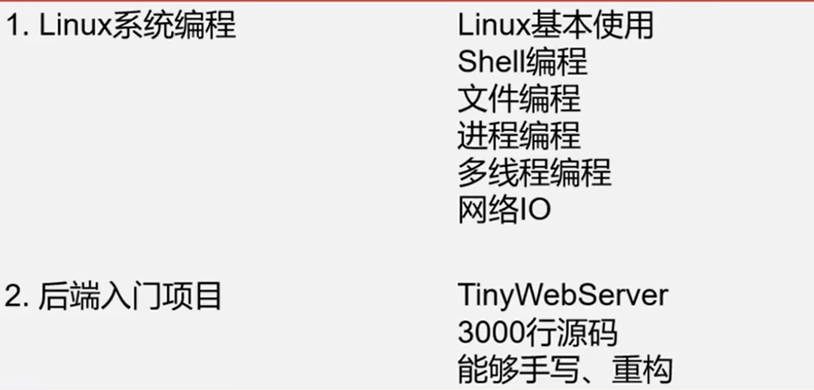
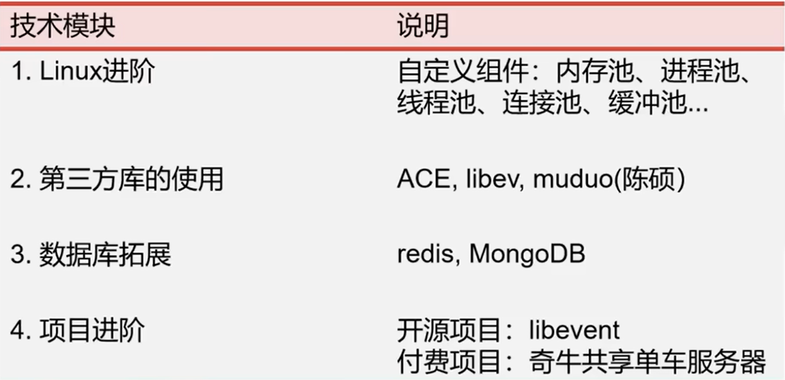
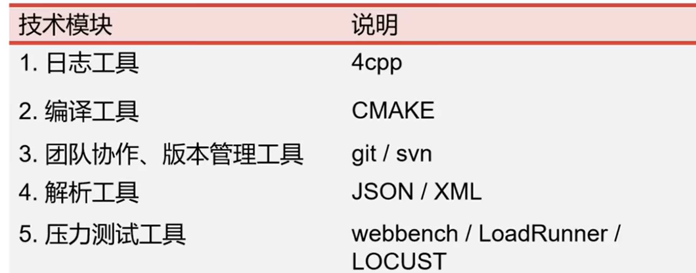
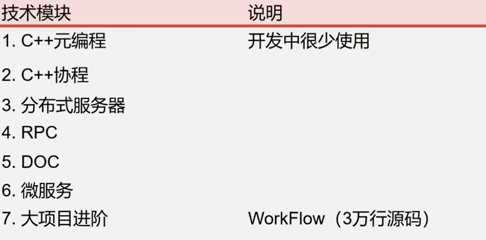

C++标准库 / STL 标准模板库

# 容器

\#include<vector>

##顺序容器

|   容器类型    |               描述                |     访问支持      |  增删  |
| :-----------: | :-------------------------------: | :---------------: | :----: |
|  vector向量   |          动态扩容的数组           | 连续存储-随机访问 | 尾部快 |
| deque双端队列 | 指针数组-每个元素指向一块连续数组 |       随机        | 两端快 |
| list双向链表  |                                   |     双向顺序      |  any   |

不常用：

* **forward_list** 单向链表
* **array**就是普通数组 
* **string** 与vector相似 存字符串

### 使用

* 初始化

```c++
//默认构造
vector<int> vec; //空
vector<int> vec(10); //10个值为0的int           默认构造
vector<int> vec(10, 42); //10个值为42的int      42作为参数的构造函数
//范围初始化
vector<int> vec(arr.begin(), arr.end()); // 使用arr的范围初始化vec  
//拷贝初始化-容器类型和元素类型一致
vector<int> copy(original);
vector<int> copy2 = original;
//移动构造
vector<int> moved(move(original)); //original的资源交给moved  c++11 original为空且未定义状态
//列表初始化 c++11
vector<int> vec = {1, 2, 3, 4, 5};
```

```c++
array<int,5> ia;  赋随机数?
array<int,5> ia{1,2,3,41,1};  {0} 全为0 {2}第一个是2其余为0
int ia(5); 不能拷贝或赋值
```

* 容器操作
* * size
  * empty
  * max_size 可包含的最大大小
  * reserve  vector和string 请求容器保留足够的空间来存储指定数量的元素，但不改变容器的大小
  * shrink_to_fit c++11  vector和string 尝试减少容器的容量以匹配其大小
* 元素访问
* * [] 下标 除了list
  * at() 返回**指定位置**的元素引用
  * front 第一个元素
  * back 最后一个
  * data 第一个元素的指针 除了list
* 修改器
* * push_back() / emplace_back()：在容器末尾添加一个元素/构造一个元素。
  * pop_back()：移除容器末尾的元素。
  * insert(itrator,value) / emplace()：在**指定位置**插入一个元素/构造一个元素。  指定位置用迭代器实现
  * erase()：移除指定位置的元素或元素范围。
  * clear
  * resize()：改变容器的大小，如果新大小大于当前大小，则添加默认构造的元素；如果小于当前大小，则删除多余的元素。

### vector

```c++
#include <iostream>
#include <vector>
#include <algorithm>

// 插入元素到 vector
void insertElements(std::vector<int>& vec, const std::initializer_list<int>& elements) {
    for (int element : elements) {
        vec.push_back(element);
    }
}

// 遍历 vector
void traverseVector(const std::vector<int>& vec) {
    for (int element : vec) {
        std::cout << element << " ";
    }
    std::cout << std::endl;
}

int main() {
    std::vector<int> myVector;

    // 插入元素
    insertElements(myVector, {5, 2, 8, 1, 9});
    std::cout << "插入元素后的 vector: ";
    traverseVector(myVector);
    // 排序
    std::sort(myVector.begin(), myVector.end());
    //反向排序
    std::sort(myVector.begin(), myVector.end(), std::greater<int>());
    std::cout << "排序后的 vector: ";
    traverseVector(myVector);

    // 查找元素
    int target = 8;
    if (std::find(myVector.begin(), myVector.end(), target) != myVector.end()) {
        std::cout << target << " 存在于 vector 中。" << std::endl;
    } else {
        std::cout << target << " 不存在于 vector 中。" << std::endl;
    }

    // 删除元素
    auto newEnd = std::remove(myVector.begin(), myVector.end(), target);
    myVector.erase(newEnd, myVector.end());
    std::cout << "删除 " << target << " 后的 vector: ";
    traverseVector(myVector);

    return 0;
}
```


###string

string::size_type类型 size函数的返回类型，能存任何string的大小，无符号

比较：

* "hello"<"hello world"
* "hi">"he" i的ascll码在后面

string+字符字面值+字符串字面值(不是string) 必须保证+两侧的对象至少一个是string

string s2=s1+","+"world"; 正确 s1放最后不对

##关联容器

按关键字有序 **map**(键值对) **set** multimap multiset     multi-可重复出现键             红黑树，元素按键自动排序

无序 unordered_map unordered_set unordered_multimap  unordered_multiset          哈希表

都是双向迭代器(可以向前或向后遍历) 不支持随机访问(不能使用下标)除了map

### 使用

```c++
//默认初始化
map<int, string> myMap;
set<int> mySet;
//拷贝初始化
map<int, string> myMap2(myMap1); 
set<int> mySet2(mySet1);
//迭代器范围初始化
set<int> mySet(myVector.begin(), myVector.end());
	// 对于map，需要确保范围中的元素是pair或可以隐式转换为pair的类型  
vector<pair<int, string>> myVectorPairs = { {1, "One"}, {2, "Two"} };  
map<int, string> myMap(myVectorPairs.begin(), myVectorPairs.end());
//列表初始化 c++11
map<int, string> myMap = { {1, "One"}, {2, "Two"} };
set<int> mySet = {1, 2, 3, 4, 5};
```

* 插入
* * insert
  * emplace 底层插入
  * map可以用下标 map["123"]  没有"123"会自动创建一个
  * map插入时 .int( make_pair("123", 1) ) 或pair
* 删除
* * erase 根据迭代器(单个或范围)或者关键字
  * clear 删除所有
* 查找
* * find 返回迭代器指向第一个关键字匹配 否则返回尾后迭代器
  * count 返回与关键字匹配的个数
  * lower_bound和upper_bound （仅适用于有序关联容器） 返回指向第一个关键字不小于和大于给定关键字的元素的迭代器
  * equal_range  （仅适用于有序关联容器） 返回一个pair，包含两个迭代器，分别表示关键字等于给定关键字的元素范围的开始和结束。
* 大小
* * size
  * empty
* 有序关联容器（如set和map）允许通过传递自定义的比较函数或函数对象来定义元素之间的比较方式。

```c++
#include <iostream>  
#include <map>  
#include <string>   
// 自定义比较器类  
struct CompareLength {  
    bool operator()(const std::string& a, const std::string& b) const {  
        return a.length() < b.length(); // 根据字符串长度进行比较  
    }  
};  
int main() {  
    // 使用自定义比较器类  
    std::map<std::string, int, CompareLength> myMap;  
    myMap["apple"] = 1;  
    myMap["banana"] = 2;  
    myMap["cherry"] = 3;  
    for (const auto& pair : myMap) {  
        std::cout << pair.first << ": " << pair.second << std::endl;  
    }  
    return 0;  
}
```

* 无序关联容器（如unordered_set和unordered_map）允许通过传递自定义的哈希函数和比较函数来定义元素的存储和比较方式。

### unordered_map

```c++
#include <iostream>
#include <unordered_map>
#include <string>

int main() {
    // 创建一个无序映射，键是字符串，值是整数
    std::unordered_map<std::string, int> myMap;

    // 插入元素
    myMap["apple"] = 5;
    myMap["banana"] = 2;
    myMap["orange"] = 8;

    // 访问元素
    std::cout << "apple: " << myMap["apple"] << std::endl;

    // 修改元素
    myMap["apple"] = 10;

    // 遍历元素
    for (const auto& pair : myMap) {
        std::cout << pair.first << ": " << pair.second << std::endl;
    }

    // 查找元素
    if (myMap.find("banana") != myMap.end()) {
        std::cout << "Found banana" << std::endl;
    }

    // 删除元素
    myMap.erase("orange");

    // 获取元素数量
    std::cout << "Size: " << myMap.size() << std::endl;

    return 0;
}
```


## 容器适配器

stack 后进先出

queue 先进先出

priority_queue 优先队列

###stack

* stack<int> a 初始化

* push() 添加元素

* pop() 移除元素，不返回值

* top() 返回顶部元素引用，不移除

* empty() 是否为空

* size() 元素个数-性能较低

* swap(**stack& other**) 交换两个stack的元素

### queue

* 没有top
* **front()** 返回最先进入的元素引用
* **back()** 最后进入的

### priority_queue

* 构造 带比较函数   默认为less<T> 创建一个最大堆-元素大的优先级高       :greater<int>>最小堆
* 最小堆 必须显示指出底层类型为vector priority_queue<int, vector<int>,greater<int>> ll;
* **emplace**() 底层容器上创建新元素，避免额外复制和移动
* 自定义比较函数

```c++
#include <iostream>  
#include <queue>  
#include <vector>  
#include <functional> // 对于 std::less 和 std::greater，虽然在这个例子中我们将自定义比较  
class MyClass {  
public:  
    int a;  
    MyClass(int val) : a(val) {}  
};   
// 自定义比较函数对象，用于比较 MyClass 对象的 a 成员  
struct CompareMyClass {  
    bool operator()(const MyClass& lhs, const MyClass& rhs) const {  
        // 如果你想要最小堆，就返回 lhs.a > rhs.a  
        return lhs.a > rhs.a;  
    }  
};  
int main() {  
    std::priority_queue<MyClass, std::vector<MyClass>, CompareMyClass> minHeap;  
    // 添加元素  
    minHeap.push(MyClass(3));  
    minHeap.push(MyClass(1));  
    minHeap.push(MyClass(4));  
    minHeap.push(MyClass(1));  
    minHeap.push(MyClass(5));  
    // 访问并移除优先级最高的元素（在最小堆中是基于 a 成员的最小值）  
    while (!minHeap.empty()) {  
        MyClass topElement = minHeap.top();  
        std::cout << "Top element (min a): " << topElement.a << std::endl;  
        minHeap.pop();  
    }  
    return 0;  
}
//比较字符串
priority_queue<string, vector<string>, CompareStr> pq;
struct CompareStr {  
    bool operator()(const string& lhs, const string& rhs) const {  
        return lhs > rhs;   //小的优先
    }  
}; 
```

#迭代器

类型：
::const_iterator   //仅需要读
::iterator        //修改存储在容器中的值使用
容器类型为const则返回::const_iterator，const vecotr<int> 

使用：

(\*iter).name。   .优先级比*高
iter->name
auto b=v.begin(),e=v.end(); //如果容器为空，b，e返回同一个迭代器-尾后迭代器"尾元素的下一位"

* 基本操作
* * *iter 解引用 访问当前指向的值
  * ++ --移动   双向和随机可以使用--
  * == != >= <= < > 比较迭代器的位置

* 注意
* * 避免迭代器失效  在对容器进行修改操作(删除元素之后的，插入扩容等)，导致元素位置改变的，指向这些元素的迭代器会失效，需要重新获取迭代器
  * 解引用之前确保不是空迭代器
  * 不同的容器类型有不同的迭代器类型
* 类型
* * vector deque string 随机访问迭代器
  * list 双向
  * foward_list双向
  * 输入/输出迭代器通常与特定的算法或适配器一起使用

cbegin cend          方便不是常量的容器也能返回const迭代器
c.rbegin() c.rend()   反向迭代器，rbegin是最后一个元素的迭代器，rend是第一个元素之前的迭代器
c.crbegin() c.crend() const反向迭代器

```c++

for(auto it=v.cbegin();it!=v.cend() && !it->empty();++it)
	cout<<*it<<endl;
```


# 算法

算法 遍历 最值 排序 查找 反转  （没有：稳定婚姻 树链部分 后缀自动机 跳舞链 模拟退火 随机算法）

排序 sort

查找 find

遍历 traversal

#仿函数

```c++
#include <iostream>  
#include <algorithm> // std::sort  
#include <vector>  
  
// 定义仿函数  
class CompareInt {  
public:  
    // 重载operator()，用于比较两个整数  
    bool operator()(int a, int b) const {  
        return a < b;  
    }  
};  
  
int main() {  
    std::vector<int> vec = {5, 3, 8, 4, 2};  
  
    // 使用仿函数作为std::sort的第三个参数  
    std::sort(vec.begin(), vec.end(), CompareInt());  
  
    // 输出排序后的结果  
    for(int num : vec) {  
        std::cout << num << " ";  
    }  
    std::cout << std::endl;  
  
    return 0;  
}
```


#动态内存 分配器

内存泄漏：忘记释放

引用非法指针：指针正在引用内存的时候被释放

## new delete

new 分配内存并返回指针

int *pi=new int; 未定义值
int *pi=new int(24); 初始化为24 
string *pi=new string(10,'9');
int\* arrPtr = new int[5];
int *p=new int[5]{0,1,2,3,4};
**const** int *p=new **const** int;

delete p;
p=nullptr; 防止释放之后依然指向无效地址
delete []arrPtr

## allocator

\#include <memory>

STL容器默认使用的内存分配器

```c++
#include <iostream>
#include <memory>

int main() {
    // 1. 创建分配器对象，指定分配的对象类型为 int
    std::allocator<int> alloc;
    // 2. 分配内存，这里分配 5 个 int 类型的内存空间
    int* ptr = alloc.allocate(5);
    // 3. 构造对象，使用 std::construct 在分配的内存上构造对象
    for (int i = 0; i < 5; ++i) {
        std::construct_at(ptr + i, i * 2);
    }
    // 输出分配内存上构造的对象的值
    for (int i = 0; i < 5; ++i) {
        std::cout << ptr[i] << " ";
    }
    std::cout << std::endl;
    // 4. 析构对象，使用 std::destroy 析构对象
    for (int i = 0; i < 5; ++i) {
        std::destroy_at(ptr + i);
    }
    // 5. 释放内存
    alloc.deallocate(ptr, 5);
    return 0;
}
```


嵌入式web后端-基于linux系统的非客户端的各种应用 如自动驾驶后端

手写常用设计模式

linux系统编程



进阶





压力测试10万+



高性能数据处理

金融量化

游戏服务器

自动驾驶

高性能中间件开发-网路模块

linux后端-银行业务

搜索 * c++

* c++ 后端
* c++ linux
