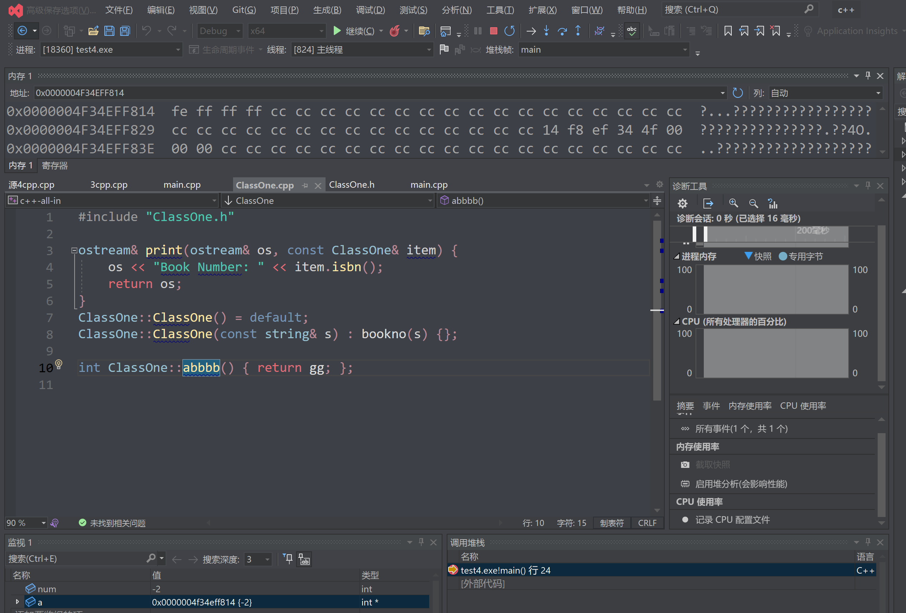
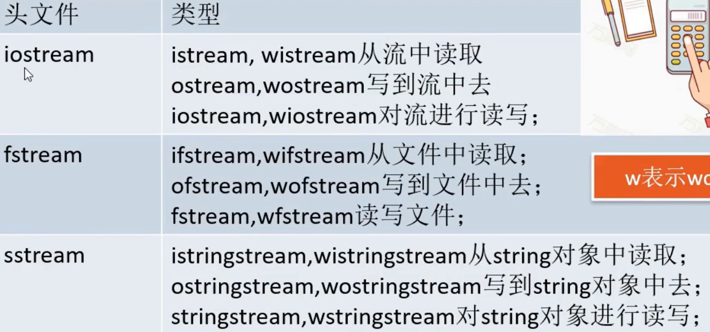
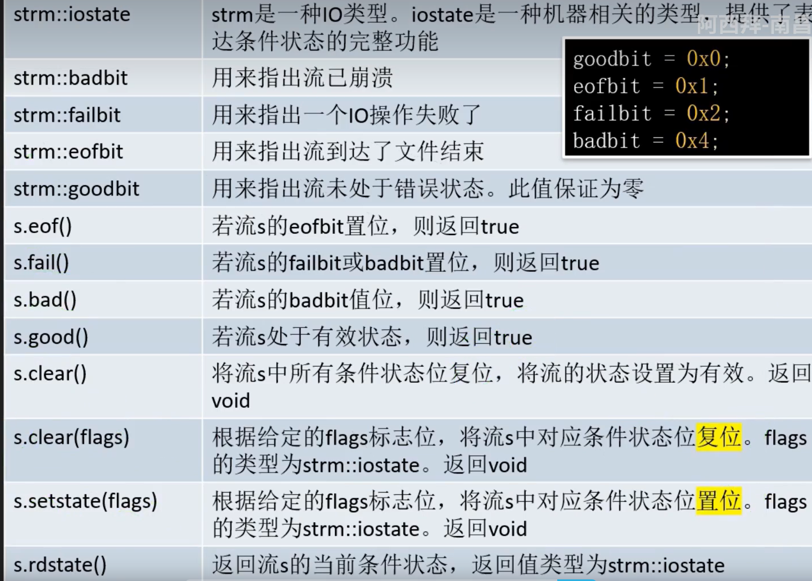
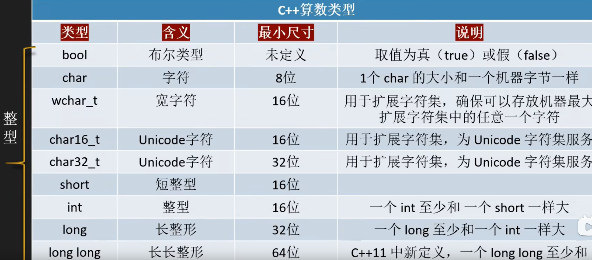

# 建议

看一下源码：前缀效率更高 --i,后缀先复制一个副本
尽量以const enum inline替换#define
尽可能使用const

手册：
比如找get函数
在线手册网址https://zh.cppreference.com/ 标准库(标头)-ctrl+f搜索istream-basic_istream-找到get函数就可以了
https://cplusplus.com/reference 英文版解释-这个网站可以直接搜用法cin.get就会出来

# 数据-存储

## 数据类型

```c++
//unsigned
bool bo;//1 byte
short sh; //至少16位 2 byte -32768到32767（有符号）或从0到65535（无符号）。
int in; //4 byte
long lo;//8 byte
long long lolo=2; //16byte
char ch;//1 byte ascll
float fl;// 4/7
double do;//8/17 
long double lodo;//19
//头⽂件climits定义了符号常量：例如：INT_MAX 表示 int 的最⼤值，INT_MIN 表示 int 的最⼩值
```

char [-128,127]
unsigned char [0,255]
char a=34;使用的是ascll编码，而char a = '1'存储的是字符

### char字符函数

<cctype>  
isspace(c) 判空，是返回true
isalpha(c) 判字母
isdigit(c) 数字
isalnum(c) 字母或数字
ispunct(c) 标点
isupper(c) 大写字母
islower(c) 小写字母
toupper(c) 产生=c的大写字符
tolower(c) 小写

## 补码

补码:正数的补码是本身,负数是其二进制取反+1

字节:最小存储单元(8比特)。一个字节范围[-128,127] 。

**11111111 -1**       

11111110 表示-2

10000001 表示-127 

10000000 -128

00000000 0

00000001 1 

01111111 127

> -1 + -2  11111101 = -3

所以隐式转化就是非负数前面+0，负数前面+1,强制转换就是把前面多余的字节直接切掉,极大可能导致数据改变
位运算：
<< 向左移动低位补0 左移一次*2
\>\> 右移,高位补0/1 除2
\>\>\> 无符号右移,高位补1
**整形都可以使用位运算** 比如char，但是要根据数据看是否会丢出数据，一般位数高的无符号整型不会丢失数据，比如uint64_t(unsigned long-linux 64位)

## 有符号和无符号

无符号数和有符号数进行比较时，有符号数会被隐式转换为无符号数

```~c++
int change(unsigned num){return num;};
int main() {
  unsigned b = -3;
  std::cout << b << std::endl;
  std::cout << change(b) << std::endl;
  return 0;
}
```~

unsigned b = -3; 省略了int，本来是unsigned int b = -3;
unsigned p=&b;  指针类型是unsigned int
change函数做了隐式转换，转换为了int变量，也可以直接显示转换

## 32位和64位计算机

32位只有4GB内存(2^32) 一次只能处理四个字节的数据
64位                一次能处理8个字节数据
C:\Program Files\ 是 64 位软件的默认安装目录
C:\Program Files(x86)\ 是 32 位软件的默认安装目录

对于数据方面

* 只有long 64是8字节 32是4字节   **win下long是4字节 long long8字节**
* 32位指针大小为4byte，而64位的指针大小为8byte   **sizeof()** 
* string的大小，64和32，和指针大小相同，因为string不保存字符串本身只存了开头的指针
* long long* a=&num sizeof(long long*)是8 而sizeof(a)也是8，都是指针大小

## 大端序和小端序

一个32位的整数`0x12345678`在大端序内存中的表示就是`12 34 56 78` 在小端序内存中的表示就是`78 56 34 12`。
大端序：网络字节序，人类阅读习惯序列。高字节存在低地址。
小端序：机器存储序。高字节高地址。      win下vs测试是小端序

**打印出数据的二进制数**

```c++
#include <iostream>  
#include <string>  
#include <bitset> // C++11及以后版本可用  

// 使用bitset（C++11及以后）  
void printBinaryUsingBitset(int num) {
    std::bitset<32> binary(num); // 假设int是32位的，根据实际情况调整  
    std::cout << binary << std::endl;
}
// 手动实现  
void printBinaryManually(int num) {
    std::string binaryStr = "";
    for (int i = 31; i >= 0; --i) { // 假设int是32位的  往右移31个就是左边数第一个bit的值
        binaryStr += (num >> i) & 1 ? '1' : '0';
    }
    std::cout << binaryStr << std::endl;
}
int main() {
    int num = -2; // 示例数字  
    // 使用bitset  
    std::cout << "Using bitset: ";
    printBinaryUsingBitset(num);
    // 手动实现  
    std::cout << "Manually: ";
    printBinaryManually(num);
    return 0;
}
```

vs打断点-调试-窗口-内存-内存1

将指针的地址值复制到窗口回车查找，默认是以16进制存储-16进制表示一个字节就是两位数 这里表示的是-2 前面四个fe ff ff ff就是其内存表示
fe ff ff ff由于小端序 0xfffffffe的最低有效字节fe放到内存的地位
12345678的16进制是0x00bc614e但是由于小端序所以内存是 4e 61 bc 00 
声明成long long则是8字节 4e 61 bc 00 00 00 00 00



char b[5] = {'a','b','\0'};   char* a = b; char每个占一个字节
通过a看b的地址61 62 00 00 00       
61 62 是16进制对应的ascll编码

## 编码

char a[] = u8"你"; 使用utf-8则内存 e4 bd a0 00 cout输出乱码
char a[] = "你";   c4 e3 00 cout输出正常
看看VS的编码设置-可以直接搜高级保存选项或者看攻略https://blog.csdn.net/qq_41868108/article/details/105750175
我现在的编码是 简体中文(GB2312)-代码页936
改成Unicode(UTF-8 带签名)-代码页 65001 但是不知道为啥我改完没有区别

## 输出ascll-char

cout<<int('a'); cout<<int('4'); 输出ascll码 char转化为int是转化为ascll

输出char('3')会输出3本身 

**如何避免转化为ascll**：int('3'-'0')

int->char  65->A

## 有效位

```cpp
double num = 3.1415926;   
std::cout << std::setprecision(4) << num << std::endl; // 设置输出的有效数字位数为 4
```

# 指针 & * const

int a;
int* n=&a;  **&取地址**赋值给指针 n是a的地址 *n(解引用)就是a 
*n=c; 改变a的值
n=&c 改变指向的地址
int& ref = x; **&引用** 两者地址相同，只是有个代号

左值 有持久状态，可以被引用的对象。左值可以被赋值或取地址 
右值 临时的、非持久的值，例如临时对象、函数返回的值（除非明确指定为返回引用）、字面量等。右值不能作为非常量引用的目标。
int& r = 5; // 错误，5 是右值  或者函数返回是int& 不能直接返回一个非引用的int类型
const int& r = 5; // 正确，使用 const 引用可以接受右值

## 指针函数-函数指针

指针函数-是函数-返回值是指针类型（地址）
函数指针-是指针-指向函数所在地址的首地址-可以用来调用函数    

函数指针声明方式： 比如有一个函数int max(int a, int b)

1. int(*f)(int, int); f=max 或者 f=&max
2. int(*f)(int, int)=max;  或者 =&max

使用方式：

1. (*f)(1, 2)
2. f(1, 2)

3. 作为参数值
   ```c++
   int calculate(int (*operation)(int, int), int a, int b) {
       return operation(a, b);
   }
   ```

# switch

```c++
switch(表达式)     
{ 
    case 常量表达式1:语句1; 
    case 常量表达式2:语句2; 
    case 常量表达式3:语句3; 
    // … … 
    case 常量表达式n:语句n; 
    default:语句n+1； 
}
```

# 循环输入

## get cin getline

读取数据只读能读的多余的会继续存在缓冲区

**operator>>** 

有格式输入-遇到空白符截至(跳过空白符)-会滞留换行符\n，可以使用get读取这个滞留的换行符

**get**

无格式输入-不会跳过空白字符(空白，回车等)，读取一个字符之后，保留换行符在输入队列     
=cin.get() 读取一个字符，返回int类型的ascll码值，如果用char接收会隐式转换为对应字符
cin.get(a) 将读取的字符直接存储到char a

> 所以int类型只能使用=cin.get()存ascll编码，而char类型都可以使用
> 读取失败设置failbit(输入出错)和eofbit(到达末尾)，cin.fail() cin.eof() 为真

**getline**

读入一行数据，会丢弃换行符
std::getline(std::cin, line);   //std::cin可以替换为文件流
std::getline(std::cin, line, ',');  // 使用逗号作为分隔符读取
int name[20]; cin.getline(name,20);   //读取一行到数组指针，遇到换行符或者读入19个字符后停止，最后一个为\0  

**operator<<**    

有格式

**put**

cout.put(ch); 输出字符(如果是ascll编码会转化为字符) 无格式

**终止**

!cin.fail() !cin.eof() ch!=EOF 都可以 ctrl+z终止

**失效位**

get读取到空行/getline遇到输入字符比分配空间长会设置失效位，接下来的输入将会阻断，可以用cin.clear();恢复失效位

## 循环读入字符

建议使用

```c++
//能读取空白字符版本
int ch;//或ch
ch=cin.get(); //不用cin cin只能读整数，并且用get避免一次读取多个
while(!cin.fail()){
	cout.put(ch);//换成cout 输出ascll码
    ch=cin.get();
}
//不读取空白字符版本
char ch;
cin>>ch;
while(!cin.eof()){
    cout<<ch;//或cin.put(ch);
    cin>>ch;
}
//终止条件可以写成ch!=EOF 用int因为int能正确处理EOF‘-1’ 
```

## 循环读入字符串

> isspace(ch) 检查输入的字符是否位空
>
> input.empty() 检查string是否为空
>
> input.clear(); 清除输入流的错误标志

```c++
#include <iostream>
#include <string>
using namespace std;
int main() {
    string s;
    cout << "请输入字符串（遇到空白字符时会循环一次读入）：\n";
    while (cin >> s) { // 使用流操作符自动处理空白字符
        cout << "你输入的字符串是: " << s << std::endl;
    }
    return 0;
}
```


# 枚举enum

定义一组命名的整数常量，用枚举类型来声明和使用。
大小默认为0 1 2手动赋值后下一位比前一位大1

```c++
enum Color {
    RED = 10,
    GREEN, // 未指定值，默认比前一个大 1，即 11
    BLUE = 20
};
int main(){
	Color myColor=GREEN;
}
//C++11引入了强类型枚举（enum class），它提供了更强的类型安全和作用域管理
enum class Color{
	RED, //0
	GREEN, //1
	BLUE //2
};
int main(){
	Color myColor = Color::GREEN;
}
//强类型枚举不会自动转换为整数
// 使用强类型枚举时，需要显示转换为整数
cout << "Green value: " << static_cast<int>(Color::GREEN);
```

# 宏

在编译前进行代码替换或生成

可以用于定义常量、函数样式的代码片段，或进行条件编译

1. 定义常量值

\#define PI 3.14159 像使用变量一样使用PI

2. 宏函数

\#define SQUARE(x) ((x) * (x)) 

cout<<"5的平方是："<<SQUARE(5)<<endl;

应用：

```c++
#include <iostream>
#define CC_SYNTHESIZE(varType, varName, funName)\
protected: varType varName;\
public: varType get##funName() const { return varName; }\
public: void set##funName(varType var){	varName = var; }

#define CC_SUM(var1, var2) \
std::cout << "The sum of " << #var1 << " and " << #var2 << " is: " << var1 + var2 << std::endl;

#define PI 3.14159 //定义常量值

class MyClass {
    CC_SYNTHESIZE(int, num1, Num1)
    CC_SYNTHESIZE(int, num2, Num2)
public:
    MyClass(int n1, int n2) {
        setNum1(n1);
        setNum2(n2);
    }
    void printSumAndMax() {
        CC_SUM(getNum1(), getNum2());
    }
};
int main() {
    MyClass obj(10, 20);
    obj.printSumAndMax();
    return 0;
}
```

\## 用于连接
\# 用于将参数转化为字符串常量，这里被替换成getNum1()

3. 条件编译

 `#ifdef`, `#ifndef`, `#if`, `#elif`, `#else` 和 `#endif` 

```c++
#include <iostream>
#define DEBUG
int main() {
#ifdef DEBUG
    std::cout << "Debug 模式开启" << std::endl;
#endif
    std::cout << "程序运行中..." << std::endl;
    return 0;
}
```

4. 宏展开与参数

\#define DOUBLE(x) x + x 	DOUBLE(1 + 2) 实际展开为1 + 2 + 1 + 2

为了避免这种情况，应该用括号包围宏参数和结果： #define DOUBLE(x) ((x) + (x))

5. 宏保护 确保头文件内容只会被包含一次

```c++
#ifndef MY_HEADER_H
#define MY_HEADER_H
// 头文件内容
#endif // MY_HEADER_H
```

6. 内联函数与宏

由于宏没有类型安全检查，通常在现代C++中使用 inline函数代替宏函数

inline int square(int x) {return x * x;}

# 修饰符

## 类型别名typedef using

类型别名

定义类型别名typedef float fl; using dou = double;
typedef double wages,*n; wages=double n=double\*

## NULL nullptr

nullptr类型安全 类型是std::nullptr_t 代表空指针
NULL 宏定义 通常定义为0，不具备安全性，被解释成整数或空指针

##volatile

修饰变量

1. 阻止编译器优化（比如访问优化的时候，将变量的值缓存到寄存器，使用之后会每次都从内存中读取值）
2. 告知编译器变量值可能意外改变

用途：在一些值随时都可能会被修改的环境，确保每次都读取最新的值

1. 访问硬件寄存器
2. 多线程或中断服务程序中
3. 信号处理，与const一起使用，确保程序不修改，但是程序外部可以改变

# 数组

**一维数组**

int abc[3]={1,2,3};  初始化元素少于总个数时，其他初始化为0 
初始化元素少于总个数时，其他初始化为0  long total[100]={0}; 全部元素为0
int dfg[3];
int g[]={2,3};  会自动计算个数，使g[2]  

**二维数组**

int b\[2][3]{1,2,3};  

==c++11==

可省略等号
大括号内不带东西 所有元素为0  int a[4]{};
初始化禁止缩窄转换  int a[]{23,2.0}  浮点转化为整型是缩窄操作
新增vector<array>

```c++
std::vector<std::array<int, 3>> vec;
// 初始化方式一：逐个添加元素
std::array<int, 3> arr1 = {1, 2, 3};
vec.push_back(arr1);
// 初始化方式二：使用花括号直接添加
vec.push_back({4, 5, 6});
//访问：
vec[0][1]
: //for(auto i : vec)
```

### 数组元素个数

sizeof(nums) / sizeof(int) //sizeof返回的是字节数
std::size(nums) //返回行数？

### 数组赋值

数组名代表数组首元素的地址，是一个常量指针，不是一个可以赋值的左值。
array可以用=

### vector<vector<int>>

初始化二维数组

```c++
vector<vector<int>> fac(n, vector<int>(m, 0));

vector<vector<int>> triangle(n, vector<int>());
for (int i = 0; i < triangle.size(); i++) {
        triangle[i].resize(i + 1);  //resize改变容器大小，每行大小加1

}
```

遍历二维数组

```c++
for (int i = 0; i < fac.size(); i++)	
	for (int j = 0; j < fac[i].size(); j++)	
	cin >> fac[i][j];

for(auto nums:fac){
	for(auto i:nums){}	
}
```

# 字符串

## 初始化

**c风格**

1. char dog[3]={'a','b','\0'};      '\0'编码为0

2. char a[6]="bull";  字符串常量/字符串字面值   隐式包含空字符，自动添加\0

**string**

\#include<string>

自动处理大小
std::string name {"tutu"};
std::string name = "tutu";
std::string name = {"tutu"};

## 区别字符常量和字符串常量

'S'在ASCLL中只是83的另一种写法，char a = 's';

"S"表示的是两个字符S和\0组成的字符串，实际表示的是字符串所在的**地址**，char a="S"; ❌

## 赋值 拼接

string可直接使用+ =

<cstring>可以使用strcpy(char\*2,char\*1) strcat 1接到2后 注意2长度要够大，strncpy strncat第三个参数指出能接受的最大长度

## 获取长度

**char ***
strlen(a)  到第一个\n

**string**
.size() .length()

## 原始字符串

cout << R"(acs\n)"<<'\n'<<"azx\\n";  用R"( )" 等效 前面加\
cout<<R"+\*("(who)",she)+\*"; R"+*(   )+\*" 可以使用任意数量的基本字符

## strcmp

<cstring> strcmp
int strcmp(const char *str1, const char *str2);
按照ascll码顺序，挨个比较两个字符串的字符，直至第一个不同的或到末尾
返回值：
小于0：两个字符串第一个不同的字符的ascll码str1小于str2，或者前者是后者的子串
等于0：两个字符串相同
大于0

string可以直接使用符号进行比较

## 字符串排序

sort默认是升序排序，如果要降序排序需要提供自定义函数

```c++
//vetctor<string>类型排序
//升序
std::sort(words.begin(), words.end());
//降序
bool caseSensitiveCompare(const std::string& a, const std::string& b) {
    return a < b;
}
std::sort(words.begin(), words.end()，caseSensitiveCompare);

//忽略大小写
bool caseInsensitiveCompare(const std::string& a, const std::string& b) {
    std::string lowerA = a, lowerB = b;
    std::transform(lowerA.begin(), lowerA.end(), lowerA.begin(), ::tolower);
    std::transform(lowerB.begin(), lowerB.end(), lowerB.begin(), ::tolower);
    return lowerA < lowerB;
}

//string类型排序
//升序
std::sort(str.begin(), str.end());
//降序
bool compareChars(const char& a, const char& b) {
    return a < b;
}
std::sort(str.begin(), str.end(),compareChars);
//或者使用标准库函数std::greater<char>()
std::sort(str.begin(), str.end(), std::greater<char>());
```

# 模板与内联函数

```c++
//模板类 后续在类中用T代替要使用的类型
template <typename T>    //使用：Stack<int> intStack;
template <class T>;
template <typename T, int Size>  //使用：Stack<int,5> intStack;
class Stack {
}
//模板类的特化
template <typename T>
class MyClass {}
   
template <>     //MyClass<int>时特殊使用
class MyClass<int> {}
//模板类的定义和实现默认在同一个文件，因为在编译时生成，而不是动态绑定的
//模板类的函数定义默认在函数声明时实现-内联，如果在类外部实现需要带上模板参数列表
template <typename T>
void MyTemplateClass<T>::func() {}
```

函数模板：

```c++
template <typename T>
void swapValues(T& a, T& b) {
    T temp = a;
    a = b;
    b = temp;
}

int num1 = 10, num2 = 20;
swapValues(num1, num2); //可以根据num的类型自动匹配
swapValues<int>(num1, num2);//或者使用<>
```

使用.hpp文件（声明和定义在一个文件） 如：内联函数，模板类模板函数，小型库

## 内联函数

在函数声明前面加inline

在编译的时候，把函数代码插入到函数调用处-编译时确定，所以声明和实现要在一个文件

>  内联函数与register变量类似，仅仅是我们提给编译器的一个请求，最终是否真正会实现内联，由编译器根据情况自行选择。//register声明变量之前，建议编译器将变量放入寄存器

# 内存

## alloca

用于在栈上申请空间，离开作用域会自动释放

```c
void *alloca(size_t size);
int *arr = (int *)alloca(n * sizeof(int));
```

# 链接

- 静态链接：在编译期将库文件的所有代码嵌入到最终可执行文件中，体积大，快 （.a .lib）
- 动态链接：在程序执行过程中遇到了再链接（.so .dll），体积小，慢


# I/O类(待看)

有三个关于I/O类的头文件 



IO对象不能拷贝赋值,不能是const,读写会改变状态




# C++ Effective


类型




constexpr int p = 1; 常量表达式进行初始化

constexpr int *p=nullptr;  constexpr修饰顶层 const修饰底层

constexpr const *p=&i; constexpr:一直指向i，const：指向的值不被修改

编译时期就需要能够确定其值

constexpr用于修饰函数时,一般只有一条return语句,用于构造函数中什么都不用有


#异常处理

基础

```c++
#include <iostream>
using namespace std;

// 自定义异常类
class MyException : public exception {
public:
    const char* what() const throw () {
        return "自定义异常发生";
    }
};

// 抛出异常的函数
double division(int a, int b) {
    if (b == 0) {
        throw "除数不能为零"; // 抛出字符串类型的异常
    }
    return (a / b);
}

int main() {
    int x = 50;
    int y = 1;
    double z = 0;

    try {
        z = division(x, y);
        cout << z << endl;
    }
    catch (const char* msg) {
        cerr << "捕获到异常: " << msg << endl;
    }
    catch (MyException& e) { // 捕获自定义异常
        cerr << "捕获到异常: " << e.what() << endl;
    }

    return 0;
}

```


嵌套异常

```c++
#include <iostream>
#include <stdexcept>
#include <exception>

// 自定义异常类，继承自std::exception
class MyException : public std::exception {
public:
    const char* what() const noexcept override {
        return "MyException发生";
    }
};

// 另一个自定义异常类，用于嵌套异常
class MyNestedException : public std::exception {
private:
    std::nested_exception nested;
public:
    MyNestedException() : nested() {}

    void rethrow_nested() const {
        if (nested) nested.rethrow_nested();
    }

    const char* what() const noexcept override {
        return "MyNestedException发生，包含嵌套异常";
    }
};

// 抛出嵌套异常的函数
void throwNestedException() {
    try {
        throw MyException();
    } catch (...) {
        std::throw_with_nested(MyNestedException());
    }
}

int main() {
    try {
        throwNestedException();
    } catch (const MyNestedException& e) {
        std::cout << "捕获到异常: " << e.what() << std::endl;
        try {
            e.rethrow_nested();
        } catch (const MyException& e) {
            std::cout << "捕获到嵌套异常: " << e.what() << std::endl;
        } catch (...) {
            std::cout << "未知异常" << std::endl;
        }
    } catch (...) {
        std::cout << "未知异常" << std::endl;
    }

    return 0;
}

```

使用智能指针管理资源 RAII

```c++
#include <iostream>
#include <memory>

class Resource {
public:
    Resource() { std::cout << "资源被创建\n"; }
    ~Resource() { std::cout << "资源被销毁\n"; }
};

void processResource() {
    // 使用智能指针管理资源
    std::unique_ptr<Resource> ptr(new Resource());

    // 这里执行一些操作...
    throw std::runtime_error("在处理资源时发生异常");

    // 智能指针会在函数结束时自动释放资源
}

int main() {
    try {
        processResource();
    } catch (const std::exception& e) {
        std::cerr << "捕获到异常: " << e.what() << '\n';
    }

    // 即使发生异常，资源也会被正确释放
    return 0;
}

```

noexcept

```c++
#include <iostream>
#include <vector>

// noexcept关键字指定函数不会抛出异常
void noThrowFunction() noexcept {
    std::cout << "这个函数保证不抛出异常。\n";
}

// 这个函数可能抛出异常
void mayThrowFunction() {
    throw std::runtime_error("发生了一个异常！");
}

// noexcept(false)指定函数可能抛出异常
void mayThrowFunctionWithNoexcept(false) noexcept(false) {
    throw std::runtime_error("这个函数可能抛出异常！");
}

int main() {
    try {
        noThrowFunction();
        mayThrowFunction(); // 这里会抛出异常
    } catch (const std::exception& e) {
        std::cerr << "捕获到异常: " << e.what() << '\n';
    }

    try {
        mayThrowFunctionWithNoexcept();
    } catch (const std::exception& e) {
        std::cerr << "捕获到异常: " << e.what() << '\n';
    }

    return 0;
}

```

异常的传播和堆栈展开

```c++
#include <iostream>
#include <stdexcept>

// 基础资源类
class Resource {
public:
    Resource() { std::cout << "资源被创建\n"; }
    ~Resource() { std::cout << "资源被销毁\n"; }
};

// 使用资源的函数
void useResource() {
    Resource res; // 局部资源
    std::cout << "使用资源\n";
    throw std::runtime_error("发生异常，资源将被清理");
}

// 调用使用资源的函数
void callUseResource() {
    try {
        useResource();
    } catch (const std::exception& e) {
        std::cerr << "异常被捕获: " << e.what() << '\n';
        throw; // 重新抛出异常
    }
}

int main() {
    try {
        callUseResource();
    } catch (const std::exception& e) {
        std::cerr << "异常在main中被捕获: " << e.what() << '\n';
    }
    return 0;
}

```

异常链和异常传播

```c++
#include <iostream>
#include <stdexcept>

// 自定义异常类
class CustomException : public std::runtime_error {
public:
    CustomException(const std::string& msg) : std::runtime_error(msg) {}
};

// 第一层函数，可能抛出异常
void functionLevel1() {
    throw CustomException("从functionLevel1抛出的异常");
}

// 第二层函数，调用第一层函数
void functionLevel2() {
    try {
        functionLevel1();
    } catch(const CustomException& e) {
        std::cerr << "在functionLevel2捕获异常: " << e.what() << '\n';
        throw; // 重新抛出异常
    }
}

// 主函数
int main() {
    try {
        functionLevel2();
    } catch(const CustomException& e) {
        std::cerr << "在main捕获异常: " << e.what() << '\n';
    }
    return 0;
}

```

自定义异常类

```c++
#include <iostream>
#include <exception>

// 自定义异常类
class MyException : public std::exception {
private:
    std::string message;
public:
    MyException(const std::string& msg) : message(msg) {}
    const char* what() const noexcept override {
        return message.c_str();
    }
};

// 可能抛出自定义异常的函数
void riskyFunction(int value) {
    if (value < 0) {
        throw MyException("负值错误：函数只接受非负整数");
    }
    // 正常处理流程
    std::cout << "输入值为: " << value << std::endl;
}

int main() {
    try {
        riskyFunction(-1); // 这将抛出自定义异常
    } catch (const MyException& e) {
        std::cerr << "捕获到异常: " << e.what() << '\n';
    } catch (...) {
        std::cerr << "捕获到未知异常\n";
    }
    return 0;
}

```

# RTTI 类型信息

运行时类型信息。它允许程序在运行时确定对象的类型。RTTI 主要通过两种方式实现：`typeid` 运算符和 `dynamic_cast` 运算符。

**typeid**

获取表达式的类型信息，返回一个 const std::type_info& 引用
必须有虚函数，才能支持运行时类型识别

```c++
Base* basePtr = new Derived();
const std::type_info& typeInfo = typeid(*basePtr);
 std::cout << "Type name: " << typeInfo.name() << std::endl;
```

**dynamic_cast**

用于在继承层次结构中进行安全的向下转型（将基类指针或引用转换为派生类指针或引用）。如果转换成功，返回目标类型的指针或引用；如果转换失败，对于指针类型返回 nullptr，对于引用类型抛出 std::bad_cast 异常。

```c++
Base* basePtr = new Derived();
Derived* derivedPtr = dynamic_cast<Derived*>(basePtr);
if (derivedPtr)
```

# 四大类型的转换

**static_cast**

- 主要用于编译时的**类型转换**，即在编译时确定转换的类型。
- 可以用于基本数据类型之间的转换，以及非多态类型之间的转换。
- 还可以用于向上转换和向下转换，但不进行运行时类型检查，因此向下转换时需要注意安全性。

```c++
int i = 10;
double d = static_cast<double>(i); // 将整数转换为浮点数
```

**const_cast**

- 主要用于去除常量性（const）或增加常量性（const）。
- 用于修改对象的常量属性，但需要谨慎使用，可能导致未定义行为。

```c++
const int i = 10;
int* ptr = const_cast<int*>(&i); // 去除常量性
*ptr = 20; // 此时可能会导致未定义行为
```

**dynamic_cast**

**reinterpret_cast**

- 主要用于低级类型转换，将一个指针转换为另一种指针类型，或将指针转换为整数类型，反之亦然。
- 不进行任何类型检查或调用构造函数/析构函数，因此风险较高，应该谨慎使用。

```c++
int* p = reinterpret_cast<int*>(0x12345678); // 将地址转换为指针
```

# 自动推导类型

## auto

auto会忽略引用属性，需要手动使用auto&

```c++
const int c=8;
auto a=c;  //a被推到为int，顶层const会被忽略(变量本身是常量)
auto b=&c; //b被推到为const int*，底层的const不会被忽略(指针指向的对象是常量)
auto &c=a; //auto &时，顶层const不会被忽略，这里a是int，c是int &
auto &d = 42; //错误，不能绑定到普通引用，普通引用必须绑定到一个左值
const auto &d = 42; //使用const引用时会临时创建一个对象绑定给d
```

## decltype类型说明符

```c++
//推导变量类型
const int x = 10;
decltype(x) y = 20;   
//推导函数返回值类型
int func() {
    return 42;
}
decltype(func()) result;
//推导左值表达式为引用类型
int arr[5] = {1, 2, 3, 4, 5};
decltype(arr[0]) ref = arr[0]; // ref 的类型是 int&，因为 arr[0] 是左值
//推导右值为普通类型
int a = 5, b = 3;
decltype(a + b) sum;//a+b是右值
```

# 空间与堆栈

## 内存对齐

一个4字节(32位)系统中都按4字节边界对齐，地址是4的倍数

在这个示例中，`alignas(16)` 表示 `MyData` 结构体的对齐方式为 16 字节。使用 `alignof(MyData)` 可以获取 `MyData` 结构体的对齐要求

```c++
#include <iostream>

struct alignas(16) MyData {
    int x;
    double y;
};

int main() {
    std::cout << "Alignment of MyData: " << alignof(MyData) << std::endl;

    return 0;
}
```

## new和delete原理

`new` 和 `delete` 是 C++ 中用于动态内存管理的关键字，它们用于在堆（heap）上分配和释放内存。以下是它们的工作原理：

### new 操作符：

1. 当程序执行 `new` 操作符时，首先会调用一个用于分配内存的函数（例如 `operator new`），该函数负责从堆中分配足够的内存来存储对象。
2. `new` 操作符接收类型的大小作为参数，并分配足够的内存以存储该类型的对象。如果内存分配失败，则会抛出 `std::bad_alloc` 异常。
3. 分配的内存足够容纳对象后，构造函数被调用以初始化对象。如果对象有构造函数，则会自动调用它来完成对象的初始化。
4. `new` 操作符返回指向新分配内存的指针，该指针的类型与所分配对象的类型相匹配。

```
int* p = new int; // 分配足够的内存来存储一个 int 对象，并调用 int 类的构造函数进行初始化
```

### delete 操作符：

1. 当程序执行 `delete` 操作符时，首先会调用一个用于释放内存的函数（例如 `operator delete`），该函数负责释放之前分配的内存。
2. `delete` 操作符接收指向动态分配内存的指针作为参数，然后释放该指针所指向的内存。这意味着它会销毁对象，并释放对象占用的内存。
3. 在销毁对象之前，析构函数被调用以清理对象的资源。如果对象有析构函数，则会自动调用它来完成对象的清理工作。
4. 使用 `delete` 操作符释放的内存将会返回给堆，以便供后续的内存分配使用。

```
int* p = new int; // 分配内存
delete p; // 释放内存
```

总的来说，`new` 和 `delete` 关键字提供了 C++ 中动态内存分配和释放的机制，可以方便地在堆上创建和销毁对象，但需要注意避免内存泄漏和悬挂指针等问题。在现代 C++ 中，推荐使用智能指针（如 `std::unique_ptr`、`std::shared_ptr`）来管理动态内存，以减少手动内存管理带来的风险。

##delete[]

`delete[]` 与 `delete` 的不同之处在于，`delete` 用于释放单个对象动态分配的内存，而 `delete[]` 用于释放动态数组动态分配的内存。

1. 找到数组元素的个数：在 C++ 中，`new[]` 会在分配内存时存储数组元素的个数。因此，`delete[]` 首先需要找到数组元素的个数，以便正确地释放每个元素所占用的内存空间。
2. 释放数组元素的内存空间：`delete[]` 将遍历数组的每个元素，并调用其析构函数（如果有的话），然后释放每个元素所占用的内存空间。这确保了动态数组中的每个元素都得到了正确的清理和释放。
3. 释放数组的内存空间：最后，`delete[]` 会释放整个动态数组所占用的内存空间，即释放数组的起始地址。

```c++
#include <iostream>

int main() {
    // 使用 new[] 分配一个包含 5 个整数的动态数组
    int* array = new int[5];

    // 对数组进行赋值
    for (int i = 0; i < 5; ++i) {
        array[i] = i;
    }

    // 使用 delete[] 释放动态数组的内存
    delete[] array;

    return 0;
}
```

# 多线程与多进程

## 进程间通信IPC

管道pipe，半双工(单方向)，只能用于父子等具有亲缘关系的进程间使用

消息队列：全双工，在不同程序的进程间都可以使用

共享内存： 同上

套接字

## 线程通信

共享变量：全局变量或类的成员变量，结合锁或信号量

消息队列

## 多进程

fork()，创建新线程，返回两次，父进程中返回子进程ID，子进程中返回0，失败返回-1
execlp(pname,argvs...,nullptr),子进程中执行新程序，程序名，参数
waitpid(pid, &status, 0) 或 wait(nullptr)，等待子进程结束
getpid() 返回PID

子进程与原来的进程几乎完全相同。子进程将复制父进程的内存空间、打开的文件描述符、环境变量等资源。
子进程与父进程共享代码段，但在进程空间中有自己的数据段和堆栈段。

示例：子进程使用ls -l

```c++
#include <iostream>
#include <unistd.h>
#include <sys/wait.h>

int main() {
    pid_t pid = fork();

    if (pid < 0) {
        // 错误处理：fork失败
        std::cerr << "Fork failed!" << std::endl;
        return 1;
    } else if (pid == 0) {
        // 子进程
        std::cout << "This is the child process. PID: " << getpid() << std::endl;
        // 执行一个新程序，这里以ls命令为例
        execlp("ls", "ls", "-l", nullptr);
        // 如果execlp执行失败，会执行到这里
        std::cerr << "Exec failed!" << std::endl;
        return 1;
    } else {
        // 父进程
        std::cout << "This is the parent process. PID: " << getpid() << ", Child PID: " << pid << std::endl;
        // 等待子进程结束
        int status;
        waitpid(pid, &status, 0);
        std::cout << "Child process has finished." << std::endl;
    }

    return 0;
}
```

### 管道

int pipefd[2]; pipefd[0]读端，pipefd[1]写端
pipe(pipefd) 创建管道，失败返回-1

```cpp
//一个进程-读线程
close(pipefd[1]);//关闭写端
ssize_t n = read(pipefd[0], buffer, BUFFER_SIZE); //阻塞读取数据，失败返回-1，写端关闭返回0
close(pipefd[0]);//读取完毕，关闭读端
//另一个线程-写线程
close(pipefd[0]); // 关闭读端
const char* message = "Hello, child process!";
ssize_t n = write(pipefd[1], message, strlen(message));
close(pipefd[1]);
```

### 消息队列

int msgget(key_t key, int msgflg); key：消息队列表示，两个进程使用同一个消息队列，消息标识相同，msgflg：创建标志和权限，IPC_CREAT | 0666表示如果指定key的消息队列不存在则创建，存在则返回消息标识符，0666代表有读写权限没有执行权限
msgsnd，发送消息
msgrcv 接收消息
msgctl 删除消息队列

demo

发送端：

```c++
#include <iostream>
#include <sys/types.h>
#include <sys/ipc.h>
#include <sys/msg.h>
#include <cstring>

#define MSG_KEY 1234
#define MAX_MSG_SIZE 1024

// 消息结构体
struct msgbuf {
    long mtype;       // 消息类型
    char mtext[MAX_MSG_SIZE]; // 消息内容
};

int main() {
    // 创建或获取消息队列
    int msgid = msgget(MSG_KEY, IPC_CREAT | 0666);
    if (msgid == -1) {
        std::cerr << "msgget failed" << std::endl;
        return 1;
    }

    // 准备消息
    msgbuf message;
    message.mtype = 1;
    std::strcpy(message.mtext, "Hello from sender!");

    // 发送消息
    if (msgsnd(msgid, &message, strlen(message.mtext) + 1, 0) == -1) {
        std::cerr << "msgsnd failed" << std::endl;
        return 1;
    }

    std::cout << "Message sent successfully." << std::endl;

    return 0;
}
```

接收端

```c++
#include <iostream>
#include <sys/types.h>
#include <sys/ipc.h>
#include <sys/msg.h>
#include <cstring>

#define MSG_KEY 1234
#define MAX_MSG_SIZE 1024

// 消息结构体
struct msgbuf {
    long mtype;       // 消息类型
    char mtext[MAX_MSG_SIZE]; // 消息内容
};

int main() {
    // 创建或获取消息队列
    int msgid = msgget(MSG_KEY, IPC_CREAT | 0666);
    if (msgid == -1) {
        std::cerr << "msgget failed" << std::endl;
        return 1;
    }

    // 准备接收消息的缓冲区
    msgbuf message;

    // 接收消息
    if (msgrcv(msgid, &message, MAX_MSG_SIZE, 1, 0) == -1) {
        std::cerr << "msgrcv failed" << std::endl;
        return 1;
    }

    std::cout << "Received message: " << message.mtext << std::endl;

    // 删除消息队列
    if (msgctl(msgid, IPC_RMID, nullptr) == -1) {
        std::cerr << "msgctl failed" << std::endl;
        return 1;
    }

    return 0;
}
```

### 共享内存

int shmid = shmget(SHM_KEY, SHM_SIZE, IPC_CREAT | 0666); 创建共享内存
将共享内存段附加到当前进程的地址空间
从共享内存读数据或写数据
删除共享内存段

```c++
#include <iostream>
#include <sys/types.h>
#include <sys/ipc.h>
#include <sys/shm.h>
#include <cstring>

#define SHM_KEY 1234
#define SHM_SIZE 1024

int main() {
    // 创建共享内存段
    int shmid = shmget(SHM_KEY, SHM_SIZE, IPC_CREAT | 0666);
    if (shmid == -1) {
        std::cerr << "shmget failed" << std::endl;
        return 1;
    }

    // 将共享内存段附加到当前进程的地址空间
    char* shmaddr = static_cast<char*>(shmat(shmid, nullptr, 0));
    if (shmaddr == reinterpret_cast<char*>(-1)) {
        std::cerr << "shmat failed" << std::endl;
        return 1;
    }

    // 向共享内存写入数据
    const char* message = "Hello, shared memory!";
    std::strcpy(shmaddr, message);

    // 将共享内存段从当前进程的地址空间分离
    if (shmdt(shmaddr) == -1) {
        std::cerr << "shmdt failed" << std::endl;
        return 1;
    }

    std::cout << "Data written to shared memory." << std::endl;

    return 0;
}

#include <iostream>
#include <sys/types.h>
#include <sys/ipc.h>
#include <sys/shm.h>
#include <cstring>

#define SHM_KEY 1234
#define SHM_SIZE 1024

int main() {
    // 获取共享内存段
    int shmid = shmget(SHM_KEY, SHM_SIZE, 0666);
    if (shmid == -1) {
        std::cerr << "shmget failed" << std::endl;
        return 1;
    }

    // 将共享内存段附加到当前进程的地址空间
    char* shmaddr = static_cast<char*>(shmat(shmid, nullptr, 0));
    if (shmaddr == reinterpret_cast<char*>(-1)) {
        std::cerr << "shmat failed" << std::endl;
        return 1;
    }

    // 从共享内存读取数据
    std::cout << "Data read from shared memory: " << shmaddr << std::endl;

    // 将共享内存段从当前进程的地址空间分离
    if (shmdt(shmaddr) == -1) {
        std::cerr << "shmdt failed" << std::endl;
        return 1;
    }

    // 删除共享内存段
    if (shmctl(shmid, IPC_RMID, nullptr) == -1) {
        std::cerr << "shmctl failed" << std::endl;
        return 1;
    }

    return 0;
}
```

##进程同步

### 信号量(主要)

POSIX 信号量分为有名信号量和无名信号量，有名信号量可以用于不相关的进程间同步，无名信号量通常用于线程间或有亲缘关系的进程间同步

```cpp
sem_t* sem = sem_open(SEM_NAME, O_CREAT, 0666, 1); //SEM_NAME信号量名字，O_CREAT表示如果信号量不存在则创建它，信号量初始值为1
sem_wait(sem) == -1) { //等待请求信号量
//进行资源操作，完成之后释放
sem_post(sem) == -1 //释放信号量

sem_close(sem) == -1//关闭信号量
sem_unlink(SEM_NAME); //删除信号量
```

### 互斥锁

pthread_mutex_t mutex;
pthread_mutex_lock(&mutex); // 加锁
pthread_mutex_unlock(&mutex); // 解锁

### 条件变量

pthread_mutex_init(&mutex, nullptr);
pthread_cond_init(&cond, nullptr);

```c++
pthread_mutex_t mutex;
pthread_cond_t cond;
bool condition_met = false;
//一个进程
pthread_mutex_lock(&mutex);
condition_met = true;   //条件
pthread_cond_signal(&cond); // 发送信号
pthread_mutex_unlock(&mutex);
//另一个进程
pthread_mutex_lock(&mutex);
while (!condition_met) {
    pthread_cond_wait(&cond, &mutex); // 等待条件成立
    //do something
}
pthread_mutex_unlock(&mutex);
//清理资源
pthread_mutex_destroy(&mutex);
pthread_cond_destroy(&cond);
```

## 多线程

### thread-c++11

\#include <thread>

1. std::thread t(threadFunction);  //创建线程执行函数
   std::thread t(threadFunction, x, y); //执行函数并传递参数
   t.join();   //等待线程结束

2. lambda表达式创建线程
   ```c++
   int a = 2, b = 4;
   std::thread t([a, b]() {
       std::cout << "The product of " << a << " and " << b << " is " << a * b << std::endl;
   });
   t.join();
   ```

3. 使用成员函数创建线程
   std::thread t(&MyClass::memberFunction, &obj); 需要传入函数地址和对象指针

### pthread-POSIX

\#include <pthread.h>

pthread_t thread;
int result = pthread_create(&thread, nullptr, threadFunction, nullptr); 成功返回0，线程执行函数threadFunction，最后一个是函数参数
result = pthread_join(thread, nullptr); 等待结束

### std::async

不一定会使用多线程
第一个参数为std::launch::async则会创建一个新线程

std::launch::deferred会延迟到使用result.get()的线程中执行

```cpp
std::future<int> result = std::async(std::launch::async, asyncFunction);  //可以传参，异步执行asyncFunction函数
int value = result.get(); //获取异步执行的结果
```

## 线程同步

互斥锁、递归互斥锁，读写锁，条件变量、信号量、等

原子操作atomic，线程局部存储thread_local

### 原子操作

常用于实现锁、信号量、计数器等线程同步机制

在C++中，标准库提供了`<atomic>`头文件，其中定义了一系列原子操作类型和函数，用于在多线程环境下进行原子操作。常见的原子操作类型包括`std::atomic`、`std::atomic_flag`等。

```c++
#include <iostream>
#include <atomic>
#include <thread>

std::atomic<int> atomicCounter(0);

void incrementCounter() {
    for (int i = 0; i < 10000; ++i) {
        atomicCounter++; // 原子自增操作
    }
}

int main() {
    std::thread t1(incrementCounter);
    std::thread t2(incrementCounter);

    t1.join();
    t2.join();

    std::cout << "Final value of counter: " << atomicCounter << std::endl;

    return 0;
}
```

`std::atomic<int>`类型的`atomicCounter`被用作一个计数器，它可以被多个线程同时访问而不会产生数据竞争问题。

`std::atomic`提供了原子操作的功能，它可以确保对共享变量的操作是原子的，即不会被中断或交错。当一个线程正在对共享变量进行原子操作时，其他线程需要**等待**这个操作完成，不能插入自己的操作，从而保证了共享变量的一致性。

### 无锁编程

通过使用原子操作和其他并发编程技术来避免使用传统的锁机制，从而降低了线程间的竞争和同步开销，提高了程序的并发性能

1. **原子操作**：
   - 使用原子操作，如`std::atomic`，可以在不需要锁的情况下对共享变量进行原子性操作，从而避免了锁带来的竞争和开销。
   - 原子操作通常包括自增、自减、比较交换等操作，可以在多线程环境中安全地对共享变量进行修改。
2. **无锁数据结构**：
   - 设计无锁数据结构，如无锁队列、无锁栈、无锁哈希表等，可以避免使用锁进行并发访问控制。
   - 无锁数据结构通常基于原子操作和一些特殊的算法实现，确保并发访问时的数据一致性和正确性。
3. **无锁算法**：
   - 设计无锁算法，如无锁排序、无锁并行搜索等，可以在不需要互斥锁的情况下实现高效的并发算法。
   - 无锁算法通常基于原子操作和一些并发编程技术，如分治、分布式计算等，以提高程序的并发性能。
4. **无锁编程模式**：
   - 使用无锁编程模式，如消息传递、事件驱动等，可以在不需要显式锁的情况下实现线程间的同步和通信。
   - 无锁编程模式通常基于异步编程和事件驱动模型，以提高程序的并发性能和响应性。

需要注意避免一些常见的陷阱和错误，如ABA问题、内存重排等。

#### ABA问题

具体来说，ABA问题的发生可以分为以下步骤：

1. 初始时刻，共享变量的值为A。
2. 线程T1读取共享变量的值A，并进行一些操作。
3. 在此过程中，另一个线程T2将共享变量的值从A修改为B，然后又将其修改回A，此时共享变量的值又变成了A。
4. 线程T1继续执行，根据共享变量值是否为A做出判断，认为共享变量的值没有被修改，继续执行操作。

在这个过程中，虽然共享变量的值在T1执行期间被修改了，但T1并没有察觉到这一变化，因为它只关心共享变量的当前值是否为A。这种情况下，T1可能会基于错误的假设继续执行，导致程序出现逻辑错误或安全问题。

为了解决ABA问题，通常需要使用一些技术手段，如版本号、时间戳等，来辅助判断共享变量的值是否发生了变化。另外，一些数据结构，如无锁队列、无锁栈等，也会使用类似的技术来避免ABA问题的发生。

#### 内存重排

内存重排包括两种类型的重排：

1. **编译器重排**：编译器可能会对代码进行优化，改变指令的执行顺序，但不会改变代码的语义。例如，编译器可能会将一些独立的指令重排以提高局部性或减少分支预测失败的可能性。
2. **处理器重排**：处理器在执行指令时，为了提高性能，可能会对指令进行乱序执行或者延迟执行。处理器会根据指令之间的数据依赖关系和相关性进行重排，以尽可能地利用处理器的各种功能单元，提高指令执行效率。

内存重排的存在使得在多线程编程中保证程序的正确性变得更加困难。为了避免内存重排导致的问题，通常需要使用同步原语（如互斥锁、原子操作、内存栅栏等）来保证指令的顺序一致性，以及使用`volatile`关键字来告诉编译器不要对指令进行重排。

###mutex互斥锁

用于保护临界区

确保在同一时间只有一个线程可以访问共享资源。互斥锁提供了两种基本操作：锁定（lock）和解锁（unlock），线程在进入临界区之前先尝试获取锁，如果锁已被其他线程持有，则该线程被阻塞直到锁可用。

在C++中，互斥锁通常使用`std::mutex`类来实现。

```c++
#include <iostream>
#include <thread>
#include <mutex>

std::mutex mtx; // 定义互斥锁对象

void incrementCounter(int& counter) {
    for (int i = 0; i < 10000; ++i) {
        // 在访问临界区之前先锁定互斥锁
        mtx.lock();
        counter++;
        // 访问完成后解锁互斥锁
        mtx.unlock();
    }
}

int main() {
    int counter = 0;

    // 创建多个线程并发执行自增操作
    std::thread t1(incrementCounter, std::ref(counter));
    std::thread t2(incrementCounter, std::ref(counter));

    // 等待所有线程结束
    t1.join();
    t2.join();

    std::cout << "Final value of counter: " << counter << std::endl;

    return 0;
}
```

### 条件变量

条件变量（Condition Variable）是一种线程同步机制，用于在线程间进行通信和同步。它允许一个线程在某个条件不满足时等待（阻塞），而另一个线程在满足条件时通知等待线程继续执行。条件变量通常与互斥锁（Mutex）一起使用，以确保线程之间的安全访问共享资源。

下面是条件变量的一般用法：

1. 创建条件变量和互斥锁：

   ```
   std::condition_variable condVar; // 条件变量
   std::mutex mtx; // 互斥锁
   ```

2. 等待条件：

   - 等待线程在进入临界区之前先锁定互斥锁，然后调用wait方法等待条件变量满足：

     ```
     std::unique_lock<std::mutex> lock(mtx); // 锁定互斥锁
     condVar.wait(lock, [](){ return condition; }); // 等待条件满足
     ```

3. 唤醒等待线程：

   - 唤醒线程在进入临界区之前先锁定互斥锁，然后调用notify_one或notify_all方法通知等待线程：

     ```
     std::unique_lock<std::mutex> lock(mtx); // 锁定互斥锁
     condition = true; // 修改条件
     condVar.notify_one(); // 唤醒等待线程
     ```

条件变量的使用可以帮助线程之间进行高效的同步和通信，避免了轮询等低效的等待方式。它常用于生产者-消费者模型、读者-写者模型等多线程编程场景中。

```c++
#include <iostream>
#include <thread>
#include <mutex>
#include <condition_variable>
#include <queue>

std::queue<int> dataQueue; // 共享数据队列
std::mutex mtx; // 互斥锁
std::condition_variable condVar; // 条件变量

void producer() {
    for (int i = 0; i < 10; ++i) {
        {
            std::unique_lock<std::mutex> lock(mtx); // 锁定互斥锁

            // 生产数据并放入队列
            dataQueue.push(i);
            std::cout << "Produced data: " << i << std::endl;
        } // 在解锁前释放互斥锁

        // 唤醒等待的消费者线程
        condVar.notify_one();

        // 模拟生产数据的间隔
        std::this_thread::sleep_for(std::chrono::milliseconds(100));
    }
}

void consumer() {
    for (int i = 0; i < 10; ++i) {
        std::unique_lock<std::mutex> lock(mtx); // 锁定互斥锁

        // 等待条件变量满足
        condVar.wait(lock, [](){ return !dataQueue.empty(); });

        // 从队列中获取数据并消费
        int data = dataQueue.front();
        dataQueue.pop();
        std::cout << "Consumed data: " << data << std::endl;

        // 模拟消费数据的处理时间
        std::this_thread::sleep_for(std::chrono::milliseconds(250));
    }
}

int main() {
    // 创建生产者线程和消费者线程
    std::thread producerThread(producer);
    std::thread consumerThread(consumer);

    // 等待生产者线程和消费者线程结束
    producerThread.join();
    consumerThread.join();

    return 0;
}
```

### 信号量

在这个示例中，使用了 `Semaphore` 类来实现信号量的功能。`Semaphore` 类包含了 `notify()` 和 `wait()` 方法，用于通知和等待信号量。

生产者线程在每次生产数据后，调用 `semProducer.wait()` 等待生产者信号量，然后将数据放入队列并通知消费者信号量。消费者线程在每次消费数据前，调用 `semConsumer.wait()` 等待消费者信号量，然后从队列中取出数据并通知生产者信号量。

```c++
#include <iostream>
#include <thread>
#include <mutex>
#include <condition_variable>
#include <queue>
#include <chrono>

class Semaphore {
public:
    Semaphore(int count = 0) : count_(count) {}

    void notify() {
        std::unique_lock<std::mutex> lock(mutex_);
        ++count_;
        condition_.notify_one();
    }

    void wait() {
        std::unique_lock<std::mutex> lock(mutex_);
        while (count_ == 0) {
            condition_.wait(lock);
        }
        --count_;
    }

private:
    std::mutex mutex_;
    std::condition_variable condition_;
    int count_;
};

std::queue<int> dataQueue; // 共享数据队列
Semaphore semProducer(1), semConsumer(0); // 生产者和消费者信号量

void producer() {
    for (int i = 0; i < 10; ++i) {
        semProducer.wait(); // 等待生产者信号量
        dataQueue.push(i); // 生产数据
        std::cout << "Produced data: " << i << std::endl;
        semConsumer.notify(); // 通知消费者信号量
        std::this_thread::sleep_for(std::chrono::milliseconds(100)); // 模拟生产数据的间隔
    }
}

void consumer() {
    for (int i = 0; i < 10; ++i) {
        semConsumer.wait(); // 等待消费者信号量
        int data = dataQueue.front(); // 消费数据
        dataQueue.pop();
        std::cout << "Consumed data: " << data << std::endl;
        semProducer.notify(); // 通知生产者信号量
        std::this_thread::sleep_for(std::chrono::milliseconds(250)); // 模拟消费数据的处理时间
    }
}

int main() {
    // 创建生产者线程和消费者线程
    std::thread producerThread(producer);
    std::thread consumerThread(consumer);

    // 等待生产者线程和消费者线程结束
    producerThread.join();
    consumerThread.join();

    return 0;
}
```

### 读写锁

```c++
#include <iostream>
#include <thread>
#include <mutex>
#include <condition_variable>
#include <chrono>
#include <vector>

class RWLock {
public:
    RWLock() : readerCount(0), writerCount(0) {}

    void lockRead() {
        std::unique_lock<std::mutex> lock(mutex_);
        while (writerCount > 0) {
            condition_.wait(lock);
        }
        ++readerCount;
    }

    void unlockRead() {
        std::unique_lock<std::mutex> lock(mutex_);
        --readerCount;
        if (readerCount == 0) {
            condition_.notify_one();
        }
    }

    void lockWrite() {
        std::unique_lock<std::mutex> lock(mutex_);
        ++writerCount;
        while (readerCount > 0 || writerCount > 1) {
            condition_.wait(lock);
        }
    }

    void unlockWrite() {
        std::unique_lock<std::mutex> lock(mutex_);
        --writerCount;
        condition_.notify_all();
    }

private:
    std::mutex mutex_;
    std::condition_variable condition_;
    int readerCount;
    int writerCount;
};

int data = 0; // 共享数据
RWLock rwLock; // 读写锁

void reader() {
    for (int i = 0; i < 10; ++i) {
        rwLock.lockRead(); // 加读锁
        std::cout << "Reader " << std::this_thread::get_id() << " reads data: " << data << std::endl;
        rwLock.unlockRead(); // 解读锁
        std::this_thread::sleep_for(std::chrono::milliseconds(100)); // 模拟读操作的间隔
    }
}

void writer() {
    for (int i = 0; i < 5; ++i) {
        rwLock.lockWrite(); // 加写锁
        data++; // 修改数据
        std::cout << "Writer " << std::this_thread::get_id() << " writes data: " << data << std::endl;
        rwLock.unlockWrite(); // 解写锁
        std::this_thread::sleep_for(std::chrono::milliseconds(250)); // 模拟写操作的间隔
    }
}

int main() {
    // 创建多个读者线程和写者线程
    std::vector<std::thread> readers, writers;
    for (int i = 0; i < 3; ++i) {
        readers.emplace_back(reader);
    }
    for (int i = 0; i < 2; ++i) {
        writers.emplace_back(writer);
    }

    // 等待所有线程结束
    for (auto& readerThread : readers) {
        readerThread.join();
    }
    for (auto& writerThread : writers) {
        writerThread.join();
    }

    return 0;
}
```

在这个示例中，使用了 `RWLock` 类来实现读写锁的功能。`RWLock` 类包含了 `lockRead()`、`unlockRead()`、`lockWrite()` 和 `unlockWrite()` 方法，分别用于读锁的加锁、读锁的解锁、写锁的加锁和写锁的解锁。

读者线程在每次读取数据前，调用 `rwLock.lockRead()` 加读锁，读取数据后调用 `rwLock.unlockRead()` 解读锁。写者线程在每次修改数据前，调用 `rwLock.lockWrite()` 加写锁，修改数据后调用 `rwLock.unlockWrite()` 解写锁。

通过使用读写锁，实现了读者-写者模型中的线程同步和并发控制，提高了读操作的并发性能。

### 线程局部存储TLS

线程局部存储（Thread-Local Storage，TLS）是一种线程特定数据（Thread-Specific Data，TSD）的存储机制

允许每个线程都拥有自己独立的数据副本。这意味着每个线程都可以独立地访问和修改自己的数据副本，而不会影响其他线程的数据。

但是自C++11起，标准库提供了一个名为`std::thread_local`的关键字，可以轻松实现线程局部存储。

```c++
#include <iostream>
#include <thread>

// 定义线程局部变量
thread_local int tls_variable = 0;

void threadFunction() {
    // 每个线程都有自己的tls_variable副本
    tls_variable++;
    std::cout << "Thread ID: " << std::this_thread::get_id() << ", TLS variable: " << tls_variable << std::endl;
}

int main() {
    std::thread t1(threadFunction);
    std::thread t2(threadFunction);

    t1.join();
    t2.join();

    return 0;
}
```

`tls_variable`是一个线程局部变量，每个线程都有自己独立的副本。在`threadFunction()`函数中，每个线程都会递增自己的`tls_variable`副本，并打印出当前线程的ID和TLS变量的值。因为每个线程都有自己的副本，所以输出的结果会显示不同的线程ID和不同的TLS变量值。

# RPC与序列化技术

远程过程调用（Remote Procedure Call，RPC）是一种分布式系统中常用的通信机制，它允许一个进程调用另一个进程（通常在不同的计算机上）的函数或方法，就像调用本地函数一样。

序列化技术是RPC的重要组成部分之一，它负责将数据从内存中的对象转换为可以在网络上传输的字节流（通常是二进制或文本格式），以及将接收到的字节流转换回原始对象。

常见的序列化技术包括：

- **JSON（JavaScript Object Notation）：** 一种轻量级的数据交换格式，易于人阅读和编写，通常用于Web应用中的数据交换。
- **XML（eXtensible Markup Language）：** 一种标记语言，用于描述数据结构和传输数据，支持复杂的数据结构和元数据。
- **Protocol Buffers（ProtoBuf）：** 由Google开发的二进制序列化格式，具有高效的编解码性能和较小的数据体积，适用于高性能的分布式系统。
- **MessagePack：** 一种高效的二进制序列化格式，比JSON和XML更轻量级，适用于网络传输和数据存储。
- **Thrift：** 由Facebook开发的跨语言的RPC框架，支持多种编程语言和多种序列化格式。

## gRRC与Protobuf

gRPC是一个高性能、跨语言的RPC框架，由Google开发并开源。它基于HTTP/2协议，使用Protocol Buffers作为默认的序列化技术，旨在简化分布式系统之间的通信和服务调用。下面分别介绍gRPC和Protocol Buffers：

1. **gRPC：**
   - 特点：
     - 高性能：基于HTTP/2的多路复用、二进制传输和帧压缩等特性，提供了更高效的网络通信。
     - 跨语言支持：支持多种编程语言，如C++、Java、Go、Python等，可以让不同语言编写的服务之间进行通信。
     - 自动代码生成：通过Protocol Buffers定义服务和消息类型，可以自动生成客户端和服务器端的代码，简化了开发工作。
     - 支持多种调用类型：支持单向调用、服务器流、客户端流和双向流等四种调用类型，满足不同场景的需求。
   - **使用场景：** gRPC适用于构建高性能、跨语言的分布式系统，特别适用于微服务架构和大规模分布式系统中的服务通信。
2. **Protocol Buffers（ProtoBuf）：**
   - 特点：
     - 简洁高效：采用二进制格式进行序列化，数据体积小、传输速度快，适合在网络传输和存储中使用。
     - 跨语言支持：支持多种编程语言，可以生成不同语言的数据结构和序列化/反序列化代码。
     - 版本兼容性：支持向后和向前兼容，可以在不同版本的服务之间进行通信。
     - 自描述性：使用.proto文件定义数据结构和服务接口，具有自描述性，易于维护和修改。
   - **使用场景：** Protocol Buffers适用于需要高效序列化和跨语言通信的场景，如分布式系统中的服务通信、数据存储和数据交换等。

在gRPC中，默认使用Protocol Buffers作为序列化技术，可以通过.proto文件定义服务接口和消息类型，然后使用gRPC工具自动生成客户端和服务器端的代码。这样可以简化开发工作，并提供高性能和跨语言的RPC通信能力。

## Thrift

Thrift 是一种远程过程调用（RPC）框架，同时也是一种序列化技术。它最初由 Facebook 开发，用于解决大规模分布式系统中的通信和数据交换问题。Thrift 支持多种编程语言，包括 C++，使得不同语言编写的应用程序可以进行跨语言通信。

Thrift 提供了一个接口定义语言（IDL），用于定义数据类型和服务接口。通过定义IDL，可以生成对应语言的代码，包括数据结构的序列化/反序列化代码和远程服务的客户端和服务器端代码。

在 Thrift 中，数据在传输之前会被序列化成字节流，在接收端再进行反序列化。这样做的好处是可以跨不同语言和平台传输数据，同时节省带宽和网络开销。Thrift 支持多种序列化协议，包括二进制协议、压缩协议和可读文本协议等。

在 C++ 中使用 Thrift，你需要定义你的数据结构和服务接口，并使用 Thrift 编译器生成相应的代码。然后你可以在你的 C++ 代码中使用生成的代码来进行序列化、反序列化和远程调用。Thrift 提供了 C++ 库来支持这些功能，使得在 C++ 中使用 Thrift 变得相对简单

##RapidJSON

RapidJSON 是一个快速的 C++ JSON 解析器/生成器，提供了简单易用的 API，能够在高效地处理 JSON 数据。

需要安装库

yum install rapidjson

```cpp
#include "rapidjson/document.h"
#include "rapidjson/writer.h"
#include "rapidjson/stringbuffer.h"
#include <iostream>

using namespace rapidjson;

int main() {
    // JSON 字符串
    const char* json = "{\"name\":\"John\",\"age\":30,\"city\":\"New York\"}";

    // 解析 JSON 字符串
    Document doc;
    doc.Parse(json);

    // 检查解析是否成功
    if (!doc.IsObject()) {
        std::cerr << "Invalid JSON format!" << std::endl;
        return 1;
    }

    // 获取字段值
    if (doc.HasMember("name") && doc["name"].IsString()) {
        std::cout << "Name: " << doc["name"].GetString() << std::endl;
    }
    if (doc.HasMember("age") && doc["age"].IsInt()) {
        std::cout << "Age: " << doc["age"].GetInt() << std::endl;
    }
    if (doc.HasMember("city") && doc["city"].IsString()) {
        std::cout << "City: " << doc["city"].GetString() << std::endl;
    }

    // 生成 JSON 字符串
    StringBuffer buffer;
    Writer<StringBuffer> writer(buffer);
    doc.Accept(writer);

    // 输出生成的 JSON 字符串
    std::cout << "Generated JSON: " << buffer.GetString() << std::endl;

    return 0;
}
```

## AVRO

Apache Avro 是一个数据序列化系统，它提供了一种跨语言的数据交换格式。与 RapidJSON 不同，Avro 旨在提供更多的功能，包括支持数据架构、远程过程调用（RPC）和数据存储等。

需要去官方下载库

 C++ 中使用 Avro 进行数据序列化和反序列化：

```cpp
#include <iostream>
#include <avro/Encoder.hh>
#include <avro/Decoder.hh>
#include <avro/Compiler.hh>
#include <avro/Generic.hh>

using namespace avro;

struct Person {
    std::string name;
    int age;

    Person() {}
    Person(const std::string& name, int age) : name(name), age(age) {}

    // 序列化函数
    template<typename Encoder>
    void encode(Encoder& encoder) const {
        encoder.encode(name);
        encoder.encode(age);
    }

    // 反序列化函数
    template<typename Decoder>
    void decode(Decoder& decoder) {
        decoder.decode(name);
        decoder.decode(age);
    }
};

int main() {
    // 创建 Person 对象
    Person person("John", 30);

    // 将 Person 对象序列化为 Avro 格式
    std::vector<uint8_t> buffer;
    avro::OutputStreamPtr out = avro::memoryOutputStream();
    avro::EncoderPtr encoder = avro::binaryEncoder();
    encoder->init(*out);
    avro::encode(*encoder, person);

    // 从 Avro 格式反序列化为 Person 对象
    avro::InputStreamPtr in = avro::memoryInputStream(*out);
    avro::DecoderPtr decoder = avro::binaryDecoder();
    decoder->init(*in);
    Person deserializedPerson;
    avro::decode(*decoder, deserializedPerson);

    // 输出反序列化后的 Person 对象
    std::cout << "Deserialized Person: Name=" << deserializedPerson.name << ", Age=" << deserializedPerson.age << std::endl;

    return 0;
}
```

# 延时循环

早期 计数等待 while(wait<10000)  wait++;

<ctime> 中定义了一个符号常量 _CLOCKS_PER_SEC 该常量等于每秒钟包含的系统时间单位数

将系统时间除以这个值，可以得到秒数    

秒数乘以CLOCK_PER_SEC，可以得到以系统时间单位为单位的时间

ctime将clock_t作为clock( )返回类型的别名，这意味着可以将变量声明为clock_t类型，编译器将把它转换为long、unsigned int或适合系统的其他类型。

```c++
float se;
clock_t delay = se*CLOCKS_PER_SEC;
clock_t start = clock();
while (clock()-start<delay);
```

# bitset

\#include<bitset>

用于高效存储和访问布尔值-权限控制，状态标记等

* 构造
* * bitset<N> b N位全0
  * bitset<N> b(value) 存value的二进制位数少于N补0，大于只取低位N位
  * bitset<N> b(str) 字符串只包含01
* 方法
* * size 位数
  * count 1的位数
  * any 只少有一个1返回true
  * none 全0返回true
  * set 全置为1   reset 设0
  * set(pos) 指定位设1  reset
  * set(pos，val) 指定位设为val(0,1)
  * flip 翻转所有位 0变1 1变0  (pos) 翻转指定位
  * test(pos)：测试指定位置的位是否为1，如果是则返回true
  * to_ulong()：将bitset的内容转换为unsigned long类型的值（如果bitset的大小超过了unsigned long的位数，则会发生溢出）。
  * to_ullong()：将bitset的内容转换为unsigned long long类型的值（如果bitset的大小超过了unsigned long lon的位数，则会发生溢出）。
  * to_string()：将bitset的内容转换为包含'0'和'1'的字符串。
