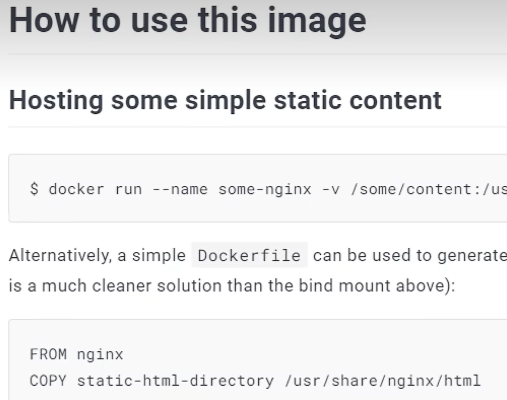
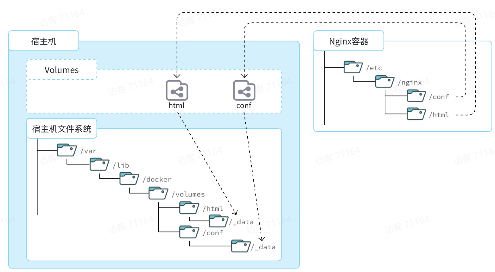

docker为每一个应用提供完全隔离的环境-配置的环境也叫做container/容器

image/镜像：包含部署的程序以及关联的所有库

容器：通过镜像创建，就像一台台运行起来的虚拟机

# 安装Docker

* 卸载旧版

```Shell
yum remove docker \
    docker-client \
    docker-client-latest \
    docker-common \
    docker-latest \
    docker-latest-logrotate \
    docker-logrotate \
    docker-engine
```

* 配置Docker的yum库

首先要安装一个yum工具

```Bash
yum install -y yum-utils
```

安装成功后，执行命令，配置Docker的yum源：

```Bash
yum-config-manager --add-repo https://download.docker.com/linux/centos/docker-ce.repo
```

* 安装Docker

```Bash
yum install -y docker-ce docker-ce-cli containerd.io docker-buildx-plugin docker-compose-plugin
```

docker -v 查看版本

docker images显示没有连接，docker也是一个服务进程(如mysql)需要启动

## 启动和校验

```Bash
# 启动Docker
systemctl start docker
# 停止Docker
systemctl stop docker
# 重启
systemctl restart docker
# 设置开机自启
systemctl enable docker
# 执行docker ps命令，如果不报错，说明安装启动成功
docker ps
```

##配置镜像加速

镜像加速在24年中旬g了

以前的阿里镜像

```Bash
# 创建目录
mkdir -p /etc/docker
# 复制内容，注意把其中的镜像加速地址改成你自己的
tee /etc/docker/daemon.json <<-'EOF'
{
  "registry-mirrors": ["https://1l76bl56.mirror.aliyuncs.com"]
}
EOF

# 重新加载配置
systemctl daemon-reload

# 重启Docker
systemctl restart docker
```

# 部署mysql

```
docker run -d \
  --name mysql \
  -p 3306:3306 \
  -e TZ=Asia/Shanghai \
  -e MYSQL_ROOT_PASSWORD=123 \
  mysql
```

下载的是安装好的mysql-==镜像==(包含应用-环境-配置-函数库)

docker在运行镜像时会创建一个隔离的环境-容器

可以换个名字换个端口3307:3306再次运行一个镜像

docker ps查看运行的镜像

镜像仓库:全球Docker Hub 华为 腾讯 ali 公司私服

## 命令解读

- docker run -d ：创建并运行一个容器，-d 容器后台运行
- --name mysql  : 容器名字
- -p 3306:3306 : 设置端口映射。 前面是宿主端口 后面是容器端口
  - 容器内端口往往是由容器内的进程决定，例如MySQL进程默认端口是3306，因此容器内端口一定是3306；而宿主机端口则可以任意指定，一般与容器内保持一致。
- -e TZ=Asia/Shanghai : 配置容器内进程运行时的一些参数-环境变量
  - 格式：-e KEY=VALUE，KEY和VALUE都由容器内进程决定
  - docker hub上查
  - 案例中，TZ=Asia/Shanghai是设置时区；MYSQL_ROOT_PASSWORD=123是设置MySQL默认密码
- mysql: 设置**镜像**名称，Docker会根据这个名字搜索并下载镜像
  - 格式：REPOSITORY:TAG，例如mysql:8.0，其中REPOSITORY为镜像名，TAG是版本号
  - 在未指定TAG的情况下，默认是最新版本，也就是mysql:latest

# Docker基础

Docker官方文档：

https://docs.docker.com/

## 常见命令

首先我们来学习Docker中的常见命令，可以参考官方文档：

https://docs.docker.com/engine/reference/commandline/cli/

### 命令介绍

其中，比较常见的命令有：

| **命令**       | **说明**                       | **文档地址**                                                 |
| :------------- | :----------------------------- | :----------------------------------------------------------- |
| docker pull    | 拉取镜像                       | [docker pull](https://docs.docker.com/engine/reference/commandline/pull/) |
| docker push    | 推送镜像到DockerRegistry       | [docker push](https://docs.docker.com/engine/reference/commandline/push/) |
| docker images  | 查看本地镜像                   | [docker images](https://docs.docker.com/engine/reference/commandline/images/) |
| docker rmi     | 删除本地镜像                   | [docker rmi](https://docs.docker.com/engine/reference/commandline/rmi/) |
| docker run     | 创建并运行容器（不能重复创建） | [docker run](https://docs.docker.com/engine/reference/commandline/run/) |
| docker stop    | 停止指定容器                   | [docker stop](https://docs.docker.com/engine/reference/commandline/stop/) |
| docker start   | 启动指定容器                   | [docker start](https://docs.docker.com/engine/reference/commandline/start/) |
| docker restart | 重新启动容器                   | [docker restart](https://docs.docker.com/engine/reference/commandline/restart/) |
| docker rm      | 删除指定容器                   | [docs.docker.com](https://docs.docker.com/engine/reference/commandline/rm/) |
| docker ps      | 查看容器                       | [docker ps](https://docs.docker.com/engine/reference/commandline/ps/) |
| docker logs    | 查看容器运行日志               | [docker logs](https://docs.docker.com/engine/reference/commandline/logs/) |
| docker exec    | 进入容器                       | [docker exec](https://docs.docker.com/engine/reference/commandline/exec/) |
| docker save    | 保存镜像到本地压缩文件         | [docker save](https://docs.docker.com/engine/reference/commandline/save/) |
| docker load    | 加载本地压缩文件到镜像         | [docker load](https://docs.docker.com/engine/reference/commandline/load/) |
| docker inspect | 查看容器详细信息               | [docker inspect](https://docs.docker.com/engine/reference/commandline/inspect/) |


补充：

默认情况下，每次重启虚拟机我们都需要手动启动Docker和Docker中的容器。通过命令可以实现开机自启：

```PowerShell
# Docker开机自启
systemctl enable docker
# Docker容器开机自启
docker update --restart=always [容器名/容器id]
```

### 演示Nginx

```PowerShell
# 第1步，去DockerHub查看nginx镜像仓库及相关信息
# 第2步，拉取Nginx镜像
docker pull nginx
# 第3步，查看镜像
docker images
# 结果如下：
REPOSITORY   TAG       IMAGE ID       CREATED         SIZE
nginx        latest    605c77e624dd   16 months ago   141MB
mysql        latest    3218b38490ce   17 months ago   516MB
# 第4步，创建并允许Nginx容器
docker run -d --name nginx -p 80:80 nginx
# 第5步，查看运行中容器
docker ps
# 也可以加格式化方式访问，格式会更加清爽
docker ps --format "table {{.ID}}\t{{.Image}}\t{{.Ports}}\t{{.Status}}\t{{.Names}}"
# 第6步，访问网页，地址：http://虚拟机地址
# 第7步，停止容器
docker stop nginx
# 第8步，查看所有容器(包括停掉的)
docker ps -a --format "table {{.ID}}\t{{.Image}}\t{{.Ports}}\t{{.Status}}\t{{.Names}}"
# 第9步，再次启动nginx容器
docker start nginx
# 第10步，再次查看容器
docker ps --format "table {{.ID}}\t{{.Image}}\t{{.Ports}}\t{{.Status}}\t{{.Names}}"
# 第11步，查看容器详细信息
docker inspect nginx
# 第12步，进入容器,查看容器内目录
docker exec -it nginx bash
# 或者，可以进入MySQL
docker exec -it mysql mysql -uroot -p
# 第13步，删除容器
docker rm nginx
# 发现无法删除，因为容器运行中，强制删除容器
docker rm -f nginx
```

当想使用docker save不知道后面怎么写了,`docker save --help`查看帮助

`docker save -o nginx.tar nginx:lastest`就会在目录下生存一个nginx.tar的文件

可以拷贝到别的机器上使用 

`docker rmi nginx:lastest`删除镜像

`docker load -i naginx.tar`使用刚才打包的文件


`docker logs -f nginx`持续查看日志-用于调试


###命令别名

```PowerShell
# 修改/root/.bashrc文件
vi /root/.bashrc
或vi ~/.bashrc
内容如下：
# .bashrc

# User specific aliases and functions

alias rm='rm -i'
alias cp='cp -i'
alias mv='mv -i'
alias dps='docker ps --format "table {{.ID}}\t{{.Image}}\t{{.Ports}}\t{{.Status}}\t{{.Names}}"'
alias dis='docker images'

# Source global definitions
if [ -f /etc/bashrc ]; then
        . /etc/bashrc
fi
```

生效:

```PowerShell
source /root/.bashrc
```

##数据卷

### 案例一

创建nginx容器，修改nginx容器内html目录下index.html文件,查看变化

将静态资源部署到nginx的html目录

* 找到index.html文件在哪里

* * 看官网
  * 

* ~~~powershell
  docker exec -it nginx bash
  cd /usr/share/nginx/html
  vi index.html #没有命令vi 文件内修改资源很困难
  ~~~

**数据卷（volume）**是一个虚拟目录，是容器内目录与宿主机目录之间映射的桥梁。



一旦绑定,一着变则全变

/var/lib/docker/volumes`这个目录就是默认的存放所有容器数据卷的目录，其下再根据数据卷名称创建新目录，格式为`/数据卷名/_data

docker volume --help

| **命令**                                                 | **说明**             | **文档地址**                                                 |
| :------------------------------------------------------- | :------------------- | :----------------------------------------------------------- |
| docker volume create(不用自己创建-v挂载的时候会自动创建) | 创建数据卷           | [docker volume create](https://docs.docker.com/engine/reference/commandline/volume_create/) |
| docker volume ls                                         | 查看所有数据卷       | [docs.docker.com](https://docs.docker.com/engine/reference/commandline/volume_ls/) |
| docker volume rm                                         | 删除指定数据卷       | [docs.docker.com](https://docs.docker.com/engine/reference/commandline/volume_prune/) |
| docker volume inspect                                    | 查看某个数据卷的详情 | [docs.docker.com](https://docs.docker.com/engine/reference/commandline/volume_inspect/) |
| docker volume prune                                      | 清除数据卷           | [docker volume prune](https://docs.docker.com/engine/reference/commandline/volume_prune/) |

```PowerShell
# 1.首先创建容器并指定数据卷，注意通过 -v 参数来指定数据卷
docker run -d --name nginx -p 80:80 -v html:/usr/share/nginx/html nginx #先把原来的删除了 docker rm -f nginx

# 2.然后查看数据卷
docker volume ls
# 结果
DRIVER    VOLUME NAME
local     29524ff09715d3688eae3f99803a2796558dbd00ca584a25a4bbc193ca82459f
local     html

# 3.查看数据卷详情
docker volume inspect html
# 结果
[
    {
        "CreatedAt": "2024-05-17T19:57:08+08:00",
        "Driver": "local",
        "Labels": null,
        "Mountpoint": "/var/lib/docker/volumes/html/_data",
        "Name": "html",
        "Options": null,
        "Scope": "local"
    }
]

# 4.查看/var/lib/docker/volumes/html/_data目录
ll /var/lib/docker/volumes/html/_data
# 可以看到与nginx的html目录内容一样，结果如下：
总用量 8
-rw-r--r--. 1 root root 497 12月 28 2021 50x.html
-rw-r--r--. 1 root root 615 12月 28 2021 index.html

# 5.进入该目录，并随意修改index.html内容
cd /var/lib/docker/volumes/html/_data
vi index.html

# 6.打开页面，查看效果

# 7.进入容器内部，查看/usr/share/nginx/html目录内的文件是否变化
docker exec -it nginx bash
```

改完访问ip可以看到改完的网页,也可以在这个目录下再上传更多的静态资源 通过/访问

###MySQL容器的数据挂载(匿名卷)

教学**演示环节**：演示一下MySQL的匿名数据卷

```PowerShell
# 1.查看MySQL容器详细信息
docker inspect mysql
# 关注其中.Config.Volumes部分和.Mounts部分
```

我们关注两部分内容，第一是`.Config.Volumes`部分：

```JSON
{
  "Config": {
    // ... 略
    "Volumes": {
      "/var/lib/mysql": {}
    }
    // ... 略
  }
}
```

可以发现这个容器声明了一个本地目录，需要挂载数据卷，但是**数据卷未定义**。这就是匿名卷。

然后，我们再看结果中的`.Mounts`部分：

```JSON
{
  "Mounts": [
    {
      "Type": "volume",
      "Name": "29524ff09715d3688eae3f99803a2796558dbd00ca584a25a4bbc193ca82459f",
      "Source": "/var/lib/docker/volumes/29524ff09715d3688eae3f99803a2796558dbd00ca584a25a4bbc193ca82459f/_data",
      "Destination": "/var/lib/mysql",
      "Driver": "local",
    }
  ]
}
```

可以发现，其中有几个关键属性：

- Name：数据卷名称。由于定义容器未设置容器名，这里的就是匿名卷自动生成的名字，一串hash值。
- Source：宿主机目录
- Destination : 容器内的目录

上述配置是将容器内的`/var/lib/mysql`这个目录，与数据卷`29524ff09715d3688eae3f99803a2796558dbd00ca584a25a4bbc193ca82459f`挂载。于是在宿主机中就有了`/var/lib/docker/volumes/29524ff09715d3688eae3f99803a2796558dbd00ca584a25a4bbc193ca82459f/_data`这个目录。这就是匿名数据卷对应的目录，其使用方式与普通数据卷没有差别。

接下来，可以查看该目录下的MySQL的data文件：

```Bash
ls -l /var/lib/docker/volumes/29524ff09715d3688eae3f99803a2796558dbd00ca584a25a4bbc193ca82459f/_data
```

这个匿名卷挂的是数据库存储的信息(数据库-表等,便于迁移数据)

注意：每一个不同的镜像，将来创建容器后内部有哪些目录可以挂载，可以参考DockerHub对应的页面

删除容器-卷还在-数据也还在-使用新的容器后想要迁移过去比较麻烦-一般自己做一个挂载-且不挂在valume下

### 挂载本地目录或文件

可以发现，数据卷的目录结构较深，如果我们去操作数据卷目录会不太方便。在很多情况下，我们会直接将容器目录与宿主机指定目录挂载。挂载语法与数据卷类似：

```Bash
# 挂载本地目录
-v 本地目录:容器内目录
# 挂载本地文件
-v 本地文件:容器内文件
```

**注意**：本地目录或文件必须以 `/` 或 `./`开头，如果直接以名字开头，会被识别为数据卷名而非本地目录名。

例如：

```Bash
-v mysql:/var/lib/mysql # 会被识别为一个数据卷叫mysql，运行时会自动创建这个数据卷
-v ./mysql:/var/lib/mysql # 会被识别为当前目录下的mysql目录，运行时如果不存在会创建目录
```

**教学演示**，删除并重新创建mysql容器，并完成本地目录挂载：(查官方文档)(先创建好本地目录)

- 挂载`/root/mysql/data`到容器内的`/var/lib/mysql`目录
- 挂载`/root/mysql/init`到容器内的`/docker-entrypoint-initdb.d`目录（初始化的SQL脚本目录(初始化一些要用到数据库)）
- 挂载`/root/mysql/conf`到容器内的`/etc/mysql/conf.d`目录（这个是MySQL配置文件目录）(配置成utf-8)

在课前资料中已经准备好了mysql的`init`目录和`conf`目录：


以及对应的初始化SQL脚本和配置文件：


其中，hm.cnf主要是配置了MySQL的默认编码，改为utf8mb4；而hmall.sql则是后面我们要用到的黑马商城项目的初始化SQL脚本。

我们直接将整个mysql目录上传至虚拟机的`/root`目录下：


接下来，我们演示本地目录挂载：

```Bash
# 1.删除原来的MySQL容器
docker rm -f mysql

# 2.进入root目录
cd ~

# 3.创建并运行新mysql容器，挂载本地目录
docker run -d \
  --name mysql \
  -p 3306:3306 \
  -e TZ=Asia/Shanghai \
  -e MYSQL_ROOT_PASSWORD=123 \
  -v ./mysql/data:/var/lib/mysql \
  -v ./mysql/conf:/etc/mysql/conf.d \
  -v ./mysql/init:/docker-entrypoint-initdb.d \
  mysql

# 4.查看root目录，可以发现~/mysql/data目录已经自动创建好了
ls -l mysql
# 结果：
总用量 4
drwxr-xr-x. 2 root    root   20 5月  19 15:11 conf
drwxr-xr-x. 7 polkitd root 4096 5月  19 15:11 data
drwxr-xr-x. 2 root    root   23 5月  19 15:11 init

# 查看data目录，会发现里面有大量数据库数据，说明数据库完成了初始化
ls -l data

# 5.查看MySQL容器内数据
# 5.1.进入MySQL
docker exec -it mysql mysql -uroot -p123
# 5.2.查看编码表
show variables like "%char%";
# 5.3.结果，发现编码是utf8mb4没有问题
+--------------------------+--------------------------------+
| Variable_name            | Value                          |
+--------------------------+--------------------------------+
| character_set_client     | utf8mb4                        |
| character_set_connection | utf8mb4                        |
| character_set_database   | utf8mb4                        |
| character_set_filesystem | binary                         |
| character_set_results    | utf8mb4                        |
| character_set_server     | utf8mb4                        |
| character_set_system     | utf8mb3                        |
| character_sets_dir       | /usr/share/mysql-8.0/charsets/ |
+--------------------------+--------------------------------+

# 6.查看数据
# 6.1.查看数据库
show databases;
# 结果，hmall是黑马商城数据库
+--------------------+
| Database           |
+--------------------+
| hmall              |
| information_schema |
| mysql              |
| performance_schema |
| sys                |
+--------------------+
5 rows in set (0.00 sec)
# 6.2.切换到hmall数据库
use hmall;
# 6.3.查看表
show tables;
# 结果：
+-----------------+
| Tables_in_hmall |
+-----------------+
| address         |
| cart            |
| item            |
| order           |
| order_detail    |
| order_logistics |
| pay_order       |
| user            |
+-----------------+
# 6.4.查看address表数据
+----+---------+----------+--------+----------+-------------+---------------+-----------+------------+-------+
| id | user_id | province | city   | town     | mobile      | street        | contact   | is_default | notes |
+----+---------+----------+--------+----------+-------------+---------------+-----------+------------+-------+
| 59 |       1 | 北京     | 北京   | 朝阳区    | 13900112222 | 金燕龙办公楼   | 李佳诚    | 0          | NULL  |
| 60 |       1 | 北京     | 北京   | 朝阳区    | 13700221122 | 修正大厦       | 李佳红    | 0          | NULL  |
| 61 |       1 | 上海     | 上海   | 浦东新区  | 13301212233 | 航头镇航头路   | 李佳星    | 1          | NULL  |
| 63 |       1 | 广东     | 佛山   | 永春      | 13301212233 | 永春武馆       | 李晓龙    | 0          | NULL  |
+----+---------+----------+--------+----------+-------------+---------------+-----------+------------+-------+
4 rows in set (0.00 sec)
```

##镜像

前面我们一直在使用别人准备好的镜像，那如果我要部署一个Java项目，把它打包为一个镜像该怎么做呢？

### 镜像结构

镜像中包含了程序运行需要的系统函数库、环境、配置、依赖。

依次准备好程序运行的基础环境、依赖、应用本身、运行配置等文件，并且打包而成。

举个例子，我们要从0部署一个Java应用，大概流程是这样：

- 准备一个linux服务（CentOS或者Ubuntu均可）
- 安装并配置JDK
- 上传Jar包
- 运行jar包

那因此，我们打包镜像也是分成这么几步：

- 准备Linux运行环境（java项目并不需要完整的操作系统，仅仅是基础运行环境即可）
- 安装并配置JDK
- 拷贝jar包
- 配置启动脚本

上述步骤中的每一次操作其实都是在生产一些文件（系统运行环境、函数库、配置最终都是磁盘文件），所以**镜像就是一堆文件的集合**。

但需要注意的是，镜像文件不是随意堆放的，而是按照操作的步骤分层叠加而成，每一层形成的文件都会单独打包并标记一个唯一id，称为**Layer**（**层**）。这样，如果我们构建时用到的某些层其他人已经制作过，就可以直接拷贝使用这些层，而不用重复制作。

例如，第一步中需要的Linux运行环境，通用性就很强，所以Docker官方就制作了这样的只包含Linux运行环境的镜像。我们在制作java镜像时，就无需重复制作，直接使用Docker官方提供的CentOS或Ubuntu镜像作为基础镜像。然后再搭建其它层即可，这样逐层搭建，最终整个Java项目的镜像结构如图所示：


### Dockerfile

由于制作镜像的过程中，需要逐层处理和打包，Docker就提供了自动打包镜像的功能。我们只需要将打包的过程，每一层要做的事情用固定的语法写下来，交给Docker去执行即可。

而这种记录镜像结构的文件就称为**Dockerfile**，其对应的语法可以参考官方文档：

https://docs.docker.com/engine/reference/builder/

其中的语法比较多，比较常用的有：

| **指令**       | **说明**                                                     | **示例**                     |
| :------------- | :----------------------------------------------------------- | :--------------------------- |
| **FROM**       | 指定基础镜像                                                 | `FROM centos:6`              |
| **ENV**        | 设置环境变量，可在后面指令使用                               | `ENV key value`              |
| **COPY**       | 拷贝本地文件到镜像的指定目录                                 | `COPY ./xx.jar /tmp/app.jar` |
| **RUN**        | 执行Linux的shell命令，一般是安装过程的命令                   | `RUN yum install gcc`        |
| **EXPOSE**     | 指定容器运行时监听的端口，是给镜像使用者看的(告诉使用者用这个端口做映射) | EXPOSE 8080                  |
| **ENTRYPOINT** | 镜像中应用的启动命令，容器运行时调用                         | ENTRYPOINT java -jar xx.jar  |

例如，要基于Ubuntu镜像来构建一个Java应用，其Dockerfile内容如下：

```Dockerfile
# 指定基础镜像
FROM ubuntu:16.04
# 配置环境变量，JDK的安装目录、容器内时区
ENV JAVA_DIR=/usr/local
ENV TZ=Asia/Shanghai
# 拷贝jdk和java项目的包
COPY ./jdk8.tar.gz $JAVA_DIR/
COPY ./docker-demo.jar /tmp/app.jar
# 设定时区
RUN ln -snf /usr/share/zoneinfo/$TZ /etc/localtime && echo $TZ > /etc/timezone
# 安装JDK
RUN cd $JAVA_DIR \
 && tar -xf ./jdk8.tar.gz \
 && mv ./jdk1.8.0_144 ./java8
# 配置环境变量
ENV JAVA_HOME=$JAVA_DIR/java8
ENV PATH=$PATH:$JAVA_HOME/bin
# 指定项目监听的端口
EXPOSE 8080
# 入口，java项目的启动命令
ENTRYPOINT ["java", "-jar", "/app.jar"]
```

同学们思考一下：以后我们会有很多很多java项目需要打包为镜像，他们都需要Linux系统环境、JDK环境这两层，只有上面的3层不同（因为jar包不同）。如果每次制作java镜像都重复制作前两层镜像，是不是很麻烦。

所以，就有人提供了基础的系统加JDK环境，我们在此基础上制作java镜像，就可以省去JDK的配置了：

```Dockerfile
# 基础镜像-需要先下载
FROM openjdk:11.0-jre-buster
# 设定时区(可有可无)
ENV TZ=Asia/Shanghai
RUN ln -snf /usr/share/zoneinfo/$TZ /etc/localtime && echo $TZ > /etc/timezone
# 拷贝jar包
COPY docker-demo.jar /app.jar
# 入口
ENTRYPOINT ["java", "-jar", "/app.jar"]
```

### 构建镜像

当Dockerfile文件写好以后，就可以利用命令来构建镜像了。

在课前资料中，我们准备好了一个demo项目及对应的Dockerfile：


首先，我们将课前资料提供的`docker-demo.jar`包以及`Dockerfile`拷贝到虚拟机的`/root/demo`目录：


然后，执行命令，构建镜像：

```Bash
# 进入镜像目录
cd /root/demo
# 开始构建
docker build -t docker-demo:1.0 .
```

命令说明：

- `docker build `: 就是构建一个docker镜像
- `-t docker-demo:1.0` ：`-t`参数是指定镜像的名称（`repository`和`tag`）
- `.` : 最后的点是指构建时Dockerfile所在路径，由于我们进入了demo目录，所以指定的是`.`代表当前目录，也可以直接指定Dockerfile目录：
  - ```Bash
    # 直接指定Dockerfile目录
    docker build -t docker-demo:1.0 /root/demo
    ```

结果：


查看镜像列表：

```Bash
# 查看镜像列表：
docker images
# 结果
REPOSITORY    TAG       IMAGE ID       CREATED          SIZE
docker-demo   1.0       d6ab0b9e64b9   27 minutes ago   327MB
nginx         latest    605c77e624dd   16 months ago    141MB
mysql         latest    3218b38490ce   17 months ago    516MB
```

然后尝试运行该镜像：

```Bash
# 1.创建并运行容器
docker run -d --name dd -p 8090:8090 docker-demo:1.0
# 2.查看容器
dps
# 结果
CONTAINER ID   IMAGE             PORTS                                                  STATUS         NAMES
78a000447b49   docker-demo:1.0   0.0.0.0:8080->8080/tcp, :::8090->8090/tcp              Up 2 seconds   dd
f63cfead8502   mysql             0.0.0.0:3306->3306/tcp, :::3306->3306/tcp, 33060/tcp   Up 2 hours     mysql

# 3.访问
curl localhost:8080/hello/count
# 结果：
<h5>欢迎访问黑马商城, 这是您第1次访问<h5>
```

## 网络

项目往往需要访问其它各种中间件，例如MySQL、Redis等。现在，我们的容器之间能否互相访问呢？

首先，我们查看下MySQL容器的详细信息，重点关注其中的网络IP地址：

```Bash
# 1.用基本命令，寻找Networks.bridge.IPAddress属性
docker inspect mysql
# 也可以使用format过滤结果
docker inspect --format='{{range .NetworkSettings.Networks}}{{println .IPAddress}}{{end}}' mysql
# 得到IP地址如下：
172.17.0.2
```

在同一个网段中

但是，容器的网络IP其实是一个虚拟的IP，其值并不固定与某一个容器绑定，如果我们在开发时写死某个IP，而在部署时很可能MySQL容器的IP会发生变化，连接会失败。

所以，我们必须借助于docker的网络功能来解决这个问题，官方文档：

https://docs.docker.com/engine/reference/commandline/network/

常见命令有：

| **命令**                  | **说明**                 | **文档地址**                                                 |
| :------------------------ | :----------------------- | :----------------------------------------------------------- |
| docker network create     | 创建一个网络             | [docker network create](https://docs.docker.com/engine/reference/commandline/network_create/) |
| docker network ls         | 查看所有网络             | [docs.docker.com](https://docs.docker.com/engine/reference/commandline/network_ls/) |
| docker network rm         | 删除指定网络             | [docs.docker.com](https://docs.docker.com/engine/reference/commandline/network_rm/) |
| docker network prune      | 清除未使用的网络         | [docs.docker.com](https://docs.docker.com/engine/reference/commandline/network_prune/) |
| docker network connect    | 使指定容器连接加入某网络 | [docs.docker.com](https://docs.docker.com/engine/reference/commandline/network_connect/) |
| docker network disconnect | 使指定容器连接离开某网络 | [docker network disconnect](https://docs.docker.com/engine/reference/commandline/network_disconnect/) |
| docker network inspect    | 查看网络详细信息         | [docker network inspect](https://docs.docker.com/engine/reference/commandline/network_inspect/) |

创建好docker后会自动创建一个docker 0的虚拟的网卡172.17.0.1/16

默认容器是以网桥连接到虚拟网络中.容器可以互连并且可以通过容器名互联

```Bash
# 1.首先通过命令创建一个网络
docker network create hmall
# 2.然后查看网络
docker network ls
# 结果：
NETWORK ID     NAME      DRIVER    SCOPE
639bc44d0a87   bridge    bridge    local
403f16ec62a2   hmall     bridge    local
0dc0f72a0fbb   host      host      local
cd8d3e8df47b   none      null      local
# 其中，除了hmall以外，其它都是默认的网络

# 3.让dd和mysql都加入该网络，注意，在加入网络时可以通过--alias给容器起别名
# 3.1.mysql容器，指定别名为db，另外每一个容器都有一个别名是容器名
docker network connect hmall mysql --alias db
# 3.2.db容器，也就是我们的java项目
docker network connect hmall dd

# 4.进入dd容器，尝试利用别名访问db
# 4.1.进入容器
docker exec -it dd bash
# 4.2.用db别名访问
ping db
# 结果
PING db (172.18.0.2) 56(84) bytes of data.
64 bytes from mysql.hmall (172.18.0.2): icmp_seq=1 ttl=64 time=0.070 ms
64 bytes from mysql.hmall (172.18.0.2): icmp_seq=2 ttl=64 time=0.056 ms
# 4.3.用容器名访问
ping mysql
# 结果：
PING mysql (172.18.0.2) 56(84) bytes of data.
64 bytes from mysql.hmall (172.18.0.2): icmp_seq=1 ttl=64 time=0.044 ms
64 bytes from mysql.hmall (172.18.0.2): icmp_seq=2 ttl=64 time=0.054 ms
```

OK，现在无需记住IP地址也可以实现容器互联了。

**总结**：

- 在自定义网络中，可以给容器起多个别名，默认的别名是容器名本身
- 在同一个自定义网络中的容器，可以通过别名互相访问


ip addr 可以看到虚拟机的网卡默认只有l0 ens(虚拟机真实ip) docker0 多一个我们设置的新的网桥

# 项目部署

在课前资料中已经提供了一个黑马商城项目给大家，如图：

项目说明：

- hmall：商城的后端代码
- hmall-portal：商城用户端的前端代码
- hmall-admin：商城管理端的前端代码

部署的容器及端口说明：

| **项目**     | **容器名** | **端口**           | **备注**            |
| :----------- | :--------- | :----------------- | :------------------ |
| hmall        | hmall      | 8080               | 黑马商城后端API入口 |
| hmall-portal | nginx      | 18080              | 黑马商城用户端入口  |
| hmall-admin  | 18081      | 黑马商城管理端入口 |                     |
| mysql        | mysql      | 3306               | 数据库              |

mysql容器中已经准备好了商城的数据，所以就不再删除了。

## 部署Java项目

`hmall`项目是一个maven聚合项目，使用IDEA打开`hmall`项目，查看项目结构如图：


我们要部署的就是其中的`hm-service`，其中的配置文件采用了多环境的方式：


其中的`application-dev.yaml`是部署到开发环境的配置，`application-local.yaml`是本地运行时的配置。

查看application.yaml，你会发现其中的JDBC地址并未写死，而是读取变量：


这两个变量在`application-dev.yaml`和`application-local.yaml`中并不相同：


在dev开发环境（也就是Docker部署时）采用了mysql作为地址，刚好是我们的mysql容器名，只要两者在一个网络，就一定能互相访问。

我们将项目打包：


结果：


将`hm-service`目录下的`Dockerfile`和`hm-service/target`目录下的`hm-service.jar`一起上传到虚拟机的`root`目录：


部署项目：

```Bash
# 1.构建项目镜像，不指定tag，则默认为latest
docker build -t hmall .

# 2.查看镜像
docker images
# 结果
REPOSITORY    TAG       IMAGE ID       CREATED          SIZE
hmall         latest    0bb07b2c34b9   43 seconds ago   362MB
docker-demo   1.0       49743484da68   24 hours ago     327MB
nginx         latest    605c77e624dd   16 months ago    141MB
mysql         latest    3218b38490ce   17 months ago    516MB

# 3.创建并运行容器，并通过--network将其加入hmall网络，这样才能通过容器名访问mysql
docker run -d --name hmall --network hmall -p 8080:8080 hmall
```

测试，通过浏览器访问：http://你的虚拟机地址:8080/search/list

## 部署前端

`hmall-portal`和`hmall-admin`是前端代码，需要基于nginx部署。在课前资料中已经给大家提供了nginx的部署目录：


其中：

- `html`是静态资源目录，我们需要把`hmall-portal`以及`hmall-admin`都复制进去
- `nginx.conf`是nginx的配置文件，主要是完成对`html`下的两个静态资源目录做代理

我们现在要做的就是把整个nginx目录上传到虚拟机的`/root`目录下：


然后创建nginx容器并完成两个挂载：

- 把`/root/nginx/nginx.conf`挂载到`/etc/nginx/nginx.conf`
- 把`/root/nginx/html`挂载到`/usr/share/nginx/html`

由于需要让nginx同时代理hmall-portal和hmall-admin两套前端资源，因此我们需要暴露两个端口：

- 18080：对应hmall-portal
- 18081：对应hmall-admin

命令如下：

```Bash
docker run -d \
  --name nginx \
  -p 18080:18080 \
  -p 18081:18081 \
  -v /root/nginx/html:/usr/share/nginx/html \
  -v /root/nginx/nginx.conf:/etc/nginx/nginx.conf \
  --network hmall \
  nginx
```

测试，通过浏览器访问：http://你的虚拟机ip:18080


## DockerCompose

大家可以看到，我们部署一个简单的java项目，其中包含3个容器：

- MySQL
- Nginx
- Java项目

而稍微复杂的项目，其中还会有各种各样的其它中间件，需要部署的东西远不止3个。如果还像之前那样手动的逐一部署，就太麻烦了。

而Docker Compose就可以帮助我们实现**多个相互关联的Docker容器的快速部署**。它允许用户通过一个单独的 docker-compose.yml 模板文件（YAML 格式）来定义一组相关联的应用容器。

### 基本语法

docker-compose.yml文件的基本语法可以参考官方文档：

https://docs.docker.com/compose/compose-file/compose-file-v3/

docker-compose文件中可以定义多个相互关联的应用容器，每一个应用容器被称为一个服务（service）。由于service就是在定义某个应用的运行时参数，因此与`docker run`参数非常相似。

举例来说，用docker run部署MySQL的命令如下：

```Bash
docker run -d \
  --name mysql \
  -p 3306:3306 \
  -e TZ=Asia/Shanghai \
  -e MYSQL_ROOT_PASSWORD=123 \
  -v ./mysql/data:/var/lib/mysql \
  -v ./mysql/conf:/etc/mysql/conf.d \
  -v ./mysql/init:/docker-entrypoint-initdb.d \
  --network hmall
  mysql
```

如果用`docker-compose.yml`文件来定义，就是这样：

```YAML
version: "3.8"

services:
  mysql:
    image: mysql
    container_name: mysql
    ports:
      - "3306:3306"
    environment:
      TZ: Asia/Shanghai
      MYSQL_ROOT_PASSWORD: 123
    volumes:
      - "./mysql/conf:/etc/mysql/conf.d"
      - "./mysql/data:/var/lib/mysql"
    networks:
      - new
networks:
  new:
    name: hmall
```

对比如下：

| **docker run 参数** | **docker compose 指令** | **说明**   |
| :------------------ | :---------------------- | :--------- |
| --name              | container_name          | 容器名称   |
| -p                  | ports                   | 端口映射   |
| -e                  | environment             | 环境变量   |
| -v                  | volumes                 | 数据卷配置 |
| --network           | networks                | 网络       |

明白了其中的对应关系，相信编写`docker-compose`文件应该难不倒大家。

黑马商城部署文件：

```YAML
version: "3.8"

services:
  mysql:
    image: mysql
    container_name: mysql
    ports:
      - "3306:3306"
    environment:
      TZ: Asia/Shanghai
      MYSQL_ROOT_PASSWORD: 123
    volumes:
      - "./mysql/conf:/etc/mysql/conf.d"
      - "./mysql/data:/var/lib/mysql"
      - "./mysql/init:/docker-entrypoint-initdb.d"
    networks:
      - hm-net
  hmall:
    build: 
      context: .
      dockerfile: Dockerfile
    container_name: hmall
    ports:
      - "8080:8080"
    networks:
      - hm-net
    depends_on:
      - mysql
  nginx:
    image: nginx
    container_name: nginx
    ports:
      - "18080:18080"
      - "18081:18081"
    volumes:
      - "./nginx/nginx.conf:/etc/nginx/nginx.conf"
      - "./nginx/html:/usr/share/nginx/html"
    depends_on:
      - hmall
    networks:
      - hm-net
networks:
  hm-net:
    name: hmall
```

### 基础命令

编写好docker-compose.yml文件，就可以部署项目了。常见的命令：

https://docs.docker.com/compose/reference/

基本语法如下：

```Bash
docker compose [OPTIONS] [COMMAND]
```

其中，OPTIONS和COMMAND都是可选参数，比较常见的有：

| **类型** | **参数或指令**                                               | **说明**                    |
| :------- | :----------------------------------------------------------- | :-------------------------- |
| Options  | -f                                                           | 指定compose文件的路径和名称 |
| -p       | 指定project名称。project就是当前compose文件中设置的多个service的集合，是逻辑概念 |                             |
| Commands | up                                                           | 创建并启动所有service容器   |
| down     | 停止并移除所有容器、网络                                     |                             |
| ps       | 列出所有启动的容器                                           |                             |
| logs     | 查看指定容器的日志                                           |                             |
| stop     | 停止容器                                                     |                             |
| start    | 启动容器                                                     |                             |
| restart  | 重启容器                                                     |                             |
| top      | 查看运行的进程                                               |                             |
| exec     | 在指定的运行中容器中执行命令                                 |                             |

教学演示：

```Bash
# 1.进入root目录
cd /root

# 2.删除旧容器
docker rm -f $(docker ps -qa)

# 3.删除hmall镜像
docker rmi hmall

# 4.清空MySQL数据
rm -rf mysql/data

# 5.启动所有, -d 参数是后台启动
docker compose up -d
# 结果：
[+] Building 15.5s (8/8) FINISHED
 => [internal] load build definition from Dockerfile                                    0.0s
 => => transferring dockerfile: 358B                                                    0.0s
 => [internal] load .dockerignore                                                       0.0s
 => => transferring context: 2B                                                         0.0s
 => [internal] load metadata for docker.io/library/openjdk:11.0-jre-buster             15.4s
 => [1/3] FROM docker.io/library/openjdk:11.0-jre-buster@sha256:3546a17e6fb4ff4fa681c3  0.0s
 => [internal] load build context                                                       0.0s
 => => transferring context: 98B                                                        0.0s
 => CACHED [2/3] RUN ln -snf /usr/share/zoneinfo/Asia/Shanghai /etc/localtime && echo   0.0s
 => CACHED [3/3] COPY hm-service.jar /app.jar                                           0.0s
 => exporting to image                                                                  0.0s
 => => exporting layers                                                                 0.0s
 => => writing image sha256:32eebee16acde22550232f2eb80c69d2ce813ed099640e4cfed2193f71  0.0s
 => => naming to docker.io/library/root-hmall                                           0.0s
[+] Running 4/4
 ✔ Network hmall    Created                                                             0.2s
 ✔ Container mysql  Started                                                             0.5s
 ✔ Container hmall  Started                                                             0.9s
 ✔ Container nginx  Started                                                             1.5s

# 6.查看镜像
docker compose images
# 结果
CONTAINER           REPOSITORY          TAG                 IMAGE ID            SIZE
hmall               root-hmall          latest              32eebee16acd        362MB
mysql               mysql               latest              3218b38490ce        516MB
nginx               nginx               latest              605c77e624dd        141MB

# 7.查看容器
docker compose ps
# 结果
NAME                IMAGE               COMMAND                  SERVICE             CREATED             STATUS              PORTS
hmall               root-hmall          "java -jar /app.jar"     hmall               54 seconds ago      Up 52 seconds       0.0.0.0:8080->8080/tcp, :::8080->8080/tcp
mysql               mysql               "docker-entrypoint.s…"   mysql               54 seconds ago      Up 53 seconds       0.0.0.0:3306->3306/tcp, :::3306->3306/tcp, 33060/tcp
nginx               nginx               "/docker-entrypoint.…"   nginx               54 seconds ago      Up 52 seconds       80/tcp, 0.0.0.0:18080-18081->18080-18081/tcp, :::18080-18081->18080-18081/tcp
```

打开浏览器，访问：http://yourIp:8080
