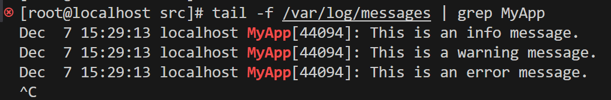

# syslog系统日志

mian.cpp

```cpp
#include <syslog.h>  
#include <iostream>  
#include <string>  
  
// 封装日志函数  
class Logger {  
public:  
    Logger(const std::string& appName) {  
        openlog(appName.c_str(), LOG_PID | LOG_CONS, LOG_USER);  
    }  
  
    ~Logger() {  
        closelog();  
    }  
  
    void log(int priority, const std::string& message) {  
        syslog(priority, "%s", message.c_str());  
    }  
  
    // 设置日志掩码以过滤日志级别  
    void setLogMask(int mask) {  
        setlogmask(mask);  
    }  
  
    // 示例日志方法  
    void debug(const std::string& msg) {  
        log(LOG_DEBUG, msg);  
    }  
  
    void info(const std::string& msg) {  
        log(LOG_INFO, msg);  
    }  
  
    void warning(const std::string& msg) {  
        log(LOG_WARNING, msg);  
    }  
  
    void error(const std::string& msg) {  
        log(LOG_ERR, msg);  
    }  
};  
  
int main() {  
    Logger logger("MyApp");  
  
    // 设置日志掩码，过滤掉 LOG_DEBUG 级别的日志  
    logger.setLogMask(LOG_UPTO(LOG_INFO)); // 允许 LOG_EMERG 到 LOG_INFO，但排除 LOG_DEBUG  
  
    // 尝试记录不同级别的日志  
    logger.debug("This is a debug message."); // 这将不会出现在日志中  
    logger.info("This is an info message.");  // 这将出现在日志中  
    logger.warning("This is a warning message."); // 这将出现在日志中  
    logger.error("This is an error message.");   // 这将出现在日志中  
  
    return 0;  
}
```

优先级：

特性：

* RAII模式管理日志资源（构造函数打开，析构函数关闭）
* 支持日志级别过滤 

> ```
> LOG_EMERG   (0) // 系统不可用（最高优先级）
> LOG_ALERT   (1) // 必须立即采取行动
> LOG_CRIT    (2) // 严重错误
> LOG_ERR     (3) // 错误
> LOG_WARNING (4) // 警告
> LOG_NOTICE  (5) // 正常但重要的情况
> LOG_INFO    (6) // 信息性消息
> LOG_DEBUG   (7) // 调试信息（最低优先级）
> ```
>
> LOG_UPTO(pri): 记录优先级等于或高于 pri 的所有消息

* 日志会被写入系统日志

>  \#Ubuntu/Debian 
>
> tail -f /var/log/syslog | grep MyApp
>
> \#RHEL/CentOS
>
> tail -f /var/log/messages | grep MyApp
>
> 

* 日志格式 时间戳+主机名+程序名+进程ID+日志消息

# 日志系统参考

https://blog.csdn.net/weixin_51322383/article/details/130464403

https://blog.csdn.net/weixin_51322383/article/details/130474753

## 队列

实现异步日志的关键，生成的日志放到队列中，写线程从队列中取出日志写入，用生产者消费者模型实现

**生产者消费者模型**

配合mutex互斥锁  `condition_variable`（条件变量） 实现线程间的同步与通信

**模板**

### blockqueue.h

```cpp
# ifndef BLOCKQUEUE_H
# define BLOCKQUEUE_H

#include <deque>
#include <condition_variable>
#include <mutex>
#include <sys/time.h>
using namespace std;

template<typename T>
class BlockQueue {
public:
    explicit BlockQueue(size_t maxsize = 1000);
    ~BlockQueue();
    bool empty();
    bool full();
    void push_back(const T& item);
    void push_front(const T& item); 
    bool pop(T& item);  // 弹出的任务放入item
    bool pop(T& item, int timeout);  // 等待时间
    void clear();
    T front();
    T back();
    size_t capacity();
    size_t size();

    void flush();
    void Close();

private:
    deque<T> deq_;                      // 底层数据结构
    mutex mtx_;                         // 锁
    bool isClose_;                      // 关闭标志
    size_t capacity_;                   // 容量
    condition_variable condConsumer_;   // 消费者条件变量
    condition_variable condProducer_;   // 生产者条件变量
};

template<typename T>
BlockQueue<T>::BlockQueue(size_t maxsize) : capacity_(maxsize) {
    assert(maxsize > 0);
    isClose_ = false;
}

template<typename T>
BlockQueue<T>::~BlockQueue() {
    Close();
}

template<typename T>
void BlockQueue<T>::Close() {
    // lock_guard<mutex> locker(mtx_); // 操控队列之前，都需要上锁
    // deq_.clear();                   // 清空队列
    clear();
    isClose_ = true;
    condConsumer_.notify_all();
    condProducer_.notify_all();
}

template<typename T>
void BlockQueue<T>::clear() {
    lock_guard<mutex> locker(mtx_);
    deq_.clear();
}

template<typename T>
bool BlockQueue<T>::empty() {
    lock_guard<mutex> locker(mtx_);
    return deq_.empty();
}

template<typename T>
bool BlockQueue<T>::full() {
    lock_guard<mutex> locker(mtx_);
    return deq_.size() >= capacity_;
}

template<typename T>
void BlockQueue<T>::push_back(const T& item) {
    // 注意，条件变量需要搭配unique_lock
    unique_lock<mutex> locker(mtx_);    
    while(deq_.size() >= capacity_) {   // 队列满了，需要等待
        condProducer_.wait(locker);     // 暂停生产，等待消费者唤醒生产条件变量
    }
    deq_.push_back(item);
    condConsumer_.notify_one();         // 唤醒消费者
}

template<typename T>
void BlockQueue<T>::push_front(const T& item) {
    unique_lock<mutex> locker(mtx_);
    while(deq_.size() >= capacity_) {   // 队列满了，需要等待
        condProducer_.wait(locker);     // 暂停生产，等待消费者唤醒生产条件变量
    }
    deq_.push_front(item);
    condConsumer_.notify_one();         // 唤醒消费者
}

template<typename T>
bool BlockQueue<T>::pop(T& item) {
    unique_lock<mutex> locker(mtx_);
    while(deq_.empty()) {
        if(isClose_) {
            return false;
        }
        condConsumer_.wait(locker);
    }
    item = deq_.front();
    deq_.pop_front();
    condProducer_.notify_one();
    return true;
}

template<typename T>
bool BlockQueue<T>::pop(T &item, int timeout) {
    unique_lock<std::mutex> locker(mtx_);
    while(deq_.empty()){
        if(condConsumer_.wait_for(locker, std::chrono::seconds(timeout)) 
                == std::cv_status::timeout){
            return false;
        }
        if(isClose_){
            return false;
        }
    }
    item = deq_.front();
    deq_.pop_front();
    condProducer_.notify_one();
    return true;
}

template<typename T>
T BlockQueue<T>::front() {
    lock_guard<std::mutex> locker(mtx_);
    return deq_.front();
}

template<typename T>
T BlockQueue<T>::back() {
    lock_guard<std::mutex> locker(mtx_);
    return deq_.back();
}

template<typename T>
size_t BlockQueue<T>::capacity() {
    lock_guard<std::mutex> locker(mtx_);
    return capacity_;
}

template<typename T>
size_t BlockQueue<T>::size() {
    lock_guard<std::mutex> locker(mtx_);
    return deq_.size();
}

// 唤醒消费者
template<typename T>
void BlockQueue<T>::flush() {
    condConsumer_.notify_one();
}
# endif
```

## 缓冲区

###buffer.h

```c++
#ifndef BUFFER_H
#define BUFFER_H
#include <cstring>   //perror
#include <iostream>
#include <unistd.h>  // write
#include <sys/uio.h> //readv
#include <vector> //readv
#include <atomic>
#include <assert.h>
class Buffer {
public:
    Buffer(int initBuffSize = 1024);
    ~Buffer() = default;

    size_t WritableBytes() const;       
    size_t ReadableBytes() const ;
    size_t PrependableBytes() const;

    const char* Peek() const;
    void EnsureWriteable(size_t len);
    void HasWritten(size_t len);

    void Retrieve(size_t len);
    void RetrieveUntil(const char* end);

    void RetrieveAll();
    std::string RetrieveAllToStr();

    const char* BeginWriteConst() const;
    char* BeginWrite();

    void Append(const std::string& str);
    void Append(const char* str, size_t len);
    void Append(const void* data, size_t len);
    void Append(const Buffer& buff);

    ssize_t ReadFd(int fd, int* Errno);
    ssize_t WriteFd(int fd, int* Errno);

private:
    char* BeginPtr_();  // buffer开头
    const char* BeginPtr_() const;
    void MakeSpace_(size_t len);

    std::vector<char> buffer_;  
    std::atomic<std::size_t> readPos_;  // 读的下标
    std::atomic<std::size_t> writePos_; // 写的下标
};

#endif //BUFFER_H
```

### buffer.cpp

```c++
#include "buffer.h"

// 读写下标初始化，vector<char>初始化
Buffer::Buffer(int initBuffSize) : buffer_(initBuffSize), readPos_(0), writePos_(0)  {}  

// 可写的数量：buffer大小 - 写下标
size_t Buffer::WritableBytes() const {
    return buffer_.size() - writePos_;
}

// 可读的数量：写下标 - 读下标
size_t Buffer::ReadableBytes() const {
    return writePos_ - readPos_;
}

// 可预留空间：已经读过的就没用了，等于读下标
size_t Buffer::PrependableBytes() const {
    return readPos_;
}

const char* Buffer::Peek() const {
    
    return &buffer_[readPos_];
}

// 确保可写的长度
void Buffer::EnsureWriteable(size_t len) {
    if(len > WritableBytes()) {
        MakeSpace_(len);
    }
    assert(len <= WritableBytes());
}

// 移动写下标，在Append中使用
void Buffer::HasWritten(size_t len) {
    writePos_ += len;
}

// 读取len长度，移动读下标
void Buffer::Retrieve(size_t len) {
    readPos_ += len;
}

// 读取到end位置
void Buffer::RetrieveUntil(const char* end) {
    assert(Peek() <= end );
    Retrieve(end - Peek()); // end指针 - 读指针 长度
}

// 取出所有数据，buffer归零，读写下标归零,在别的函数中会用到
void Buffer::RetrieveAll() {
    bzero(&buffer_[0], buffer_.size()); // 覆盖原本数据
    readPos_ = writePos_ = 0;
}

// 取出剩余可读的str
std::string Buffer::RetrieveAllToStr() {
    std::string str(Peek(), ReadableBytes());
    RetrieveAll();
    return str;
}

// 写指针的位置
const char* Buffer::BeginWriteConst() const {
    return &buffer_[writePos_];
}

char* Buffer::BeginWrite() {
    return &buffer_[writePos_];
}

// 添加str到缓冲区
void Buffer::Append(const char* str, size_t len) {
    assert(str);
    EnsureWriteable(len);   // 确保可写的长度
    std::copy(str, str + len, BeginWrite());    // 将str放到写下标开始的地方
    HasWritten(len);    // 移动写下标
}

void Buffer::Append(const std::string& str) {
    Append(str.c_str(), str.size());
}

void Append(const void* data, size_t len) {
    Append(static_cast<const char*>(data), len);
}

// 将buffer中的读下标的地方放到该buffer中的写下标位置
void Append(const Buffer& buff) {
    Append(buff.Peek(), buff.ReadableBytes());
}

// 将fd的内容读到缓冲区，即writable的位置
ssize_t Buffer::ReadFd(int fd, int* Errno) {
    char buff[65535];   // 栈区
    struct iovec iov[2];
    size_t writeable = WritableBytes(); // 先记录能写多少
    // 分散读， 保证数据全部读完
    iov[0].iov_base = BeginWrite();
    iov[0].iov_len = writeable;
    iov[1].iov_base = buff;
    iov[1].iov_len = sizeof(buff);

    ssize_t len = readv(fd, iov, 2);
    if(len < 0) {
        *Errno = errno;
    } else if(static_cast<size_t>(len) <= writeable) {   // 若len小于writable，说明写区可以容纳len
        writePos_ += len;   // 直接移动写下标
    } else {    
        writePos_ = buffer_.size(); // 写区写满了,下标移到最后
        Append(buff, static_cast<size_t>(len - writeable)); // 剩余的长度
    }
    return len;
}

// 将buffer中可读的区域写入fd中
ssize_t Buffer::WriteFd(int fd, int* Errno) {
    ssize_t len = write(fd, Peek(), ReadableBytes());
    if(len < 0) {
        *Errno = errno;
        return len;
    } 
    Retrieve(len);
    return len;
}

char* Buffer::BeginPtr_() {
    return &buffer_[0];
}

const char* Buffer::BeginPtr_() const{
    return &buffer_[0];
}

// 扩展空间
void Buffer::MakeSpace_(size_t len) {
    if(WritableBytes() + PrependableBytes() < len) {
        buffer_.resize(writePos_ + len + 1);
    } else {
        size_t readable = ReadableBytes();
        std::copy(BeginPtr_() + readPos_, BeginPtr_() + writePos_, BeginPtr_());
        readPos_ = 0;
        writePos_ = readable;
        assert(readable == ReadableBytes());
    }
}
```


## 实现

**单例模式**

这里我们需要传入初始化参数所以选择懒汉模式将类的静态对象放到函数静态函数中。

```c++
public:
	static Log* Instance(){static Log log;return &log;}
	void init(...);
private:
	 Log();

Log::Instance()->init(0, "./log", ".log", 1024);
```

### log.h

```cpp
#ifndef LOG_H
#define LOG_H

#include <mutex>
#include <string>
#include <thread>
#include <sys/time.h>
#include <string.h>
#include <stdarg.h>           // vastart va_end
#include <assert.h>
#include <sys/stat.h>         // mkdir
#include "blockqueue.h"
#include "../buffer/buffer.h"

class Log {
public:
    // 初始化日志实例（阻塞队列最大容量、日志保存路径、日志文件后缀）
    void init(int level, const char* path = "./log", 
                const char* suffix =".log",
                int maxQueueCapacity = 1024);

    static Log* Instance();
    static void FlushLogThread();   // 异步写日志公有方法，调用私有方法asyncWrite
    
    void write(int level, const char *format,...);  // 将输出内容按照标准格式整理
    void flush();

    int GetLevel();
    void SetLevel(int level);
    bool IsOpen() { return isOpen_; }

private:
    Log();
    void AppendLogLevelTitle_(int level);
    virtual ~Log();
    void AsyncWrite_(); // 异步写日志方法

private:
    static const int LOG_PATH_LEN = 256;    // 日志文件最长文件名
    static const int LOG_NAME_LEN = 256;    // 日志最长名字
    static const int MAX_LINES = 50000;     // 日志文件内的最长日志条数

    const char* path_;          //路径名
    const char* suffix_;        //后缀名

    int MAX_LINES_;             // 最大日志行数

    int lineCount_;             //日志行数记录
    int toDay_;                 //按当天日期区分文件

    bool isOpen_;               
 
    Buffer buff_;       // 输出的内容，缓冲区
    int level_;         // 日志等级
    bool isAsync_;      // 是否开启异步日志

    FILE* fp_;                                          //打开log的文件指针
    std::unique_ptr<BlockQueue<std::string>> deque_;    //阻塞队列
    std::unique_ptr<std::thread> writeThread_;          //写线程的指针
    std::mutex mtx_;                                    //同步日志必需的互斥量
};

#define LOG_BASE(level, format, ...) \
    do {\
        Log* log = Log::Instance();\
        if (log->IsOpen() && log->GetLevel() <= level) {\
            log->write(level, format, ##__VA_ARGS__); \
            log->flush();\
        }\
    } while(0);

// 四个宏定义，主要用于不同类型的日志输出，也是外部使用日志的接口
// ...表示可变参数，__VA_ARGS__就是将...的值复制到这里
// 前面加上##的作用是：当可变参数的个数为0时，这里的##可以把把前面多余的","去掉,否则会编译出错。
#define LOG_DEBUG(format, ...) do {LOG_BASE(0, format, ##__VA_ARGS__)} while(0);    
#define LOG_INFO(format, ...) do {LOG_BASE(1, format, ##__VA_ARGS__)} while(0);
#define LOG_WARN(format, ...) do {LOG_BASE(2, format, ##__VA_ARGS__)} while(0);
#define LOG_ERROR(format, ...) do {LOG_BASE(3, format, ##__VA_ARGS__)} while(0);

#endif //LOG_H

```

### log.cpp

```cpp
#include "log.h"
#include <errno.h>
#include <unistd.h>

// 构造函数
Log::Log() {
    fp_ = nullptr;
    deque_ = nullptr;
    writeThread_ = nullptr;
    lineCount_ = 0;
    toDay_ = 0;
    isAsync_ = false;
}

Log::~Log() {
    if(isAsync_) {
        deque_->Close();
        if(writeThread_ && writeThread_->joinable()) {
            writeThread_->join();
        }
    }
    
    {
        lock_guard<mutex> locker(mtx_);
        if(fp_) {
            flush();
            fclose(fp_);
            fp_ = nullptr;
        }
    }
}

// 唤醒阻塞队列消费者，开始写日志
void Log::flush() {
    if(isAsync_) {  // 只有异步日志才会用到deque
        deque_->flush();
    }
    fflush(fp_);    // 清空输入缓冲区
}

// 懒汉模式 局部静态变量法（这种方法不需要加锁和解锁操作）
Log* Log::Instance() {
    static Log log;
    return &log;
}

// 异步日志的写线程函数
void Log::FlushLogThread() {
    Log::Instance()->AsyncWrite_();
}

// 写线程真正的执行函数
void Log::AsyncWrite_() {
    string str = "";
    while(true) {
        if(deque_->pop(str)) {
            lock_guard<mutex> locker(mtx_);
            fputs(str.c_str(), fp_);
            fflush(fp_);
        } else {
            break;  // 队列已关闭
        }
    }
}

// 初始化日志实例
void Log::init(int level, const char* path, const char* suffix, int maxQueCapacity) {
    isOpen_ = true;
    level_ = level;
    path_ = path;
    suffix_ = suffix;
    if(maxQueCapacity) {    // 异步方式
        isAsync_ = true;
        if(!deque_) {   // 为空则创建一个
            unique_ptr<BlockQueue<std::string>> newQue(new BlockQueue<std::string>);
            // 因为unique_ptr不支持普通的拷贝或赋值操作,所以采用move
            // 将动态申请的内存权给deque，newDeque被释放
            deque_ = move(newQue);  // 左值变右值,掏空newDeque

            unique_ptr<thread> newThread(new thread(FlushLogThread));
            writeThread_ = move(newThread);
        }
    } else {
        isAsync_ = false;
    }

    lineCount_ = 0;
    time_t timer = time(nullptr);
    struct tm* systime = localtime(&timer);
    char fileName[LOG_NAME_LEN] = {0};
    snprintf(fileName, LOG_NAME_LEN - 1, "%s/%04d_%02d_%02d%s", 
            path_, systime->tm_year + 1900, systime->tm_mon + 1, systime->tm_mday, suffix_);
    toDay_ = systime->tm_mday;

    {
        lock_guard<mutex> locker(mtx_);
        buff_.RetrieveAll();
        if(fp_) {   // 重新打开
            flush();
            fclose(fp_);
        }

        // 确保目录存在
        if (access(path_, F_OK) != 0) {
            mkdir(path_, 0777);
        }
        
        fp_ = fopen(fileName, "a");
        if(fp_ == nullptr) {
            // 输出错误信息便于调试
            printf("Failed to open file %s, errno: %d\n", fileName, errno);
            return;  // 或其他错误处理
        }
        assert(fp_ != nullptr);
    }
}

void Log::write(int level, const char *format, ...) {
    struct timeval now = {0, 0};
    gettimeofday(&now, nullptr);
    time_t tSec = now.tv_sec;
    struct tm *sysTime = localtime(&tSec);
    struct tm t = *sysTime;
    va_list vaList;

    // 日志日期 日志行数  如果不是今天或行数超了
    if (toDay_ != t.tm_mday || (lineCount_ && (lineCount_  %  MAX_LINES == 0)))
    {
        unique_lock<mutex> locker(mtx_);
        locker.unlock();
        
        char newFile[LOG_NAME_LEN];
        char tail[36] = {0};
        snprintf(tail, 36, "%04d_%02d_%02d", t.tm_year + 1900, t.tm_mon + 1, t.tm_mday);

        if (toDay_ != t.tm_mday)    // 时间不匹配，则替换为最新的日志文件名
        {
            snprintf(newFile, LOG_NAME_LEN - 72, "%s/%s%s", path_, tail, suffix_);
            toDay_ = t.tm_mday;
            lineCount_ = 0;
        }
        else {
            snprintf(newFile, LOG_NAME_LEN - 72, "%s/%s-%d%s", path_, tail, (lineCount_  / MAX_LINES), suffix_);
        }
        
        locker.lock();
        flush();
        fclose(fp_);
        fp_ = fopen(newFile, "a");
        assert(fp_ != nullptr);
    }

    // 在buffer内生成一条对应的日志信息
    {
        unique_lock<mutex> locker(mtx_);
        lineCount_++;
        int n = snprintf(buff_.BeginWrite(), 128, "%d-%02d-%02d %02d:%02d:%02d.%06ld ",
                    t.tm_year + 1900, t.tm_mon + 1, t.tm_mday,
                    t.tm_hour, t.tm_min, t.tm_sec, now.tv_usec);
                    
        buff_.HasWritten(n);
        AppendLogLevelTitle_(level);    

        va_start(vaList, format);
        int m = vsnprintf(buff_.BeginWrite(), buff_.WritableBytes(), format, vaList);
        va_end(vaList);

        buff_.HasWritten(m);
        buff_.Append("\n\0", 2);

        if(isAsync_ && deque_ && !deque_->full()) { // 异步方式（加入阻塞队列中，等待写线程读取日志信息）
            deque_->push_back(buff_.RetrieveAllToStr());
        } else {    // 同步方式（直接向文件中写入日志信息）
            fputs(buff_.Peek(), fp_);   // 同步就直接写入文件
        }
        buff_.RetrieveAll();    // 清空buff
    }
}

// 添加日志等级
void Log::AppendLogLevelTitle_(int level) {
    switch(level) {
    case 0:
        buff_.Append("[debug]: ", 9);
        break;
    case 1:
        buff_.Append("[info] : ", 9);
        break;
    case 2:
        buff_.Append("[warn] : ", 9);
        break;
    case 3:
        buff_.Append("[error]: ", 9);
        break;
    default:
        buff_.Append("[info] : ", 9);
        break;
    }
}

int Log::GetLevel() {
    lock_guard<mutex> locker(mtx_);
    return level_;
}

void Log::SetLevel(int level) {
    lock_guard<mutex> locker(mtx_);
    level_ = level;
}
```

## 测试

main.cpp

```c++
#include <iostream>
#include <thread>
#include <string>
#include "log/log.h"

void AsyncLog() {
    int cnt = 0;
    int n = 5;
    while(n--) {
        LOG_DEBUG("这是第%d条异步调试日志", ++cnt);
        LOG_INFO("这是第%d条异步信息日志", cnt);
        LOG_WARN("这是第%d条异步警告日志", cnt);
        LOG_ERROR("这是第%d条异步错误日志", cnt);
    }
}

void SyncLog() {
    int cnt = 0;
    int n = 5;
    while(n--) {
        LOG_DEBUG("这是第%d条同步调试日志", ++cnt);
        LOG_INFO("这是第%d条同步信息日志", cnt);
        LOG_WARN("这是第%d条同步警告日志", cnt);
        LOG_ERROR("这是第%d条同步错误日志", cnt);
    }
}

int main() {
    //初始化异步日志
    Log::Instance()->init(0, "./log", ".log", 1024);
    std::cout << "测试异步日志..." << std::endl;
    AsyncLog();
    
    // 等待异步日志处理完成
    std::this_thread::sleep_for(std::chrono::seconds(1));
    
    // 重新初始化为同步日志
    // Log::Instance()->init(0, "./log", ".log", 0);
    // std::cout << "测试同步日志..." << std::endl;
    // SyncLog();
    return 0;
}
```


# 自己实现

## 阻塞队列

需要的功能：通过队列指针实现判断队列是否满，添加元素，取出元素

* 用模板设计，提高这个工具的复用性

* 使用标准队列queue实现
* 使用mutex和条件变量保证线程安全，多个线程可以同时使用这个队列

block_queue.hpp

```c++
/*
 * @file block_queue.hpp
 * @brief 阻塞队列的模板类实现
 */
#ifndef PROJECT_BLOCK_QUEUE_HPP_
#define PROJECT_BLOCK_QUEUE_HPP_

#include <queue>
#include <iostream>
#include <condition_variable>
#include <mutex>
using namespace std;

template<typename T>
class BlockQueue{
private:
    mutex mtx;
    condition_variable cvConsumer;
    condition_variable cvProducer;
    queue<T> blockQueue;
    int maxsize;
    //单例
    BlockQueue(){}
    BlockQueue(const BlockQueue&) = delete;
    BlockQueue& operator=(const BlockQueue&) = delete;
public:
    //~BlockQueue();
    static BlockQueue& getInstance(){
        static BlockQueue instance;//或者在类外定义
        return instance;
    }
    void init(int size){maxsize=size;};
    void push(T data);
    T pop();
};

template<typename T>
void BlockQueue<T>::push(T data){
    unique_lock<mutex> locker(mtx);
    while(blockQueue.size() >= maxsize) {   // 队列满了，需要等待
        cvProducer.wait(locker);         // 暂停生产，等待消费者唤醒生产条件变量
    }
    blockQueue.push(data);
    cvConsumer.notify_one();  
}

template<typename T>
T BlockQueue<T>::pop(){
    unique_lock<mutex> locker(mtx);
    cvConsumer.wait(locker, [this]{ return blockQueue.size() != 0; });
    cvProducer.notify_one();
    T temp=blockQueue.front();
    blockQueue.pop();
    return temp;
}

#endif
```

###测试

main.cpp

```c++
#include "block_queue.hpp"
#include <thread>
#include <chrono>
#include <string>
void producer(int id) {
    auto& queue = BlockQueue<int>::getInstance();
    for(int i = 0; i < 10; i++) {
        int data = i + id * 100;
        queue.push(data);
        {
            cout << "生产者 " << id << " 生产数据: " << data << endl;
        }
        this_thread::sleep_for(chrono::milliseconds(200));  // 模拟生产过程
    }
}

void consumer(int id) {
    auto& queue = BlockQueue<int>::getInstance();
    for(int i = 0; i < 5; i++) {
        int data = queue.pop();
        {
            cout << "消费者 " << id << " 消费数据: " << data << endl;
        }
        this_thread::sleep_for(chrono::milliseconds(500));  // 模拟消费过程
    }
}

int main() {
    auto& queue = BlockQueue<int>::getInstance();
    queue.init(5); 
    vector<thread> producers;
    vector<thread> consumers;
    for(int i = 0; i < 3; i++) {
        producers.emplace_back(producer, i);
    }
    for(int i = 0; i < 2; i++) {
        consumers.emplace_back(consumer, i);
    }
    for(auto& p : producers) {
        p.join();
    }
    for(auto& c : consumers) {
        c.join();
    }
    return 0;
}
```

## 缓冲区

作用：

避免频繁内存的分配和释放，重复使用已分配的空间

功能：

* 

## 日志

功能：

* 阻塞和非阻塞功能
* 单例模式
* 设置掩码打印不同等级日志
* 打印的日志自动加上时间
