# 安装虚拟机

## 前置准备

1. bios里修改设置：开启虚拟化设备支持   【上网搜索（系统默认开启）】
2. 管理员运行VMware安装包

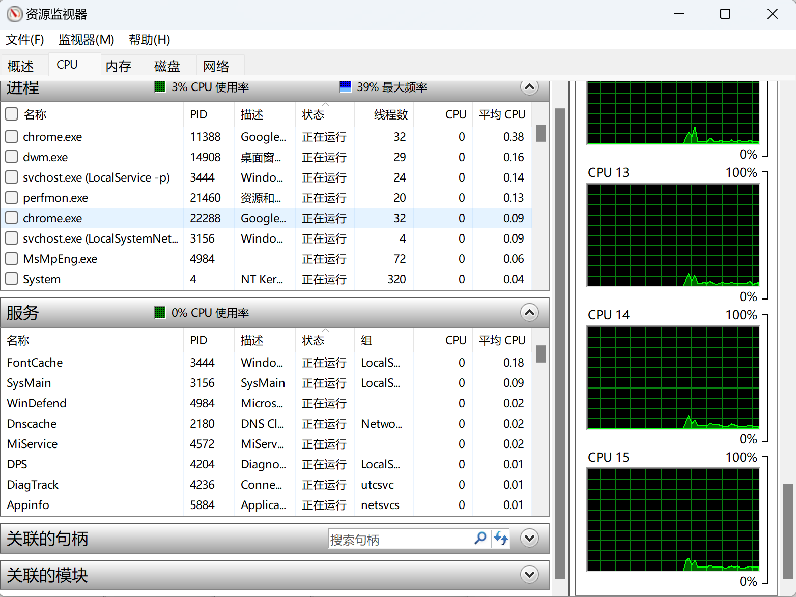

可以看到两个cpu-16核，我们分配两个cpu-每个4核

## Anolis 

Anolis8.6 GA 下载地址：https://mirrors.openanolis.cn/anolis/8.6/isos/GA/x86_64/ 下载minimal.iso

虚拟机选择centos 8 64位

## CentOS7

下载地址：https://mirrors.aliyun.com/centos/7/isos/x86_64/  CentOS-7-x86_64-Minimal-2009.iso

## Ubuntu安装g++

sudo apt update

sudo apt install build-essential gdb  同时安装gcc g++ gdp

apt install net-tools 安装arp等网络工具

##Anolis安装g++

yum update

yum install gcc 

yum install gcc-c++ libstdc++-devel

yum install gdb 编译器

yum install cmake

yum install tree  一般跳转到要查看的目录下tree .

手动如何安装？？?配置环境==？？？==

使用gcc编译c语言文件 g++编译c++ vscode也是使用gcc

##编译过程

1. 预处理

g++ -E test.cpp -o test.i  -E 头文件，宏等处理

2. 编译

g++ -S test.i -o test.s  -S 生成汇编文件

3. 汇编

g++ -C test.s -o test.o  -C 仅把源代码编译为机器语言（二进制）的目标代码

4. 链接

g++ test.o -o test   -o指定产生的文件名  生成bin文件  使用这一步会自动完成前面三步   

链接是将编译后生成的目标文件以及程序中可能需要的库文件合并成一个可执行文件的过程。在链接阶段，链接器（Linker）会处理目标文件之间的依赖关系，并解决任何符号引用（比如函数或变量的调用）。

./test 运行当前路径下的可执行文件test

###g++编译参数

-g 产生带可调试信息的可执行文件


-O[n] 优化代码 -O=-O1  -O0不做优化 一般到-O2就可以了 最多-O3

time ./ test 可以看到执行时间


-l   usr/local/lib  usr/lib  lib 这三个目录下的库这样使用

g++ -lglog test.cpp  链接glog库  

-L 其他目录

g++ -L/home/tutu -lmytest test.cpp  链接mytest库


-I 头文件不在/usr/include

g++ -I/myincldue test.cpp 


-Wall 打印警告信息 -w关闭警告信息

-std=c++11 使用c++11标准

-o指定输出名字 没有会生成a.out

-D使用宏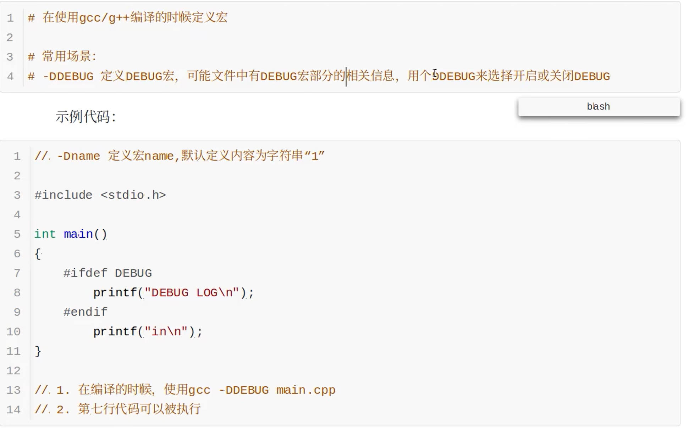

## 命令行编译

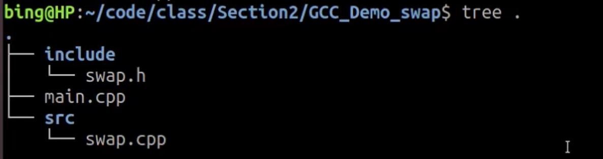

如果有这样一个目录结构

1. 直接编译

g++ main.cpp src/swap.cpp -Iinclude  **如果head.h和head.cpp在一个文件下则不需要-Iinclude**

./a.out 执行

增加编译参数

g++ main.cpp src/swap.cpp -Iinclude -Wall -std=c++11 -o b.out

2. 生成库文件并编译

**链接静态库生成可执行文件**

cd src

g++ swap.cpp -c -I../include  生成swap.o

**ar rs libswap.a swap.o 把swap.o归档为libswap.a的静态库文件**

cd ..

g++ main.cpp -lswap -Lsrc -Iinclude -o static_main

./static_main

**链接动态库生成可执行文件**

cd src

g++ swap.cpp -I../inlcude -fpic -shared -o libswap.so  -fpic于路径无关 **-shared生成动态库** .so动态库后缀

cd ..

g++ main.cpp -Iinclude -lswap -Lsrc -o dyna_main

./dyna_main 运行不了

动态生成的文件是在src里面 静态在外面（嵌到main.cpp中） 区别==？？？==

LD_LIBRARY_PATH=src ./dyna_main 在指定文件中搜索

###GDB调试器


```
## 以下命令后括号内为命令的简化使用，比如run（r），直接输入命令 r 就代表命令run
$(gdb)help(h)        # 查看命令帮助，具体命令查询在gdb中输入help + 命令 
$(gdb)run(r)         # 重新开始运行文件（run-text：加载文本文件，run-bin：加载二进制文件）
$(gdb)start          # 单步执行，运行程序，停在第一行执行语句
$(gdb)list(l)        # 查看原代码（list-n,从第n行开始查看代码。list+ 函数名：查看具体函数）
$(gdb)set            # 设置变量的值
$(gdb)next(n)        # 单步调试（逐过程，函数直接执行）
$(gdb)step(s)        # 单步调试（逐语句：跳入自定义函数内部执行）
$(gdb)backtrace(bt)  # 查看函数的调用的栈帧和层级关系
$(gdb)frame(f)       # 切换函数的栈帧
$(gdb)info(i)        # 查看函数内部局部变量的数值
$(gdb)finish         # 结束当前函数，返回到函数调用点
$(gdb)continue(c)    # 继续运行
$(gdb)print(p)       # 打印值及地址
$(gdb)quit(q)        # 退出gdb
$(gdb)break+num(b)                 # 在第num行设置断点
$(gdb)info breakpoints             # 查看当前设置的所有断点
$(gdb)delete breakpoints num(d)    # 删除第num个断点
$(gdb)display                      # 追踪查看具体变量值
$(gdb)undisplay                    # 取消追踪观察变量
$(gdb)watch                        # 被设置观察点的变量发生修改时，打印显示
$(gdb)i watch                      # 显示观察点
$(gdb)enable breakpoints           # 启用断点
$(gdb)disable breakpoints          # 禁用断点
$(gdb)x                            # 查看内存x/20xw 显示20个单元，16进制，4字节每单元
$(gdb)run argv[1] argv[2]          # 调试时命令行传参$(gdb)set follow-fork-mode child   # Makefile项目管理：选择跟踪父子进程（fork()）
```

1. 编译程序时需要加上-g，之后才能用gdb进行调试：gcc -g main.c -o main
2. 回车键：重复上一命令

gdb main

# cmake

## cmake windows(不用看)

软件构建(build)：cmake   全自动完成代码编译，链接，打包 **跨平台**

vs:MSbuild 不同编译器使用的工具不同 cmake可以支配所有

cmake：不用手动配置makefile

**首先vscode安装插件cmake cmaketools**

编译运行单个文件

```cmake
cmake_minimum_required(VERSION 3.10)    //要求cmake的最低版本
project(Example)   //指定工程名字，也是生成的可执行文件的名字
add_executable(Example test.cpp)  //表示我们需要构建一个可执行文件由test.cpp编译而成
```

#####配置(configure) 

根据这个cmakelists文件生成目标平台的原生工程--配置(configure) 

命令面板ctrl+shift+p   输入>cmake configure

选择

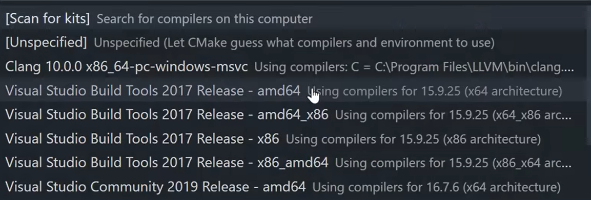

命令行指令  cmake -S . -B build

之后保存会自动配置

#####构建(build)

F7或者>cmake build

命令行指令 cmake --build build

##### 运行

复制粘贴构建后最后一行的路径

C:\Users\Tutu\Desktop\cmake\build\Debug\Example.exe


BV1rR4y1E7n9 入门-代码解释

https://subingwen.cn/cmake/CMake-primer/ 详细文档  BV14s4y1g7Zj 视频解析


```cmake
cmake_minimum_required(VERSION 3.10)  
project(Example)

#find_package(easyx REQUIRED) 

file(GLOB
    "${PROJECT_SOURCE_DIR}/src/*.h"
    "${PROJECT_SOURCE_DIR}/src/*.cpp")

add_executable(${CMAKE_PROJECT_NAME} ${SRC_FLIES})

#target_link_libraries(${CMAKE_PROJECT_NAME} PRIVATE easyx)

target_compile_features(${CMAKE_PROJECT_NAME} PRIVATE cxx_std_17)

add_custom_command(
    target ${CMAKE_PROJECT_NAME}
    POST_BUILD
    COMMAND ${CMAKE_PROJECT_NAME} -E copy_directoy
        "${PROJECT_SOURCE_DIR}/assets"
        "$<PROJECT_FILE_DIR:${CMAKE_PROJECT_NAME}>/assets")


```

运行多文件

```cmake
cmake_minimum_required(VERSION 3.10) 
project(CALC)
set(CMAKE_CXX_STANDARD 11)  #使用c++ 11
set(HOME /home/robin/Linux/calc)
set(EXECUTABLE_OUTPUT_PATH ${HOME}/bin/)
include_directories(${PROJECT_SOURCE_DIR})  #包含头文件 不要也可以（有时出错？）
file(GLOB SRC_LIST ${CMAKE_CURRENT_SOURCE_DIR}/*.cpp)  #文件下的源文件/str/*.cpp
add_executable(app  ${SRC_LIST})
```

## cmake linux

crlf \r\n  lf \n ==???==

需要插件：c/c++ cmake cmaketools

在anolis中安装vscode 可以考虑，但是没必要

### 安装插件


点这个没用

https://marketplace.visualstudio.com/vscode下载对应版本的插件-linux平台

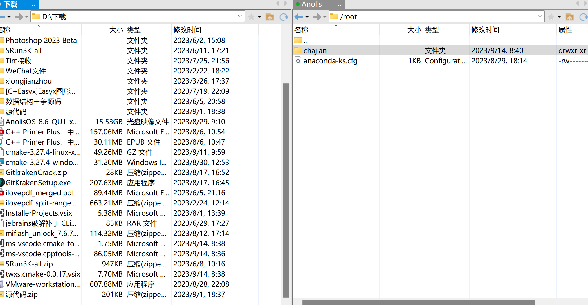

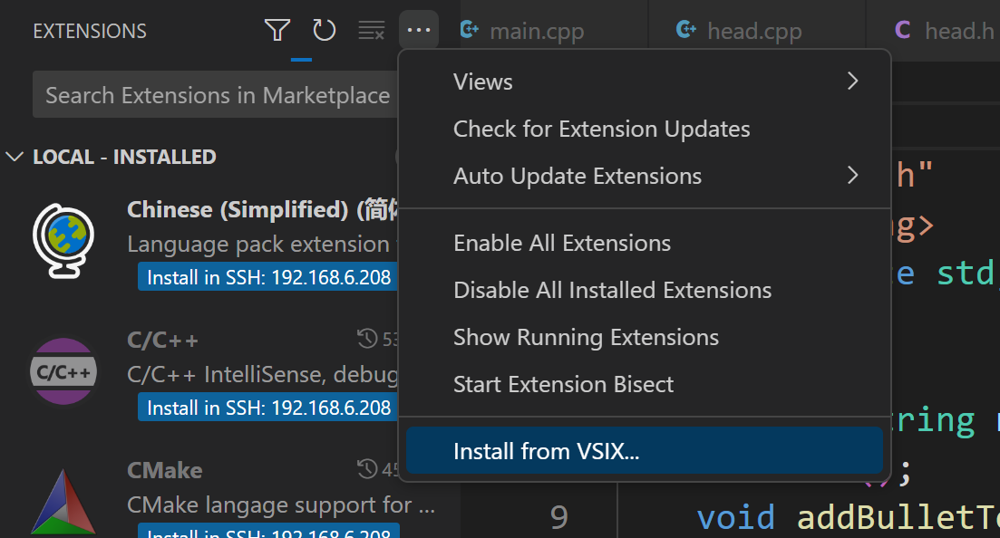

跳转到对应目录，会提示安装成功重启vscode

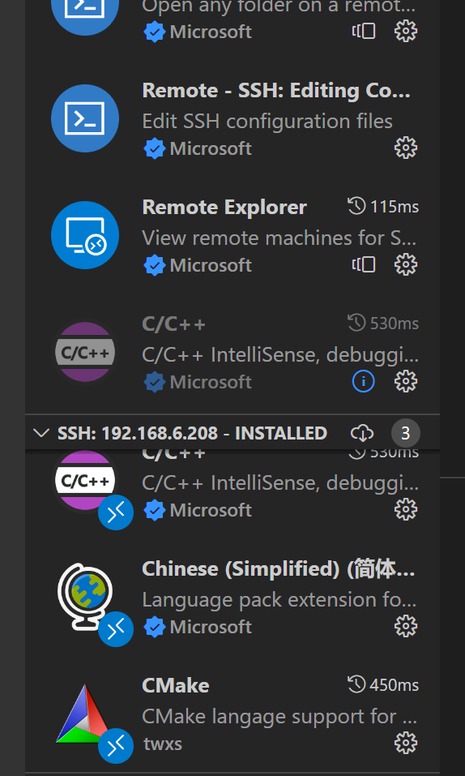

会提示已经安好的插件

###cmake语法

格式 指令(参数1 参数2) 参数间用分号或空格  指令和大小写无关 参数和变量有关

变量使用${} IF控制语句中直接使用

重要指令和常用变量

中括号为可选项，可无

- **指定CMake的最小版本要求**

  ```
  CMake最小版本要求为2.8.3
  cmake_minimum_required(VERSION 2.8.3)
  ```

- - 语法：**cmake_minimum_required(VERSION versionNumber [FATAL_ERROR])**

- **project** **- 定义工程名称，并可指定工程支持的语言** 

  ```
  指定工程名为HELLOWORLD
  project(HELLOWORLD)
  ```

- - 语法：**project(projectname [CXX] [C] [Java])**

- **set** **- 显式的定义变量** 

  ```
  定义SRC变量，其值为main.cpp hello.cpp
  set(SRC sayhello.cpp hello.cpp)
  ```

- - 语法：**set(VAR [VALUE] [CACHE TYPE DOCSTRING [FORCE]])**

- **include_directories - 向工程添加多个特定的头文件搜索路径** --->相当于指定g++编译器的-I参数

  ```
  将/usr/include/myincludefolder 和 ./include 添加到头文件搜索路径
  include_directories(/usr/include/myincludefolder ./include)
  ```

- - 语法：**include_directories([AFTER|BEFORE] [SYSTEM] dir1 dir2 …)**

- **link_directories** **- 向工程添加多个特定的库文件搜索路径** --->相当于指定g++编译器的-L参数

  ```
  将/usr/lib/mylibfolder 和 ./lib 添加到库文件搜索路径
  link_directories(/usr/lib/mylibfolder ./lib)
  ```

- - 语法：link_directories(dir1 dir2 …) 

- **add_library** **- 生成库文件**

  ```
  通过变量 SRC 生成 libhello.so 共享库
  add_library(hello SHARED ${SRC})
  ```

- - 语法：**add_library(libname [SHARED|STATIC|MODULE] [EXCLUDE_FROM_ALL] source1 source2 … sourceN)**
  - SHARED动态库 STATIC静态库

- **add_compile_options** - 添加编译参数

  ```
  添加编译参数 -Wall -std=c++11
  add_compile_options(-Wall -std=c++11 -O2)
  ```

- - 语法：**add_compile_options(**

- **add_executable** **- 生成可执行文件**

  ```
  编译main.cpp生成可执行文件main
  add_executable(main main.cpp)
  ```

- - 语法：**add_executable(exename source1 source2 … sourceN)**

- **target_link_libraries** - 为 target 添加需要链接的共享库  --->相同于指定g++编译器-l参数

  ```
  将hello动态库文件链接到可执行文件main
  target_link_libraries(main hello) 
  ```

- - 语法：**target_link_libraries(target library1library2…)**

- **add_subdirectory - 向当前工程添加存放源文件的子目录，并可以指定中间二进制和目标二进制存放的位置**

  ```
  添加src子目录，src中需有一个CMakeLists.txt
  add_subdirectory(src) 
  ```

- - 语法：**add_subdirectory(source_dir [binary_dir] [EXCLUDE_FROM_ALL])**

- **aux_source_directory - 发现一个目录下所有的源代码文件并将列表存储在一个变量中，这个指令临时被用来自动构建源文件列表**

  ```
  定义SRC变量，其值为当前目录下所有的源代码文件
  aux_source_directory(. SRC)
  编译SRC变量所代表的源代码文件，生成main可执行文件
  add_executable(main ${SRC})
  ```

- - 语法：**aux_source_directory(dir VARIABLE)**

### CMake常用变量

- **CMAKE_C_FLAGS  gcc编译选项**

  **CMAKE_CXX_FLAGS  g++编译选项**

  ```
  在CMAKE_CXX_FLAGS编译选项后追加-std=c++11
  set( CMAKE_CXX_FLAGS "${CMAKE_CXX_FLAGS} -std=c++11")
  ```

  **CMAKE_BUILD_TYPE  编译类型(Debug, Release)**

  ```
  设定编译类型为debug，调试时需要选择debug
  set(CMAKE_BUILD_TYPE Debug) 
  设定编译类型为release，发布时需要选择release
  set(CMAKE_BUILD_TYPE Release) 
  ```

  **CMAKE_BINARY_DIR**

  **PROJECT_BINARY_DIR**

  **<projectname>__BINARY_DIR**

- 1. 这三个变量指代的内容是一致的。
  2. 如果是 in source build，指的就是工程顶层目录。
  3. 如果是 out-of-source 编译,指的是工程编译发生的目录。
  4. PROJECT_BINARY_DIR 跟其他指令稍有区别，不过现在，你可以理解为他们是一致的。

- **CMAKE_SOURCE_DIR**

  **PROJECT_SOURCE_DIR**
  **<projectname>__SOURCE_DIR**

- 1. 这三个变量指代的内容是一致的,不论采用何种编译方式,都是工程顶层目录。
  2. 也就是在 in source build时,他跟 CMAKE_BINARY_DIR 等变量一致。
  3. PROJECT_SOURCE_DIR 跟其他指令稍有区别,现在,你可以理解为他们是一致的。

------

- **CMAKE_C_COMPILER：指定C编译器**
- **CMAKE_CXX_COMPILER：指定C++编译器**
- **EXECUTABLE_OUTPUT_PATH：可执行文件输出的存放路径**
- **LIBRARY_OUTPUT_PATH：库文件输出的存放路径**

### CMake编译工程

CMake目录结构：项目主目录存在一个CMakeLists.txt文件

编译流程

- 手动编写 CmakeLists.txt。

- 执行命令 `cmake PATH`生成 Makefile ( PATH 是顶层CMakeLists.txt 所在的路径 )。

- 执行命令`make` 进行编译。

- ```
  important tips
  .          # 表示当前目录
  ./         # 表示当前目录
  
  ..      # 表示上级目录
  ../     # 表示上级目录
  ```

  #### 两种构建方式

  CMakeList在外面 外部构建只是进入build文件夹执行cmake使生成的文件放到build文件夹中

  - **内部构建(in-source build)**：不推荐使用

    内部构建会在同级目录下产生一大堆中间文件，这些中间文件并不是我们最终所需要的，和工程源文件放在一起会显得杂乱无章。

    ```
    内部构建
    在当前目录下，编译本目录的CMakeLists.txt，生成Makefile和其他文件
    cmake .
    执行make命令，生成target
    make
    ```
    
  - **外部构建(out-of-source build)**：==推荐使用==
  
    将编译输出文件存放到单独的build文件夹中
  
    ```
    # 外部构建
    1. 在当前目录下，创建build文件夹
    mkdir build 
    2. 进入到build文件夹
    cd build
    3. 编译上级目录的CMakeLists.txt，生成Makefile和其他文件
    cmake ..
    4. 执行make命令，生成target
    make
    ```
  
  ####单文件直接使用g++指令更方便

  \#include<include/head.h> cmake可不加include

  实例

  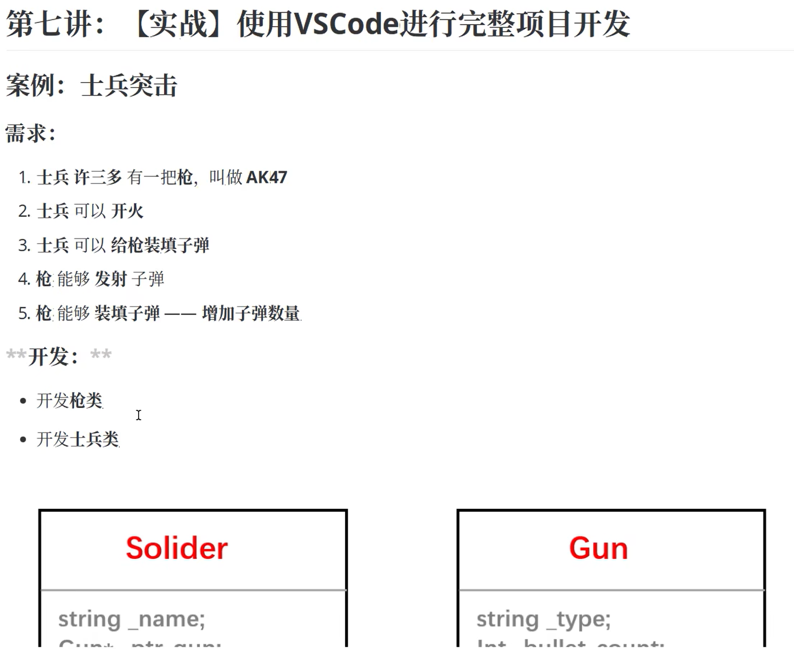

  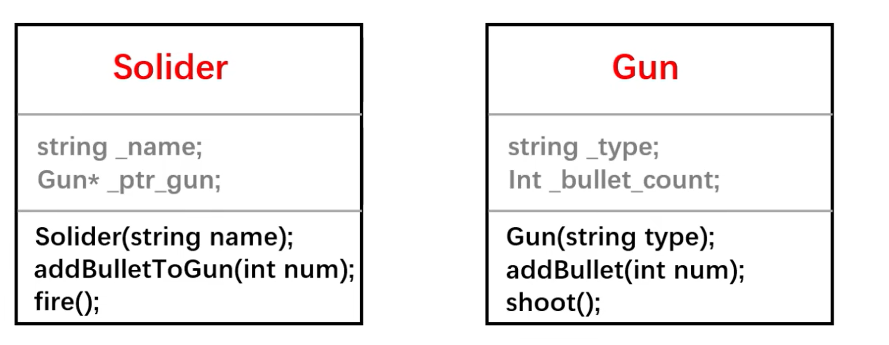

  目录结构

  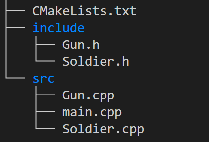

  g++ main.cpp scr/Gun.cpp scr/Solier.cpp -Iinclude [-o main] -wall -g -O2

  如果头文件和源文件放到同一个目录下则不需要-Iinclude
  
  ```cmake
  cmake_minimum_required(VERSION 3.0)
  project(Solidefire)
  set(CMAKE_CXX_FLAGS "${CMAKE_CXX_FLAGS} -g -O2 -Wall")  //设置g++编译选项
  include_directories(include)
  add_executable(main_cmake main.cpp src/Gun.cpp src/Soldier.cpp)
  ```
  
  include_directories(include) 可以写成 include_directories(${CMAKE_SOURCE_DIR}/include) 变量CMAKE_SOURCE_DIR是cmakelists所在文件夹路径
  
  修改源代码之后只需要make不需要cmake .. cmake只针对cmakelists文件
  
  **所有文件放到一个目录里面**
  
  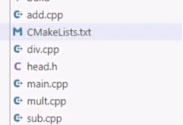
  
  aux_source_directory(${PROJECT_SOURCE_DIR} SRC) #PROJECT_SOURCE_DIR cmake .. 执行cmake后面跟随的路径
  
  或者file(GLOB SRC ${CMAKE_CURRENT_SOURCE_DIR}/*.cpp) 
  
  再
  
  add_executable(main_cmake ${SRC})
  
  **放到不同目录里面**
  
  目录结构
  
  
  
  一样是进入build文件夹 cmake .. make ./mian_cmake
  
  ```cmake
  cmake_minimum_required(VERSION 3.0)
  
  project(Solidefire)
  
  set(CMAKE_CXX_FLAGS "${CMAKE_CXX_FLAGS} -g -O2 -Wall")
  
  include_directories(include)
  
  set(SRC main_cmake main.cpp src/Gun.cpp src/Soldier.cpp)
  #aux_source_directory(${PROJECT_SOURCE_DIR} SRC) #PROJECT_SOURCE_DIR cmake .. 执行cmake后面跟随的路径
  file(GLOB SRC ${CMAKE_CURRENT_SOURCE_DIR}/src/*.cpp)    #CMAKE_CURRENT_SOURCE_DIR对应makelists所在路径
  include_directories(%{CMAKE_CURRENT_SOURCE_DIR}/include)
  
  #set(EXECUTABLE_OUTPUT_PATH /opt/demo/build) #指定输出路径
  set(CMAKE_CXX_STANDARD 11) #使用c++11标准 或cmake .. -DCMAKE_CXX_STANDARD=11
  
  add_executable(main_cmake ${SRC})
  ```
  
  后续链接库等看BV14s4y1g7Zj?p
  
  调试看BV1fy4y1b7TC?p 配置json等

# 调试

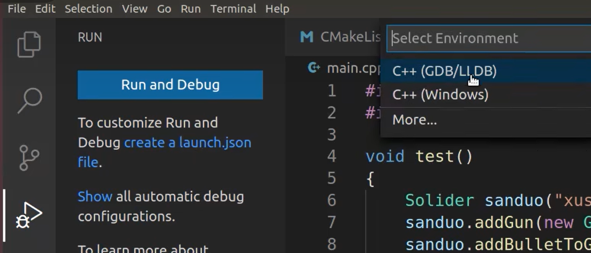

选择creat a launch.json file再选择c++(GDB)

如果没用在右下角选择第一个

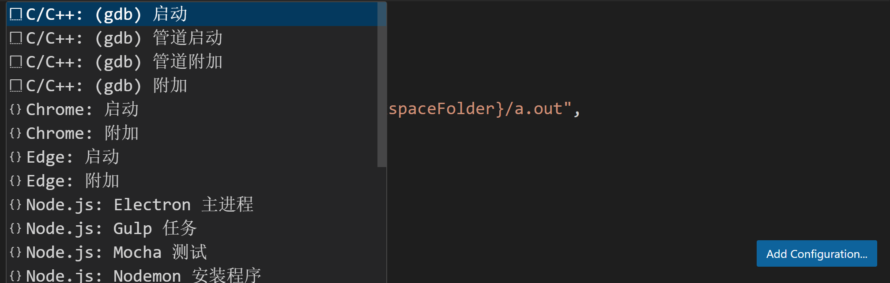

.json文件如下

```json
{
    // Use IntelliSense to learn about possible attributes.
    // Hover to view descriptions of existing attributes.
    // For more information, visit: https://go.microsoft.com/fwlink/?linkid=830387
    "version": "0.2.0",
    "configurations": [

        {
            "name": "(gdb) 启动",
            "type": "cppdbg",
            "request": "launch",
            "program": "${workspaceFolder}/demo/build/main_cmake", //要调试的可执行文件的绝对路径
            "args": [],
            "stopAtEntry": false,
            "cwd": "${workspaceFolder}",//workspaceFolder顶层目录，json文件所在
            "environment": [],
            "externalConsole": false,
            "MIMode": "gdb",
            "setupCommands": [
                {
                    "description": "为 gdb 启用整齐打印",
                    "text": "-enable-pretty-printing",
                    "ignoreFailures": true
                },
                // {
                //     "description": "将反汇编风格设置为 Intel",
                //     "text": "-gdb-set disassembly-flavor intel",
                //     "ignoreFailures": true
                // }
            ],
            //"preLaunchTask": "build", //调试之前做一个task引号是名字
            "miDebuggerPath": "/usr/bin/gdb"
        }

    ]
}
```


cmakelist中加set(CMAKE_BUILD_TYPE Debug) #生成可调试文件，避免冲突

f5进入调试 f10单步 f11进入 f5结束

打开

//"preLaunchTask": "C/C++:g++ build active file", //调试之前做一个task引号是名字

配置tasks.json文件

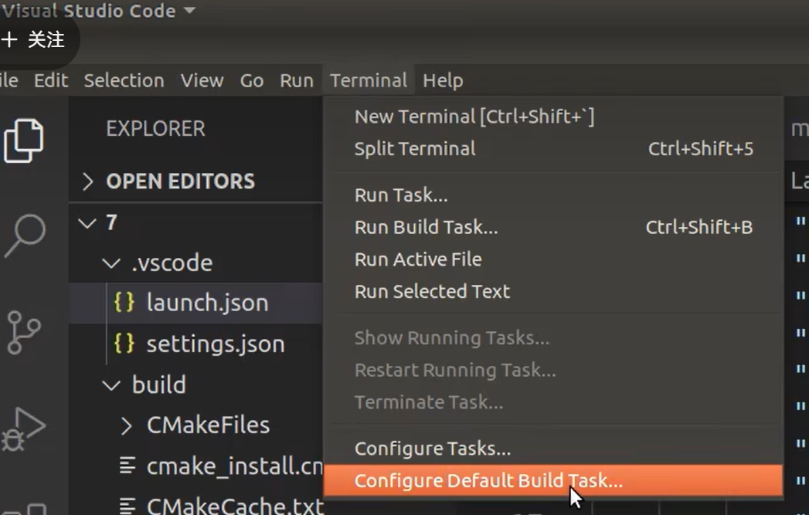

随便点击一个

```json
{
    "version": "2.0.0",
    "options": {
        "cwd": "${workspaceFolder}/build" //进入build文件夹
    },
    "tasks": [  //包含了三个task
        {
            "type": "shell",
            "label": "cmake",  //task名字
            "command": "cmake", //命令
            "args": [  //参数
                ".."
            ]
        },
        {
            "label": "make",
            "group": {
                "kind": "build",
                "isDefault": true
            },
            "command": "make",  //执行make，没用参数
            "args": []
        },
        {
            "label": "build",
            "dependsOrder": "sequence",
            "dependsOn": [ //依赖于上面两个，做cmake .. make 两件事
                "cmake",
                "make"
            ]
        }
    ],
}
```

这样直接f5就可以调试了运行了，不用再cmake和make了

# 遇到问题

yum install 时遇到问题

###failed to set locale defaulting to C.UTF-8

**我是网络问题，下面都没用的意思**

先ping www.baidu.com 看能不能通 不能一般是网络问题（我是没有设置dns）

locale -a查看已经安装的语言包

镜像网站下载rpm包

指令安装

sudo yum install epel-release

sudo yum install langpacks-en

无法使用指令镜像网站

镜像网站：[Welcome to the RPM repository on fr2.rpmfind.net](http://rpmfind.net/linux/RPM/index.html)

搜索epel-release langpacks-en找对应版本进行安装rpm包


rpm -i example.rpm  `-i`表示安装，`example.rpm`是要安装的RPM包的名称。

可视化显示使用`-v`  使用`-h`选项来显示安装进度。

rpm -ivh example.rpm

镜像网站：[Welcome to the RPM repository on fr2.rpmfind.net](http://rpmfind.net/linux/RPM/index.html)

搜索名字安装rpm包

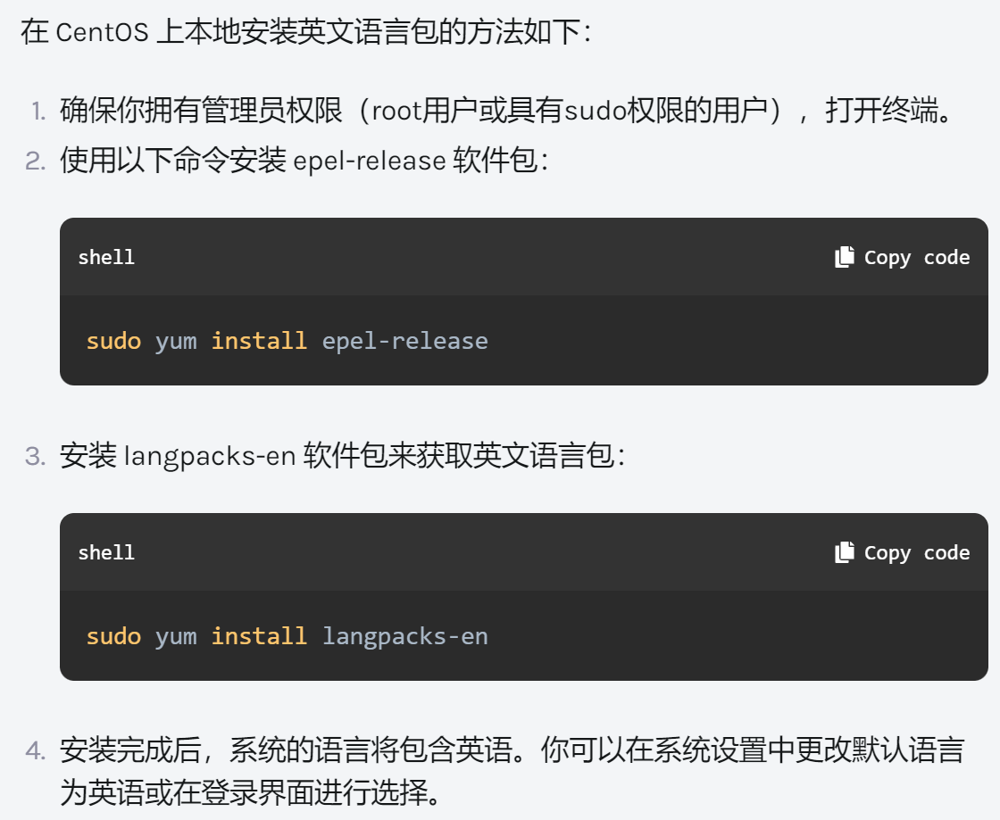


重命名后使用xftp传输到/home/tutu 

进入目录 分别rpm -ivh epel-release.rpm

然后

生成语言环境

先install再sudo localedef -v -c -i en_US -f UTF-8 en_US.UTF-8

sudo nano /etc/default/locale

LANG=en_US.UTF-8 LC_ALL=en_US.UTF-8

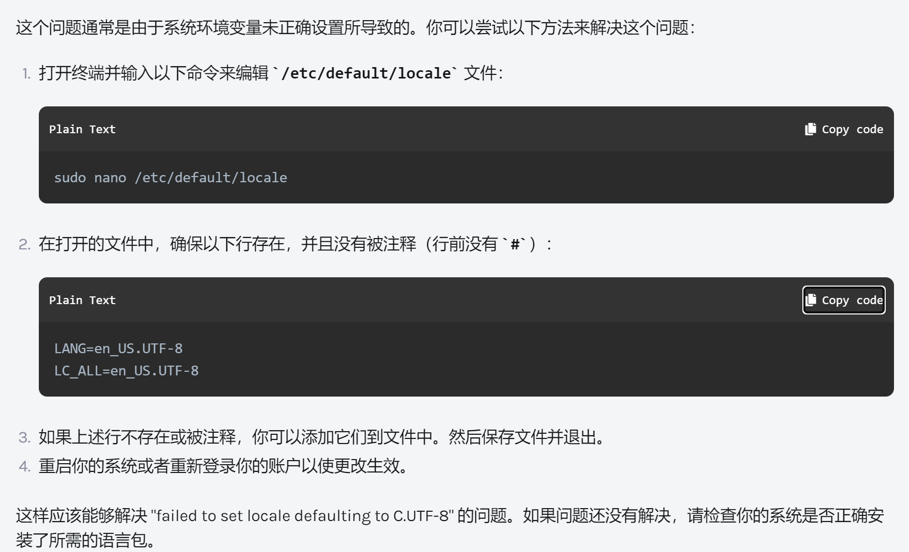

sudo yum install langpacks-en

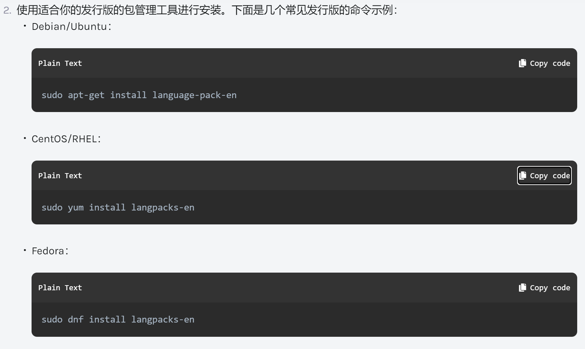


sudo localedef -v -c -i en_US -f UTF-8 en_US.UTF-8 生成语言环境

# 安装库文件

##安装pthread库 

yum install -y glibc-devel

rpm -q glibc-devel 检查

编译 g++ communicationV2.0.cpp -lpthread

# 安装Ubuntu

官网 https://cn.ubuntu.com/desktop

我下载的是ubuntu-24.04-desktop-amd64.iso


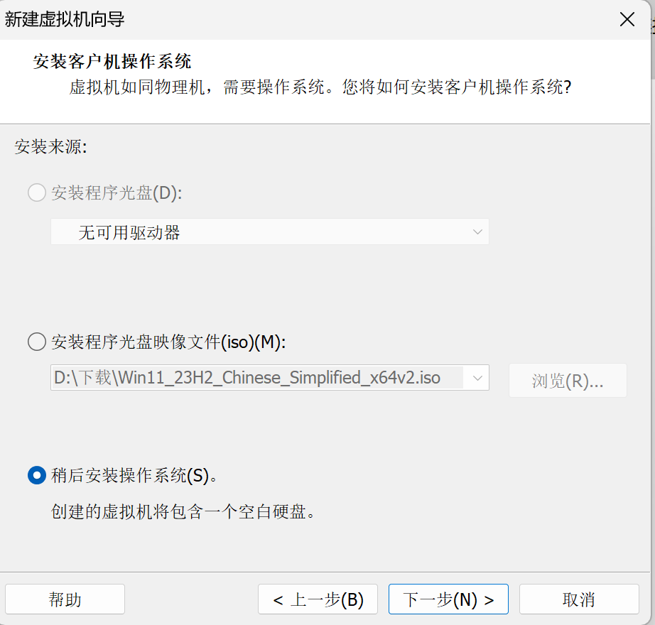

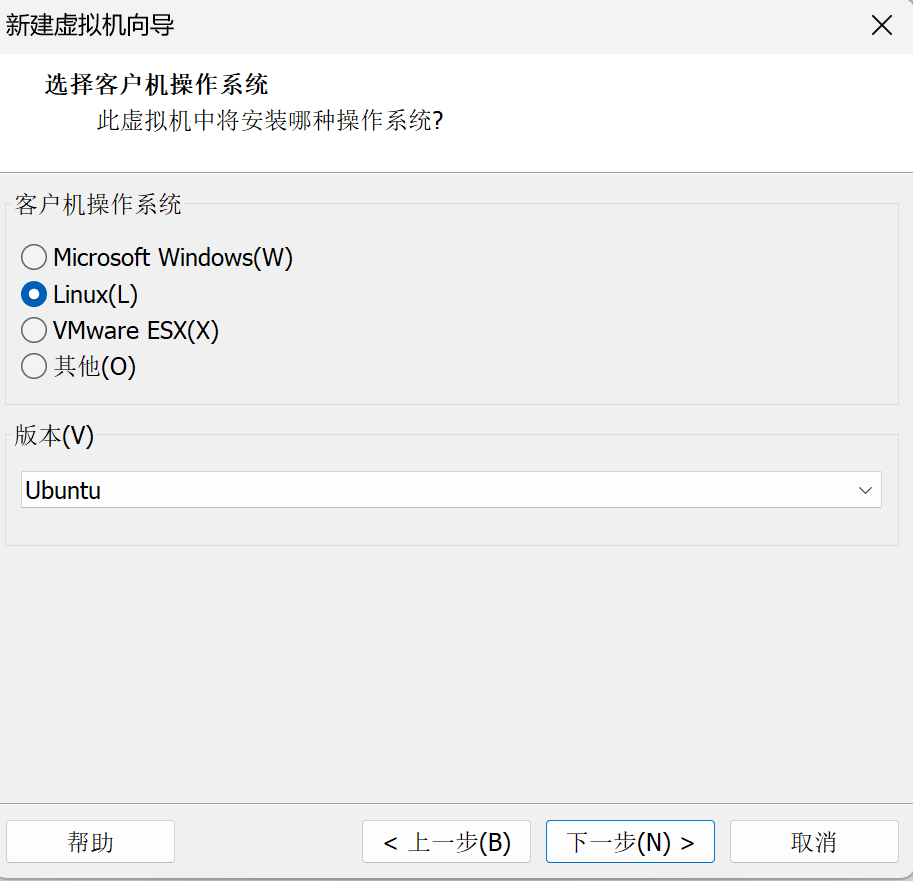

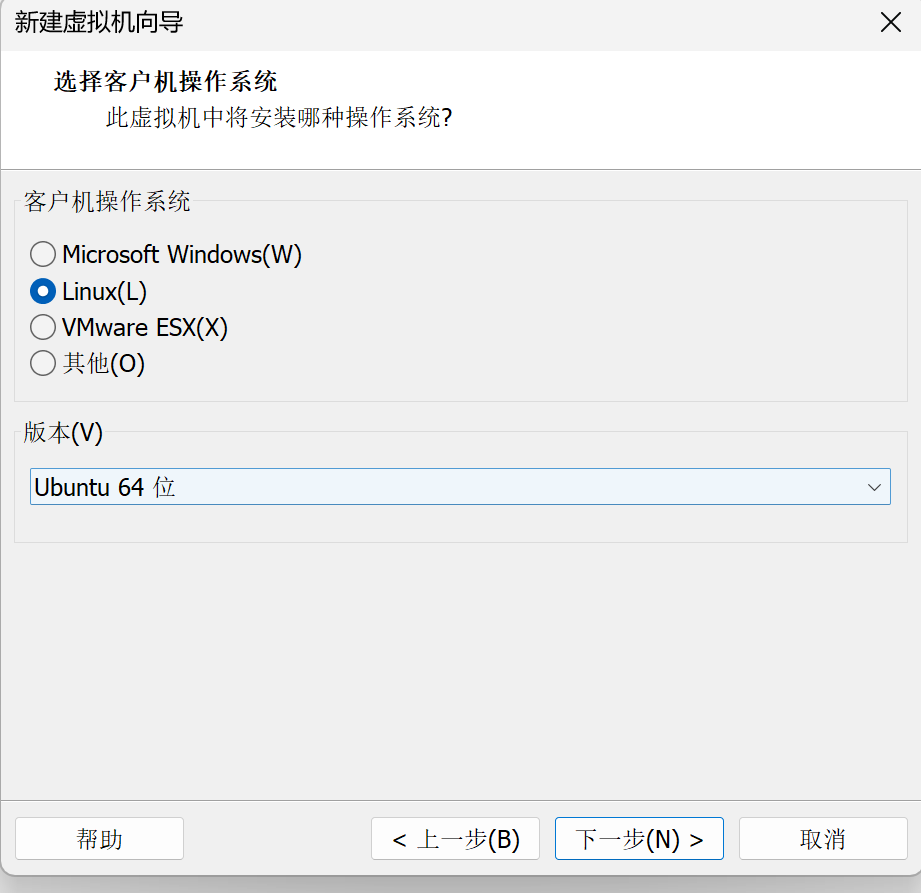

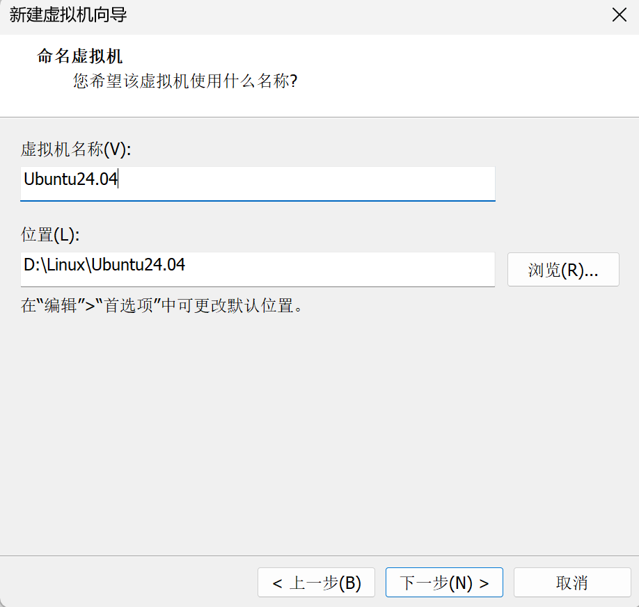

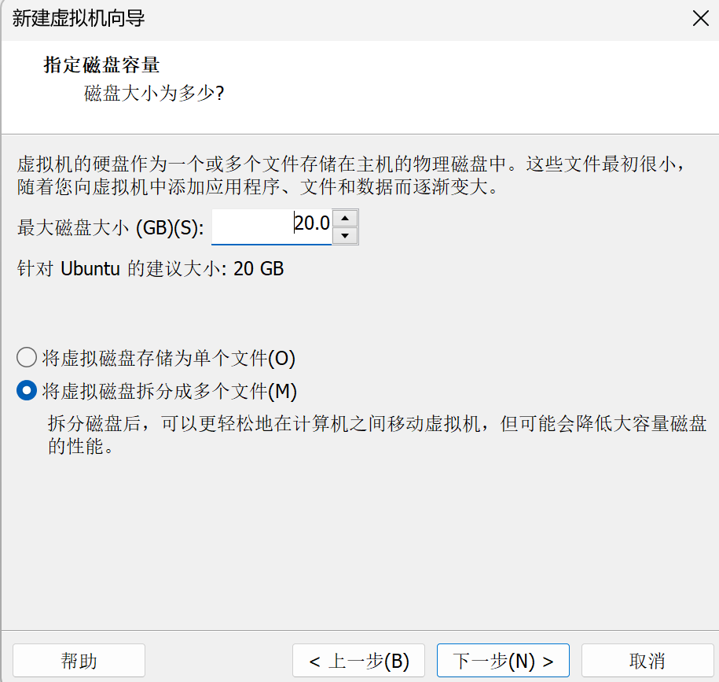

完成

编辑虚拟机设置

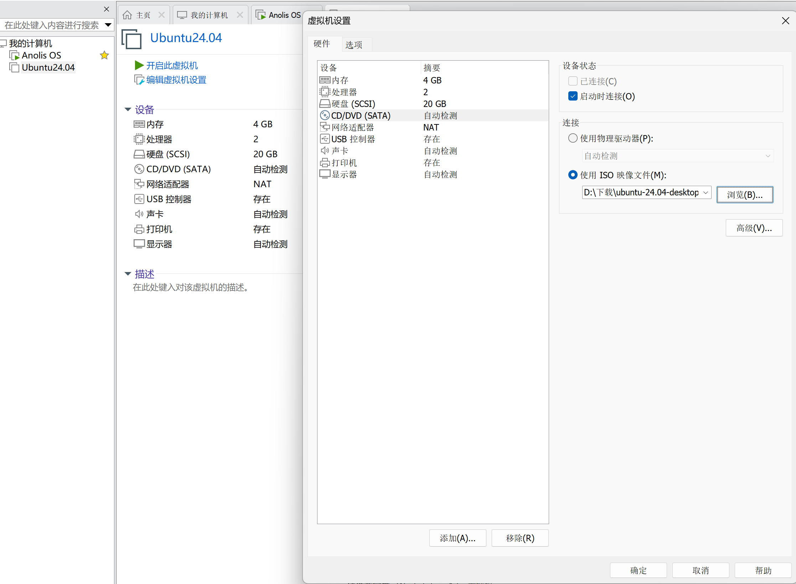

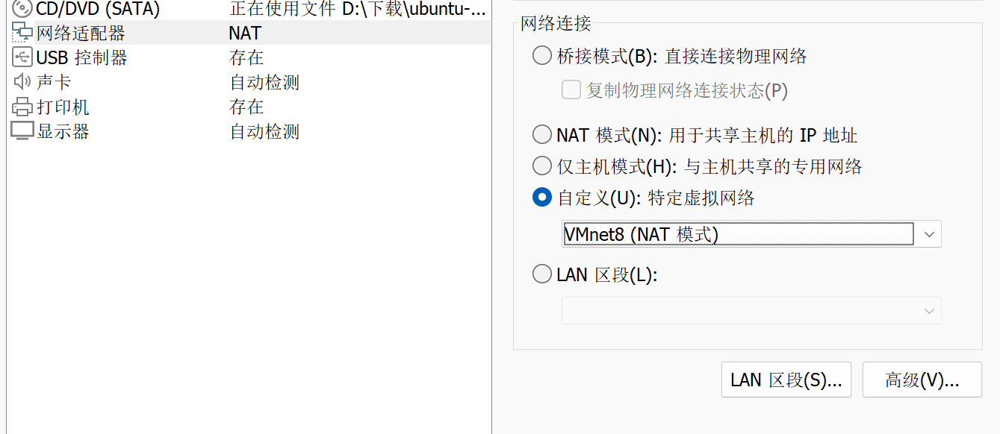

这里选择这个会使用之前配置的网络自动分配一个ip，后面不用配置了

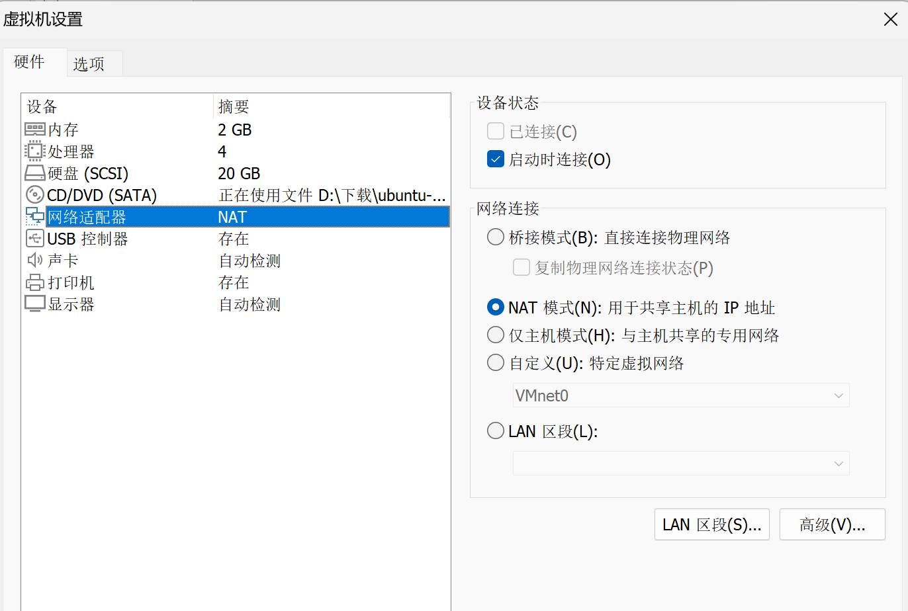

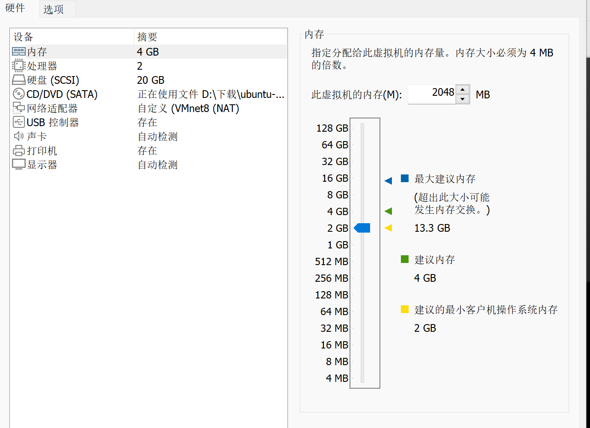

确定-开启虚拟机

不知道为什么我图形化界面进去在安装的位置一直卡住

后面直接安装非图形化的 前面步骤一样，后面安好之后要重新启动一次，启动的时候把镜像文件改为自动检测，我改了以后不知道是我卡还是等的时间不够，后面我又把镜像安上之后或者取消重复开了好几次，去吃个饭回来就进入命名界面了，意外之喜

镜像文件下载地址：https://mirrors.aliyun.com/ubuntu-releases/


进入之后只有一个自己建的用户，没有root用户 导致输入命令很多都要 +sudo

sudo passwd root 设置root密码

su - root 切换到root

#配置静态局域网

虚拟机默认是NAT模式 每个虚拟机一个DHCP都是10.0.2.2  主机10.0.2.15 每个虚拟机都一样 所以虚拟机不能互通

虚拟机可以ping主机NAT的私有地址，主机不能访问虚拟机 只出不进

NAT网络


教程：https://cnxiaobai.com/articles/2021/04/21/1619011285612.html

一开始ip a查看不到ip地址，需要编辑网卡信息

首先进入root账户 普通账户尝试过不行

1. cd /etc/sysconfig/network-scripts/

2. ls  显示网卡名称 ifcfg-ens160

3. vi ifcfg-ens160 进入编辑模式/vi

4. 按 i 进入编辑

5. ```
   TYPE=Ethernet        #网络类型:Ethernet以太网
   PROXY_METHOD=none    #代理方式：关闭状态
   BROWSER_ONLY=no	     # 只是浏览器：否
   BOOTPROTO=static       #引导协议：static静态、dhcp动态获取、none不指定   改
   DEFROUTE=yes         #启动默认路由
   IPV4_FAILURE_FATAL=no  #不启用IPV4错误检测功能
   IPV6INIT=yes         #启用IPV6协议
   IPV6_AUTOCONF=yes    #自动配置IPV6地址
   IPV6_DEFROUTE=yes    #启用IPV6默认路由
   IPV6_FAILURE_FATAL=no #不启用IPV6错误检测功能
   NAME=ens160          # 网卡设备的别名
   UUID=985f89ca-ada3-4dfd-9dd2-c97f680a8ed1  #网卡设备的UUID,通用唯一识别码
   DEVICE=ens160        # 网卡的设备名称
   ONBOOT=yes           #开机自动启动网卡      改
   //加
   IPADDR=192.168.6.208    248.3
   NETMASK=255.255.255.0
   GATEWAY=192.168.6.2    248.2
   PREFIX=24
   DNS1=114.114.114.114
   DNS2=8.8.8.8
   ```

6. 编写完成后按esc进入选择模式

7. : 进入底线模式 输入==w保存 q退出== 后加！强制执行

8. nmcli c reload                         # 重新加载配置文件
   nmcli c up ens160                      # 重启ens33网卡    service NetworkManager restart  重置网卡？？

9. 重新启动客户机


sudo nmtui 进入网络设置

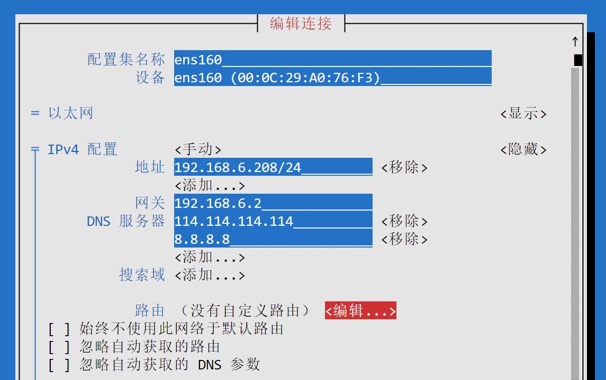

为啥网关设置成.2呢

### 虚拟机网络设置

编辑-虚拟网络编辑器-更改设置-VMnet8

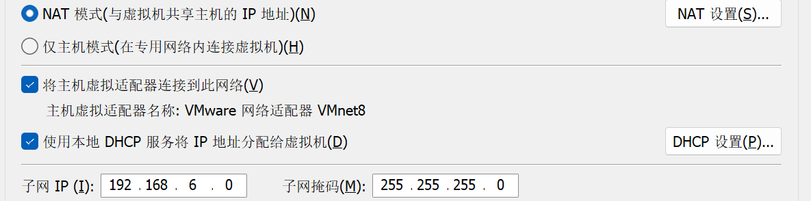

NAT设置

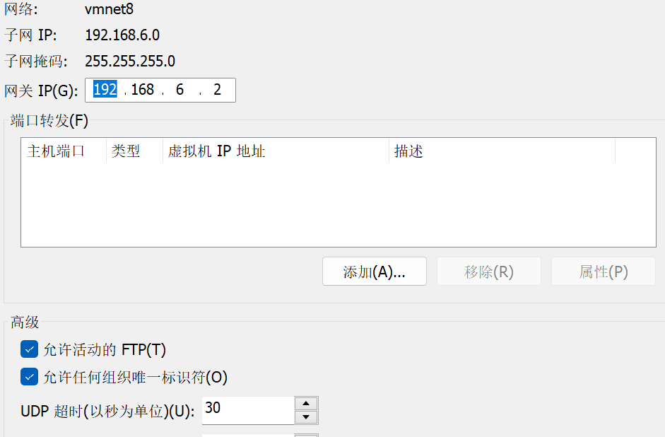

规则192.168不变  6随便（224以下） 

DHCP设置

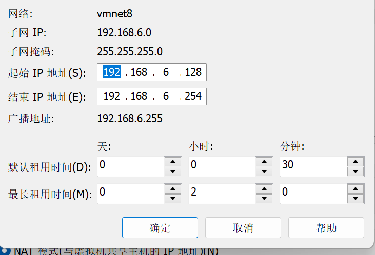

ip要在这个范围里面


ping www.baidu.com  ping不通代表有问题  ctrl+c结束ping

#SSH

###windows

ssh tutu@192.168.6.208


linux：

systemctl status sshd 查看是否启动ssh

systemctl start sshd 启用

###vscode

配置config文件

```
Host 192.168.6.208  //主机ip
  HostName 192.168.6.208
  User tutu
```

ssh tutu@192.168.6.208   tutu

ssh root@192.168.6.208   123

避免每次连接需要输入密码

cmd:ssh-keygen -t rsa -b 4096  四个回车生成密钥 ==？？？==

##免密登录

* code /etc/ssh/sshd_config    日志：code /var/log/secure
* sudo systemctl restart sshd

* windows上运行ssh-keygen 

三个回车看到生成的公钥和私钥的位置C:\Users\Tutu\.ssh\id_rsa

* 修改config配置文件

Host 192.168.6.208

 HostName 192.168.6.208

 User root

 IdentityFile C:\Users\Tutu\.ssh\id_rsa

* 将id_rsa.pub复制到服务器的~/.ssh文件夹中
* 修改文件/etc/ssh/ssh_config

PasswordAuthentication no

PubkeyAuthentication yes


systemctl restart sshd

* 可能需要权限

chmod 700 ~/.ssh
chmod 600 ~/.ssh/authorized_keys


## ssh慢

修改/etc/ssh/sshd_config文件

UseDNS no

GSSAPIAuthentication no


创建实例并初始化  Open  StartAccept  创建TcpClientPtr   HandleAccept  StartRead

407 行 pClient->GetBuffer(0); max,0   HandleRead RecvData  GetMessage

```
TcpClientPtr构造
	m_maxBufSize = 8 * 1024 * 1024;
	m_offset = 0;//总消息长度
	m_parseOffset = 0;//上一条消息的末尾
	m_pBuf = NULL;//堆上分配8MB内存，m_pBuf指向第一个字节
	m_state = 1;
    m_bReadClose = false;
    m_nSendHeartBeatCount = 10;	
    m_nRecvHeartBeatCount = 0;
	Init(m_maxBufSize);
	m_prp2dbspcPkt.pktLen = sizeof(PRP_DBSPC_RULE_PKT);
	m_prp2dbspcPkt.flag = DBAGENT_FLAG;
	m_prp2dbspcPkt.pktType = EU_AGENT_PKT_TYPE_RULE;
	m_pBuf = new uint8_t[m_maxBufSize];//max
GetBuffer(0)//获得缓冲区的第一个地址
	uint8_t* pBuf = m_pBuf + m_offset;//+0
	bufSize = m_maxBufSize - m_offset;//-0
	if max<=0 return null
	return pbuf 返回地址
RecvData(readSize)
	m_offset+=readSize
HaveMessage
	msgLen=*m_pBuf//
	if(m_offset < msgLen) return fasle
	m_parseOffset=0 
GetMessage（0）
	pBuf=
	
	msgSize 数据部分长度经过减去头部数据4
```

# 配置静态网络

```
cd /etc/sysconfig/network-scripts/
vi ifcfg-ens33 (替换成对应网卡名称)
```

```
TYPE=Ethernet
PROXY_METHOD=none
BROWSER_ONLY=no
BOOTPROTO=static   //改
DEFROUTE=yes
IPV4_FAILURE_FATAL=no
IPV6INIT=yes
IPV6_AUTOCONF=yes
IPV6_DEFROUTE=yes
IPV6_FAILURE_FATAL=no
IPV6_ADDR_GEN_MODE=stable-privacy
NAME=ens33
UUID=1647aabe-3d39-4811-b698-b958ac9169f4
DEVICE=ens33
ONBOOT=yes               //从这往下，改，ip根据自己配置的VMnet8更改
IPADDR=192.168.248.3
NETMASK=255.255.255.0
GATEWAY=192.168.248.2
PREFIX=24
DNS1=114.114.114.114
DNS2=8.8.8.8
```

```
nmcli c reload                   
nmcli c up ens160                   
```

3. 配置yum源

```
备份
cp /etc/yum.repos.d/CentOS-Base.repo /etc/yum.repos.d/CentOS-Base.repo.backup
vi /etc/yum.repos.d/CentOS-Base.repo
```

```
# CentOS-Base.repo
#
# The mirror system uses the connecting IP address of the client and the
# update status of each mirror to pick mirrors that are updated to and
# geographically close to the client.  You should use this for CentOS updates
# unless you are manually picking other mirrors.
#
# If the mirrorlist= does not work for you, as a fall back you can try the
# remarked out baseurl= line instead.
#
#
 
[os]
name=Qcloud centos os - $basearch
baseurl=http://mirrors.cloud.tencent.com/centos/$releasever/os/$basearch/
enabled=1
gpgcheck=1
gpgkey=http://mirrors.cloud.tencent.com/centos/RPM-GPG-KEY-CentOS-7
 
[updates]
name=Qcloud centos updates - $basearch
baseurl=http://mirrors.cloud.tencent.com/centos/$releasever/updates/$basearch/
enabled=1
gpgcheck=1
gpgkey=http://mirrors.cloud.tencent.com/centos/RPM-GPG-KEY-CentOS-7
 
[centosplus]
name=Qcloud centosplus - $basearch
baseurl=http://mirrors.cloud.tencent.com/centos/$releasever/centosplus/$basearch/
enabled=0
gpgcheck=1
gpgkey=http://mirrors.cloud.tencent.com/centos/RPM-GPG-KEY-CentOS-7
 
[cr]
name=Qcloud centos cr - $basearch
baseurl=http://mirrors.cloud.tencent.com/centos/$releasever/cr/$basearch/
enabled=0
gpgcheck=1
gpgkey=http://mirrors.cloud.tencent.com/centos/RPM-GPG-KEY-CentOS-7
 
[extras]
name=Qcloud centos extras - $basearch
baseurl=http://mirrors.cloud.tencent.com/centos/$releasever/extras/$basearch/
enabled=1
gpgcheck=1
gpgkey=http://mirrors.cloud.tencent.com/centos/RPM-GPG-KEY-CentOS-7
 
[fasttrack]
name=Qcloud centos fasttrack - $basearch
baseurl=http://mirrors.cloud.tencent.com/centos/$releasever/fasttrack/$basearch/
enabled=0
gpgcheck=1
gpgkey=http://mirrors.cloud.tencent.com/centos/RPM-GPG-KEY-CentOS-7
```

```
yum clean all   
yum makecache    
```

