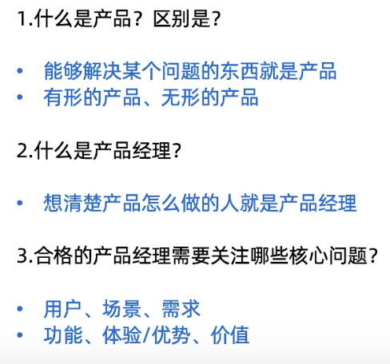

产品经理分类：

* C 端	面向普通用户
* B 端        面相企业或公司内部
* G 端        面相政府部门

职责：

1. 产品的开发流程

* 分析定义

  * 问题定义
  * 可行性研究
  * 需求分析

* 软件设计 

  * 概要设计

  * 详细设计

* 编码测试

  * 程序编码

  * 集成测试

* 运行维护

2. 核心团队成员及其职责

* 产品设计部
  产品经理，平面设计，交互设计
* 研发部
  前端，后端，测试，运维
* 项目组
  项目经理

产品经理职责：

* 评估产品机会
  需求收集(用户反馈，运营等)，可行性分析(技术，质量，成本，机会)
  产出：MRD 文档（市场需求文档）/立项报告

* 定义要开发的产品
  需求分析，原型设计，产出 PRD 文档

* 额外职责(有的公司没有需要 pm 做)

  组织开发/项目管理，交互设计/用户体验

能力需求：

1. 调研分析：商业，行业，市场， **用户，竞品，需求**
2. 决策判断：可行性，**优先级**，成本，技术，风险
3. 规划定义：业务，架构，**流程，结构，功能，逻辑**
4. 体验设计：**用户体验，原型设计，产品体验**，交互体验，产品体验
5. 文档工具：BRD，MRD，**PRD**，立项说明书，产品说明书，**协作工具，设计工具**

工具：

1. 原型工具：Axure PR    墨刀
2. 脑图工具：XMind    MindMaster 
3. 流程图工具：ProcessOn

综合素质：

有责任心，沟通表达，同理心，终身学习，创新，情商，协作组织，逻辑思维

## 问题思考维度-用户

用户：

* 目标用户
* * 种子用户 （尝鲜）
  * 核心用户（商业价值）
* 潜在用户

抓住核心用户，保持市场竞争力

定义核心用户群体：

* 供需关系
  服务端
  消费端
* 统计学
  年龄，性别，地域，职业，消费水平
* 熟练程度
  新用户，老用户，专家用户

抓住核心用户：

捆绑式(会员制，限时优惠)，诱导式(低价)，享受型(服务)，网络型(社交，网络社群)，股东型(粉丝)

### 场景化分析

>  感知用户的真实体验感受

场景化分析方法：

列举场景要素，构建场景画面，预判发现需求

1. 场景五要素：

* 用户分析：类型，特征，熟悉程度
* 地点：地理位置，使用场所，软件平台(mac，phone，小程序等)
* 时间：固定时间，周期性时间(工作日)
* 行为：使用流程和操作行为
* 目的，用户想要什么

2. 构建画面

上班族在上班通勤的地铁上，通过刷视频来获取最新的新闻资讯

3. 预判用户行为与目标：

组成动作(评论与回复，分析与转发，复制与粘贴等)
常进用户行为(下拉刷新，左滑上一页，双击点赞)
产品使用流程(搜索-筛选-查看详情) 

场景化分析的应用：洞察问题，理解用户，提高预期

需求是什么？

用户预期和现状有差异

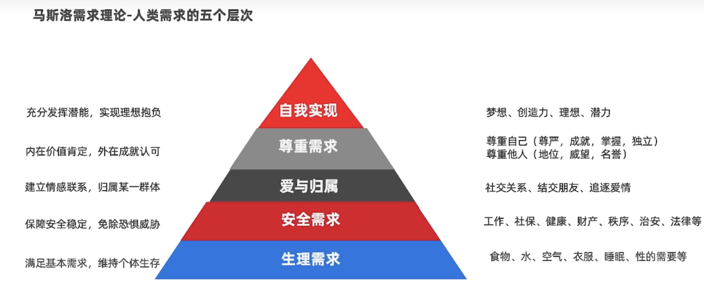

需求收集方法：

观察
用户反馈
问卷调查
用户访谈
切身感受，或加入社群

业务分析，文献分析，头脑风暴
竞品分析，数据分析

一手需求和二手需求

一手需求，更准确，效率低
二手需求，效率高，易曲解
全员收集，统一处理

需求辨别：
维度：需求真实，需求强烈(价值，风险，规模)，需求高频
优先级：强烈且高频，强烈低频，不强烈高频

用户故事：将典型用户在应用场景下将需求进行描述的一种方式

模板：
故事主题，故事 id，做没<某角色>，需要实现什么目标，原因，验收标准，条件，触发点，预期结果

## 产品解决方案

### 需求分析

需求分析的方法：Y 模型

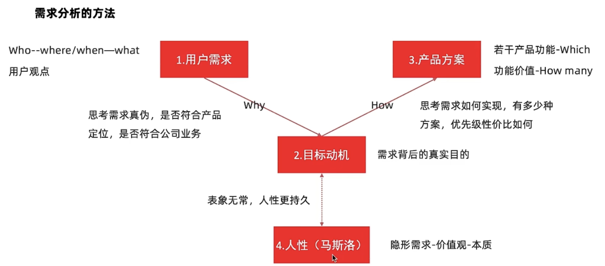

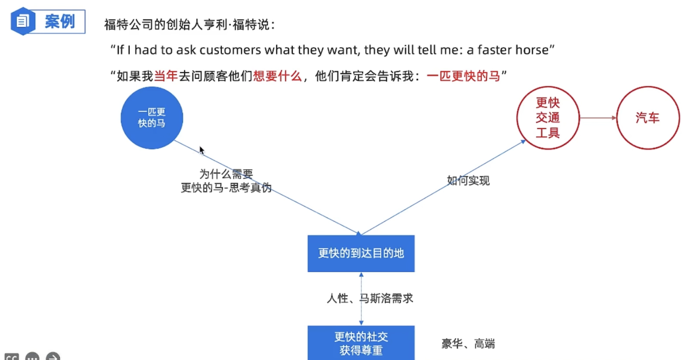

如何基于人性的分析得出与之匹配的解决方案？

以人性七宗罪举例

傲慢：追求优越感，爱慕虚荣
产品：炫耀优越感，荣誉展示，粉丝数，成就，点赞数
妒忌：排行榜，段位
愤怒：拉黑，删除，注销，充值关闭广告
懒惰：便捷工具，更少思考，更少决策
贪婪：免费体验，新人福利，签到
饕餮：美食
色欲：(同年龄或同年级的排名)

如何及时给出更好的解决方案？
多体验，创新

### 功能优先级划分

KANO 模型，对用户需求分类并排序
M 的优先级最高

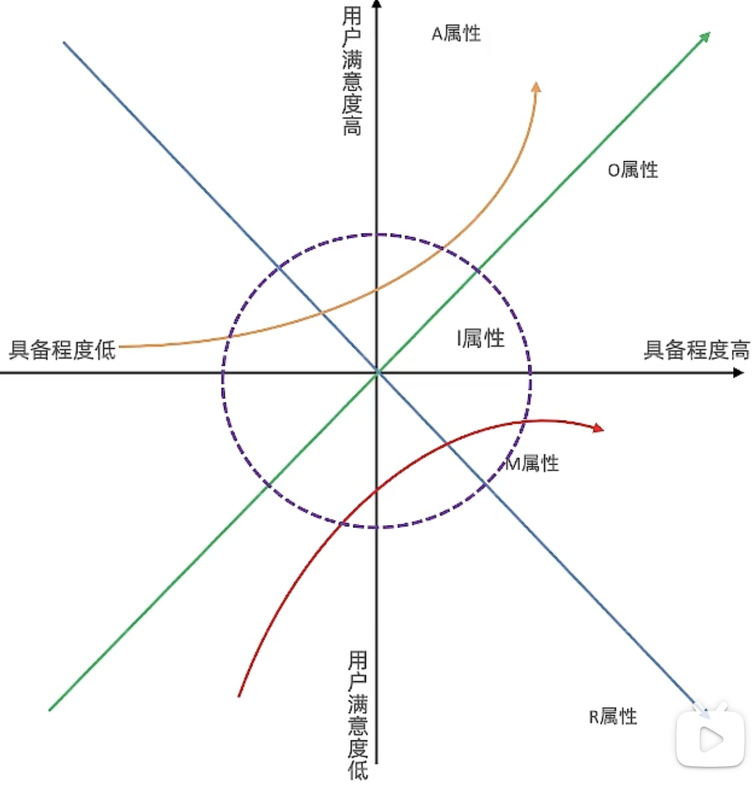

如何得到 KANO 模型？

1. 问卷 (问题需要正反设计)
2. 功能属性评定

 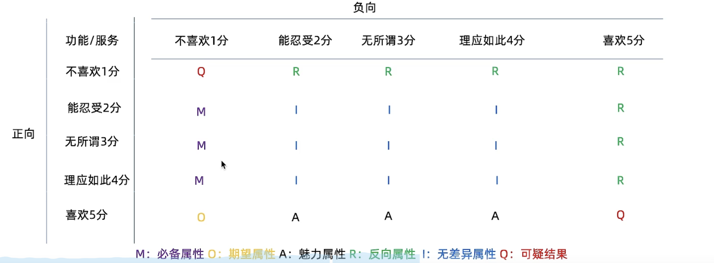

### 功能价值

> 评估一个功能的价值，可以先试点

实际价值判断

* 范围价值=潜在用户数*单用户价值
* 频次价值=需求频次*单次价值
* 时间价值=持续时间*单位价值

成本评估
成本=实现时间(天)*每(天)花多少

### 用户体验 ue

影响因素：

使用者的状态：精神状态，性格特征（动机，情绪，认知）
系统性能
环境(状况)

demo：下班后的地铁上询问家人晚饭吃什么，环境：地铁，系统性能：语音，文字，电话，视频

用户体验的类别：

感官：色彩，声音，布局，ui
交互
情感：心里认同度

用户体验的层次：

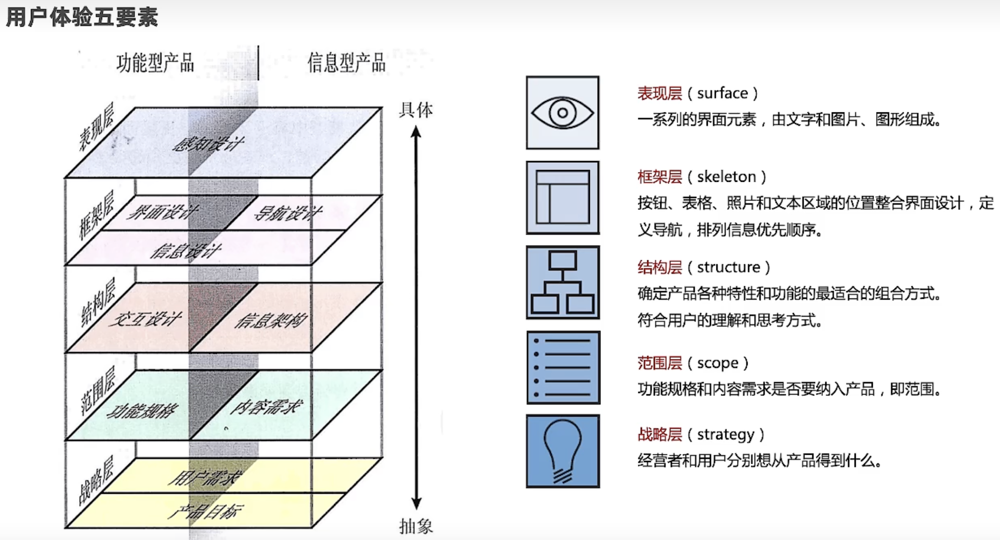

用户体验的设计目标：

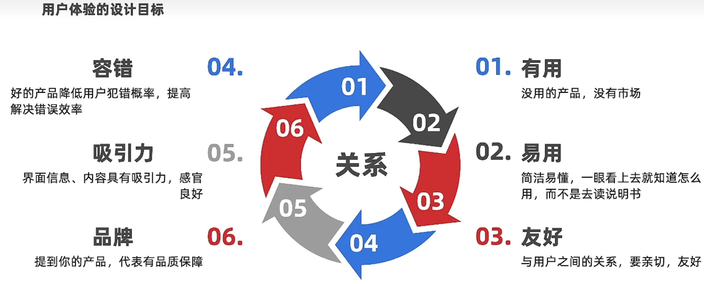

## 项目立项

流程：
项目立项-**开发阶段**-测试阶段
上线阶段-**运营阶段**-总结阶段

立项阶段：

* 任务提出-基本方案	现在的业务是什么，要做什么新业务，或哪些流程需要优化，需要做哪些平台，好处有哪里
* 需求讨论-会议纪要
* 可行性分析-MRD，可行性报告
* 立项启动-立项申请表

项目方案简介：产品名称，市场背景，核心用户

### 可行性分析

**市场需求**，资源供应，功能规模，开发技术，设备类型，**环境印象**，资金，**盈利能力**

市场环境对产品规划的影响：

目标**市场**现状，规模，趋势，市场格局，现在的问题，壁垒
目标**用户**群体，用户特征，使用场景，用户需求总结
**竞品**，竞品的用户定位，竞品的核心业务与主要功能，优缺点

市场环境分析：

市场调研：选取特点方式调研，确定数据来源
市场调研：根据调研，直观呈现目标市场现状，趋势，问题，机会

用户分析：
目标用户群体(大学生)
用户画像 （基本信息，特点，喜好等）
目标场景(具体场景)

竞品分析：
竞品的基础信息，名称，类型，定位，战略，发展历程，背景，现状，盈利模式，技术
用户定位
功能对比
优缺点

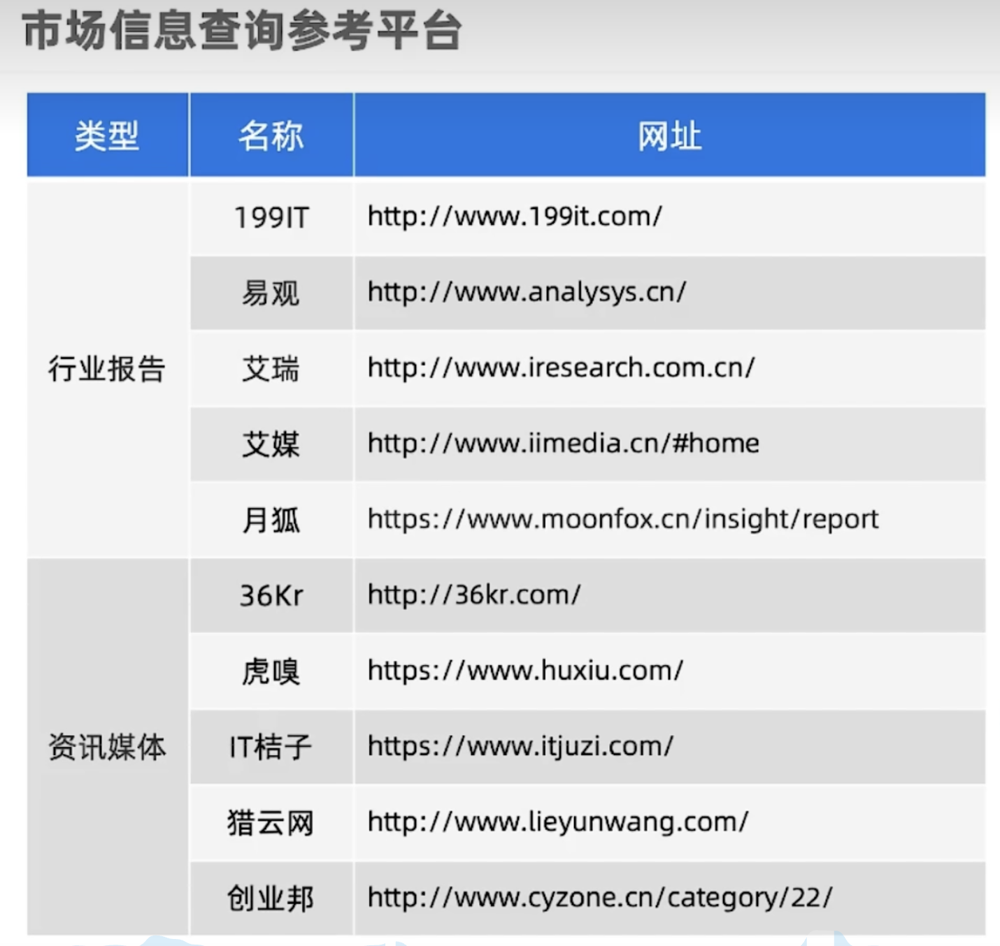

### 产品规划

*  产品定位：目标市场目标全体，提供什么服务，满足什么需求
* 目标用户：用户群体特征
* 核心业务：核心业务与主要流程
* 主要功能与特色
* 产品结构，主要页面，功能，信息
* 版本规划

### 立项评审

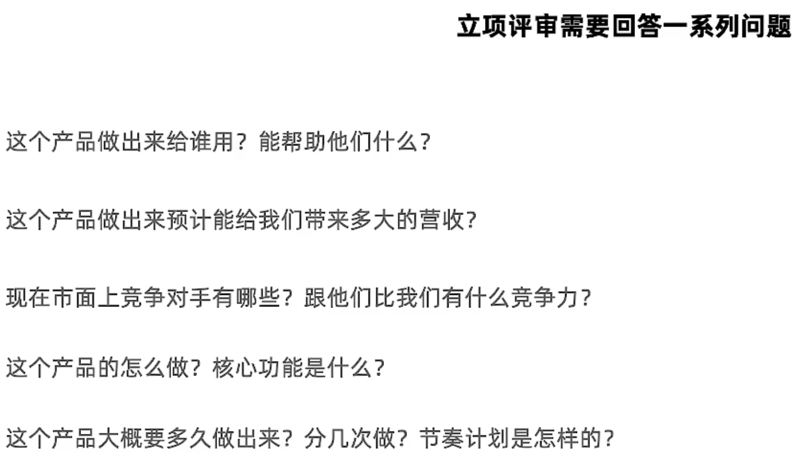

立项说明书结构：

* 产品概述：产品定位，目标用户，主要功能
* 可行性分析：市场环境分析，用户分析，竞品分析
* 产品规划：产品架构图，业务流程图，产品结构图，功能清淡，迭代计划

评审会议流程：

预约会议(确认参会人与时间地点，提前沟通，发送邮件，会议材料)
会前准备(准备研究设备，协调会议记录人员，开会前再次通知开会时间，确认核心人员是否无法参会)
会议过程(强调主题，目的，会议时间，注意事项，把握讨论时间，记录关键需求，待确认需求等)
会后跟踪(同步会议结论给相关人员或领导，确定待确认需求的跟进时间，待讨论的细节)

如果通过，需要发起立项申请表

原型的分类：

草图，手绘，方便修改
低保真原型，没有设计图，黑白，选择尺寸，划分区域，使用基础组件
高保真原型

墨刀：
页面状态，点击切换状态即可，全局事件

动态组件：右键点击组件，转化为动态组件，设置组件状态，添加交互事件

# 五张图

## 核心体验图

eg:电商
找-了解-下单-收
首页 % 详情 % 购物车/直接购买 % 退货

## 产品模块图

导购：home-search-detail
交易：pay-售后
营销：优惠券-积分-拼团

## 功能树

eg：搜索功能 
 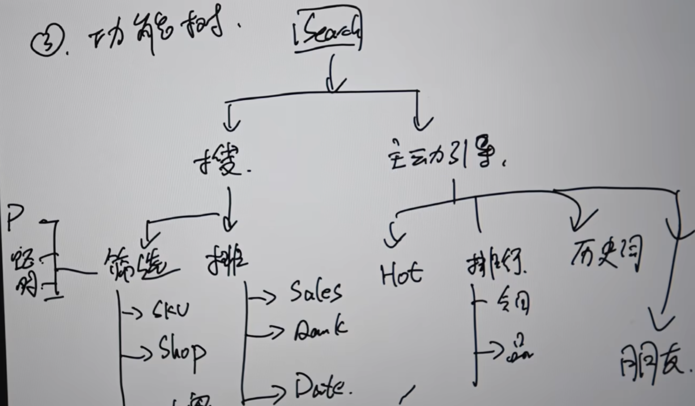

## 页面关系图

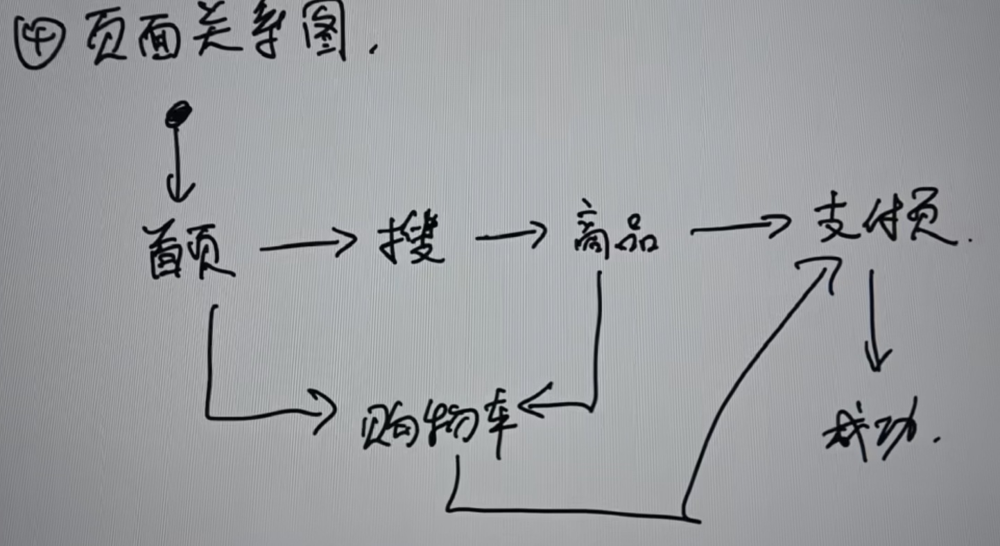

## 交互图mockup

就是一个大致的原型，然后解释其中的一些交互逻辑，现在可能不会要求画

# RPD文档

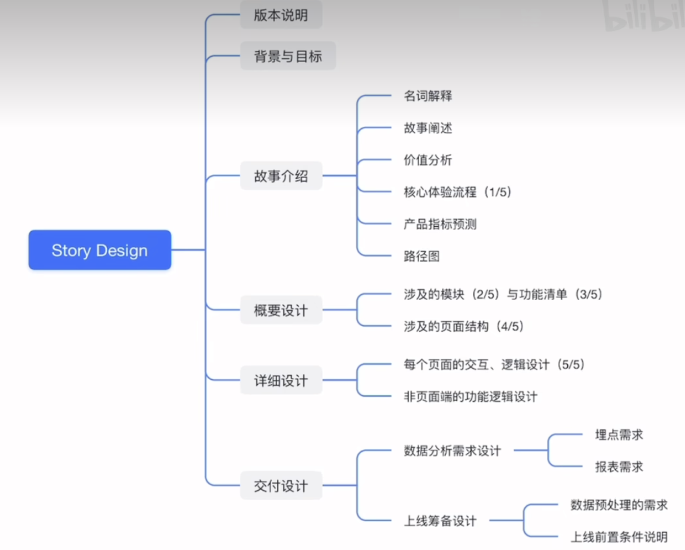

1. 版本说明：记录每次 review (版本迭代中)的改动
2. 背景与目标
   背景：产品背景(可以链接到产品的宏观设计文档)+当前故事的背景介绍
   目标：上线什么功能，什么为指标

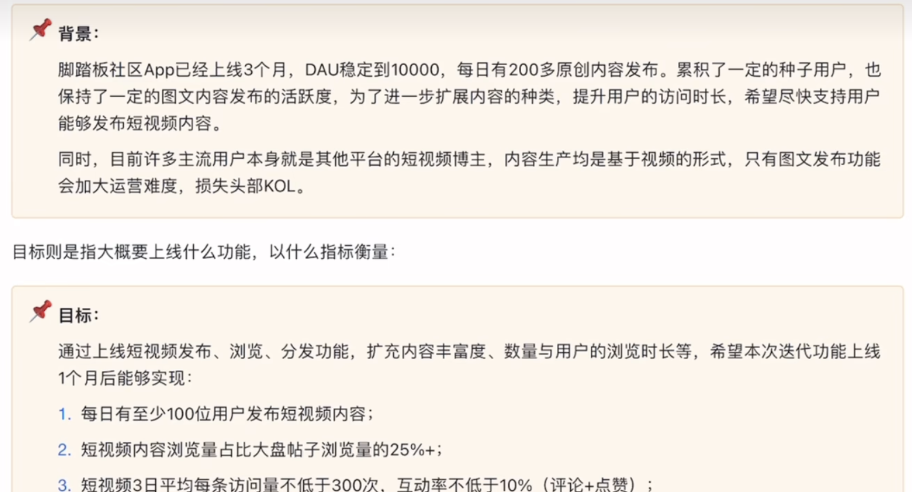

3. 故事介绍

* 用户场景，一个场景一行，读完大概知道需求有哪些
* 价值分析，分析新的需求带来的价值
* 核心体验路径，分析用户使用功能的步骤(大致分为 5 步)
* 产品指标预测
* 路径规划，当前版本，未来可能做的升级

4. 概要设计(模块图，功能清单图，页面结构图)

* 模块设计
* 功能清单

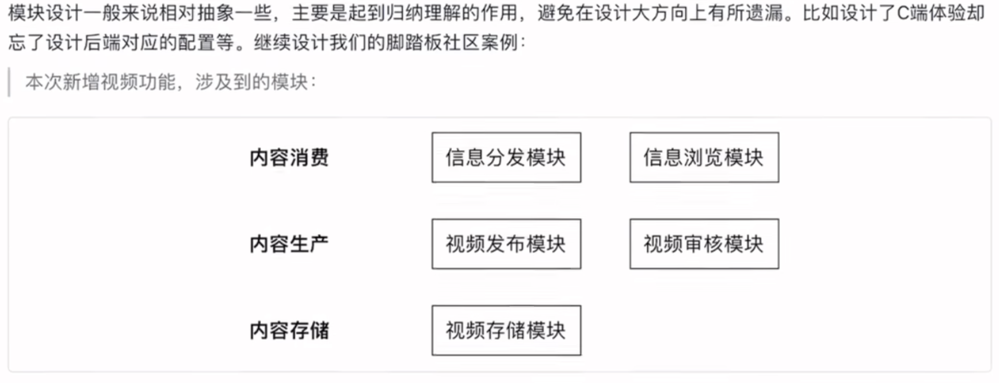

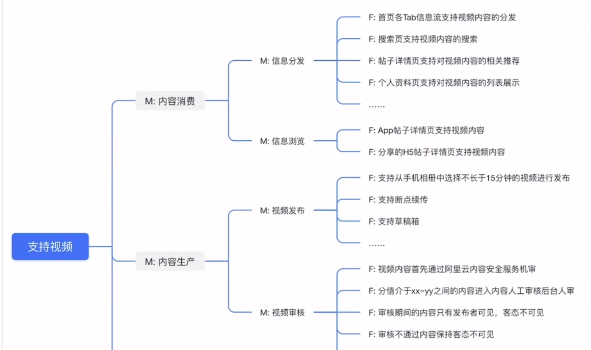

* 页面结构 

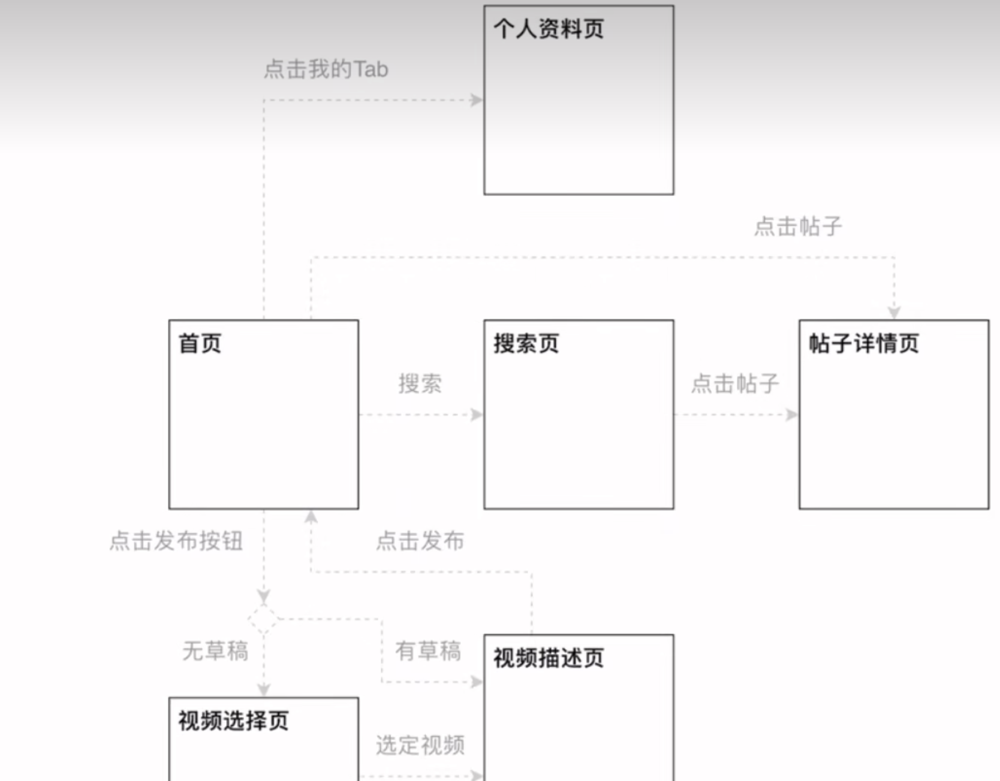

5. 详细设计

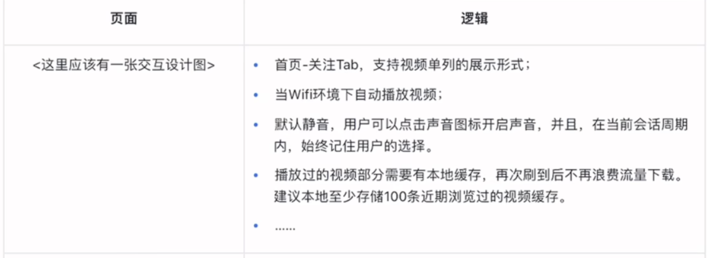

6. 交付设计

* 数据分析设计
  指明当前版本需要新增，更新的数据埋点内容，以及未来可能需要的分析报表
  埋点设计
  报表设计

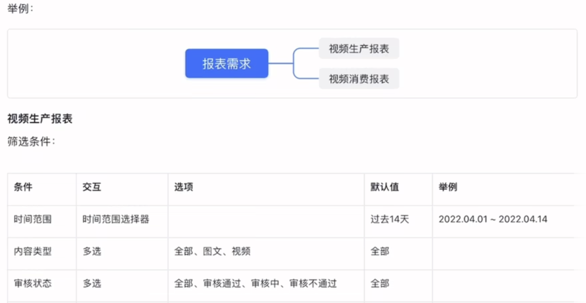

​	   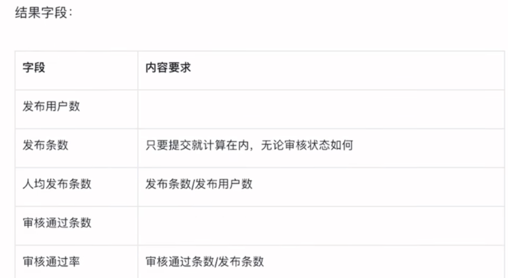

> 也就是说根据现有的报表，是否需要新增或者修改，方便分析用户活动追踪产品效果等

* 上线筹备

考虑上线新功能的影响，是否会影响现有功能，或者影响数据库，指明冲突和解决办法，还要考虑是否服务器资源会发送变化等，比如是否需要更换服务器等

7. 来自产品上线后的更新

上线后对功能进行复盘