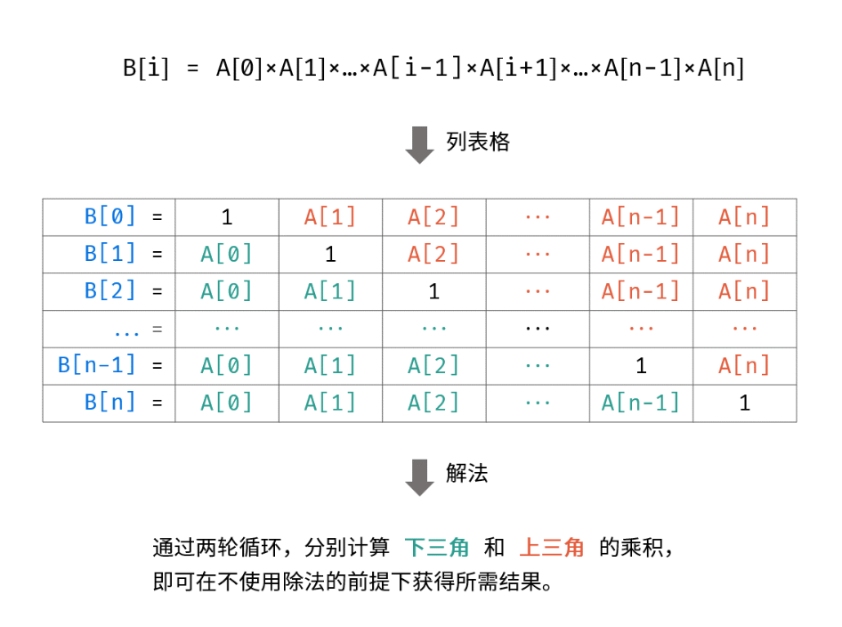

# 数组/字符串

### 88 合并两个有序数组

非递减顺序：从小到大排列

```
输入：nums1 = [1,2,3,0,0,0], m = 3, nums2 = [2,5,6], n = 3
输出：[1,2,2,3,5,6]
解释：需要合并 [1,2,3] 和 [2,5,6] 。
合并结果是 [1,2,2,3,5,6] 
```

我的：先nums2中插入到nums1中0的位置 然后使用选择排序

~~~~c++
class Solution { //排序
public:
    void merge(vector<int>& nums1, int m, vector<int>& nums2, int n) {
        for(int i=m;i<m+n;i++){
            nums1[i]=nums2[i-m];
        }
        int i,j;
        for(i=1; i<n+m; i++) {    //sort(nums1.begin(), nums1.end());
            if(nums1[i]<nums1[i-1]) {  
                int temp=nums1[i];  
                for(j=i-1; j>=0 && nums1[j]>temp; j--) {   
                   nums1[j+1]=nums1[j];
                }
                nums1[j+1]=temp;
            }
        }
    }
};
~~~~

双指针

利用两个数组已经有序，创建一个新的数组，每次取两个数组中的最小放进去

~~~c++
class Solution {
public:
    void merge(vector<int>& nums1, int m, vector<int>& nums2, int n) {
        int p1 = 0, p2 = 0;
        int sorted[m + n];
        int cur;
        while (p1 < m || p2 < n) {
            if (p1 == m) {
                cur = nums2[p2++];
            } else if (p2 == n) {
                cur = nums1[p1++];
            } else if (nums1[p1] < nums2[p2]) {
                cur = nums1[p1++];
            } else {
                cur = nums2[p2++];
            }
            sorted[p1 + p2 - 1] = cur;
        }
        for (int i = 0; i != m + n; ++i) {
            nums1[i] = sorted[i];
        }
    }
};
~~~

逆向双指针 0ms

避免使用临时变量创建一个新的数组，不用担心覆盖nums1的问题

~~~c++
//我的
class Solution {
public:
    void merge(vector<int>& nums1, int m, vector<int>& nums2, int n) {
        int l=m-1;
        int j=n-1;
        int i=m+n-1;
        while(j>=0){
            if(l>=0&&nums1[l]>nums2[j]){
                nums1[i]=nums1[l];
                l--;
            }else{
                nums1[i]=nums2[j];
                j--;
            }
            i--;
        }
    }
};   

class Solution {
public:
    void merge(vector<int>& nums1, int m, vector<int>& nums2, int n) {
        int p1 = m - 1, p2 = n - 1;
        int tail = m + n - 1;
        int cur;
        while (p1 >= 0 || p2 >= 0) {
            if (p1 == -1) {
                cur = nums2[p2--];
            } else if (p2 == -1) {
                cur = nums1[p1--];
            } else if (nums1[p1] > nums2[p2]) {
                cur = nums1[p1--];
            } else {
                cur = nums2[p2--];
            }
            nums1[tail--] = cur;
        }
    }
};

class Solution {
public:
    void merge(vector<int>& nums1, int m, vector<int>& nums2, int n) {
        int left = m - 1, right = n - 1, cur = m + n - 1;
        while (left >= 0 && right >= 0) 
            nums1[cur--] = nums1[left] > nums2[right] ? nums1[left--] : nums2[right--]; //>优先级大于=
        // nums1剩下的已经排序，可以跳过
        while (right >= 0) 
            nums1[cur--] = nums2[right--];        
    }
};
~~~

### 27 移除元素

返回剩下的元素个数

~~~
输入：nums = [0,1,2,2,3,0,4,2], val = 2
输出：5, nums = [0,1,4,0,3]
~~~

0ms

~~~c++
class Solution {
public:
    int removeElement(vector<int>& nums, int val) {
        vector<int>::iterator it=nums.begin();
        for(;it<nums.end();it++){
            if(*it==val){
                nums.erase(it);
                it--;
            }
        }
        return nums.size();
    }
};
~~~

或 使用双指针

### 26 删除有序数组中的重复项

给你一个 **升序排列** 的数组 `nums` ，请你**[ 原地](http://baike.baidu.com/item/原地算法)** 删除重复出现的元素，使每个元素 **只出现一次** ，返回删除后数组的新长度。元素的 **相对顺序** 应该保持 **一致** 。然后返回 `nums` 中唯一元素的个数。

~~~c++
//484ms 迭代器
class Solution {
public:
    int removeDuplicates(vector<int>& nums) {
        vector<int>::iterator it=nums.begin();
        for(;it<nums.end()-1;it++){
            for(vector<int>::iterator j=(it+1);j<nums.end();j++){
                if(*j==*it){
                    nums.erase(j);
                    j--;
                }
            }
        }
        return nums.size();
    }
};
~~~

因为是有序的，所以只需要从头到尾连续的两个进行比较，至少剩一个

~~~c++
//540ms
class Solution {
public:
    int removeDuplicates(vector<int>& nums) {
        vector<int>::iterator it=nums.begin();
        for(;it<nums.end()-1;it++){
            vector<int>::iterator j=(it+1);
            if(*j==*it){
                 nums.erase(j);it--;
            }           
        }
        return nums.size();
    }
};
~~~

it--==???==

双指针 将有序的排在前面， p前q后 q外层遍历 q找到和q不一样的复制到p的下一位

~~~c++
//12ms
class Solution{
public:
    int removeDuplicates(vector<int>& nums) {
        if(nums.empty()) return 0;
        int p = 0;
        int q = 1;
        while(q < nums.size()){
            if(nums[p] != nums[q]){
                if(q - p > 1){
                    nums[p + 1] = nums[q];
                }
                p++;
            }
        q++;
        }
        return p + 1;
    }
};
~~~

### 80 删除有序数组中的重复项Ⅱ

~~~c++
//8ms
class Solution {
public:
    int removeDuplicates(vector<int>& nums) {
        vector<int>::iterator it=nums.begin();
        vector<int>::iterator j;
        while(it<nums.end()-2){
            j=it+1;
            if(*j==*it&&*(j+1)==*it){
                nums.erase(j);
            }else{ 
                it++; //不相等才it++ 防止大于三个相同的漏掉
            }
        }
        return nums.size();
    }
};
~~~

双指针 slow表示处理出的数组长度 fast表示已经检查过的长度

~~~c++
//0ms
class Solution {
public:
    int removeDuplicates(vector<int>& nums) {
        int n = nums.size();
        if (n <= 2) {
            return n;
        }
        int slow = 2, fast = 2;  //从2开始，前面2个都是不用动的
        while (fast < n) {
            if (nums[slow - 2] != nums[fast]) { //不相等可以保存
                nums[slow] = nums[fast];  //保存
                ++slow;  //保存数目+1
            }
            ++fast; //检查数目+1
        }
        return slow;
    }
};
~~~

删除重复项的通解==？？？==

~~~c++
//4ms
class Solution {
public:
    int work(vector<int>& nums, int k) {
        int len = 0;
        for(auto num : nums)
            if(len < k || nums[len-k] != num)
                nums[len++] = num;
        return len;
    }
    int removeDuplicates(vector<int>& nums) {
        return work(nums, 2);
    }
};
~~~

### 169 多数元素

给定大小为n的数组，返回多数元素（个数大于n/2）

利用两个循环 时间复杂度O² 会超时

~~~c++
class Solution {
public:
    int majorityElement(vector<int>& nums) {
        int max=0;
        for(int i=0;i<nums.size();i++){
            for(int j=i;j<nums.size();j++){
                if(nums[j]==nums[i])
                    max++;
                if(max>nums.size()/2){
                    return nums[i];
                }
            }
            max=0;
        }
        return 0;
    }
};
~~~

哈希表

我们使用哈希映射（HashMap）来存储每个元素以及出现的次数。对于哈希映射中的每个键值对，键表示一个元素，值表示该元素出现的次数。我们同样也可以在遍历数组 nums 时候使用打擂台的方法，维护最大的值，这样省去了最后对哈希映射的遍历。==？？？==

~~~~c++
//24ms n n	
class Solution {
public:
    int majorityElement(vector<int>& nums) {
        unordered_map<int, int> counts; //创建哈希表统计元素出现的次数
        int majority = 0, cnt = 0;   //当前的众数 和次数
        for (int num: nums) {
            ++counts[num];  //增加counts中nun对于的值
            if (counts[num] > cnt) {  //nun对于的值出现的次数>当前众数  更新
                majority = num;
                cnt = counts[num];
            }
        }
        return majority;
    }
};
~~~~

排序

从小到大排序 下标n/2处一定为次数多的

~~~c++
//20ms nlogn  logn  自己编写堆排序O1
class Solution {
public:
    int majorityElement(vector<int>& nums) {
        sort(nums.begin(), nums.end());
        return nums[nums.size() / 2];
    }
};
~~~

随机化

~~~c++
//8ms 期望n 1
class Solution {
public:
    int majorityElement(vector<int>& nums) {
        while (true) {
            int candidate = nums[rand() % nums.size()];
            int count = 0;
            for (int num : nums)
                if (num == candidate)
                    ++count;
            if (count > nums.size() / 2)
                return candidate;
        }
        return -1;
    }
};
~~~

分治

思路

如果数 a 是数组 nums 的众数，如果我们将 nums 分成两部分，那么 a 必定是至少一部分的众数。

我们可以使用反证法来证明这个结论。假设 a 既不是左半部分的众数，也不是右半部分的众数，那么 a 出现的次数少于 l / 2 + r / 2 次，其中 l 和 r 分别是左半部分和右半部分的长度。由于 l / 2 + r / 2 <= (l + r) / 2，说明 a 也不是数组 nums 的众数，因此出现了矛盾。所以这个结论是正确的。

这样以来，我们就可以使用分治法解决这个问题：将数组分成左右两部分，分别求出左半部分的众数 a1 以及右半部分的众数 a2，随后在 a1 和 a2 中选出正确的众数。

算法

我们使用经典的分治算法递归求解，直到所有的子问题都是长度为 1 的数组。长度为 1 的子数组中唯一的数显然是众数，直接返回即可。如果回溯后某区间的长度大于 1，我们必须将左右子区间的值合并。如果它们的众数相同，那么显然这一段区间的众数是它们相同的值。否则，我们需要比较两个众数在整个区间内出现的次数来决定该区间的众数。

~~~c++
// 40ms nlogn logn
class Solution {
    int count_in_range(vector<int>& nums, int target, int lo, int hi) {
        int count = 0;
        for (int i = lo; i <= hi; ++i)
            if (nums[i] == target)
                ++count;
        return count;
    }
    int majority_element_rec(vector<int>& nums, int lo, int hi) {
        if (lo == hi)
            return nums[lo];
        int mid = (lo + hi) / 2;
        int left_majority = majority_element_rec(nums, lo, mid);
        int right_majority = majority_element_rec(nums, mid + 1, hi);
        if (count_in_range(nums, left_majority, lo, hi) > (hi - lo + 1) / 2)
            return left_majority;
        if (count_in_range(nums, right_majority, lo, hi) > (hi - lo + 1) / 2)
            return right_majority;
        return -1;
    }
public:
    int majorityElement(vector<int>& nums) {
        return majority_element_rec(nums, 0, nums.size() - 1);
    }
};
~~~

boyer-moore 投票算法

我们维护一个候选众数 candidate 和它出现的次数 count。count 为 0；

我们遍历数组 nums 中的所有元素，对于每个元素 x，在判断 x 之前，如果 count 的值为 0，我们先将 x 的值赋予 candidate，随后我们判断 x：

如果 x 与 candidate 相等，那么计数器 count 的值增加 1；如果 x 与 candidate 不等，那么计数器 count 的值减少 1。

在遍历完成后，candidate 即为整个数组的众数。

~~~c++
//16 n 1
class Solution {
public:
    int majorityElement(vector<int>& nums) {
        int x = 0, votes = 0;
        for (int num : nums){
            if (votes == 0) x = num;
            votes += num == x ? 1 : -1;  //如果num=x +1 else -1
        }
        return x;
    }
};
~~~

### 189 轮转数组

给定一个整数数组 `nums`，将数组中的元素向右轮转 `k` 个位置，其中 `k` 是非负数。

使用另一个数组辅助

~~~c++
//28ms
class Solution {
public:
    void rotate(vector<int>& nums, int k) {
        int a=nums.size();
        vector<int> nums2(a);
        for(int i=0;i<a;i++){
            int j=(i+k)%a;
            nums2[j]=nums[i];
        }
        nums=nums2;
    }
};
~~~

环状替换

一个临时变量x  x保存0+k位 0+k位=0位  0位=x  x保存(0+2k)%n位 (0+2k)%n位=0位  一直循环，回到0位，但不能保证全部都轮了，要有一个计数器计数没有完下一轮从1位开始 ==？？？==

~~~c++
//40ms
class Solution {
public:
    void rotate(vector<int>& nums, int k) {
        int n = nums.size();
        k = k % n;
        int count = gcd(k, n); //最大公约数
        for (int start = 0; start < count; ++start) {
            int current = start;
            int prev = nums[start];
            do {
                int next = (current + k) % n;
                swap(nums[next], prev);
                current = next;
            } while (start != current);
        }
    }
};
~~~

数组翻转

我们可以先将所有元素翻转，这样尾部的 k%n个元素就被移至数组头部，然后我们再翻转 \[0,k%n−1] 区间的元素和 \[k%n,n−1] 区间的元素即能得到最后的答案。

~~~c++
//28ms
class Solution {
public:
    void reverse(vector<int>& nums, int start, int end) {
        while (start < end) {
            swap(nums[start], nums[end]);
            start += 1;
            end -= 1;
        }
    }

    void rotate(vector<int>& nums, int k) {
        k %= nums.size();
        reverse(nums, 0, nums.size() - 1);
        reverse(nums, 0, k - 1);
        reverse(nums, k, nums.size() - 1);
    }
};
~~~

### 121 买卖股票的最佳时机

给定一个数组 `prices` ，它的第 `i` 个元素 `prices[i]` 表示一支给定股票第 `i` 天的价格。

你只能选择 **某一天** 买入这只股票，并选择在 **未来的某一个不同的日子** 卖出该股票。设计一个算法来计算你所能获取的最大利润。

返回你可以从这笔交易中获取的最大利润。如果你不能获取任何利润，返回 `0` 。

要在一条线上找跨度最大的，直接用后面数字-前面的看谁最大n^2 直接超时

~~~c++
class Solution {
public:
    int maxProfit(vector<int>& prices) {
        int temp=0;
        int n=prices.size();
        for(int i=0;i<n;i++){
            for(int j=i+1;j<n;j++){
                if(prices[i]-prices[j]<temp)
                    temp=prices[i]-prices[j];
            }
        }
        if(temp<0){
            return -1*temp;
        }else{
            return 0;
        }
    }
};
~~~

n 动态规划

~~~c++
//96ms
class Solution {
public:
    int maxProfit(vector<int>& prices) {
        int n = prices.size();
        if (n <= 1)
            return 0;
        
        int maxProfit = 0;
        int minPrice = prices[0];
        
        for (int i = 1; i < n; i++) {
            if (prices[i] < minPrice)
                minPrice = prices[i];
            else if (prices[i] - minPrice > maxProfit)
                maxProfit = prices[i] - minPrice;
        }
        
        return maxProfit;
    }
};
~~~


for(i:)中i是一个什么对象？

###122 买股票的最佳时机Ⅱ

给你一个整数数组 `prices` ，其中 `prices[i]` 表示某支股票第 `i` 天的价格。

在每一天，你可以决定是否购买和/或出售股票。你在任何时候 **最多** 只能持有 **一股** 股票。你也可以先购买，然后在 **同一天** 出售。

返回 *你能获得的 **最大** 利润* 。

**示例 1：**

```
输入：prices = [7,1,5,3,6,4]
输出：7
解释：在第 2 天（股票价格 = 1）的时候买入，在第 3 天（股票价格 = 5）的时候卖出, 这笔交易所能获得利润 = 5 - 1 = 4 。
     随后，在第 4 天（股票价格 = 3）的时候买入，在第 5 天（股票价格 = 6）的时候卖出, 这笔交易所能获得利润 = 6 - 3 = 3 。
     总利润为 4 + 3 = 7 。
```

相当于就是求所有能的利润

~~~c++
0ms
class Solution {
public:
    int maxProfit(vector<int>& prices) {
        int sum=0;
        int n=prices.size();
        int a=prices[0];
        for(int i=1;i<n;i++){
            if(prices[i]>a){
                sum+=prices[i]-a;
                a=prices[i];
            }else{
                a=prices[i];
            }
        }
        return sum;
    }
};
~~~

###55 跳跃游戏

给你一个非负整数数组 `nums` ，你最初位于数组的 **第一个下标** 。数组中的每个元素代表你在该位置可以跳跃的最大长度。

判断你是否能够到达最后一个下标，如果可以，返回 `true` ；否则，返回 `false` 。

**示例 1：**

```
输入：nums = [2,3,1,1,4]
输出：true
解释：可以先跳 1 步，从下标 0 到达下标 1, 然后再从下标 1 跳 3 步到达最后一个下标。
```

**示例 2：**

```
输入：nums = [3,2,1,0,4]
输出：false
解释：无论怎样，总会到达下标为 3 的位置。但该下标的最大跳跃长度是 0 ， 所以永远不可能到达最后一个下标。
```

~~~c++
//60ms
class Solution {
public:
    bool canJump(vector<int>& nums) {
        int k = 0;  //到达的最大下标
        for (int i = 0; i < nums.size(); i++) {
            if (i > k) return false;  //到不到这个i
            k = max(k, i + nums[i]);//i + nums[i]在下标i基础上跳多少
        }
        return true;
    }
};
~~~

###45 跳跃游戏Ⅱ

返回到达 `nums[n - 1]` 的最小跳跃次数。生成的测试用例可以到达 `nums[n - 1]`。

下标0的位置，如果能跳到下标1，2，这是我们并不清楚我们应该跳到哪一个，而应该进行一次选择，如果下标1能跳3格，也就是能到达1+3=4的位置，下标2只能跳一格，只能到达2+1=3的位置，这是我们就应该选择首先跳到下标1，并且记录步数的变量+1

代码表示

~~~c++
    int j = start + nums[start];
    for (int i = start + 1; i <= j && i <= end; i++) {
    	if ((nums[i] + i) > Dmax) {
            Dmax = nums[i] + i;  //最远距离
            start = i; //起跳点更新
    	}
    }
        count++;
~~~

算法写好了，那么我们的程序应该是：把算法放进while循环中，结束条件是其距离能到达最后一位

~~~c++
//12ms
int jump(vector<int>& nums) {
    int end = nums.size() - 1;
    if (end == 0) return 0;
    int count = 0;
    int Dmax = nums[0];
    int start = 0;
    while (Dmax < end) {
        int j = start + nums[start];
        for (int i = start + 1; i <= j && i <= end; i++) {
            if ((nums[i] + i) > Dmax) {
                Dmax = nums[i] + i;
                start = i;
            }
        }
        count++;
    }
    return count+1;
}
~~~

###274 H 指数

给你一个整数数组 `citations` ，其中 `citations[i]` 表示研究者的第 `i` 篇论文被引用的次数。计算并返回该研究者的 **`h` 指数**。

根据维基百科上 [h 指数的定义](https://baike.baidu.com/item/h-index/3991452?fr=aladdin)：`h` 代表“高引用次数” ，一名科研人员的 `h` **指数** 是指他（她）至少发表了 `h` 篇论文，并且每篇论文 **至少** 被引用 `h` 次。如果 `h` 有多种可能的值，**`h` 指数** 是其中最大的那个。

**示例 1：**

```
输入：citations = [3,0,6,1,5]
输出：3 
解释：给定数组表示研究者总共有 5 篇论文，每篇论文相应的被引用了 3, 0, 6, 1, 5 次。
     由于研究者有 3 篇论文每篇 至少 被引用了 3 次，其余两篇论文每篇被引用 不多于 3 次，所以她的 h 指数是 3。
```

**示例 2：**

```
输入：citations = [1,3,1]
输出：1
```

从大到小遍历，H指数从大到小判断，内层遍历如果不满足指数的数目过多则H--重新判断

~~~c++
//32ms
class Solution {
public:
    int hIndex(vector<int>& citations) {
        for(int i=citations.size()-1;i>=0;i--){
            int count=citations.size();
            for(int j=0;j<citations.size();j++){
                if(citations[j]<i+1) count--; 
                if(count<=i) break;
            }
            if(count>=i+1){
                return i+1;
            }
        }
        return 0;
    }
};
~~~

官方：先排序 h和i向中间靠拢，一次循环意味着一篇文章h++次，最后至少h篇h次

~~~c++
class Solution {
public:
    int hIndex(vector<int>& citations) {
        sort(citations.begin(), citations.end());
        int h = 0, i = citations.size() - 1;
        while (i >= 0 && citations[i] > h) {
            h++;
            i--;
        }
        return h;
    }
};
~~~

二分==？？？==

首先，定义左右两个指针，分别指向数组的首尾，然后取中间值，并计算大于或等于中间值的元素个数。如果这个数大于或等于中间值，那么将左指针移动到中间值，反之，将右指针移动到中间值减1。这样，每次循环后，搜索区间就会减半，最终会找到H指数。

~~~c++
class Solution {
public:
    int hIndex(vector<int>& citations) {
        int left=0,right=citations.size();
        int mid=0,cnt=0;
        while(left<right){
            // +1 防止死循环
            mid=(left+right+1)>>1;
            cnt=0;
            for(int i=0;i<citations.size();i++){
                if(citations[i]>=mid){
                    cnt++;
                }
            }
            if(cnt>=mid){
                // 要找的答案在 [mid,right] 区间内
                left=mid;
            }else{
                // 要找的答案在 [0,mid) 区间内
                right=mid-1;
            }
        }
        return left;
    }
};
~~~

###238 除自身以外数组的乘积

给你一个整数数组 `nums`，返回 *数组 `answer` ，其中 `answer[i]` 等于 `nums` 中除 `nums[i]` 之外其余各元素的乘积* 。

题目数据 **保证** 数组 `nums`之中任意元素的全部前缀元素和后缀的乘积都在 **32 位** 整数范围内。

请 **不要使用除法，**且在 `O(*n*)` 时间复杂度内完成此题。

~~~c++
//超时
class Solution {
public:
    vector<int> productExceptSelf(vector<int>& nums) {
        //二分
        int left,right;
        vector<int> nums2(nums.size(),1);//全部赋为1，不用new空间
        for(int mid=0;mid<nums.size();mid++){
            left=0;right=nums.size()-1;
            while(left<mid){
                nums2[mid]*=nums[left];
                left++;
            }
            while(right>mid){
                nums2[mid]*=nums[right];
                right--;
            }
        }
        return nums2;//要申请空间才能返回数组
    }
};
//改进:可以额外开辟一个数组,先记录左边每一位累乘的,再记录右边每一位累乘的s,这样就不会超时了
~~~

上三角下三角法



B[i]=对应行乘积  返回B数组

先算下三角 ex:B[2]=B[1]*A[1]

for (int i = 1; i < len; i++) {
    ans[i] = ans[i - 1] * nums[i - 1];
}

再算上三角 ex:

ans *=(temp\*nums)

~~~c++
//20ms
class Solution {
public:
    vector<int> productExceptSelf(vector<int>& nums) {
        int len = nums.size();
        if (len == 0) return {};
        vector<int> ans(len, 1);
        ans[0] = 1;
        int tmp = 1;
        for (int i = 1; i < len; i++) {
            ans[i] = ans[i - 1] * nums[i - 1];
        }
        for (int i = len - 2; i >= 0; i--) {
            tmp *= nums[i + 1];
            ans[i] *= tmp;
        }
        return ans;
    }
};
~~~

### 134 加油站

在一条环路上有 `n` 个加油站，其中第 `i` 个加油站有汽油 `gas[i]` 升。

你有一辆油箱容量无限的的汽车，从第 `i` 个加油站开往第 `i+1` 个加油站需要消耗汽油 `cost[i]` 升。你从其中的一个加油站出发，开始时油箱为空。

给定两个整数数组 `gas` 和 `cost` ，如果你可以按顺序绕环路行驶一周，则返回出发时加油站的编号，否则返回 `-1` 。如果存在解，则 **保证** 它是 **唯一** 的。

**示例 1:**

```
输入: gas = [1,2,3,4,5], cost = [3,4,5,1,2]
输出: 3
解释:
从 3 号加油站(索引为 3 处)出发，可获得 4 升汽油。此时油箱有 = 0 + 4 = 4 升汽油
开往 4 号加油站，此时油箱有 4 - 1 + 5 = 8 升汽油
开往 0 号加油站，此时油箱有 8 - 2 + 1 = 7 升汽油
开往 1 号加油站，此时油箱有 7 - 3 + 2 = 6 升汽油
开往 2 号加油站，此时油箱有 6 - 4 + 3 = 5 升汽油
开往 3 号加油站，你需要消耗 5 升汽油，正好足够你返回到 3 号加油站。
因此，3 可为起始索引。
```

~~~c++
//112ms
class Solution {
public:
    int canCompleteCircuit(vector<int>& gas, vector<int>& cost) {
        int n=gas.size();
        int m=cost.size();
        vector<int>temp(n); 
        auto it=temp.begin();
        int min =0;
        int sum=0,index,l=0;
        for(int i=0,j=0;i<n&&j<m;i++,j++){
            (*it)=gas[i]-cost[j];
            sum+=(*it);
            if(sum<min){  //min记录最小油量时刻（负油最多），它之后就是出发点
                min=sum;
                index=i+1;
            }
            ++it;
        }
        if(sum<0){
            return -1;
        }
        if(min>=0) return 0; //>0是多解情况，从0开始走都可以
        return index%n;

    }
};
~~~

~~~c++
//简化，但是耗时更多？
class Solution {
public:
    int canCompleteCircuit(vector<int>& gas, vector<int>& cost) {
        int n=gas.size();
        int min =0;
        int sum=0,index;
        for(int i=0;i<n;i++){
            sum+=gas[i]-cost[i];
            if(sum<min){  //
                min=sum;
                index=i+1;
            }
        }
        if(sum<0){
            return -1;
        }
        if(min>=0) return 0;
        return index%n;

    }
};
~~~

### 135 分发糖果

`n` 个孩子站成一排。给你一个整数数组 `ratings` 表示每个孩子的评分。

你需要按照以下要求，给这些孩子分发糖果：

- 每个孩子至少分配到 `1` 个糖果。
- 相邻两个孩子评分更高的孩子会获得更多的糖果。

请你给每个孩子分发糖果，计算并返回需要准备的 **最少糖果数目** 。

**示例 1：**

```
输入：ratings = [1,2,2]
输出：4
解释：你可以分别给第一个、第二个、第三个孩子分发 1、2、1 颗糖果。第三个孩子只得到 1 颗糖果，这满足题面中的两个条件。
```

~~~c++
//840ms 每次两个遍历
int candy(vector<int>& ratings) {
    int all = 0;
    auto it = ratings.begin();
    int temp1 = 0,temp2=0;
    for (; it != ratings.end(); ++it) {
        int b = 0,c=0;
        if (it + 1 != ratings.end() && *(it) > *(it + 1)) {//注意，此时我们不知道后一位是否比后两位大
            int count = 2;
            auto j = it+1;
            while (j+1!=ratings.end()&& (*j) > *(j + 1)) {
                j++;
                count++;
            }
            temp1 = count;
            b = 1;
        }
        if (it != ratings.begin() && *(it) > *(it - 1)) {
            int count = 2;
            auto j = it-1;
            while (j != ratings.begin() && (*j) > *(j - 1)) {
                j--;
                count++;
            }
            temp2 = count;
            c = 1;
        }
        if (b == 0&&c==0) {
            all += 1;
        }
        else if (b == 1&&c==1) {
            if (temp1 >= temp2) {
                all += temp1;
            }
            else {
                all += temp2;
            }
        }
        else if(b==0){
            all += temp2;
        }
        else {
            all += temp1;
        }
    }
    return all;
}
~~~

~~~c++
//优化版本16ms
class Solution {
public:
    int candy(vector<int>& ratings) {  
    int n = ratings.size();  
    vector<int> candies(n, 1); // 初始化每个孩子至少有一个糖果  
    // 从左到右遍历，保证右边评分更高的孩子获得更多糖果  
    for (int i = 1; i < n; ++i) {  
        if (ratings[i] > ratings[i - 1]) {  
            candies[i] = candies[i - 1] + 1;  
        }  
    }  
    // 从右到左遍历，保证左边评分更高的孩子获得更多糖果，同时考虑两边都评分更高的情况  
    for (int i = n - 2; i >= 0; --i) {  
        if (ratings[i] > ratings[i + 1]) {  
            candies[i] = max(candies[i], candies[i + 1] + 1);  
        }  
    }  
    // 计算总糖果数量  
    int total = 0;  
    for (int i = 0; i < n; ++i) {  
        total += candies[i];  
    }  
    return total;  
}  
};
~~~

~~~c++
//12ms ,不好想
class Solution {
public:
    int candy(vector<int>& ratings) {
        int n = ratings.size();
        int ret = 1;
        int inc = 1, dec = 0, pre = 1;
        for (int i = 1; i < n; i++) {
            if (ratings[i] >= ratings[i - 1]) {
                dec = 0;//出现大于，-序列归0
                pre = ratings[i] == ratings[i - 1] ? 1 : pre + 1;//相等=1，前一个+1
                ret += pre;//总糖
                inc = pre;//递增序列
            } else {
                dec++;//递减序列
                if (dec == inc) {//增序列=减序列时是特殊点
                    dec++;
                }
                ret += dec;
                pre = 1;
            }
        }
        return ret;
    }
};
~~~

# 双指针

核心思想：创建两个指针，一个指向头，一个指尾，根据条件遍历

### 15 三数之和

给你一个整数数组 `nums` ，判断是否存在三元组 `[nums[i], nums[j], nums[k]]` 满足 `i != j`、`i != k` 且 `j != k` ，同时还满足 `nums[i] + nums[j] + nums[k] == 0` 。请

你返回所有和为 `0` 且不重复的三元组。

**注意：**答案中不可以包含重复的三元组。

**示例 1：**

```
输入：nums = [-1,0,1,2,-1,-4]
输出：[[-1,-1,2],[-1,0,1]]
解释：
nums[0] + nums[1] + nums[2] = (-1) + 0 + 1 = 0 。
nums[1] + nums[2] + nums[4] = 0 + 1 + (-1) = 0 。
nums[0] + nums[3] + nums[4] = (-1) + 2 + (-1) = 0 。
不同的三元组是 [-1,0,1] 和 [-1,-1,2] 。
注意，输出的顺序和三元组的顺序并不重要。
```

难点：去除重复 -1 0 1 和 0 1 -1 属于重复的 所以先排序再去除重复遍历

~~~c++
//108ms
class Solution {
public:
    vector<vector<int>> threeSum(vector<int>& nums) {
        vector<vector<int>> ans;
        if(nums.size()<3) return ans;
        sort(nums.begin(), nums.end());
        if(nums[0]>0) return ans;
        int i = 0;
        while(i<nums.size()){  
            int left = i+1, right = nums.size()-1;
            while(left< right){       
                int y = nums[i];
                int x = nums[left];
                int z = nums[right];
                if(x + y >0-z)//z偏大
                    right--;
                else if(x + y <0-z)
                    left++;
                else{
                    ans.push_back({nums[i], nums[left], nums[right]});
                    // 相同的left和right不应该再次出现，因此跳过
                    while(left<right&&nums[left]==nums[left+1])
                        left++;
                    while(left<right&&nums[right] == nums[right-1])
                        right--;
                    left++;
                    right--;
                }
            }
            // 避免nums[i]作为第一个数重复出现
            while(i+1<nums.size()&&nums[i] == nums[i+1])
                i++;
            i++;
        }
        return ans;
    }
};
~~~

##滑动窗口

双指针的基础上，像一个窗口一样滑动遍历

### 209 长度最小的子数组

给定一个含有 `n` 个正整数的数组和一个正整数 `target` **。**

找出该数组中满足其总和大于等于 `target` 的长度最小的 **连续子数组** `[numsl, numsl+1, ..., numsr-1, numsr]` ，并返回其长度**。**如果不存在符合条件的子数组，返回 `0` 。

 

**示例 1：**

```
输入：target = 7, nums = [2,3,1,2,4,3]
输出：2
解释：子数组 [4,3] 是该条件下的长度最小的子数组。
```

从子数组长度遍历，从1开始，子数组长度越长时间越长

还有一种：遍历每一个元素，每个元素在其基础上从1开始

~~~c++
//超时
int minSubArrayLen(int target, vector<int>& nums) {
    int n = nums.size();
    int count = 1;
    while (count <= n) {
        for (int i = 0; i < n; i++) {  
            int temp = 0;
            int j = i;
            while (j<n) { 
                if (j - i <= count - 1) {
                    temp += nums[j];
                }
                else {
                    break;
                }
                j++;
            }
            if (temp >= target) return count;
        }
        count++;
    }
    return 0;
}
~~~

滑动窗口法：定义两个指针，和一个临时变量用来保存最小的子数组长度

开始l和r两个指针指向开头，区间内和小于指定值则r右移，区间和大于指定值则保存长度且l左移，寻找后面是否有更短的数组

~~~c++
class Solution {
public:
    int minSubArrayLen(int s, vector<int>& nums) {
        int n = nums.size();
        if (n == 0) {
            return 0;
        }
        int ans = INT_MAX;
        int start = 0, end = 0;
        int sum = 0;
        while (end < n) {
            sum += nums[end];
            while (sum >= s) {
                ans = min(ans, end - start + 1);
                sum -= nums[start];
                start++;
            }
            end++;
        }
        return ans == INT_MAX ? 0 : ans;
    }
};
~~~

~~~c++
//12ms
class Solution {
public:
    int minSubArrayLen(int s, vector<int>& nums) {
        int minLen = numeric_limits<int>::max();//更快！！！很多
        int curSum = 0;
        int start = 0;
        
        for (int end = 0; end < nums.size(); end++) {
            //add current number
            curSum += nums[end]; 
            
            // check if the current sum >= s
            while (curSum >= s) {
                minLen = min(minLen, end - start + 1);
                curSum = curSum - nums[start];
                start = start + 1;
            }
            
        }
        return minLen == numeric_limits<int>::max() ? 0 : minLen;
        
    }
};
~~~

# 矩阵

###36 有效的数独

请你判断一个 `9 x 9` 的数独是否有效。只需要 **根据以下规则** ，验证已经填入的数字是否有效即可。

1. 数字 `1-9` 在每一行只能出现一次。
2. 数字 `1-9` 在每一列只能出现一次。
3. 数字 `1-9` 在每一个以粗实线分隔的 `3x3` 宫内只能出现一次。（请参考示例图）

~~~c++
//20ms
class Solution {
public:
    bool isValidSudoku(vector<vector<char>>& board) {
        for(int i=0;i<9;i++){
            for(int j=0;j<9;j++){
                if(isdigit(board[i][j])){
                    for(int k=0;k<9;k++){
                        if(k!=j&&board[i][k]==board[i][j]){
                            return false;
                        }
                    }
                    for(int k=0;k<9;k++){
                        if(k!=i&&board[k][j]==board[i][j]){
                            return false;
                        }
                    }
                    int temp1=0;
                    if(i>5){
                        temp1=6;
                    }else if(i>2){
                        temp1=3;
                    }else{
                        temp1=0;
                    }
                    int temp2=0;
                    if(j>5){
                        temp2=6;
                    }else if(j>2){
                        temp2=3;
                    }else{
                        temp2=0;
                    }
                    for(int k=temp1;k<temp1+3;k++){
                        for(int l=temp2;l<temp2+3;l++){
                            if(k!=i&&l!=j&&board[k][l]==board[i][j]) return false;
                        }
                    }
                }
            }
        }
        return true;
    }
};
~~~

因为都是数字，用数组代替哈希表记录每个数字出现的次数，可以建立三个数组也可以用一个数组

~~~c++
//0ms
class Solution {
public:
    bool isValidSudoku(vector<vector<char>>& board) {
        // 二维数组 v，共有 27 行，每行有 128 个元素，初始值都为 0
    int v[27][128] = {0};//为啥128？？？？？？？
    //前面9行用于存每一行出现的数字次数，中间9行存每一列，最后9行存小九宫格
    for(int i = 0; i < 9; ++i) {
        for(int j = 0; j < 9; ++j) {
            if(isdigit(board[i][j]) && 
            (v[i][board[i][j]]++ || v[9+j][board[i][j]]++ || v[18+(i/3)+(j/3)*3][board[i][j]]++)) {
                // 若出现重复数字-加到2退出，返回 false               除法是舍尾的，每行一个小九宫，竖着依次
                return false;
            }
        }
    }
    return true;
        }
};
~~~

# 哈希表

使用unordered_map

### 205同构字符串

~~~c++
class Solution {
public:
    bool isIsomorphic(string s, string t) {
        unordered_map<char, char> s2t;
        unordered_map<char, char> t2s;
        int len = s.length();
        for (int i = 0; i < len; ++i) {
            char x = s[i], y = t[i];
            if ((s2t.count(x) && s2t[x] != y) || (t2s.count(y) && t2s[y] != x)) {
                return false;
            }
            s2t[x] = y;
            t2s[y] = x;
        }
        return true;
    }
};
~~~


### 383 赎金信

给你两个字符串：`ransomNote` 和 `magazine` ，判断 `ransomNote` 能不能由 `magazine` 里面的字符构成。

如果可以，返回 `true` ；否则返回 `false` 。

`magazine` 中的每个字符只能在 `ransomNote` 中使用一次。


只需要统计每一个字符出现的次数，ransomNote里面的都要<=magazine

~~~c++
class Solution {
public:
    bool canConstruct(string ransomNote, string magazine) {
        if (ransomNote.size() > magazine.size()) {
            return false;
        }
        vector<int> cnt(26);  //用int cnt[26]={0};更快
        for (auto & c : magazine) {  //知道类型的情况下，char比auto快
            cnt[c - 'a']++;  //a 放到0的位置依次
        }
        for (auto & c : ransomNote) {
            cnt[c - 'a']--;
            if (cnt[c - 'a'] < 0) {
                return false;
            }
        }
        return true;
    }
};
~~~

###128 最长连续序列

给定一个未排序的整数数组 `nums` ，找出数字连续的最长序列（不要求序列元素在原数组中连续）的长度。

请你设计并实现时间复杂度为 `O(n)` 的算法解决此问题。

**示例 1：**

```
输入：nums = [100,4,200,1,3,2]
输出：4
解释：最长数字连续序列是 [1, 2, 3, 4]。它的长度为 4。
```

排序->遍历,下一个是前一位+1继续,遍历的下一位是不是前一位+1 O(n)

哈希表 O(1)


# 栈

stk


# 回溯-一种递归思路

类似深度优先

### 17 电话号码的字母组合

myidea：用二维数组存储映射关系，下标为数字

~~~c++
class Solution {
public:
    vector<string> letterCombinations(string digits) {
        vector<string> combinations;//存储所有字母组合
        if (digits.empty()) {
            return combinations;
        }
        unordered_map<char, string> phoneMap{//哈希表存储映射关系
            {'2', "abc"},
            {'3', "def"},
            {'4', "ghi"},
            {'5', "jkl"},
            {'6', "mno"},
            {'7', "pqrs"},
            {'8', "tuv"},
            {'9', "wxyz"}
        };
        string combination;//临时字母组合
        backtrack(combinations, phoneMap, digits, 0, combination);
        return combinations;
    }

    void backtrack(vector<string>& combinations, const unordered_map<char, string>& phoneMap, const string& digits, int index, string& combination) {
        if (index == digits.length()) {
            combinations.push_back(combination);
        } else {
            char digit = digits[index];//获取当前字数字
            const string& letters = phoneMap.at(digit);//当前数字对应的字母
            for (const char& letter: letters) {
                combination.push_back(letter);
                backtrack(combinations, phoneMap, digits, index + 1, combination);//递归
                combination.pop_back();
            }
        }
    }
};
~~~

~~~c++
class Solution {
    string MAPPING[10] = {"", "", "abc", "def", "ghi", "jkl", "mno", "pqrs", "tuv", "wxyz"};
public:
    vector<string> letterCombinations(string digits) {
        int n = digits.length();//数字长度
        if (n == 0) return {};
        vector<string> ans;
        string path(n, 0); // 临时存储和字母组合
        function<void(int)> dfs = [&](int i) {
            if (i == n) {
                ans.emplace_back(path);//一般用于不创建临时对象，此处用push_back效果一样
                return;//出口
            }
            for (char c : MAPPING[digits[i] - '0']) {//char->int,遍历该数字对应的每个字符
                path[i] = c; // 直接覆盖
                dfs(i + 1);//递归
            }
        };
        dfs(0);//调用函数，传入i=0
        return ans;
    }
};
~~~

- `function<void(int)> dfs = [&](int i)`：定义了一个名为 `dfs` 的函数对象，其参数类型为 `int`，返回类型为 `void`。它使用了 Lambda 表达式 `&` 捕获了当前作用域内的所有变量，这样可以访问外部的变量。

总体来说，这段代码的作用是对输入的数字字符串 `digits` 进行深度优先搜索，生成所有可能的字母组合，并将结果存储在 `ans` 中。

### 77 组合

比上一题多一步，就是解决重复的组合

给定两个整数 `n` 和 `k`，返回范围 `[1, n]` 中所有可能的 `k` 个数的组合。你可以按 **任何顺序** 返回答案。

```
输入：n = 4, k = 2
输出：
[
  [2,4],
  [3,4],
  [2,3],
  [1,2],
  [1,3],
  [1,4],
]
```

~~~c++
class Solution {
public:
    vector<vector<int>> combine(int n, int k) {
        if(n==0) return{};
        vector<int> nums(n);
        for(int i=0;i<n;i++){
            nums[i]=i+1;
        }
        vector<vector<int>> ans;
        vector<int> path(k);
        function<void(int, int)> dfs = [&](int start, int i) {
            if(i==k){
                ans.push_back(path);
                return ;
            }
            for(int j = start; j < nums.size(); j++){
                path[i] = nums[j];
                dfs(j + 1, i + 1);
            }
        };
        dfs(0, 0);
        return ans;
    }
};

~~~


### 46 全排列

传统回溯会有重复情况,用一个数组来标记是否已经被标记，递归完后要回溯标记为false

~~~c++
class Solution {
public:
    vector<vector<int>> permute(vector<int>& nums) {
        int n = nums.size();
        if (n == 0) return {};
        vector<int> temp(n);
        vector<vector<int>> ans;
        vector<bool> used(n, false); // 记录数字是否被使用过
        function<void(int)> dfs = [&](int i) {
            if (i == n) {
                ans.push_back(temp);
                return;
            }
            for (int j = 0; j < n; ++j) {
                if (!used[j]) {
                    temp[i] = nums[j];
                    used[j] = true;
                    dfs(i + 1);
                    used[j] = false; // 回溯，恢复状态
                }
            }
        };
        dfs(0);
        return ans;
    }
};
~~~

