# 软件安装

1. 下载安装包 https://download.qt.io/official_releases/online_installers/ windows版

2. 换源安装 安装包拖进去-后面加https://mirrors.tuna.tsinghua.edu.cn/qt/

D:\下载\qt-unified-windows-x64-4.8.1-online.exe --mirror https://mirrors.tuna.tsinghua.edu.cn/qt/

>  --mirror https://mirror.nju.edu.cn/qt 上面那个源用不了了，我换了一个

3. 安装指引

账号注册需要在邮箱中点击链接填写信息进行验证

* 不发送使用信息

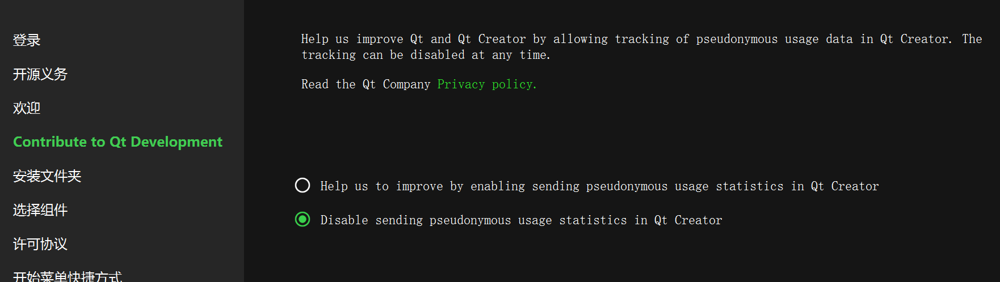

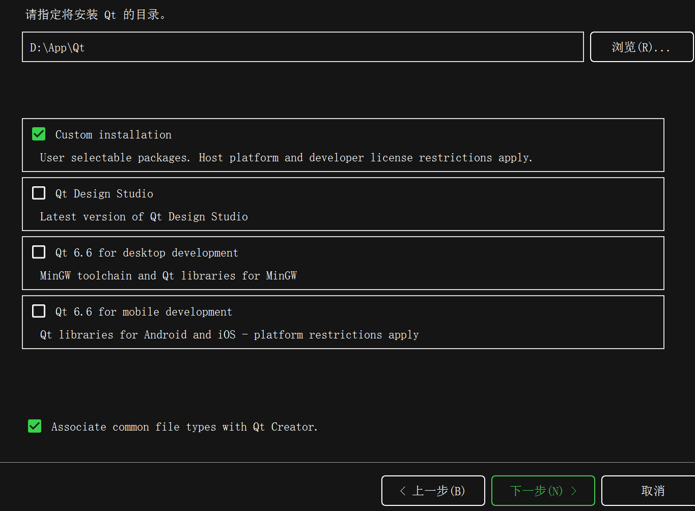

* 按需选择插件

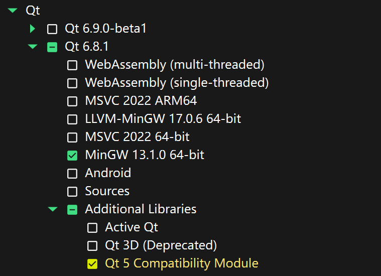

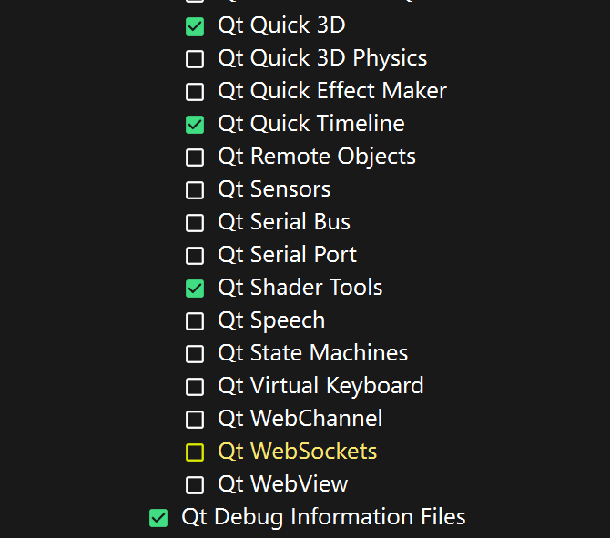

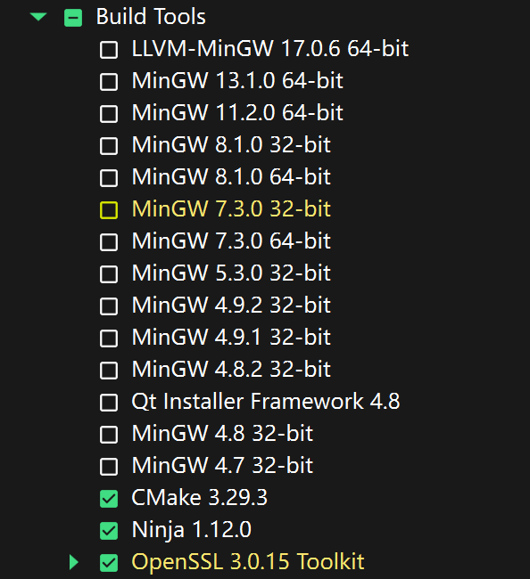

* 选择最后一个协议

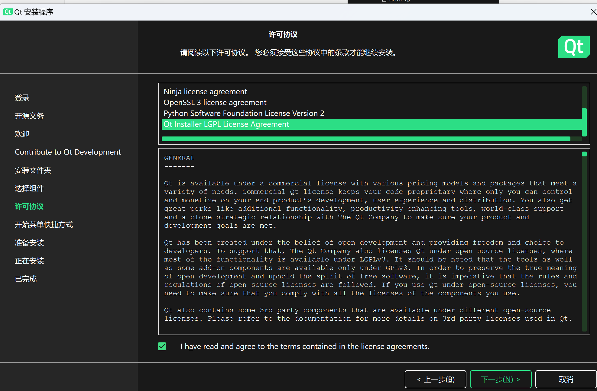

4. 后面需要安装插件时：根目录下会有一个维护程序，打开进行安装-同样需要换源


# 新建项目

1. Qt Widgets Application

2. * 项目名词 位置
   * 构建系统-qmake
   * Base class: QWidget
   * 语言-无
3. 减少警告

help - about plugins(关于插件) - c++ - 取消勾选clangcodemodel

4. 运行项目(忽略)

.pro文件是工程文件，qmake自动生成的用于生产makefile的配置文件

Qt的编译不能使用普通的make，先qmake预编译

* 工程目录下`qmake -project`创建.pro文件(比如hello.pro) 

* .pro文件目录下使用`qmake hello.pro (make)`或`qmake -tp vc hello.pro (nmake)`生成makefile

* 然后调用make或nmake进行编译 

我们使用的IDE所以不用手动操作了

# 使用技巧

## HTML解析

`QLabel *label = new QLabel("<h2><font color='red'>Hello</font>, world!<h2>");`

# GUI程序设计基础（暂时没整理）

.pro文件是工程文件，qmake自动生成的用于生产makefile的配置文件

```c++
#include <QApplication> 
#include <QLabel>  //头文件名也是类名

int main(int argc, char *argv[]) 
{ 
        QApplication app(argc, argv);  //创建一个QApplication对象-管理应用程序级别的资源
        QLabel *label = new QLabel("Hello, world!"); //创建一个QLabel对象
        label->show(); //使这个label可见，可以制定避免闪烁
        return app.exec(); //将应用程序的控制权移交给Qt
}
```

Qt的编译不能使用普通的make，先qmake预编译

工程目录下`qmake -project` 创建.pro文件(比如hello.pro) .pro文件目录下使用`qmake hello.pro (make)`或`qmake -tp vc hello.pro (nmake)`

生成makefile,然后调用make或nmake进行编译 我们使用的IDE所以不用手动操作了

修改一下

`QLabel *label = new QLabel("<h2><font color='red'>Hello</font>, world!<h2>");`

Qt也是支持HTML解析的


## 信号槽

```c++
#include <QtGui/QApplication> 
#include <QtGui/QPushButton> 
int main(int argc, char *argv[]) 
{ 
        QApplication a(argc, argv); 
        QPushButton *button = new QPushButton("Quit"); 
        QObject::connect(button, SIGNAL(clicked()), &a, SLOT(quit())); 
        button->show(); 
        return a.exec(); 
}
```

\#include <QtWidgets/QApplication>
\#include <QtWidgets/QPushButton> 替换开头的头文件才能用

QObject 是所有类的根。Qt 使用这个 QObject 实现了一个单根继承的 C++。它里面有一个 connect静态函数，用于连接信号槽。当一个按钮被点击时，它会发出一个 clicked 信号->执行实例a的quit函数 

clicked()就是一个信号，而 quit()就是槽

## 组件布局

这里使用了两个新的组件：QSpinBox 和 QSlider,以及一个新的顶级窗口 QWidget

QSpinBox 是一个有上下箭头的微调器，QSlider 是一个滑动杆

```c++
#include <QtWidgets/QApplication>
#include <QtWidgets/QWidget>
#include <QtWidgets/QSpinBox>
#include <QtWidgets/QSlider>
#include <QtWidgets/QHBoxLayout>

int main(int argc, char *argv[])
{
    QApplication app(argc, argv);
    QWidget *window = new QWidget;
    window->setWindowTitle("Enter your age");//设置窗口标题

    QSpinBox *spinBox = new QSpinBox;
    QSlider *slider = new QSlider(Qt::Horizontal);
    spinBox->setRange(0, 130); //setRange函数设置值的范围
    slider->setRange(0, 130);
	//信号槽链接
    QObject::connect(slider, SIGNAL(valueChanged(int)), spinBox, SLOT(setValue(int)));
    QObject::connect(spinBox, SIGNAL(valueChanged(int)), slider, SLOT(setValue(int)));
    spinBox->setValue(35);

    QHBoxLayout *layout = new QHBoxLayout; //水平布局，按照从左到右的顺序进行添加?
    layout->addWidget(spinBox); //添加组件,链接的信号槽?
    layout->addWidget(slider);
    window->setLayout(layout);//设置layout成我们定义的那样

    window->show();

    return app.exec();
}
```

Qt 一共有三种主要的 layout，分别是：

QHBoxLayout- 按照水平方向从左到右布局；

QVBoxLayout- 按照竖直方向从上到下布局；

QGridLayout- 在一个网格中进行布局，类似于 HTML 的 table。

## API文档的使用

左侧问好help里面就可以查看文档

第一个是帮助的帮助；第二个是 Qt Designer 的帮助；第三个是 Qt Linguist 的帮助；第四个是 QMake 的帮助;最后一个是 Qt 的 API 文档，在 QtCreator 中默认打开的就是这部分。

## 创建一个对话框

头文件

```c++
#ifndef FINDDIALOG_H 
#define FINDDIALOG_H 

#include <QtWidGets/QDialog> 
//声明类以免c++找不到
class QCheckBox; 
class QLabel; 
class QLineEdit; 
class QPushButton; 
//FindDialog，继承自 QDialog?
class FindDialog : public QDialog 
{ 
        Q_OBJECT   //这是一个宏,凡是定义信号槽的类都必须声明这个宏

public:   //声明构造和析构函数
        FindDialog(QWidget *parent = 0); 
        ~FindDialog(); 
signals:  //关键字,定义信号,两个信号
        void findNext(const QString &str, Qt::CaseSensitivity cs); 
        void findPrevious(const QString &str, Qt::CaseSensitivity cs); 
private slots:  //私有的两个槽,可以接收信号
        void findClicked();//为了slots的定义，我们需要访问FindDialog的组件，因此，我们把其中的组件定义为成员变量以便访问
        void enableFindButton(const QString &text); 
private: 
        QLabel *label; 
        QLineEdit *lineEdit; 
        QCheckBox *caseCheckBox; 
        QCheckBox *backwardCheckBox; 
        QPushButton *findButton; 
        QPushButton *closeButton; 
}; 

#endif // FINDDIALOG_H
```

源代码

```c++
#include <QtWidGets> 
#include "finddialog.h" 

FindDialog::FindDialog(QWidget *parent) //构造函数有参数初始化列表，用来调用父类的构造函数?
        : QDialog(parent) //所有使用了Q_OBJECT宏的类都自动具有tr()函数
{ 
        label = new QLabel(tr("Find &what:")); //tr()全称QObject::tr(),被它处理的字符串可以使用工具提取出来翻译成其他语言
        lineEdit = new QLineEdit;  //字符串中的&代表快捷键,会生成Find字符串,当你按下Alt+W的时候，这个按钮就相当于被点击
        label->setBuddy(lineEdit); //当label获得焦点时,它的焦点会自动传给它的buddy(伙伴):lineEdit

        caseCheckBox = new QCheckBox(tr("Match &case")); 
        backwardCheckBox = new QCheckBox(tr("Search &backford")); 

        findButton = new QPushButton(tr("&Find")); // alt+f
        findButton->setDefault(true); 
        findButton->setEnabled(false); //把默认的按钮设为findButton,把findButton设为不可用

        closeButton = new QPushButton(tr("Close")); 
	//连接信号槽 connect()函数也是QObject的
        connect(lineEdit, SIGNAL(textChanged(const QString&)), this, SLOT(enableFindButton(const QString&))); 
        connect(findButton, SIGNAL(clicked()), this, SLOT(findClicked())); 
        connect(closeButton, SIGNAL(clicked()), this, SLOT(close()));  

        QHBoxLayout *topLeftLayout = new QHBoxLayout; 
        topLeftLayout->addWidget(label); 
        topLeftLayout->addWidget(lineEdit); 

        QVBoxLayout *leftLayout = new QVBoxLayout; 
        leftLayout->addLayout(topLeftLayout); 
        leftLayout->addWidget(caseCheckBox); 
        leftLayout->addWidget(backwardCheckBox); 

        QVBoxLayout *rightLayout = new QVBoxLayout; 
        rightLayout->addWidget(findButton); 
        rightLayout->addWidget(closeButton); 
        rightLayout->addStretch(); 

        QHBoxLayout *mainLayout = new QHBoxLayout; 
        mainLayout->addLayout(leftLayout); 
        mainLayout->addLayout(rightLayout); 
        setLayout(mainLayout); 

        setWindowTitle(tr("Find")); //标题
        setFixedHeight(sizeHint().height()); //固定高度 sizeHint()返回“最理想”的大小，这里我们使用的是 height()函数去到“最理想”的高度。
} 
FindDialog::~FindDialog() 
{ 

} 
//槽
void FindDialog::findClicked() 
{ 
        QString text = lineEdit->text(); //取出输入值
        Qt::CaseSensitivity cs = caseCheckBox->isChecked() ? Qt::CaseInsensitive : Qt::CaseSensitive;//判断caseCheckBox是否选中,选中则返回Qt::CaseInsensitive，否则返回 Qt::CaseSensitive
        if(backwardCheckBox->isChecked()) {  //如果 backwardCheckBox被选中，就 emit(发出)信号 findPrevious()，否则 emit信号 findNext
                emit findPrevious(text, cs); 
        } else { 
                emit findNext(text, cs); 
        } 
} 
//enableFindButton()则根据 lineEdit 的内容是不是变化——这是我们的 connect 连接的——来设置findButton 是不是可以使用
void FindDialog::enableFindButton(const QString &text) 
{ 
        findButton->setEnabled(!text.isEmpty()); 
}
```

main.cpp

```c++
#include <QApplication>

#include "widget.h"

int main(int argc, char *argv[])
{
    QApplication app(argc, argv);
    FindDialog *dialog = new FindDialog;
    dialog->show();
    return app.exec();
}
```


# 开始（没整理）

widget.cpp:窗口属性,添加控件写在这个文件的构造函数中

修改窗口标题:

乱码:工具-选项-文本编辑器-行为-默认编码-UTF-8

设置窗口大小:可以拉伸/不可拉伸 

    this->setWindowTitle("OpenChatRoom");
    this->resize(800,600);
    this->setFixedSize(500,500);

按钮

\#include <QPushButton>

```c++
QPushButton *button=new QPushButton;
//button->show(); 会在外面,没有嵌进去
//设置按钮的父对象为窗口
button->setParent(this);
//合在一起
QPushButton *button2=new QPushButton("Log In",this);

//设置属性
button->setText("Log In");
button->move(400,500);//位置
button->setFixedSize(100,50);//大小
```

信号与槽

```c++
//信号发出者，信号，信号接收者，接收信号后执行的任务（槽函数）
connect(button,&QPushButton::clicked,this,&Widget::close);//点击关闭，自带的关闭和点击函数

signals://信号，返回值void，可以有参数，可以重载
	void hungery();
public slots：//槽函数，返回值void，可以写到其他地方，可以有参数，需要声明并实现，可以重载
	void treat();
	
void Student::treat(){  qDebug()<<"请吃饭"; }
//打印
#inlcude<QDebug>
 qDebug()<<" ";
 
 //实现
 //widget.h
 Teacher *tea;
 Student *stu;
 void ClassOver();
 //widget.cpp
 this->tea=new Teacher(this);//指定父对象,回收时自动释放
 this->stu=new Student(this);
 connect(tea,&Teacher::hungry,stu,&student::treat);
 ClaseOver();//触发信号
void Widget::ClassOver(){
	emit teacher->hungry();  //发出信号
}
//点击按钮触发信号
connect(button,&QPushButton::clicked,this,&Widget::ClassOver);
//或者
connect(button,&QPushButton::clicked,tea,&Widget::hungury);
//重载，需要函数指针指向函数地址
void hungery(QString food);//treat也有参数
void Widget::ClassOver(){
	emit teacher->hungry("abc");  //发出信号
}
void(Teacher::*a)(QString)=&Teacher::hungury;
void(Student::*b)(QString)=&Student::treat;
connect(tea,a,stu,b);
ClassOver();
//Qstring输出带有""转化为不带 <<str.toUtf8().data();有空格,qDebug().nospace()<< 没有
```

自定义信号与槽 新建类继承于QObejct(槽函数全局,lambda除外)

槽函数可以比信号少,与信号参数顺序也需要一致

一个信号对应两个槽->登录-成功-失败

lambda表达式 ()里面可以写参数,省去写函数的部分,节省时间

```c++
QPushButton * b1=new QPushButton ("点击",this);
    connect(b1,&QPushButton::clicked,this,[=](){
    qDebug()<<"按钮被按下";
    }
            );
```


记事本部件

##资源文件

ctrl+n  Qt-Qt source file-前缀/-添加图片

可以起别名

```c++
	QPixmap pix=QPixmap(":/image/d2.png").scaled(this->size());//设置大小
    //pix.load(":/image/d2.png");//没有设置大小
    QPalette palette;
    palette.setBrush(QPalette::Window,QBrush(pix));//QPalette::Background
    this->setPalette(palette);
```

给菜单项增加图片

增加背景图片


QMainWindow

.ui

ui

状态栏显示发送成功


对话框

```c++
    QDialog dialog;
    dialog.setWindowTitle(tr("Hello"));
    dialog.exec();//模态对话框（只能操作对话框）
    dialog.show();//非模态对话框（不会阻塞）     一闪而过，这是在栈上创建的
//在堆上创建
    QDialog *dialog=new QDialog;
    dialog->setAttribute(Qt::WA_DeleteOnClose);//自动销毁，不占用内存
    dialog->setWindowTitle(tr("Hello"));
    dialog->show();
```

标准对话框（内置）

```
QColorDialog 选择颜色
QFileDialog 选择文件/目录
QFontDialog 选择字体
QInputDialog 允许用户输入一个值，并且返回
QMessageBox 模态对话框，用于显示信息，询问问题等
```

按钮pushbutton

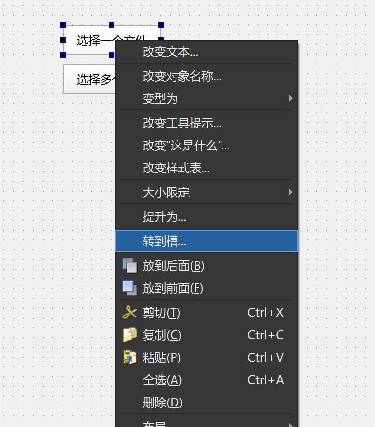

plain text edit 文本编辑器

```c++
//选择文件，并且输出文件地址
void MainWindow::on_pushButton_clicked()
{
    QString fileName=QFileDialog::getOpenFileName(this,tr("打开文件"),"./",tr("Images(*.png *.xpm *.jpg);;Text(*.txt)"));
    if(!fileName.isEmpty()){
        ui->plainTextEdit->appendPlainText(fileName);
    }
}
```


选择多个文件p43

颜色对话框

```c++
void MainWindow::on_pushButton_2_clicked()
{
    QPalette pal=ui->plainTextEdit->palette();//获取现有palette
    QColor iniColor = pal.color(QPalette::Text);//现有文字颜色
    QColor color= QColorDialog::getColor(iniColor,this,"选择颜色");
    if(color.isValid()){
        pal.setColor(QPalette::Text,color);
        ui->plainTextEdit->setPalette(pal);//设置编辑器文字颜色
    }
}
```

选择字体对话框

消息对话框

输入对话框

## 布局管理器

绝对定位：需要提供组件长高，坐标  如果改变窗口大小，其位置大小不变-需要设置固定大小

布局定位：需要指定使用哪种布局 使用上方widget的布局

标签Label

Line Edit

增加弹簧，并且水平布局

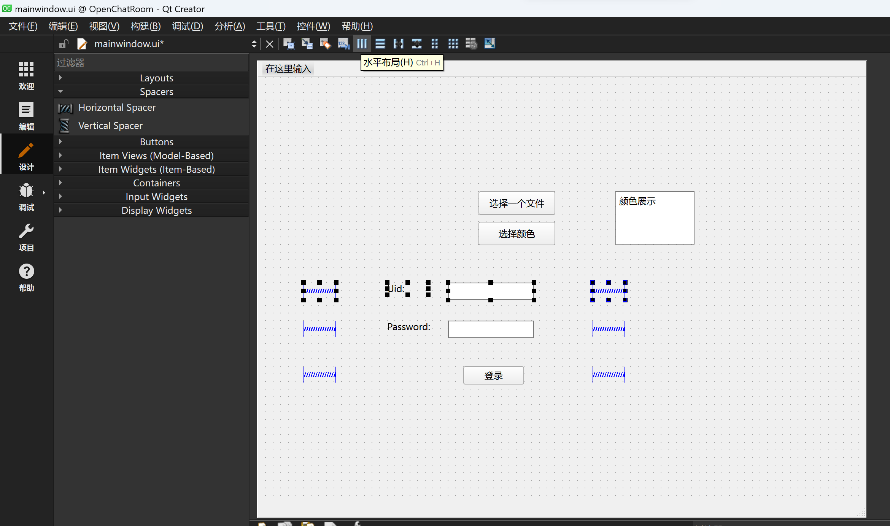

解除布局后可以进行调整

##切换主界面

添加-Qt-Qt 设计师类-父类选择widget，就增加了一个ui

\#include "login.h"

LogIn l;
l.show();

一下子展示两个页面

wiget.h中包含新界面的头文件

private中新建  LogIn *new_window;

```c++
this->new_window=new LogIn();
    connect(ui->pushButton,&QPushButton::clicked,this,[=](){
        this->hide();
        this->new_window->show();//想要登录后释放之前的界面？
    });
```

新界面返回主界面

```c++
//LogIn.h
signals:
    void back(void);
//LogIn.cpp
connect(ui->pushButton,SIGNAL(clicked(bool)),this,SIGNAL(back()));
//wiget.cpp
connect(this->new_window,&LogIn::back,this,[=](){
        this->new_window->hide();
        this->show();
    });
```

##标签

\#include<Qlabel>

```c++
    QLabel *l=new QLabel(this);
    l->setText("这是OpenChatroom");
```

```c++
#include <QLineEdit>
    QLineEdit *e=new QLineEdit(this);
    e->setText("请输入6位数字");
    //获取ui编辑框内的内容
    QString str=ui->lineEdit->text;
    qDebug()<<str;
    //获取代码创建框内的内容
    QString str=e->text();
    qDebug()<<str;
//设置输出模式
    e->setEchoMode(QLineEdit::Password);//显示圆点
	NoEcho//不显示
    PasswordEchoEdit//正在输入时显示，输完不显示
//设置输出左，上，右，下的距离
        e->setTextMargins(0,0,0,0);
```

自定义控件-经常用到的页面进行展示

栈容器：点击一个菜单显示一个界面

## 事件

鼠标按下，释放，移动

点击标签，做出动作deng

# 打包

项目开发中用debug，但是发布时用release，会对项目进行优化

前提：配置qt环境变量D:\App\Qt\6.2.4\mingw_64\bin

1. 编译release版本，生成包-后缀为Release

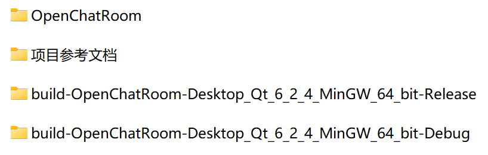

2. 打开Release文件-release-复制.exe文件到桌面一个新的文件夹里面
3. 利用qt bin文件夹下的工具"D:\App\Qt\6.2.4\mingw_64\bin\windeployqt.exe"来找出程序需要的所有动态库
4. 在新文件夹里面打开终端  D:\App\Qt\6.2.4\mingw_64\bin\windeployqt.exe .\OpenChatRoom.exe 得到绿色版
5. 下载打包工具Inno Setuphttp://www.jrsoftware.org/isdl.php#stable
6. 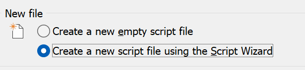ok
7. next-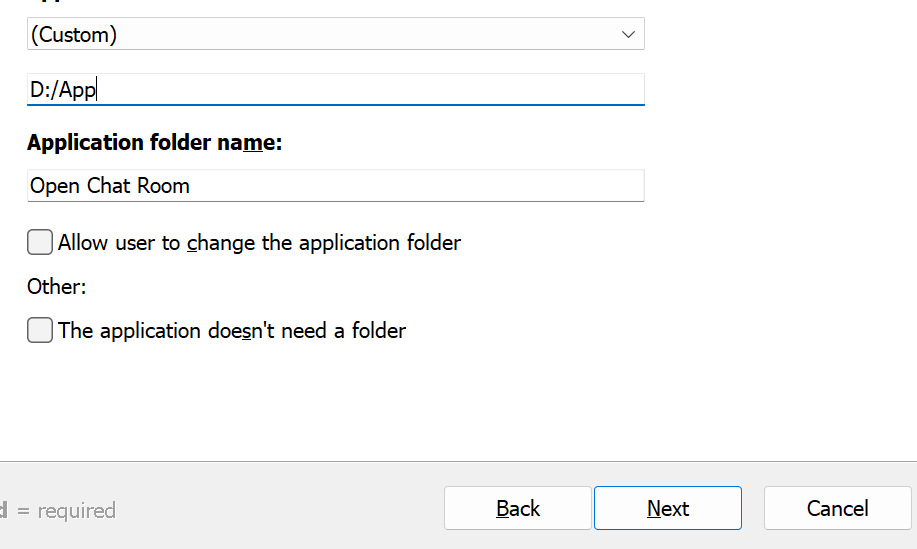安装目录
8. 打包程序的文件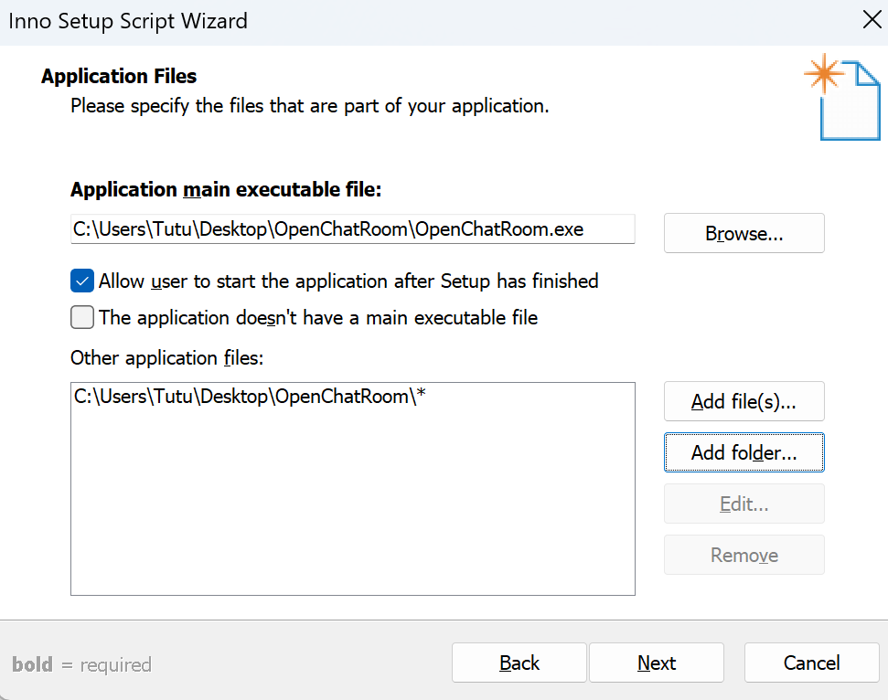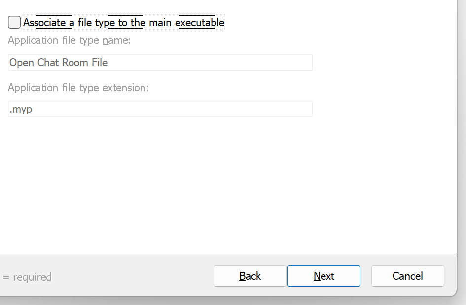-next-next-next-next
9. 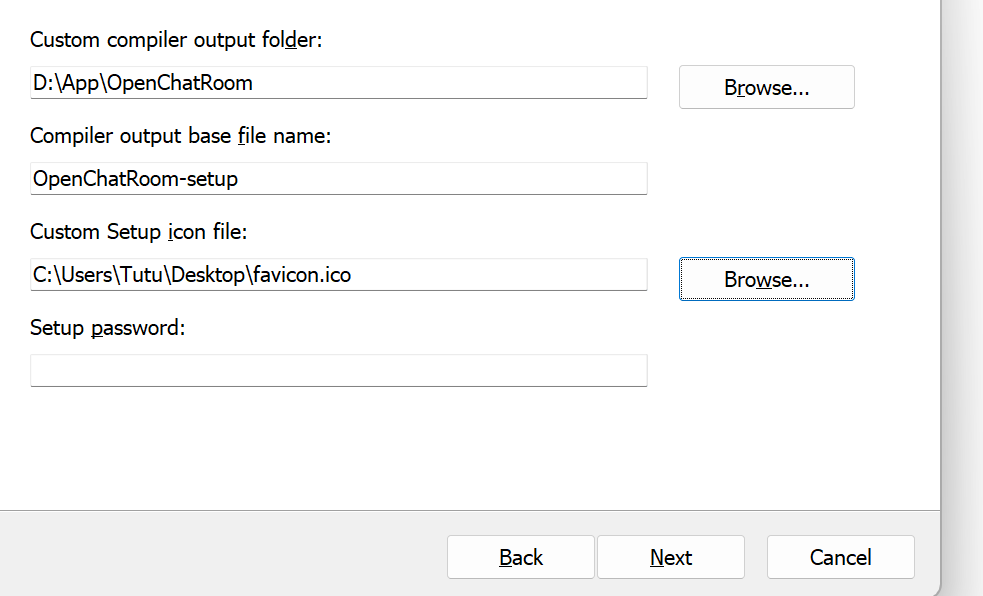安装包所在目录 安装包名称 图标位置(安装包的图标)
10. 不要配置qt的环境变量,配置了在自己机器上面可运行,别的机器不能运行,找不到动态库：看缺哪些,去qt文件夹里面去搜索,把缺少的手动复制到需要打包的文件夹里面
11. 不配置环境->桌面文件夹找全动态库->再打包安装包  如果没有找全就打包,可找全后直接打开保留的.iss文件运行一遍即可