# BTC-比特币

## BTC中的密码学原理

比特币中主要用到了密码学中两个功能：1.哈希 2.签名。

密码学中的哈希函数（cryptographtic hash function） 

一、哈希函数 哈希函数主要有三个特性：

1、碰撞特性（collision resistance）；2、隐秘性（Hiding）；3、谜题友好（puzzle friendly）。 1、collision resistance collision resistance 。假设输入x1，哈希值为H(x1)，几乎不能找到一个x2，使得H(x1)=H(x2)即很难产生哈希碰撞。所以可以通过计算哈希值检测内容是否被篡改。 

2、Hiding hiding 意思是哈希函数的计算过程是单向的，不可逆的。但前提要满足输入空间足够大，且输入的分布比较均匀，各种取值的可能性都是差不多的。通常我们在实际操作中会使用添加随机数的方法。假设给定一个输入值X，可以算出哈希值H(x)，但是不能从H(x)推出X。 

3、puzzle friendly  哈希值的结果事先不可预测，不能通过一个输入预测其哈希值，想要计算出的哈希值落在某个范围只能遍历计算。

比特币挖矿：就是遍历寻找一个nonce和区块中的块头一起计算出一个哈希值小于等于一个指定的目标阈值-工作量证明，挖矿难，验证简单。

比特币使用的哈希函数为SHA-256，满足上述三个性质

二、签名 

比特币开户：使用非对称加密的方式即本地生成一个私钥和公钥，私钥本地保存，公钥公开，公钥相当于卡号，私钥相当于密码。使用私钥给交易加上签名（证明是账户本人交易），验证签名用公钥。以此来确保比特币的安全传输。

至今没有生成完全一样的两个公钥和私钥，前提，产生公私钥有一个好的随机源，签名也要有好的随机看源。

随机源的确定？签名和生成公私钥的算法？

## BTC-数据结构

1. 链表

链表中的节点为每个区块，第一个叫创世纪块，指针为上一个区块的哈希值

2. Merkle tree（二叉树的基础上指针为哈希）

最下面(叶子节点)是数据块，内部节点都是哈希指针
只要有根哈希值(对根节点取哈希的哈希值)，就能检测任何位置的修改-牵一发而动全身
每个区块所包含的交易组织成一个Merkle tree的形式，每个数据块-叶子节点包含一个交易
每个区块分为块头和块身
块头：只有根哈希值
比特币的节点包含全节点和轻节点，全节点包含所有信息块头和块身，轻节点只保存块头
Merkle proof：证明交易存在，从交易所在数据块一直到根节点的路径

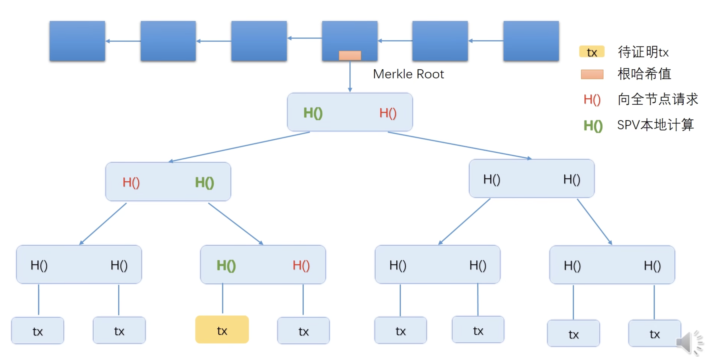

轻节点向全节点发送请求，请求能证明交易的Merkle proof，全节点只需要把图中红色的哈希值发送给轻节点，如果叶子节点有n个，Merkle proof复杂度为log(n)

证明交易不在？知道整个块数据的前提下计算每个数据块的哈希，复杂度为n，更快？在数据块的哈希值是有序排列的前提下，二分查找，找到该交易左右的两个数据块，然后验证两个数据块的Merkle proof，成立则代表交易不在该区块中，复杂度log(n)
排好序的叫sorted Merkle tree，比特币中不要求排序，没必要

## BTC-协议

* 传统中心化发行货币
  ==双花攻击==：非对称加密公私钥发行货币：货币可复制，文件内容一致
  给数字货币加编号，并记录在谁手中：这是中心化的，交易需要经过央行

比特币中两个问题：*如何发行货币？如何验证交易的有效性？*

简易的交易示意图：


每个交易有两个指针，一个是上一个节点的哈希，一个是发起者钱的来源(证明其拥有这个钱)
整条链都需要知道A的公钥，通过验证签名证明交易合法。

*如何避免伪造交易的？*
如果有人冒名，伪造一个交易，用自己的公钥说是A的公钥，然后用自己的私钥去签名，所以需要从铸币(第一个交易)开始去验证A的公钥是否一致。

*验证方式？*
每一个交易是用当前的输入脚本拼接前一个的输出脚本来验证交易合法的。

**区块组成**：

* 块头：
  协议版本
  前一个块头的哈希
  根节点哈希
  目标阈值
  随机数
* 块身：
  交易列表

### 共识机制

*当多个节点记录的账本不一样，如何对账本的内容取得分布式共识，承认某个账本的有效性？*

> 如果一个分布式系统，网络传输是异步的，网络传输的时延没有上限，只要一个节点有问题，那么就无法达成共识
> 一个分布式系统最多满足三个想要的性质中的两个(一致性，可用性，分区容错性)

**BTC中的共识协议**-对去中心化的账本产生共识

有些节点有恶意，假设大多数是好的，如何设计共识协议？

1. 直接投票：如果是投票将交易加入到区块链，存在==女巫攻击==，一台超级计算机产生过半的账户来控制投票
2. 按照计算力投票：谁计算出随机数就有记账权，并遵循最长合法链原则，如果两个同时获得记账权，会维持一段时间直到其中一个分叉胜出

**出块奖励**：获得记账权的节点，在发布的区块里可以有一个特殊的交易，铸币交易，可以发行比特币，最开始一个区块可以产生50个BTC，协议规定21万个区块之后奖励减半

需要提前写好账本的内容然后去计算随机值，那么账本的内容如何确定，自己随意事前填写吗？那别人的比特币交易又是如何写进去的呢？

## BTC-实现

比特币中的全节点需要维护一个UTXO的数据结构，所有没有被花掉的交易的输出，一个交易可能有多个输出也就是一个账户给多个账户转账，比如A给B，C转账，但是B花掉了，那么A->B的输出就不在UTXO中，所以全节点相当于去中心化的中心防止双花

交易补充

> 除了出块奖励，发布区块的节点可以从打包的交易中获取交易费
> 21万个奖励减半，大概十分钟出一个块，差不多四年的时间出块奖励就会减半

每隔2001个区块需要调整挖矿的难度，保障10分钟出一个区块

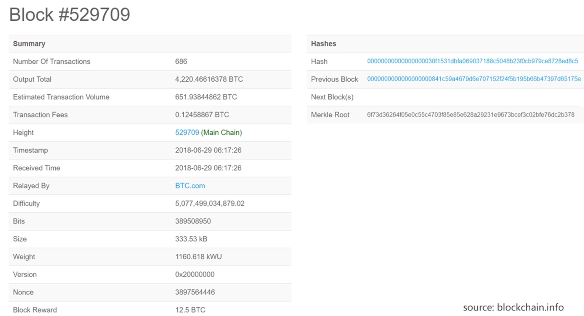


目标阈值是定期更改的，但是Nonce的值有取值范围，就算所有值都取也跟不上难度的调整，所以其中的时间time可以有一定调整，根哈希值也是可以调整的，调整方式，在铸币交易中存在一个CoinBase这里面的内容是可以随意写的，因为铸币交易没有交易来源

当交易刚刚被写进区块叫做一个确认，一般多等几个确认/区块，一般为6个确认才认为交易是不可篡改的，交易发出但是没有被写入区块叫做0个确认，实际上0个确认就被认为是可靠的

## BTC-网络

应用层：运行区块链
网络层：节点之间使用P2P协议可以绕过防火墙，可以从种子节点获取信息

一个节点收到消息会发给邻居节点，一个节点收到消息会记录下次不会接受，邻居节点的选取是随机的

## BTC-挖矿难度

使用哈希算法SHA-256，输出空间为2的256次方 

挖矿难度与目标阈值成反比

如果出块时间太快，分叉可能性更大，分叉可能更多，导致安全性越差，不利于共识机制，更容易用更少的算力达成区块链的分叉攻击

2016个区块调整一次阈值，大概14天，目标阈值调整为=原来的阈值*实际挖矿时间/目标挖矿时间，最多减小4倍，由代码自动调整

## BTC-挖矿

**全节点**

* 一直在线
* 本地硬盘维护完整的区块链信息
* 内存中维护UTXO集合，方便快速验证交易的合法性
* 监听交易信息，验证交易合法性
  签名合法
  有无双花
* 决定哪些交易打包到区块中
* 监听别的矿工挖出的区块，验证合法性
  每个交易合法
  铸币的奖励 
  难度要求是否符合
* 每两周调整难度
* 挖矿
  决定往哪一条分叉，最长与先收

**轻节点**

* 不是一直在线
* 只保存块头，比全保存小1000倍
* 只保存与自己相关度交易，也只能检验与自己交易相关的合法性
* 无法检测网上发布区块的正确性，因为不能检验其中的交易
* 能验证挖矿的难度
* 只能检测哪个最长，不知道哪个是最长合法链，因为无法验证其中交易的合法

当全节点挖矿时，收到一个新的区块，验证合法性后接入并停止现在的挖矿马上重新组装区块进行挖矿，这并不可惜，因为每时每刻挖到的概率是一样的-memoryless

挖矿从CPU到GPU，到ASIC芯片(只为了挖矿设计的)挖矿，一般设计的时候需要抗ASIC，使得适合通用计算机

很多个节点可以组成集群，一个全节点用来专门维护功能，包括校验，组装区块等，其他节点专门挖

*假如一个矿池拥有百分之50以上的算力，可以发起哪些攻击？*

1. 分叉攻击-用一条更长的分链替代现有链
2. 封锁攻击-不让某个账户的交易上链

## BTC-比特币脚本

一个交易包含的内容：

* 可以多个输入-该交易中使用的币是来自哪一个交易的输出
* 可以有多个输出，输出会放到UTXO
* 输入脚本-脚本语言为堆栈
* 输出脚本-对应多个输出

**P2PKH**（常用）：

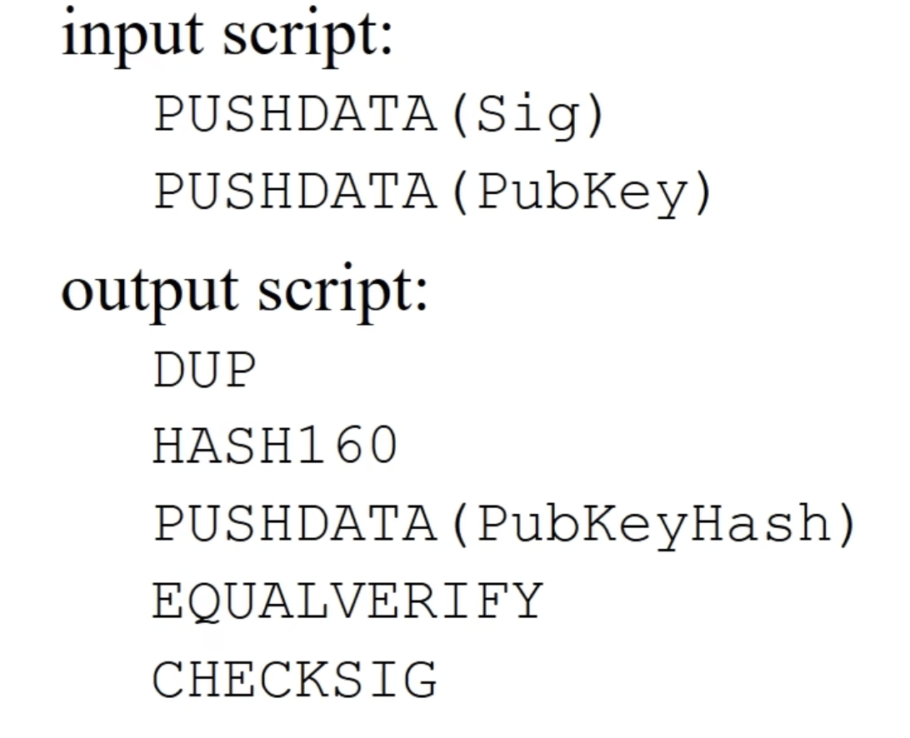

UTXO中的数据

```
{
   txid: "上一笔交易的哈希",
   vout: 1,
   value: 100000000,   # satoshi
   scriptPubKey: "OP_DUP OP_HASH160 <pubKeyHash> OP_EQUALVERIFY OP_CHECKSIG"
}
scriptPubKey存的是一个交易中的输出脚本
```

比如A给B转账，花费的是UTXO中A收到比特币，会使用其中的脚本

输出脚本：-证明这个币是给B的
OP_DUP OP_HASH160 <B_pubKeyHash> OP_EQUALVERIFY OP_CHECKSIG
输入脚本：-证明这个币是A花的
scriptSig = <A_signature> <A_pubkey>

过程：
入栈，stack = [A_signature, A_pubkey]
复制公钥：stack = [A_signature, A_pubkey, A_pubkey]
栈顶元素哈希：stack = [A_signature, A_pubkey, hash160(A_pubkey)]
入栈，stack = [A_signature, A_pubkey, hash160(A_pubkey), B_pubKeyHash]
比较：Tx1.output.pubKeyHash==hash160(A_pubkey) 证明币确实是A的
verify(A_signature, A_pubkey, tx_dat) 验证签名证明不是别人伪造的公钥
[true]

**P2SH**

收款人给出的是一个赎回脚本的哈希，交易的时候输入需要给出赎回脚本的具体内容
验证之后还需要执行赎回脚本的内容进行验证，赎回脚本有多种，比如上述的P2PKH

**多重签名**(现在已经没有使用)

多重签名，要求输入需要给出多个签名，并确定需要多少其中多少个签名通过才能交易

**P2SH实现多重签名**

输出脚本只需要赎回脚本的哈希值

**Proof of Burn**

销毁脚本，表示这个输出已经不能用了，可以利用这个性质来记录信息

那如果一个交易中没有花完的钱如何处理？转给自己吗

## BTC-分叉

state fork：分叉攻击或者同时收到新区块

protocd fork：协议升级
硬分叉：比如区块大小修改，1MB每秒钟大概7个交易，会产生永久的硬分叉，为了解决分叉带来的影响会有一个chain id
软分叉：比如1MB改为0.5MB，旧链条也会觉得新节点是正确的，所以新旧节点都可以沿着新链的区块挖，所以是临时的。比如更新P2SH

## 思考

**哈希指针**

其实哈希指针就是一个哈希值，全节点存储数据块，使用key-value存储，level DB

**区块恋**

私钥分为多份，会降低安全性，使得暴力破解变容易很多
多人账户可以使用多重签名，每个人一个私钥

**分布式共识**

比特币理论上没有达到真正的共识，而实际中能达到共识

**量子计算**

量子计算的使用遥遥无期，并且首先冲击的是传统金融业，并且哈希算法不可逆，因为会对原本的数据有损失，而非对称加密可能通过量子计算机破解，逆哈希不行，比特币中可以不公布公钥，使用公钥的哈希

# ETH-以太坊

出块时间为十多秒

去中心化的货币到去中心化的合约，保证合同生效，不可篡改

## ETH-账户

> 比特币交易需要将钱花完，需要将剩余的转给自己

优点：

系统中显示记录每个账号有多少以太币，交易中不必说吗币的来源，也不用转给自己，对双花攻击有天然防御

缺点：

==重放攻击==：收币的人，再网络中再次发起收到的交易，实现两次相同转账

用一个计数器记录nonce账户所有的交易，用签名保护，也就是维护账号的状态，重放攻击时计数器一致

外部账户：公私钥管理，余额+nonce

合约账户：无法主动发起交易，code+storage。合约的要求需要稳定的身份

## ETH-状态树

状态：40个16进制数=20字节=160bits

trie字典树

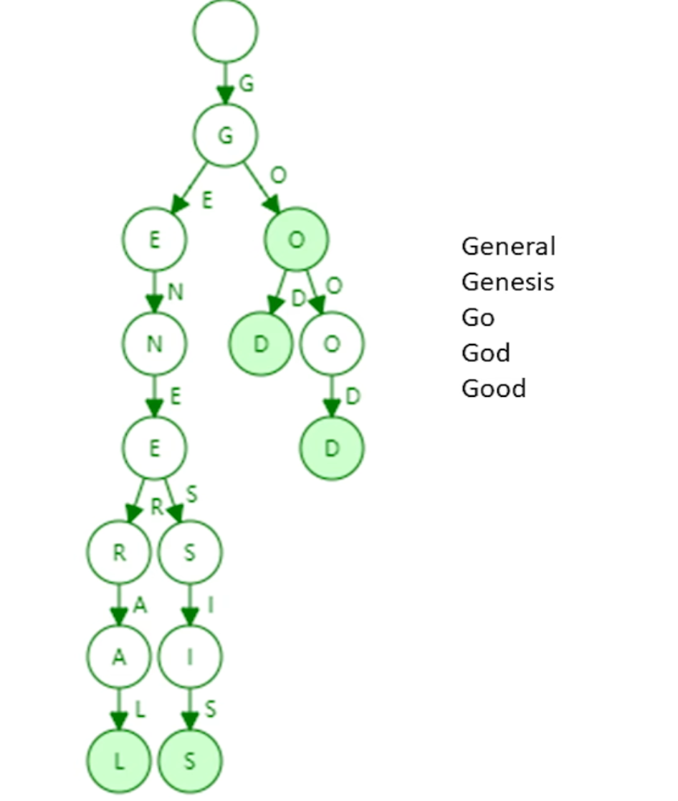

Patricia tree

经过路径压缩

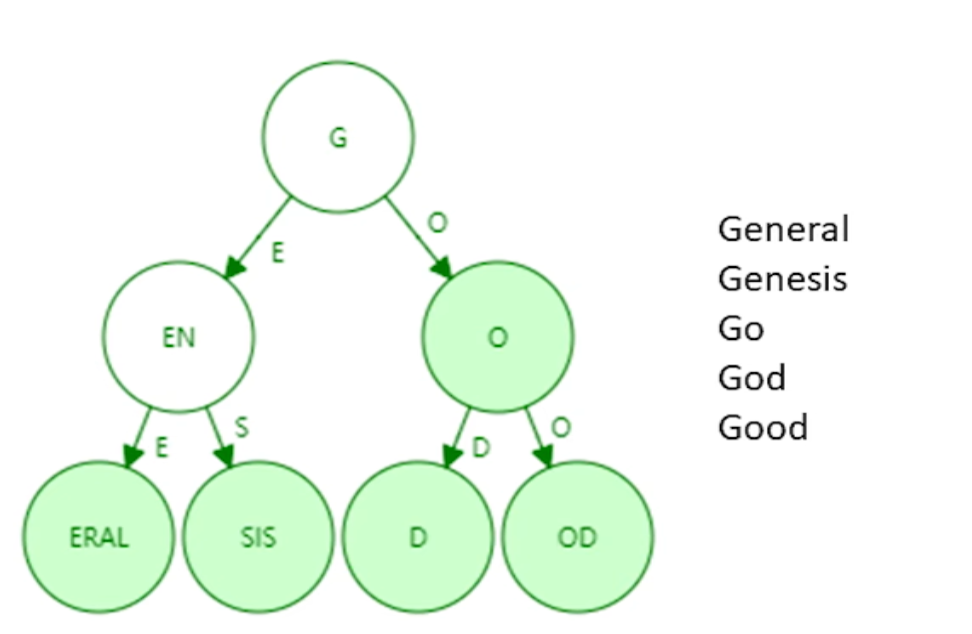

MPT-MerklePatriciaTree

普通指针换成哈希指针

状态树存储的是键值对
其中值通过RLP序列化后存储

一个简单的描述

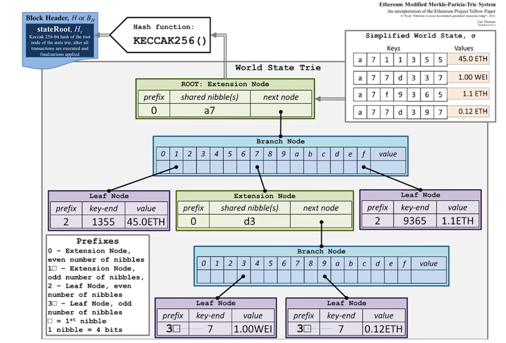

如果有账户发生变动只有所在分支会改变，其他内容会共享

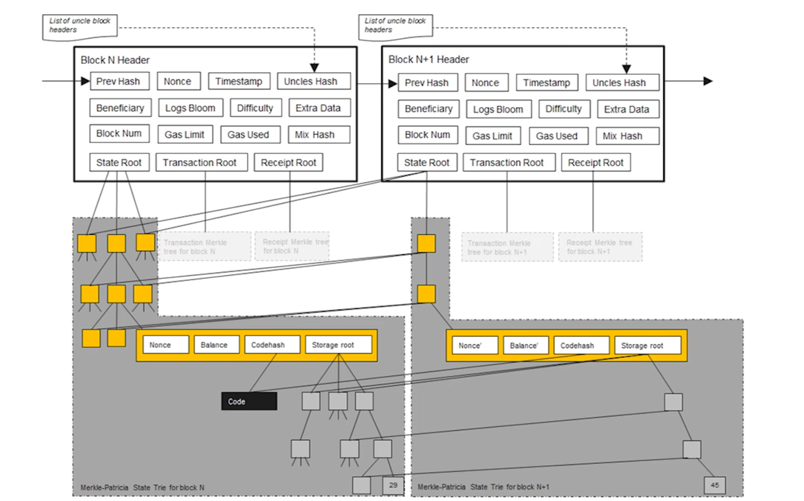

全节点中每收到一个区块就会新增一个MPT，并保留所有历史的MPT，方便有分支的时候直接回滚


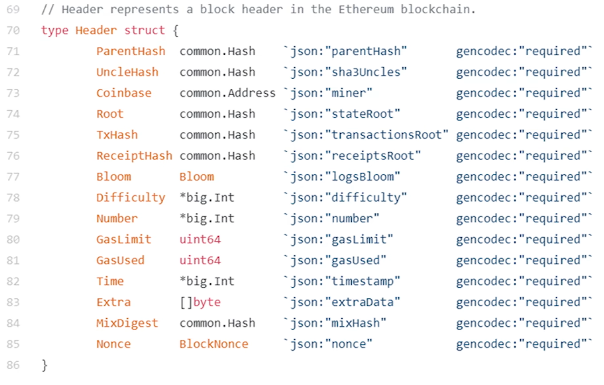

块头数据结构：
前一个块的块头哈希值
叔父区块的块头哈希值
矿工地址
状态树根哈希值
交易树的根哈希值
收据树的根哈希值
Bloom过滤器
挖矿难度
汽油费相关
汽油费相关
产生时间
挖矿相关，根据随机数进行一些计算算出的哈希值
挖矿中的猜测的随机数


区块结构

指向块头的指针
指向叔父区块的指针数组
交易列表


## ETF-交易树和收据树

都是MPT

证明某个交易的执行结果-收据树

* 查找过去10天与某个智能合约相关的交易

bloom filter 布隆过滤，可以证明某个元素不在集合中，不支持删除操作-由于哈希碰撞，将位置的标记改为计数器，但是会变复杂

每个交易会形成一个收据，收据中包含一个bloom filter ，记录交易类型，地址等信息，块头也有一个总的bloom filter，所有交易的bloom filter的并集

先查哪个块头的bloom filter有我要的类型，确认该区块是否含有相关交易，然后去找里面交易的bloom filter，最后确认

> 通过bloom filter可以快速过滤掉很多不要的区块

状态树需要保存系统中所有账户的状态

## ETH-GHOST

以太坊中的共识机制

出块时间很短，十多秒，对于共识机制的设计是一种挑战

GHOST：挖出块之后后面被废弃了也可以得到一些安慰奖，这些区块叫uncle block ，得到7/8的出块奖励，如果当前区块包含了叔父区块，可以额外获得1/32的奖励，一个区块最多包含两个叔父区块

问题：发布下一个区块时包含了当前的兄弟区块 

包含的叔父区块不一定与父亲同辈，多一辈则一次减少 6/8 5/8  直到2/8，以此鼓励尽早包含叔父区块，但是包含叔父的奖励不变都是1/32

叔父区块得不到汽油费，叔父区块中的交易是否需要包括，因为兄弟区块包含的交易可能冲突

如果叔父区块后面跟了子区块？都不算，不能得到奖励，鼓励分叉后进行合并

## ETH-挖矿算法ethash

1. 先生成一个16M的cache，cache中的每个元素都是64字节的哈希值，第一个元素是seed的哈希，后续的元素都是前一个元素都哈希，每隔30000个区块重新生成seed，对前一个seed哈希，并重新生成cache ，并且cache的大小需要增大原来的1/128
2. 通过cache生成1G的dataset，叫DAG，每隔30000增大1/128，按照伪随机的算法读取cache中的256个数，每次读取的位置是通过上一个位置经过计算得到

全节点验证需要，header，nonce，full_size，DAG
轻节点验证需要，header，nonce，full_size，cache
挖矿：full_size，DAG，header，target，不断尝试nonce，看最后是否小于target

## ETH-挖矿难度调整

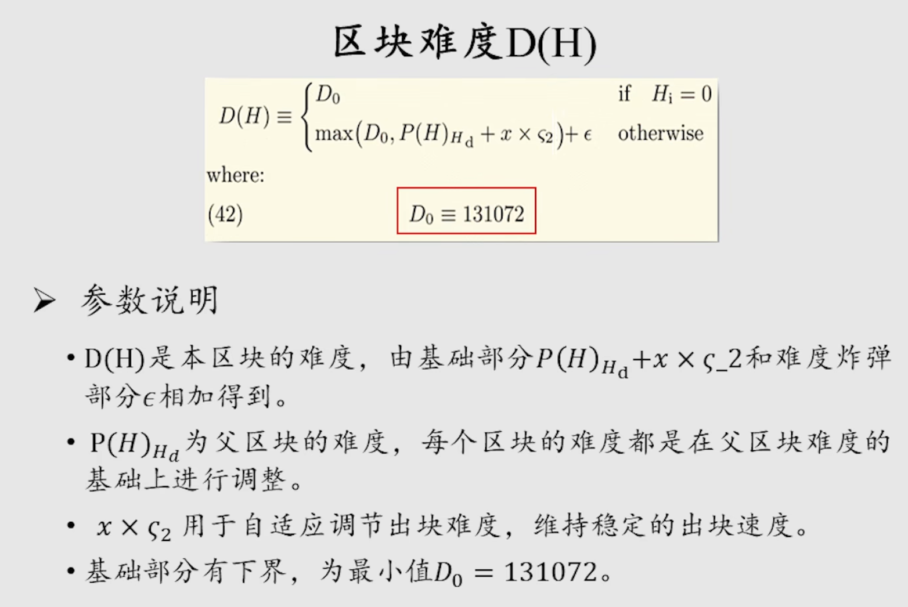

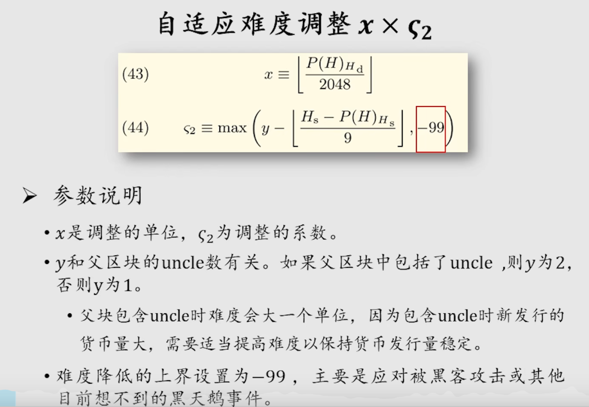

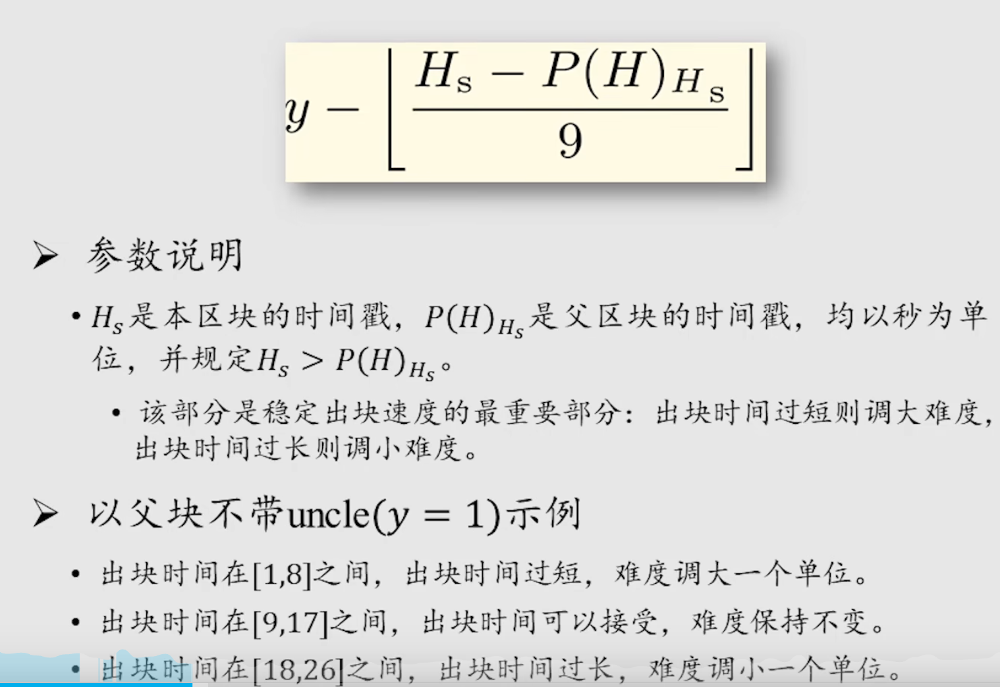

 难度炸弹：
开始以出块时间为主要影响难度因素，难度炸弹是指数增长，后续影响大，难度增加，为了硬分叉从工作量证明到向Pos协议-权益过度，但是Pos协议一直没有开发出来，索引后续发生一次回调难度炸弹

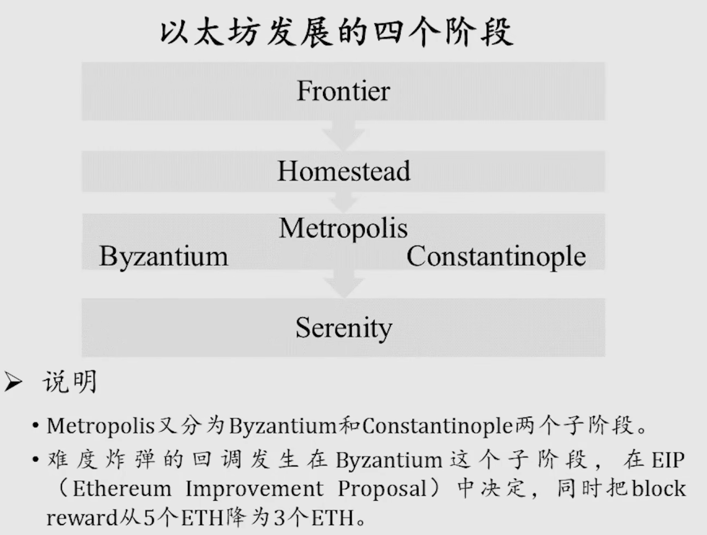

## ETH-权益证明

工作量证明很费电，一个交易需要1000度电，一年产生60亿的价值，用掉35亿的电

权益证明也相对更安全，按照你有多少这个币种的币，如果需要攻击需要买一半，大量买也会导致币的价格上升

Casper the Friendly Finality Gadset （FFG）

50个区块一个epoch，每个epoch结束一轮投票，连续两个epoch都有2/3的投票才通过

验证者才能投票，需要交保证金，有时间限制，过了之后可以取回保障金并获得奖励

finality中的交易认为完成，那么怎样才会产生冲突，当有1/3的验证者两边投票，这些保障金会被没收

但是权益证明不成熟

## ETH-智能合约

> 智能合约是运行在区块链中的一段代码，代码逻辑就是合约内容
> 智能合约的账户，保存了运行状态，包括：余额，交易次数，合约代码，存储MPT

