# 操作系统

## 环境准备

###安装编译工具

~~~
sudo yum groupinstall "Development Tools"   (GCC make Debug)

yum install kernel-devel  (内核开发相关的头文件)

yum install genisoimage  用于生成ISO光盘映像文件
~~~

~~~
安装汇编语言编译器 nasm
yum install wget
wget https://www.nasm.us/pub/nasm/releasebuilds/2.15.05/nasm-2.15.05.tar.gz
tar -xf nasm-2.15.05.tar.gz
cd nasm-2.15.05
./configure
make
sudo make install
nasm -v
~~~

###安装虚拟机-Bochs

> 下载地址：https://sourceforge.net/projects/bochs/files/bochs/
>
> 下载2.8 tar.gz  地址：https://sourceforge.net/projects/bochs/files/bochs/2.8/bochs-2.8.tar.gz/download

这里我选择直接使用curl下载

`curl -L -o bochs-2.8.tar.gz https://sourceforge.net/projects/bochs/files/bochs/2.8/bochs-2.8.tar.gz/download`

`tar xvf bochs-2.8.tar.gz`

`cd bochs-2.8`

`./configure \
--prefix=/root/bochs \
--enable-debugger \
--enable-disasm \
--enable-iodebug \
--enable-x86-debugger \
--with-x \
--with-x11`

--prefix是安装的目录的位置，这里我是 /root/bochs/

`make install`

我遇到了找不到X11的错误

`sudo yum install libX11-devel`

`make`

###配置bochs

类似于配置bios，知道有哪些硬件，启动顺序是什么，这里需要一个配置文件，参考文件在安装目录下的share/doc/bochs/bochsrc-sample.txt，启动顺序大概在531-543行

下方文件放到/root/bochs/bochsrc.txt

~~~
megs : 512
romimage: file=/root/bochs/share/bochs/BIOS-bochs-latest //注意路径
vgaromimage: file=/root/bochs/share/bochs/VGABIOS-lgpl-latest //注意路径
boot: disk
log: bochs.out
mouse:enabled=0
keyboard:keymap=/root/bochs/share/bochs/keymaps/x11-pc-us.map //注意路径
ata0:enabled=1,ioaddr1=0x1f0,ioaddr2=0x3f0,irq=14
#gdbstub:enabled=1,port=1234,text_base=0,data_base=0,bss_base=0
~~~

`cd /root/bochs`

`sudo bin/bochs -f bochsrc.txt -q`  运行bochs -f 指定配置文件 -q 跳过界面指引

> 报错：cannot connect to X server  
>
> 原因：我使用的vscode远程连接没有访问Linux centos图形界面的权力,用MobaXterm是可以的有X server

报错：No bootable device  没有启动盘

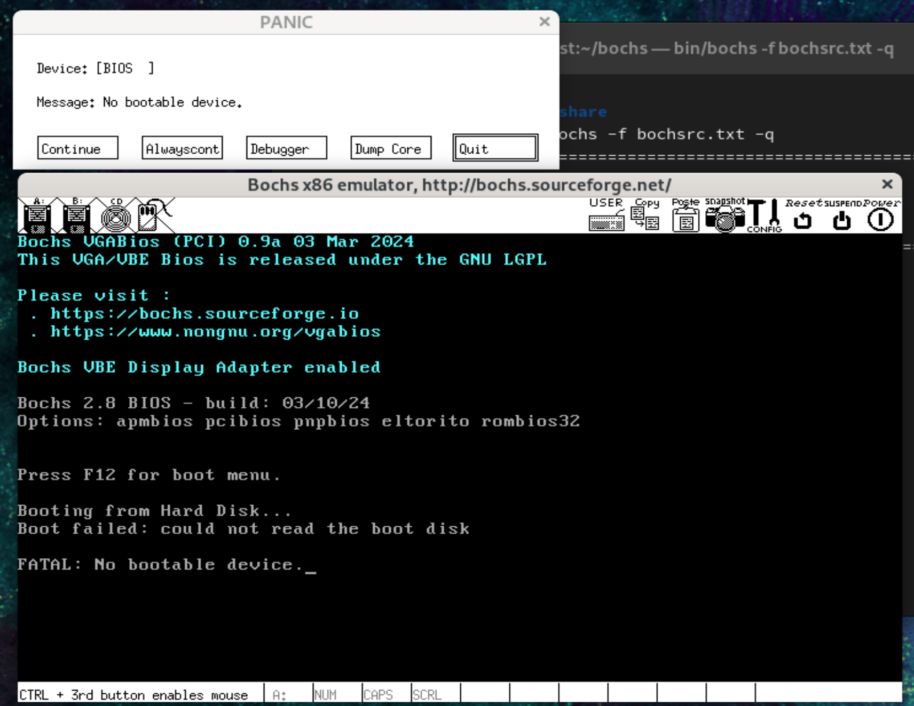

### 设置启动盘

BIOS会将PC的控制权转移到引导加载程序，使用现有的引导加载程序GNU GRand(**GRUB**)，GRUB可以将操作系统构建为普通的ELF可执行文件，然后由GRUB将其加载到正确的内存位置。

GRUB将寻找一个数(具体的)以确保它实际上是在跳转到操作系统。然后GRUB跳转到内存中的某个位置将控制权转移到OS。 

操作系统的这一部分必须用汇编代码编写，因为C需要一个不可用的堆栈。将以下代码保存在一个名为loader.s的文件中

~~~
global loader                   ; the entry symbol for ELF

MAGIC_NUMBER equ 0x1BADB002     ; define the magic number constant
FLAGS        equ 0x0            ; multiboot flags
CHECKSUM     equ -MAGIC_NUMBER  ; calculate the checksum
                                ; (magic number + checksum + flags should equal 0)

section .text:                  ; start of the text (code) section
align 4                         ; the code must be 4 byte aligned
    dd MAGIC_NUMBER             ; write the magic number to the machine code,
    dd FLAGS                    ; the flags,
    dd CHECKSUM                 ; and the checksum

loader:                         ; the loader label (defined as entry point in linker script)
    mov eax, 0xCAFEBABE         ; place the number 0xCAFEBABE in the register eax
.loop:
    jmp .loop                   ; loop forever
~~~

功能：将0xCAFEBABE写入eax寄存器   后续开发中，.loop循环会被替换为真正的内核初始化代码

`mkdir /root/tutuio`

`nasm -f elf32 loader.s ` 将loader.s文件编译为32位ELF目标文件

###链接内核

现在必须链接代码以生成可执行文件。我们希望GRUB在大于或等于0x00100000（1兆字节（MB））的内存地址上加载内核，因为GRUB本身，BIOS和内存映射的I / O使用小于1 MB的地址。因此，需要以下链接程序脚本（为GNU LD编写）

~~~c++
ENTRY(loader)                /* the name of the entry label */

SECTIONS {
    . = 0x00100000;          /* the code should be loaded at 1 MB */

    .text ALIGN (0x1000) :   /* align at 4 KB */
    {
        *(.text)             /* all text sections from all files */
    }

    .rodata ALIGN (0x1000) : /* align at 4 KB */
    {
        *(.rodata*)          /* all read-only data sections from all files */
    }

    .data ALIGN (0x1000) :   /* align at 4 KB */
    {
        *(.data)             /* all data sections from all files */
    }

    .bss ALIGN (0x1000) :    /* align at 4 KB */
    {
        *(COMMON)            /* all COMMON sections from all files */
        *(.bss)              /* all bss sections from all files */
    }
}
~~~

将链接程序脚本保存到名为link.ld的文件中

`ld -T link.ld -melf_i386 loader.o -o kernel.elf `

###创建可引导的so镜像

我们将使用的GRUB版本是GRUB Legacy，因为可以在同时使用GRUB Legacy和GRUB 2的系统上生成OS ISO映像。将使用GRUB Legacy stage2_eltorito引导程序。

> 教程中`wget ftp://alpha.gnu.org/gnu/grub/grub-0.97.tar.gz` 然后构建文件，我编译失败
>
> 从http://littleosbook.github.com/files/stage2_eltorito直接下载stage2_eltorito文件，这个地址也失效了
>
> 

从syslinux构建isolinux.bin 即stage2_eltorito文件

~~~
wget https://mirrors.edge.kernel.org/pub/linux/utils/boot/syslinux/syslinux-6.03.tar.gz
tar xzf syslinux-6.03.tar.gz
cd syslinux-6.03
make bios

mkdir -p /root/iso/boot/grub 
cp /root/syslinux-6.03/bios/core/isolinux.bin /root/iso/boot/grub/
cp /root/tutuio/kernel.elf /root/iso/boot/
~~~

此时的目录结构：

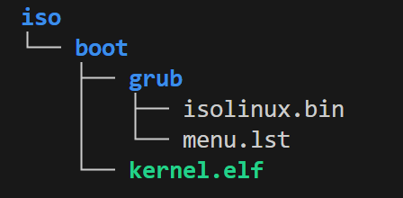

menu.lst内容如下 

~~~
default=0
timeout=0

title os
kernel /boot/kernel.elf
~~~

在iso同级目录下运行下方指令， isolinux.bin本来是stage2_eltorito被我替换了

可以使用**man genisoimage**查看参数含义

~~~
genisoimage -R                              \
            -b boot/grub/isolinux.bin    \
            -no-emul-boot                   \
            -boot-load-size 4               \
            -A os                           \
            -input-charset utf8             \
            -quiet                          \
            -boot-info-table                \
            -o os.iso                       \
            iso       
~~~

此时iso同级目录下会生成 os.iso文件

以isolinux.bin构建的iso并不使用，会出现报错failed to load ldlinux.32c

所以用GRUB 2构建iso

`sudo yum install grub2 grub2-tools grub2-tools-extra mtools xorriso`

新的目录结构

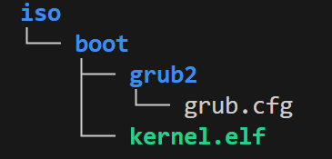

`grub2-mkrescue -o os.iso /root/iso`

### 启动bochs

`sudo bin/bochs -f bochsrc.txt -q`

`c`

成功启动！

`cat bochslog.txt  | grep 'EAX='`查看日志并没有EAX = CAFEBABE的字样？

## 过渡到c

# 操作系统真相还原

软件是如何访问硬件的？

> 硬件发展迅速，操作系统不可能及时更新驱动，于是使用硬件适配器，也就是IO接口，生产出来的设备按照这个标准工作就实现了通用
>
> 
>
> 访问外部硬件有两个方式。
>
> （1）将某个外设的内存映射到一定范围的地址空间中，CPU 通过地址总线访问该内存区域时会落到外设的内存中
>
> 比如显卡，显卡是显示器的适配器，CPU 不直接和显示器交互，它只和显卡通信。显卡上有片内存叫显存，它被映射到主机物理内存上的低端 1MB 的 0xB8000～0xBFFFF。CPU 访问这片内存就是访问显存，往这片内存上写字节便是往屏幕上打印内容。计算机中处处是分层，我们要充分相信上一层的工作。
>
> （2）外设是通过 IO 接口与 CPU 通信的，CPU 访问外设，就是访问 IO 接口，由 IO 接口将信息传递给另一端的外设，也就是说，CPU 从来不知道有这些设备的存在，它只知道自己操作的 IO 接口，你看，处处体现着分层。
>
> 于是问题来了，如何访问到 IO 接口呢，答案就是 IO 接口上面有一些寄存器，访问 IO 接口本质上就是访问这些寄存器，这些寄存器就是人们常说的端口。这些端口是人家 IO 接口给咱们提供的接口。人家接口电路也有自己的思维（系统），看到寄存器中写了什么就做出相应的反应。

# 部署工作环境

CentOS 9 (CentOS-Stream-9-latest-x86_64-dvd1.iso) 

> 我使用CentOS 7试过，无法连接到X server，需要安装图形界面，我就没有尝试了

nasm 汇编语言编译器  (只能使用汇编语言修改寄存器)

bochs 虚拟机

virtualBox 虚拟机 我用的vmware

> 只有从源码安装的版本才会在其配置和编译过程中根据所在的平台的特性去优化，这些是其他形式的软件包不可比拟的。

##安装bochs

下载地址：http://sourceforge.net/projects/bochs/files/bochs/

~~~
curl -L -o bochs-2.8.tar.gz https://sourceforge.net/projects/bochs/files/bochs/2.8/bochs-2.8.tar.gz/download
tar xvf bochs-2.8.tar.gz

书籍中使用的2.6.2 我使用的时候已经make编译不过了，需要<gtk/gtk.h>
~~~

编译 三部曲configure make make install

~~~
cd bochs-2.8

./configure \ 
--prefix=/root/tutuos/bochs-2.8-installed \ 
--enable-debugger \ 
--enable-disasm \ 
--enable-iodebug \ 
--enable-x86-debugger \ 
--with-x \ 
--with-x11

注意各行结尾的'\'字符前面有个空格

//直接复制可使用版本：
./configure --prefix=/root/tutuos/bochs-2.8-installed --enable-debugger --enable-disasm --enable-iodebug --enable-x86-debugger --with-x --with-x11

我使用2.8出现报错：configure: WARNING: unrecognized options: --enable-disasm 我暂时没有理会，可以取消这个选项应该没有影响
~~~

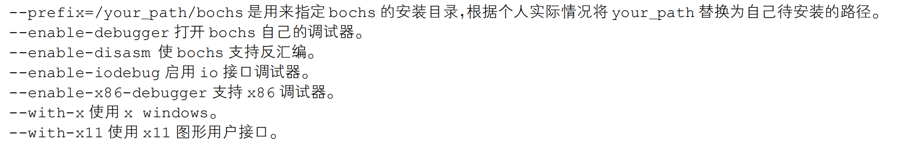

> --enable-gdb-stub替换--enable-debugger来使用gdb调试，但是不建议

~~~
make
make install
~~~

### 配置bochs

类似BIOS的作用

安装目录下有配置文件的样本文件：share/doc/bochs/bochsrc-sample.txt

在安装目录下新建bochsrc.disk  文件名和位置都不固定，注意文件

~~~
############################################### 
# Configuration file for Bochs 
############################################### 
# 第一步，首先设置 Bochs 在运行过程中能够使用的内存，本例为 32MB。
# 关键字为：megs 
megs: 32 
# 第二步，设置对应真实机器的 BIOS 和 VGA BIOS。
# 对应两个关键字为：romimage 和 vgaromimage 
romimage: file=/root/tutuos/bochs-2.8-installed/share/bochs/BIOS-bochs-latest 
vgaromimage: file=/root/tutuos/bochs-2.8-installed/share/bochs/VGABIOS-lgpl-latest 
# 第三步，设置 Bochs 所使用的磁盘，软盘的关键字为 floppy。
# 若只有一个软盘，则使用 floppya 即可，若有多个，则为 floppya，floppyb…
#floppya: 1_44=a.img, status=inserted 
# 第四步，选择启动盘符。
#boot: floppy #默认从软盘启动，将其注释
boot: disk #改为从硬盘启动。我们的任何代码都将直接写在硬盘上，所以不会再有读写软盘的操作。
# 第五步，设置日志文件的输出。
log: bochs.out 
# 第六步，开启或关闭某些功能。
# 下面是关闭鼠标，并打开键盘。
mouse: enabled=0 
keyboard:keymap=/root/tutuos/bochs-2.8-installed/share/bochs/keymaps/x11-pc-us.map
# 硬盘设置
ata0: enabled=1, ioaddr1=0x1f0, ioaddr2=0x3f0, irq=14 
ata0-master: type=disk, path="hd60M.img", mode=flat, cylinders=121, heads=16, spt=63
# 下面的是开放的 bochs 对 gdb 的支持，这样 gdb 便可以远程连接到此机器的 1234 端口调试了
#gdbstub: enabled=1, port=4567, text_base=0, data_base=0, bss_base=0  注释掉，会出现段错误
################### 配置文件结束 #####################
~~~

### 运行bochs

在 bochs 安装路径下

~~~
bin/bochs
第一个默认选择是2，选择配置文件，这里2.8版本出现段错误，应该渲染选项界面出错，但是我也不知道如何解决
sudo bin/bochs -f bochsrc.disk -q 
指定配置文件并跳过指引
~~~

~~~
创建启动硬盘
bin/bximage -hd -mode=flat -size=60 -q hd60M.img
bin/bximage -func=create -hd=60 -imgmode=flat -q hd60M.img
bin/bochs –f bochsrc.disk
~~~

# 编写 MBR 主引导记录

为什么程序要载入内存？

> 内存快且容量大
>
> 操作系统可以存储在多种存储介质中

什么是载入内存？

> 程序被加载器（软件或硬件）加载到内存某个区域
>
> CPU 的 cs：ip 寄存器被指向这个程序的起始地址

##BIOS

Base Input & Output System，即基本输入输出系统

### 实模式下1mb内存布局

Intel 8086 有 20 条地址线，故其可以访问 1MB 的内存空间，即 2 的 20 次方=1048576=1MB，地址范围若按十六进制来表示，是 0x00000 到 0xFFFFF

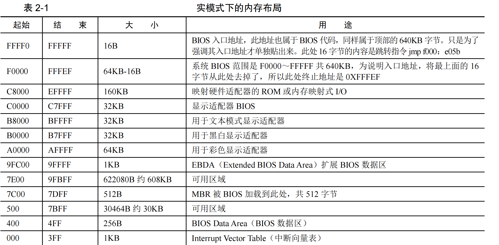

* 地址 0～0x9FFFF 处是 DRAM(动态随机访问内存)，我们所装的物理内存就是 DRAM

> 动态是什么意思？
>
> 动态指此种存储介质由于本身电气元件的性质，需要定期地刷新(电容漏电，及时补点来保存数据，称为刷新)

* 看顶部的 0xF0000～0xFFFFF，这 64KB 的内存是 ROM。这里面存的就是 BIOS 的代码

BIOS的作用：

> 过“int 中断号”来实现相关的硬件调用，即对硬件的输入输出，但由于就 64KB 大小的空间，挑一些重要的、保证计算机能运行的那些硬件的基本 IO 操作

* BIOS不用更该,被写进ROM，映射在低端1MB内存顶部，0xF0000入口地址

开机指令执行顺序：

1. 开机的瞬间CPU 的 cs：ip 寄存器被强制初始化为 0xF000：0xFFF0 执行跳转指令
2. jmp far f000：e05b 跳转到0xfe05b 处(段基址 0xf000 左移 4 位+0xe05b)，这是 BIOS 代码真正开始的地方
3. cs：f000  加电，强制将 cs 置为 f000
4. 接下来 BIOS 便马不停蹄地检测内存、显卡等外设信息，当检测通过，并初始化好硬件后，开始在内存中 0x000～0x3FF 处建立数据结构，中断向量表 IVT 并填写中断例程。
5. BIOS 最后一项工作校验启动盘中位于 0 盘 0 道 1 扇区的内容（最开始那个区域 CHS方法），也就是**MBR**所在位置

### MBR

如果此扇区末尾的两个字节分别是魔数 0x55 和 0xaa，BIOS 便认为此扇区中确实存在可执行的程序，加载到物理地址 0x7c00

MBR 的大小必须是 512 字节，这是为了保证 0x55 和 0xaa 这两个魔数恰好出现在该扇区的最后两个字节处，即第 510 字节处和第 511 字节处，由于我们的 bochs 模拟的是 x86 平台，所以是小端字节序，故其最后两个字节内容是 0xaa55

### 神奇好用的$和$$，令人迷惑的 section

\$和$$是编译器 NASM 预留的关键字，用来表示当前行和本 section 的地址，起到了标号的作用，它是 NASM 提供的，并不是 CPU 原生支持的，相当于伪指令一样，对 CPU 来说是假的。

~~~nasm
code_start:
	mov ax, 0

code_start被nasm认为是一个地址，此地址是：mov ax, 0这条指令所在的地址
~~~

\$属于“隐式地”藏在本行代码前的标号，也就是编译器给当前行安排的地址，看不到却又无处不在，\$在每行都有。

~~~nasm
code_start:
 	jmp $
 等效于jmp code_start
~~~

$$指代本 section 的起始地址

p70，暂且跳过

### NASM简单用法

`nasm -f <format><filename> [-o <output>]`

-f指定输出格式，默认bin，需要用elf格式才使用-f，一共21中格式

~~~
; 主引导程序
SECTION MBR vstart=0x7c00 
    mov ax, cs 
    mov ds, ax 
    mov es, ax 
    mov ss, ax 
    mov fs, ax 
    mov sp, 0x7c00 

; 清屏利用 0x06 号功能,上卷全部行,则可清屏。
; INT 0x10 功能号:0x06 功能描述:上卷窗口
; 输入: 
; AH 功能号 = 0x06 
; AL = 上卷的行数(如果为 0,表示全部) 
; BH = 上卷行属性
; (CL,CH) = 窗口左上角的(X,Y)位置
; (DL,DH) = 窗口右下角的(X,Y)位置
; 无返回值: 
mov ax, 0x600 
mov bx, 0x700 
mov cx, 0 ; 左上角: (0, 0) 
mov dx, 0x184f ; 右下角: (80,25) 
; VGA 文本模式中,一行只能容纳 80 个字符,共 25 行。
; 下标从 0 开始,所以 0x18=24,0x4f=79 
int 0x10 ; int 0x10 

;.get_cursor 获取当前光标位置,在光标位置处打印字符。
mov ah, 3 ; 输入: 3 号子功能是获取光标位置,需要存入 ah 寄存器
mov bh, 0 ; bh 寄存器存储的是待获取光标的页号
int 0x10 ; 输出: ch=光标开始行,cl=光标结束行
; dh=光标所在行号,dl=光标所在列号

; 打印字符串 
; 还是用 10h 中断,不过这次调用 13 号子功能打印字符串
mov ax, message 
mov bp, ax ; es:bp 为串首地址,es 此时同 cs 一致, 
; 开头时已经为 sreg 初始化

; 光标位置要用到 dx 寄存器中内容,cx 中的光标位置可忽略
mov cx, 5 ; cx 为串长度,不包括结束符 0 的字符个数
mov ax, 0x1301 ; 子功能号 13 显示字符及属性,要存入 ah 寄存器, 
; al 设置写字符方式 ah=01: 显示字符串,光标跟随移动
mov bx, 0x2 ; bh 存储要显示的页号,此处是第 0 页, 
; bl 中是字符属性,属性黑底绿字(bl = 02h) 
int 0x10 ; 执行 BIOS 0x10 号中断

jmp $ ; 使程序悬停在此

message db "1 MBR" 
times 510-($-$$) db 0 
db 0x55,0xaa 
~~~

代码功能：在屏幕上打印字符串“1 MBR”，背景色为黑色，前景色为绿色

> 没有使用显卡，本段代码中关于“打印显示”的操作都利用 BIOS 建立好的例程就好了，这里第 0x10 号中断便是负责有关打印的例程。

* 第 3 行的“vstart=0x7c00”表示本程序在编译时，告诉编译器，把我的起始地址编译为 0x7c00。

* 第 4～8 行是用 cs 寄存器的值去初始化其他寄存器。由于 BIOS 是通过 jmp 0：0x7c00 跳转到 MBR 的，故cs 此时为 0。对于 ds、es、fs、gs 这类 sreg，CPU 中不能直接给它们赋值，没有从立即数到段寄存器的电路实现，只有通过其他寄存器来中转，这里我们用的是通用寄存器 ax 来中转。例如 mov ds：0x7c00，这样就错了。

* 第 9 行是初始化栈指针，在 CPU 上运行的程序得遵从 CPU 的规则，mbr 也是程序，是程序就要用到栈。目前 0x7c00 以下暂时是安全的区域，就把它当作栈来用。

* 第 11～28 行是清屏。因为在 BIOS 工作中，会有一些输出，如检测硬件的结果信息。为了让大家看清楚我们在 MBR 中的输出字符串，故先把 BIOS 的输出清掉，这里演示的是 BIOS 中断 int 0x10 的用法。

* 第30～35 行是做打印前的工作，先获取光标位置，目的是避免打印字符混乱，覆盖别人的输出。字符打印的位置，不一定要在光标处，字

  符的位置只和显存中的地址有关，和光标是没关系的，这只是人为地加个约束，毕竟光标在视觉上告诉了我们当前字符写到哪里了，完全是为了好看，不要以为光标就是新打印字符的位置。更多细节，以后讲显卡时会提到。

==页==

第 33 行，往 bh 寄存器中写入了 0，这是告诉 BIOS 例程，我要获取第0 页当前的光标

显示器有很多种模式，如图形模式、文本模式等，在文本模式中，又可以工作于 80\*25 和 40\*25 等显示方式，默认情况下，所有个人计算机上的显卡在加电后都将自己置为 80\*25 这种显示方式。80*25 是指一屏可以显示 25 行、每行 80 列的字符，也就是 2000 个字符。但由于一个字符要用两字节来表示，低字符是字符的 ASCII 编码，高字节是字符属性，故显示一屏字符需要用 4000 字节（实际上，分配给一屏的容量是 4KB），这一屏就称为一页，0 页是默认页。

* 第 38～52 行是往光标处打印字符。说一下第 48 行的 mov ax，0x1301，13 对应的是 ah 寄存器，这是调用0x13 号子功能。01 对应的是 al 寄存器，表示的是写字符方式，其低 2 位才有意义，各位功能描述如下。

（1）al=0，显示字符串，并且光标返回起始位置。

（2）al=1，显示字符串，并且光标跟随到新位置。

（3）al=2，显示字符串及其属性，并且光标返回起始位置。

（4）al=3，显示字符串及其属性，光标跟随到新位置。

* 第 55 行执行了个死循环，\$是本行指令的地址，这属于伪指令，是汇编器在编译期间分配的地址。在最终编译出来的程序中，\$会被替换为指令实际所在行的地址。jmp 是个近跳转，$是 jmp 自己的地址，于是跳到自己所在的地址再执行自己，又是跳到自己所在的地址再继续执行跳转，这样便实现了死循环。
* 第 57 行是定义打印的字符串。
* 第 58 行的\$\$是指本 section 的起始地址，上面说过了\$是本行所在的地址，故\$-\$\$是本行到本 section的偏移量。由于 MBR 的最后两个字节是固定的内容，分别是 0x55 和 0xaa，要预留出这 2 个字节，故本扇区内前 512-2=510 字节要填满，那到底要用多少字节才能填满此扇区呢。用 510 字节减去上面通过\$-\$$得到的偏移量，其结果便是本扇区内的剩余量，也就是要填充的字节数。由此可见第 50 行的“times 510-（\$-\$\$） db 0”是在用 0 将本扇区剩余空间填充。

~~~
编译
nasm -o mbr.bin mbr.S
验证是否为512字节
ls -lb mbr.bin
磁盘操作，将文件写入 0 盘 0 道 1 扇区
dd if=/root/tutuos/mbr.bin of=/root/tutuos/bochs-2.8-installed/hd60M.img bs=512 count=1 conv=notrunc
运行
bin/bochs -f bochsrc.disk -q
输入c后回车
~~~

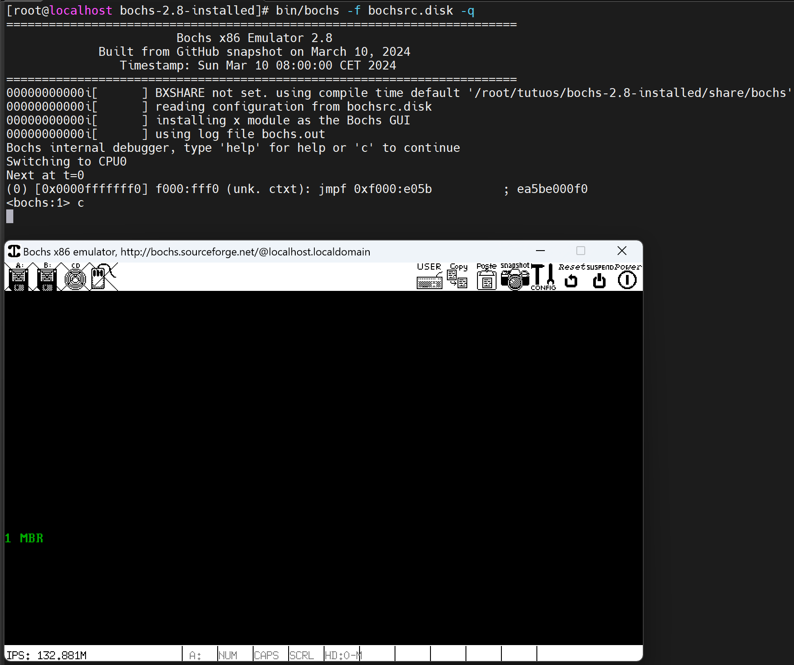

第一个提示设置环境变量：export BXSHARE=/root/tutuos/bochs-2.8-installed/share/bochs

# 完善MBR

## 地址 section vstart浅尝

### 什么是地址

地址：描述各种符号在源文件中的位置，各符号偏移文件开头的距离

编译器：给各符号编址，根据硬件平台特性，不考虑对齐则彼此相连

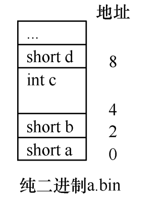

每个变量的地址是前一个变量的地址+前一个变量的内存空间大小。

代码编译之后，源代码中的标号(比如$)会被替换为实际地址

为了看程序编译后的各指令或标号的地址，可以用反汇编来查看，用 ndisasm 这个工具完成

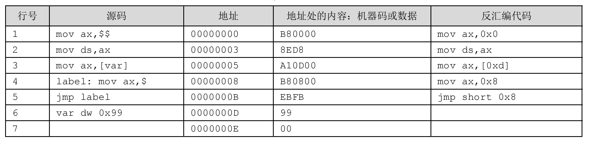

> 指令 mov ds,ax，被编译器处理之后，其所在地址处的内容就是机器码 8ED8
>
> var dw 0x99 数据定义 定义一个双字节字，编译后为99 00 x86小端序，低地址在99

* 看第 1 行的 mov 指令，\$\$表示的是所在的 section 的起始地址，由于这 6 行代码中没有定义 section，故 nasm 默认把全体文件当成一个大的 section，全体文件自然偏移地址为 0，所以在反汇编代码那列中，起始地址$$被置换为 0。
* 第 2 行代码是真指令，不牵涉到符号转换，所以反汇编后的代码同源码一致。
* 第 3 行引用了 var 变量的值，[]符号是取所在地址处的内容。在相应的反汇编代码中，相应的第三行中 var 这个符号地址被编译器替换为 0xd。结合地址列查看一下内容列，地址为 0xd 的内容为 99，这正是var 的值。
* 第 4 行源码为“label: mov ax,\$”,label 是个标号，代表指令“mov ax，\$”所在地址。\$是个隐式的标号，表示当前行地址。按理说这两个标号值应该是一致的，验证一下：查看下反汇编代码列的第 4 行，$被替换为0x8，即本行 mov 指令地址是 0x8，在地址列第 4 行查看，地址确实为 8，吻合。
* 第 5 行的“jmp label”编译后被替换为 jmp short 0x8，这是短跳转指令，地址为 8 处的内容是第 4 行的“mov ax，$”，同样吻合。

==地址等于上一个地址+上一个地址处的内容的长度。例如地址列第二行的 3 等于“上一个地址 0”+“上一个地址0 处的内容：B80000 的长度 3(一个长度32位)”，以此类推。==

### 节 section

编译器提供的伪指令，将程序逻辑上分为几个部分，比如将指令和数据分开便于维护等

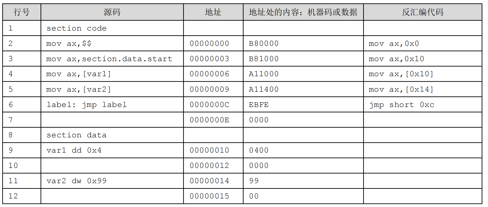

### vstart

是 section 用 vstart=来修饰后，可以被赋予一个虚拟起始地址，它被用来计算在该 section 内的所有内存引用地址。

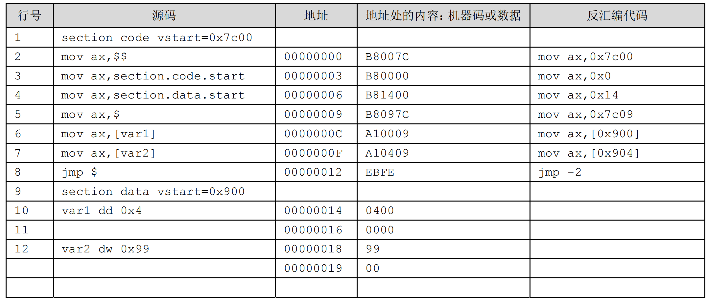

在 section 中添加了 vstart，这个参数是让编译器将 section 中的数据的地址以 vstart 的值为起始，不再从整个程序开头算起。只有以程序开头 0 算起的地址才是真实存在的，在这个地址上能访问到相应的符号，所以不以程序开头算起的地址，必然在程序内部不存在，是虚拟的。

* 源码第 1 行的 section 含有 vstart=0x7c00，故该节中的数据地址以 0x7c00 为起始编址。此 0x7c00 便是虚拟的地址，在程序中没有偏移文件开头为 0x7c00 的地址，整个程序不到 100 字节。
* 源码第 2 行的\$\$在编译后被替换为 vstart 的值 0x7c00
* 第 5 行的$在文件中的地址是 0x9，经编译后变成了 0x7c09，以vstart为起始计算的
* 第 6、7 行中引用的变量 var1 和 var2 属于 data 节，根据第二个vstart计算的

## CPU的实模式(汇编讲解)

实模式其实就是 8086 CPU 的工作环境、工作方式、工作状态，这是一整套的内容，实模式是指 8086 CPU 的寻址方式、寄存器大小、指令用法等，是用来反应 CPU 在该环境下如何工作的概念

实模式的“实”体现在：程序中用到的地址都是真实的物理地址，“段基址：段内偏移”产生的逻辑地址就是物理地址，也就是程序员看到的完全是真实的内存

## 直接对显示器说点什么

### CPU如何与外设通信-IO接口

IO接口：CPU和外设之间的中间层，形式不限

IO接口的多功能和多工作模式，甚至多设备，通过软件指令实，称为“IO接口控制编程”，通过端口读写指令in/out实现

IO接口的功能：

1. 设置数据缓冲，解决速度不匹配问题
2. 设置信号电平转换电路，CPU是TTL电平，外设大多机电设备无法被TTL驱动
3. 设置数据格式转换
4. 设置时序控制电路同步CPU和外设
5. 提供地址译码，多端口设备

同一时刻CPU 只能和一个 IO 接口通信,CPU将选择这个工作交给输入输出控制中心（I/O control hub，ICH），也就是**南桥芯片**

南桥用于连接 pci、pci-express、AGP 等低速设备，北桥用于连接高速设备，如内存

> IA32 体系系统中，因为用于存储端口号的寄存器是 16 位的，所以最大有 65536 个端口，即 0～65535。要是通过内存映射，端口就可以用 mov 指令来操作。但由于用的是独立编址，所以就不能把它当作
>
> 内存来操作，因此 CPU 提供了专门的指令来干这事，in 和 out。

~~~
in 指令用于从端口中读取数据，其一般形式是：
（1）in al, dx；
（2）in ax, dx; 
其中 al 和 ax 用来存储从端口获取的数据，dx 是指端口号

目的操作数是用 al，还是 ax，取决于 dx 端口指代的寄存器是 8 位宽度，还是 16 位宽度

（1）out dx, al；
（2）out dx,ax；
（3）out 立即数, al；
（4）out 立即数, ax;
~~~

### 显卡概述

mbr运行在实模式下，实模式下才有中断向量表，将来运行在保护模式下就不能调用BIOS中断0x10打印字符串

### 显存，显卡，显示器

显卡的工作：不断读取显存中的内容，发送到屏幕上

根据ASCLL编码往显示屏写入字符

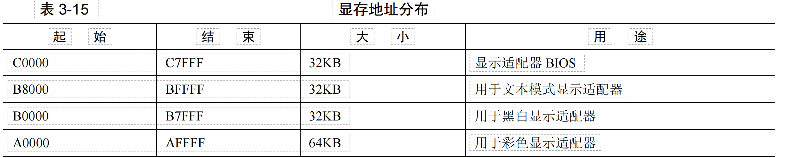

> 指令中的地址由地址总线寻址，指向某个介质，而不是都通过内存条

显卡默认文本模式为80*25 一屏可以打印2000个字符，一行80个共25行

打出彩色字符：ASCLL码一位，颜色一位，颜色RGB+I(1高亮)  

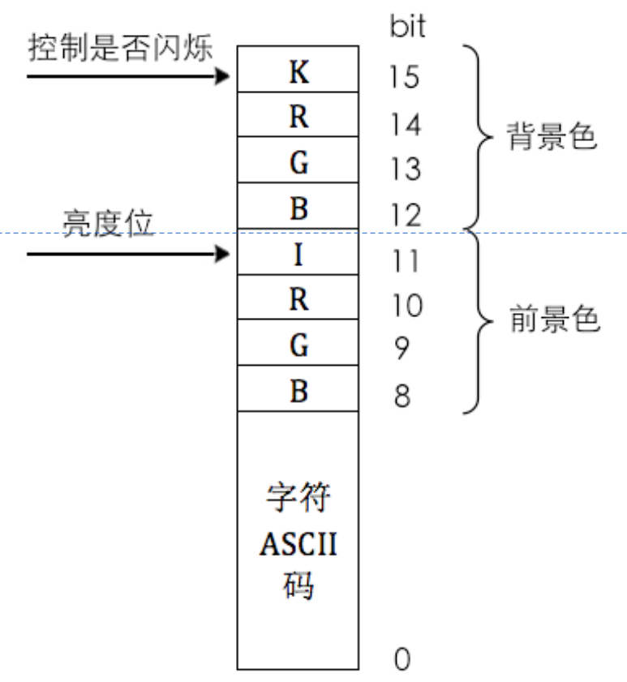

可用颜色：

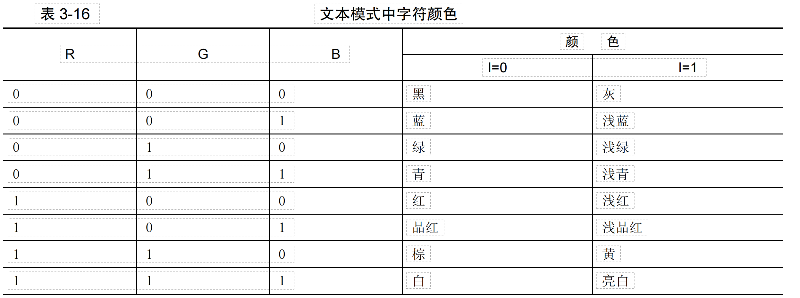

### 改进MBR，直接操作显卡

mbr.S

~~~
SECTION MBR vstart=0x7c00 ;标记一个MBR段 起始地址为0x7c00
    mov ax, cs 
    mov ds, ax 
    mov es, ax 
    mov ss, ax 
    mov fs, ax 
    mov sp, 0x7c00 ;栈指针赋值，从7c00开始
    mov ax, 0xb800 ;0xb800是文本模式下显存的段地址，后续通过gs访问显存
    mov gs, ax

mov ax, 0x600 ;滚动窗口
mov bx, 0x700 ;黑底白字
mov cx, 0 ;左上角行列坐标 (0,0)
mov dx, 0x184f ;右下角行列坐标 (80,25)
int 10h ;调用 BIOS 的 INT 10H 中断来清屏

mov byte [gs:0x00],'1'   ;直接向显存写入数据，ASCLL码+属性
mov byte [gs:0x01],0xA4
mov byte [gs:0x02],' '
mov byte [gs:0x03],0xA4
mov byte [gs:0x04],'M'
mov byte [gs:0x05],0xA4
mov byte [gs:0x06],'B'
mov byte [gs:0x07],0xA4
mov byte [gs:0x08],'R'
mov byte [gs:0x09],0xA4

jmp $ ;无限循环

times 510-($-$$) db 0 ;填充剩余空间
db 0x55,0xaa ;结束标志
~~~

~~~
nasm -o mbr.bin mbr.S
dd if=/root/tutuos/mbr.bin of=/root/tutuos/bochs-2.8-installed/hd60M.img bs=512 count=1 conv=notrunc
bin/bochs -f bochsrc.disk -q
~~~

## bochs调试方法

### bochs一般用法

