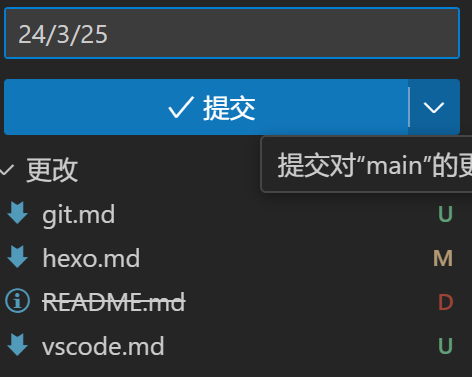
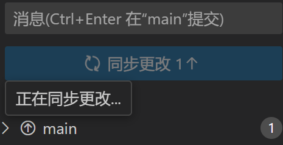
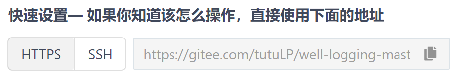
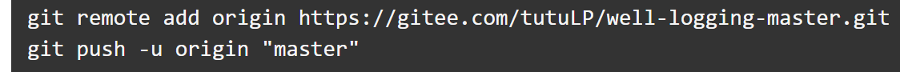
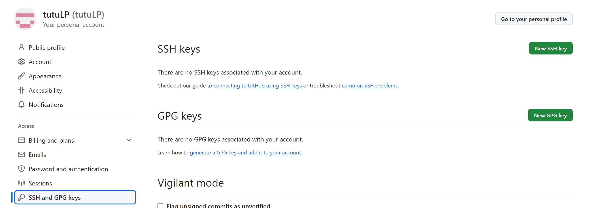

1. 集中版本控制 SVN   所有的版本数据都保存在服务器上，相当于在线修改
2. 分布式版本控制 Git

# 下载

windows  https://git-scm.com/  无脑下一步

centos  yum install git

# 克隆项目

在想要存放项目文件夹的地方git bash here

克隆远程仓库 `git clone https......`

右键-在vscode中打开

在本地修改完文件后从vscode或其他工具上传 输入信息并提交-同步更改

从远程拉取并且删除本地多余的文件 `git pull --prune`

# 本地项目上传

##控制文件

1. 忽略文件

* 根目录新建自定义文件 .gitignore

以uni-app项目为例

~~~.gitignore
/node_modules   
/unpackage/dist   一个是插件包 一个是运行到微信开发者工具自动生成的文件
~~~

2. 忽略例外

* unpackage文件夹下新建一个空文件 .gitkeep 

为了追踪到这个文件夹而不是随dist一起被忽略

## 初始化项目并上传到仓库

* 根目录下输入命令

~~~
git init 
git add .
git commit -m "init project"
git status 其中可以随时查看状态
~~~

* 添加电脑与账号的ssh公钥
* 新建一个空白仓库(只填名称)并上传项目
* 选择ssh
* 
* 输入最后两条
* 

# SSH密钥

1. cd ~/.ssh 

ssh-keygen -t rsa -b 2048 -C 'github注册邮箱'

2. ssh-keygen -t rsa -b 2048 -C 'tutu2061867903@gmail.com' 一路回车即可
3. 粘贴.pub文件的内容到SSH keys

4. 进入hexo项目根目录 cd blog
5. 删除文件 .deploy_git
6. 修改_config.yml
7. repo:项目的SSH地址

git fetch origin c8
git merge origin/c8
如果有冲突解决冲突之后：
git add .
git commit

git init

git add.   git commit 

git remote add origin https://github.com/username/repository.git

git push -f origin master
