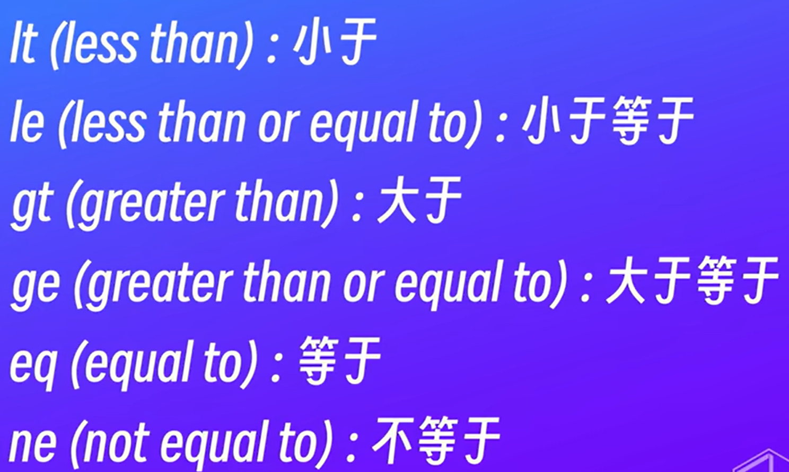
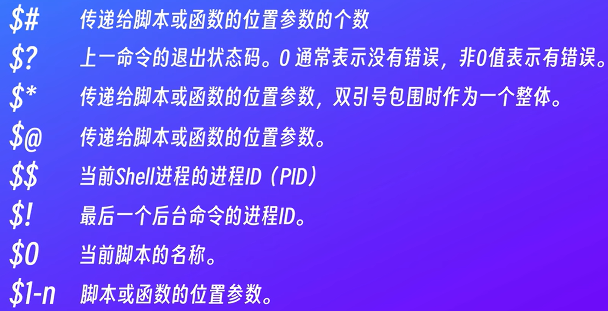
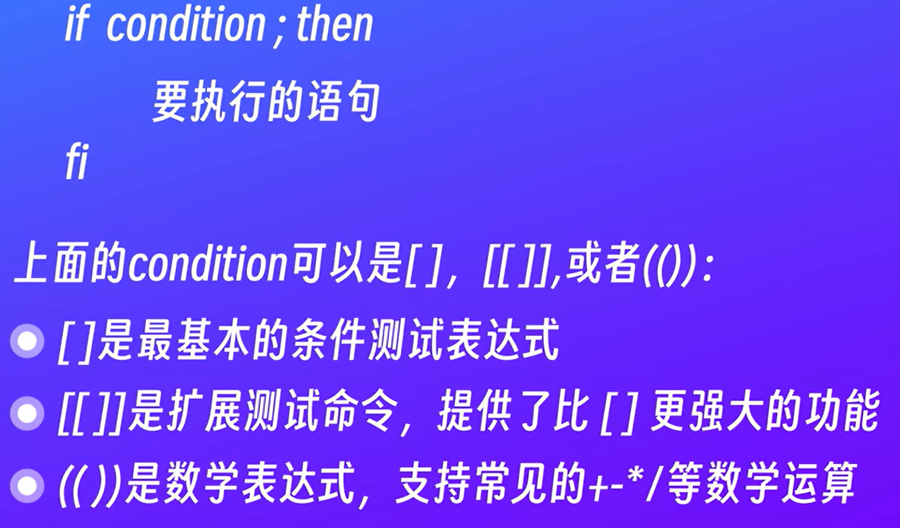

shell：命令行解释器-接收用户输入的命令-调用操作系统内核去执行-返回结果

运行环境：linux-bash windows-powershell

* 切换shell版本

vi hello.sh 约定以sh，可以是其他任何或者没有

```sh
#!/bin/bash
#表示这个脚本使用的是Bash解释器，系统会自动调用，可以替换成想用的路径
echo "hello"
date
whoami
```



运行脚本

bash hello.sh 

./hello.sh 这种方式需要权限 chmod +x hello.sh 添加执行权限

使用参数

```sh
bash hello.sh param1 param2
$0 $1
read name#控制台读取
name=$0#使用参数
echo"$name"
```




```sh
name=jokeer#会话变量
export name=joker#环境变量，脚本中可以使用 但是推出会话就失效了
~下 ls -a 查看隐藏文件
```

~下 ls -a 查看隐藏文件 .profile .bashrc(推荐)都可以用来存储环境变量

将export name=joker添加到最后就可以了

source .bashrc 或 . .bashrc 或 重新登录会话 使生效

.bashrc 还存有一些简化命令


生成随机数 shuf -i 1-10 -n 1 输出一个1-10的随机数

写进sh

```sh
num='shuf -i 1-10 -n 1'
或num=$(shuf -i 1-10 -n 1) #(推荐)
read guess
if [[$guess -eq $num]]; then #-lt小于 -gt大于
	echo "yes"
else 
	echo "no"
fi

while [[$guess -ne $num]]#循环 上面的判断放进去就行了 true不需要[[]]
do 

done
```



$RANDOM生成0-32767的随机数

$((RANDOM % 10 + 1))