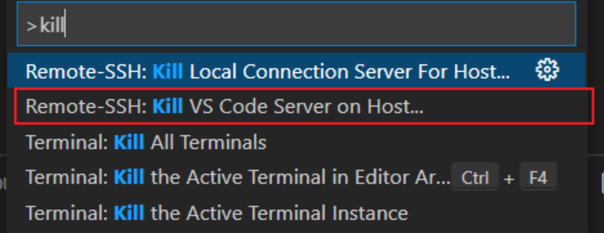
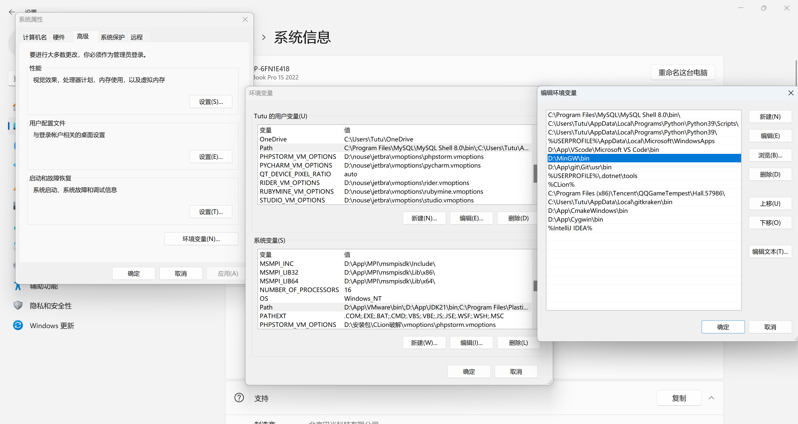
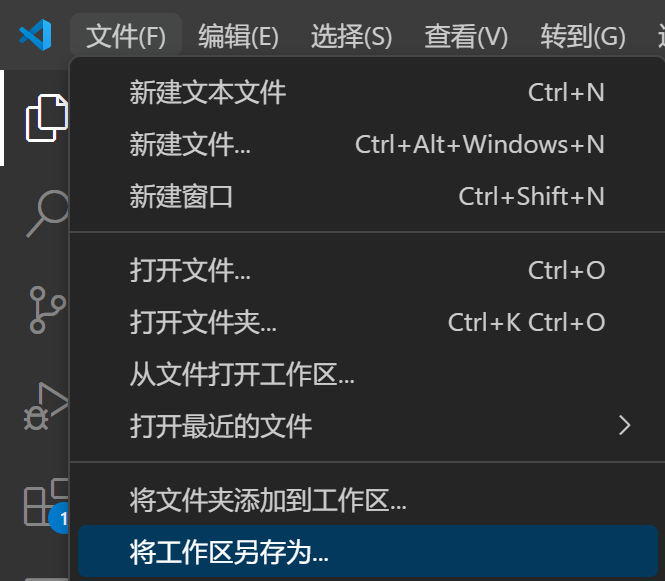
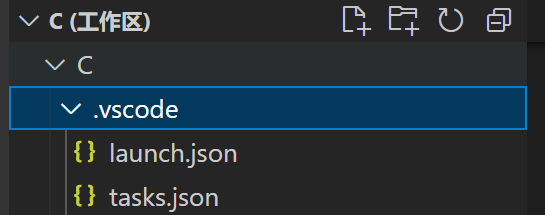
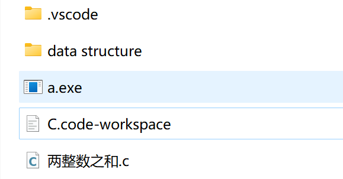
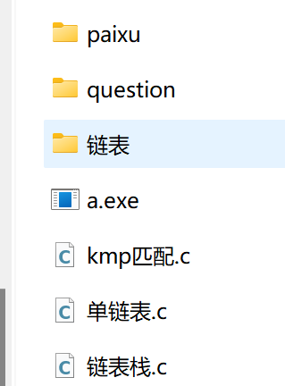
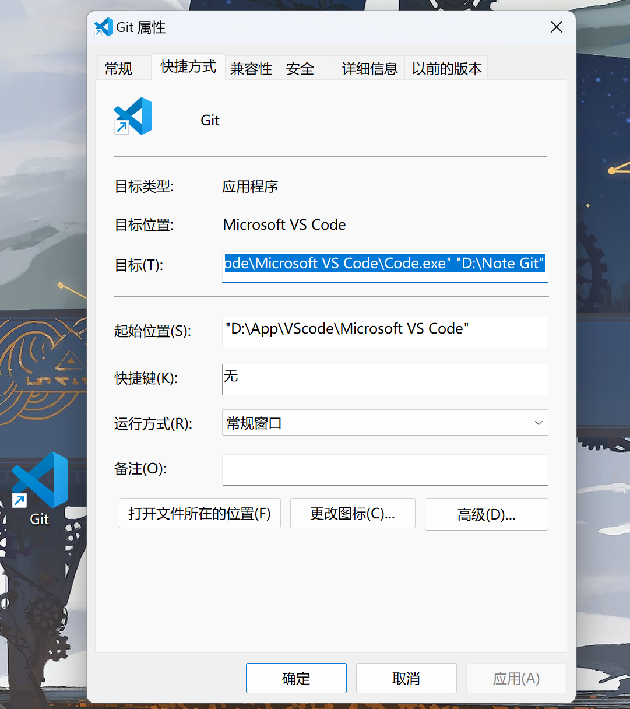

## ssh远程连接错误

报错：

* 无法建立连接，下载vscode服务器失败-请在远程安装curl

解决办法：

- 删除远程服务器家目录下的.vscode-server文件夹，linux的家目录路径是：/home/yourusername

ctrl+shift+p 输入kill

输入密码后删除服务器中的服务文件

再次连接会重新下载解决问题

# 配置c语言环境

## 下载

下载MinGW https://sourceforge.net/projects/mingw-w64/

安装到你找得到英文路径下 打开这个文件夹找到bin文件夹的位置 "D:\MinGW\bin"

**配置环境变量** 右键此电脑-属性-高级系统设置-环境变量-上方Path-编辑-新建-放入地址(不要"")

下载vscode

## VScode插件

C/C++ Chinese(可选)两个插件

## 工作区配置

####建立工作区

先在喜欢的地方建一个文件夹，这个文件夹用来存放你的代码和工作区的地方

打开文件夹，在空白处右键通过vscode打开

文件-将工作区另存为-选择这个文件夹

#### 配置.vscode文件

可以不用下载老版本的c/c++插件，只需要手动建立一下的一个文件夹和两个文件

手动输入文件名和后缀

下面我附上配置内容

我已经加上了注释，可以根据自己喜好配置

~~~json
//launch.json
{
    // 使用 IntelliSense 了解相关属性。 
    // 悬停以查看现有属性的描述。
    // 欲了解更多信息，请访问: https://go.microsoft.com/fwlink/?linkid=830387
    "version": "0.2.0",
    "configurations": [
        {
            "name": "gcc.exe - 生成和调试活动文件",
            "type": "cppdbg",
            "request": "launch",
            "program": "${fileDirname}\\a.exe",
            "args": [],
            "stopAtEntry": false,
            "cwd": "D:\\MinGW\\bin",
            "environment": [],
            "externalConsole": true,  //在外部控制台中打开-输出内容将不会出现在下方
            "MIMode": "gdb",
            "miDebuggerPath": "D:\\MinGW\\bin\\gdb.exe",
            "setupCommands": [
                {
                    "description": "为 gdb 启用整齐打印",
                    "text": "-enable-pretty-printing",
                    "ignoreFailures": true
                },
                {
                    "description": "将反汇编风格设置为 Intel",
                    "text": "-gdb-set disassembly-flavor intel",
                    "ignoreFailures": true
                }
            ],
            "preLaunchTask": "C/C++: gcc.exe 生成活动文件"
        }
    ]
}
~~~

~~~json
//tasks.json
{
    "tasks": [
        {
            "type": "cppbuild",
            "label": "C/C++: gcc.exe 生成活动文件",
            "command": "D:\\MinGW\\bin\\gcc.exe",
            "args": [
                "-fdiagnostics-color=always",
                "-g",
                "${file}",
                "-o",
                "${fileDirname}\\a.exe",
                "-fexec-charset=GBK" //解决中文乱码
            ],
            "options": {
                "cwd": "D:\\MinGW\\bin"
            },
            "problemMatcher": [
                "$gcc"
            ],
            "group": {
                "kind": "build",
                "isDefault": true
            },
            "detail": "调试器生成的任务。"
        }
    ],
    "version": "2.0.0"
}
~~~

####建立a.exe

在每一个有代码的同级目录下都要新建一个a.exe 每次运行代码都会覆盖写入可执行文件，避免出现一堆exe文件，我已经在上方两个文件中改动优化了

例如上方的目录结构，其中可以内涵很多文件夹，只需要每个文件夹都有一个a.exe

## 运行代码

在代码的头文件中加上

\#include<stdlib.h>

main函数体末尾加上

system("pause");

运行-GDB-gcc

为了方便打开，我们找到vscode的安装目录，右键图标-发送到桌面

右键桌面的这个vscode图标-属性-在目标后面加上文件夹的位置 就可以双击打开了

或者直接双击我们之前保存的工作区也同样的效果

# vscode占用过大

pkill -f vscode rm -rf ~/.vscode-server
