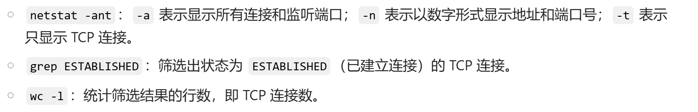

1. 对技术运营的看法？

保障技术系统的稳定运行，推动业务的发展和创新，负责服务器维护、网络管理、数据库优化等基础工作，确保整个技术架构的稳定可靠，优化业务流程等。

系统运维与监控   技术支持与优化    数据管理与分析

技术能力：包括操作系统、网络技术、数据库管理、编程语言等方面的知识。例如，要熟练掌握 Linux 系统的操作和管理，能够使用 Python 等编程语言进行自动化脚本编写

沟通能力解决问题的能力，保证业务连续，提升业务效率

2. 你都用过哪些Linux开源程序

vim docker nginx mysql PostgreSQL apache

3. 了解过nginx吗？

Nginx 是一款轻量级的高性能 Web 服务器、反向代理服务器以及电子邮件（IMAP/POP3）代理服务器

* http 服务器：处理静态资源

* 反向代理：将请求转发到真实的服务器

* 负载均衡：轮询、加权轮询、IP哈希，最少连接，随机

* SSL/TLS 加密

4. 使用apache过程中遇到过什么问题，怎么分析的

ps -ef | grep httpd 发现apache进程过多或者根本无法启动

* 参数配置过大：MaxClients MaxRequestWorkers
* 内存泄漏：某些 Apache 模块或第三方插件可能存在内存泄漏问题，导致进程不断占用内存，使用系统监控工具，如 top、htop 或 vmstat 等，观察 Apache 进程的内存使用情况。如果发现某个进程的内存占用持续增长，可能存在内存泄漏
* 服务器的 CPU、内存、磁盘 I/O 等资源不足，Apache 处理请求过于复杂，或者存在死循环使CPU使用过高，如果磁盘 I/O 过高，可能是日志文件写入频繁或磁盘性能不佳

用户访问网站时，页面加载时间过长，响应缓慢

* 服务器的硬件资源不足，如 CPU 性能低下、内存不足、磁盘 I/O 缓慢等，使用系统监控工具，如 top、htop、iostat 等
* 网络带宽不足、网络延迟高、网络丢包等问题，ping  traceroute  ifconfig
* Apache 配置不合理：Apache 的一些配置参数，如 KeepAlive、Timeout 等，设置不合理，会影响服务器的性能和响应速度。
* 应用程序性能问题，如果网站使用了动态脚本语言，如 PHP、Python 等，应用程序本身的性能问题也会影响 Apache 的访问速度。PHP 的 Xdebug、Python 的 cProfile 等，对应用程序进行性能分析
* 缓存配置不当：如果网站没有合理配置缓存，每次请求都需要重新生成页面内容，会增加服务器的负载，导致访问速度变慢。检查缓存配置，是否启用了 mod_cache模块，是否设置了合理的缓存规则

5. tcp连接数

netstat -ant | grep ESTABLISHED | wc -l

ss -ant | grep ESTABLISHED | wc -l

Windows：   netstat -an | findstr /i "ESTABLISHED" | find /c /v ""

6. 一个小时内的每个ip访问服务器的数目

nginx或apache的日志文件，使用grep进行筛选统计

7. 用过awk吗？如果我要替换文中字符，行间用tab分割，用awk怎么解决？

awk 替换和提取，awk '{gsub(/apple/, "grape"); print}' OFS='\t' data.txt   替换函数gsub

8.一行命令替换所有中文，不使用awk

sed 's/hello/hi/g' example.txt    sed流编辑器，将所有hello替换为hi

9. 给一个PID，返回进程文件的位置

readlink /proc/<PID>/exe

10. 怎么获取Linux系统当前的所有状态（CPU，内存，硬盘剩余等）

* cpu：top/htop m  mpstat -P ALL
* 内存： free -h  vmstat 1
* 硬盘：df -h    du -sh /path/to/directory/* 文件或目录的使用量

11. lvm

逻辑卷管理器，磁盘分区管理，lvm可以动态调整逻辑卷大小

13. 锁

数据库锁：行级锁 在事务查询结果集上加，这些数据无法被删除，修改，直到事务释放

表级锁：整个表加锁，数据备份，导入导出

页级锁：

共享锁：多个事务可以同时加，加了锁的无法修改

排他锁：其他事务无法在其基础上加锁，持有者可以修改

意向锁：为了在进行表级锁操作时，能够快速判断表中是否有行或页已经被加锁，从而避免全表扫描。

互斥锁：mutex

读写锁：可以同时持有读锁，但是有人持有写锁时其他人不能持有读锁

自旋锁：当一个线程尝试获取自旋锁时，如果锁已经被其他线程持有，该线程不会进入睡眠状态，而是会不断地循环检查锁是否被释放

15. linux信号

在linux下有很多信号，按可靠性分为可靠信号和非可靠信号，按时间分为实时信号和非实时信号，linux进程也有三种方式来处理收到的信号：

（1）忽略信号，即对信号不做任何处理，其中，有两个信号不能忽略：SIGKILL及SIGSTOP；

（2）捕捉信号。定义信号处理函数，当信号发生时，执行相应的处理函数；

（3）执行缺省操作，Linux对每种信号都规定了默认操作。

常见的信号：

① SIGINT (2) 程序终止(interrupt)信号，在用户键入INTR字符(通常是Ctrl + C)时发出。

② SIGQUIT (3) 和SIGINT类似，但由QUIT字符(通常是Ctrl + )来控制。进程在因收到 SIGQUIT退出时会产生core文件，在这个意义上类似于一个程序错误信号。

③ SIGKILL (9) 用来立即结束程序的运行。本信号不能被阻塞、处理和忽略。

④ SIGTERM (15) 程序结束(terminate)信号。与SIGKILL不同的是该信号可以被阻塞和处理。通常用来要求程序自己正常（优雅地）退出。shell命令kill缺省产生这个信号。

⑤ SIGSTOP (19) 停止(stopped)进程的执行。注意它和terminate以及interrupt的区别：该进程还未结束，只是暂停执行。本信号不能被阻塞、处理或忽略。

16.Http 短连接和长连接的区别，以及各自使用的场景，以及长连接的缺点有哪些？

长连接可以省去较多的TCP建立和关闭的操作，减少浪费，节约时间。对于频繁请求资源的客户来说，较适用长连接。

而像WEB网站的http服务一般都用短链接，因为长连接对于服务端来说会耗费一定的资源，而像WEB网站这么频繁的成千上万甚至上亿客户端的连接用短连接会更省一些资源，如果用长连接，而且同时有成千上万的用户，如果每个用户都占用一个连接的话，那可想而知吧。所以并发量大，但每个用户无需频繁操作情况下需用短连接好。

17. 迭代和递归的区别吗

- 递归：重复调用函数自身实现循环称为递归；
- 迭代：利用变量的原值推出新值称为迭代，或着说迭代是函数内某段代码实现循环；

18. redis分布式锁 

分布式锁来保证同一时间只有一个服务实例能够访问该资源，setnx设置键值对来上锁，可以使用 Redlock 算法来提高分布式锁的可靠性

18. redis多线程

Redis 的多线程主要是用于处理网络 I/O ，键值对的读写操作仍然是单线程执行的，主线程接受多个连接放入队列，IO线程从队列取出请求进行网络IO(读取请求发送响应)，然后将请求返回给主线程，主线程处理之后再给IO线程，IO线程返回给客户端

18. 操作系统的内存管理

任务：

- **内存分配**：为每个进程分配所需的内存空间，确保进程能够正常运行。操作系统需要根据进程的需求和内存的使用情况，合理地分配内存块。

- **内存回收**：当进程执行完毕或不再需要某些内存空间时，操作系统需要及时回收这些内存，以便重新分配给其他进程使用。

- **地址映射**：将进程的逻辑地址转换为物理地址。进程在编写程序时使用的是逻辑地址，而内存中的实际存储位置是物理地址，操作系统需要完成这两者之间的映射。

- **内存保护**：防止不同进程之间的内存相互干扰和破坏。每个进程只能访问自己被分配的内存空间，操作系统需要提供相应的机制来确保内存的安全性。

- **内存扩充**：当物理内存不足时，操作系统需要通过虚拟内存等技术，为进程提供更大的内存空间，以满足进程的需求。

内存分配：

  单一连续分配：将内存分为系统区和用户区，系统区供操作系统使用，用户区供一个用户进程使用。在任何时刻，内存中只有一个用户进程。

  分区分配：固定分区分配：将内存划分为若干个固定大小的分区，每个分区可以容纳一个进程。操作系统维护一个分区表，记录每个分区的使用情况。

  ​	动态分区分配：当有新进程需要内存时，操作系统从空闲内存中划分出一个合适大小的分区分配给该进程

  分页/段存储管理：将进程的逻辑地址空间划分为若干个大小相等的页/段，(将内存的物理地址空间划分为若干个与页大小相等的帧)。通过页/段表管理

  **段页式存储**（现在）：结合了分段存储管理和分页存储管理的优点。先将进程的逻辑地址空间划分为若干个段，再将每个段划分为若干个页。通过段表和页表来实现逻辑地址到物理地址的映射。

内存分配算法

虚拟存储：将进程的部分地址空间存储在磁盘上，而只将当前需要的部分加载到内存中

18. topk问题，维护小根堆的复杂度分析，除此之外还有别的方法吗
   TopK 问题指的是从包含n个元素的数据集中找出最大的k个元素

小根堆方法：前k个元素构建小根堆，顶端最小，遍历k+1之后，比堆顶大就替换然后调整堆顶O(nlogk)

排序法：快速排序、归并排序O(nlogn)

桶排序：前提：数据范围小，统计每个元素出现的次数，然后从大到小遍历桶，找出最大的k个元素O(n+m,m是范围)

18. B+树知道吗？覆盖索引怎么优化的

从根节点开始，根据查询键值与节点中键值的大小关系，选择合适的子节点继续查找，直到到达叶子节点找到目标数据记录。由于数据都存储在叶子节点，范围查询时可以通过叶子节点的指针顺序遍历，效率较高。

覆盖索引是指一个查询语句的执行只需要从索引中获取数据，而不需要回表查询（即不需要再到数据表中查找对应的数据行）

减少磁盘IO即回表

减少内存占用，索引通常比数据表小，命中率提升

避免排序，b+数索引有序

18. 数据库隔离级别介绍？RR隔离级别如何解决脏读问题的

读未提交：一个事务读取另一个未提交事务的数据，会产生脏读、不可重复读和幻读问题，脏读指的是一个事务读取到了另一个未提交事务修改的数据

读已提交：解决了脏读问题，存在不可重复读(多次读取的结果不同)和幻读问题

可重复读：多次读取同一数据的结果是一致的，在某些数据库中可能仍然存在幻读问题

串行化：只能事务结束才能新事务

RR(可重复读)隔离级别解决脏读问题的原理：多版本并发控制MVCC+行锁(修改某一行数据时加锁)

18. OSPF

OSPF 即开放式最短路径优先（Open Shortest Path First），是用于在单一自治系统（AS）内动态地建立、维护和更新**路由信息**的内部网关协议（IGP）

OSPF 可以通过区域划分来管理网络，提高网络的可扩展性和性能。

18. 操作系统进程间通信方式
    管道( pipe )：管道是一种半双工的通信方式，数据只能单向流动，而且只能在具有亲缘关系的进程间使用。进程的亲缘关系通常是指父子进程关系。

    信号量( semophore ) ： 信号量是一个计数器，可以用来控制多个进程对共享资源的访问。它常作为一种锁机制，防止某进程正在访问共享资源时，其他进程也访问该资源。因此，主要作为进程间以及同一进程内不同线程之间的同步手段。

    消息队列( message queue ) ： 消息队列是由消息的链表，存放在内核中并由消息队列标识符标# 识。消息队列克服了信号传递信息少、管道只能承载无格式字节流以及缓冲区大小受限等缺点。

     共享内存( shared memory ) ：共享内存就是映射一段能被其他进程所访问的内存，这段共享内存由一个进程创建，但多个进程都可以访问。共享内存是最快的 IPC 方式，它是针对其他进程间通信方式运行效率低而专门设计的。它往往与其他通信机制，如信号两，配合使用，来实现进程间的同步和通信。

    套接字( socket ) ： 套解口也是一种进程间通信机制，与其他通信机制不同的是，它可用于不同及其间的进程通信。

19. 数据库索引

普通索引，频繁查询某个字段

唯一索引，索引列的值必须唯一，但允许有空值。如果是组合唯一索引，则列值的组合必须唯一

主键索引：主键索引是一种特殊的唯一索引，不允许有空值

全文索引：用于内容搜索

组合索引：多个列上创建的索引，数据库会根据这些列的顺序来使用索引。

k8s

应用服务和服务器的中间层，腾讯云中叫TKE，写一份配置文件而已将应用自动部署到服务器上，k8s将服务器分为控制平面+工作节点node，控制平面决定将应用部署到哪一个节点上，node负责部署实际应用服务Pod,Pod可以自动改变容量，如何让node节点也弹性伸缩：再加一层中间层实现节点伸缩：CA/Kapernter，以pod形式部署然后通过控制平面获取集群资源状态，一个动态一个静态。还能节点整合，节点替换(当出现错误)

从ls或者cd命令举例，命令背后如何执行的。如何从用户态到内核态执行，命令的整体流程

1. 解析shell  fork创建进程 内核为新进程分配资源，包括内存空间、进程控制块（PCB）等，并复制父进程（Shell）的相关信息。
2. 子进程通过系统调用execve()来加载ls命令对应的可执行程序
3. 执行系统调用获取文件信息，切换到内核态。当执行系统调用时，CPU 会将当前进程的状态信息保存到内核栈中，然后根据系统调用号查找对应的内核函数，并跳转到内核函数的入口地址开始执行。
4. 内核完成操作后，将结果返回给ls程序。ls程序接收到结果后，对其进行处理，如按照一定的格式将文件信息显示在终端上。
5. ls程序执行完毕后，通过系统调用exit()结束进程

> 内核态才能执行系统调用

bios

ROM(只读)，现在使用闪存芯片

