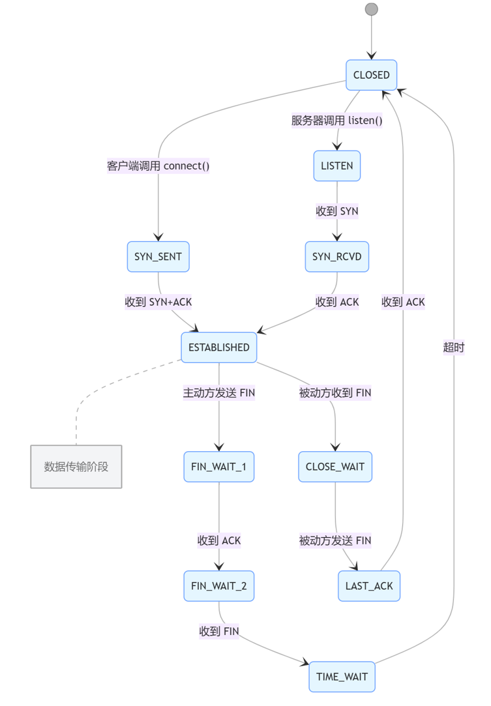
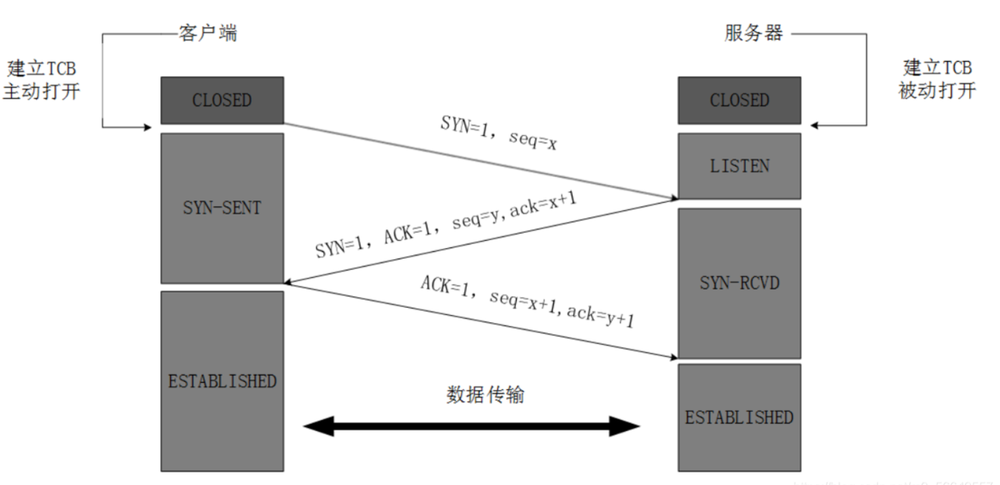
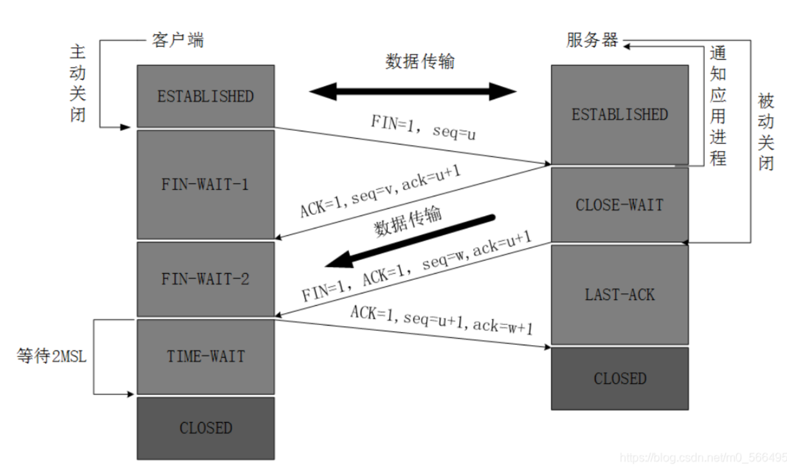

# socket状态转变

特殊情况：同时调用close，同时先收到FIN包的状态：FIN_WAIT_1 -> ClOSE -> TIME_WAIT（另一个走1 2），如果同时收到FIN则都走这种状态

超时时间：2MSL

# 三次握手

你能听到吗？我携带了序列号(SYN),我的序列号(seq=x)是x

你能听到吗？我确认能听到(ACK=1),我携带了序列号(SYN)，我的序列号是(seq=y)是y，下一个数据包给我发送序列号(ack=x+1)

我确认能听到(ACK=1)，我的序列号是(seq=x+1)，下一个数据包给我发送序列号(ack=y+1)

# 四次挥手

超时时间：2MSL，2MSL是报文存在的最长时间，确认最后客户端发送的ACK能到达服务器

TLS SSL 

TLS是SSL更安全的进化版本，也是现在主流。TLS是OSI模型中的会话层

OSI七层模型

物理层 bit

数据链路层 帧 交换机/网桥/MAC

网络层 数据包 路由器/IP

传输层 段/数据报 TCP/UDP

会话层 报文 TLS/SSL （负责建立、管理和终止不同主机之间的会话连接）

表示层 报文（数据的表示和转换）

应用层 报文 HTTP/FTP/SMTP/snmp 网页/文件传输/邮件

